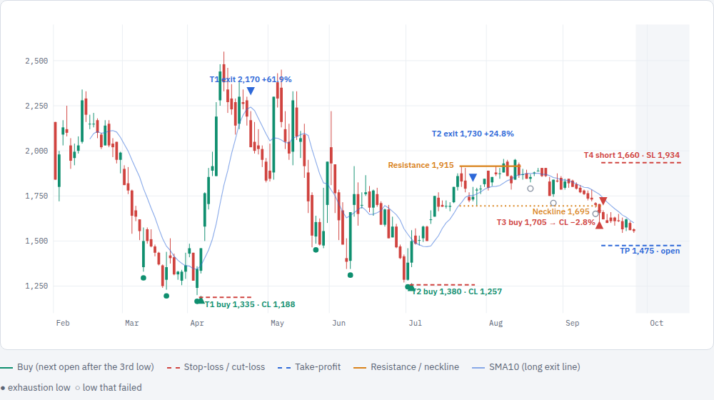

# BRPT Pattern Playbook

**Ticker:** BRPT (Barito Pacific), IDX · **Timeframe:** daily (hourly tested separately) · **As of:** 25 Sep 2026, close 1,555
**Status:** exploratory research, one session. Not registered under the research protocol. Not investment advice.
**Interactive version:** https://claude.ai/artifact/95djWEyG9Q172v85CjKWTL (private until shared)

## Current state

| Item | Value |
|---|---|
| Price | 1,555 (−20% from the 1,955 rejection high) |
| Open position | **T4 short** from 1,660 · SL 1,934 · TP 1,475 · time exit ≈ 13 Oct 2026 · +5.7% open |
| Structure | New down-wedge forming from 1,955 |
| 1-year momentum | **−40%** (weakest third, where past long setups failed more often) |

## Summary

BRPT has cycled through two chart patterns since mid-2025. Selling pressure exhausts in three shrinking lower lows, the stock rallies hard, the rally stalls at a lower-high resistance, and the downtrend resumes.

- **Pattern A (exhaustion lows, long)** worked on BRPT: 5 trades since mid-2025, 3 wins, average **+32.1%** with an SMA10 trailing exit. The same rules **lose across all liquid IDX stocks** (−2.46% per 20 sessions, 38% winners).
- **Pattern B (lower-high rejection)** is the strongest market-wide candidate found: **+2.9%** per 20 sessions hedged as a short (t ≈ 2.6). Not yet proven. It also works as an exit for longs.
- **The 1-hour chart does not help.** Both patterns lose on hourly bars, and executing daily signals on hourly triggers gave slightly worse entries than the daily open.

## Pattern rules

### A · Exhaustion lows (long entry)

1. Three lower lows, each no more than 12% below the previous, at least 3 sessions apart, with a ≥3% bounce between.
2. Each low closes in the upper half of its range with a green body or a long lower wick. A two-day low counts if the reversal candle is within 1% of the extreme (e.g. 30 Jun–1 Jul 2026).
3. **Buy** at the next daily open after the 3rd low.
4. **Cut-loss (CL)** 1% below the lowest low.
5. **Exit** at the next open after a daily close below the 10-day average (SMA10). No fixed target.

### B · Lower-high rejection (short entry / long exit)

1. A rally inside a downtrend stalls at a level at least 10% below the prior 120-day high; the rally started at least 20% below the level.
2. Repeated rejection candles within 3% of the level (2026: 22 Jul, 3 Aug, 10 Aug, 13 Aug at 1,890–1,955). Rejection candle = close in the lower half of the range with a red body or long upper wick.
3. **Short entry:** next open after a daily close below the neckline (lowest low between touches).
4. **Stop** 1% above the highest touch. **Target** neckline − (resistance − neckline). **Time exit** after 20 sessions.
5. **As a long exit:** sell once the pattern confirms (tested across the market: better than holding).

## Trade log (daily rules, net of 0.60% round-trip cost)

| Trade | Side | Setup (3 lows / trigger) | Entry | Cut-loss / SL | Exit signal | Exit | Result |
|---|---|---|---|---|---|---|---|
| 2025-A | Long | 20 Aug · 29 Aug · 9 Sep 2025 | 10 Sep @ 2,210 | 2,030 | 14 Oct: 3,940 < SMA10 4,029 | 15 Oct @ 3,940 | **+77.7%** |
| 2025-B | Long | 12 · 21 · 26 Nov 2025 | 27 Nov @ 3,540 | 3,316 | 2 Dec: 3,500 < SMA10 3,505 | 3 Dec @ 3,530 | −0.9% |
| T1 | Long | 9 Mar · 17 Mar · 6 Apr 2026 | 7 Apr @ 1,335 | 1,188 | 23 Apr: 2,190 < SMA10 2,232 | 24 Apr @ 2,170 | **+61.9%** |
| T2 | Long | 22 May · 9 Jun · 1 Jul 2026 | 2 Jul @ 1,380 | 1,257 | 27 Jul: 1,725 < SMA10 1,753 | 28 Jul @ 1,730 | **+24.8%** |
| T3 | Long | 19 Aug · 27 Aug · 11 Sep 2026 | 14 Sep @ 1,705 | 1,668 | Cut-loss hit same day | 14 Sep @ 1,668 | −2.8% |
| T4 | Short | Pattern B, neckline 1,695 broken 14 Sep 2026 | 15 Sep @ 1,660 | 1,934 | TP 1,475 or 20 sessions | Open | +5.7% open |

Longs: 3 wins, 2 losses, average **+32.1%** per trade. Shorting on IDX needs an eligible stock and broker; without one, T4 reads as "stay out / don't hold".

## Why the exit is SMA10 (not a fixed target)

The first version used a measured-move take-profit. On 10 Sep 2025 it sold at 2,710 (+22%) while BRPT ran to 4,530 (+105%) by 13 Oct. Six exits compared on the same five long trades:

| Exit rule | 10 Sep 25 | 27 Nov 25 | 7 Apr 26 | 2 Jul 26 | 14 Sep 26 | Average |
|---|---|---|---|---|---|---|
| Take-profit at measured move | +22.0% | −6.9% | +45.5% | +35.6% | −2.8% | +18.7% |
| Half at target, rest on pattern B | +44.0% | −6.9% | +42.8% | +35.6% | −2.8% | +22.6% |
| Pattern B rejection only | +65.9% | −6.9% | +40.2% | +35.6% | −2.8% | +26.4% |
| **Close below SMA10** | **+77.7%** | **−0.9%** | **+61.9%** | +24.8% | −2.8% | **+32.1%** |
| Close below SMA20 | +71.3% | −0.9% | +44.7% | +13.9% | −2.8% | +25.3% |
| Trail 3× ATR from the high | +71.3% | −2.9% | +41.0% | +28.4% | −2.8% | +27.0% |

SMA10 was picked after seeing these five results, so it is fitted to BRPT's history. No exit is best on every trade (T2 did better with pattern B). Across all liquid IDX stocks a trailing exit does not rescue pattern A: with an SMA20 exit and the same cut-loss, 357 setups still averaged −0.69% per trade.

## Market-wide evidence (liquid IDX, ADV ≥ Rp 10bn, 2021-10 → 2026-06)

| Test | Result |
|---|---|
| Pattern A long, deep downtrend, 3 lows | 360 setups, **−2.46%** per 20 sessions, 38% winners; ~90% break under the 3rd low before rallying |
| Pattern A, 12 variants | All negative raw (−0.8% to −4.5%); the 3-low structure adds nothing over a single reversal candle |
| Pattern A, BRPT only (2022+) | 36 setups, +9.1% average vs +3.1% for a random BRPT day, 44% winners; carried by a few huge rallies |
| What separates winners | Stronger 3rd reversal candle (close ≥4% above the low) and stronger 1-year momentum. Together: +15% rally before breaking the low rises from 12% to 33%, but the 20-session average stays negative (−1.23%). The filter picks bigger swings in both directions. |
| Pattern B short (downtrend, 2 touches, neckline break, 20 sessions) | **+2.9%** market-hedged, t 2.58 (t 2.93 excluding >25% daily jumps); plain breakdown in a downtrend with no pattern: −0.04%. 2024-07 → 2026-06 half: +2.06%, t 1.18. Misses the multiple-testing bar for 24 variants (\|t\| ≥ 2.87). |
| Pattern B as a long exit | Median trade −4.1% → −0.6%, winners 38% → 48% vs a fixed 20-session hold; 120-session hold: −11% median |

## 1-hour tests (BRPT, yfinance 60-minute bars, Sep 2023 → Sep 2026, 4,852 bars)

### Patterns detected on the 1-hour chart

| Variant | Signals | Avg/trade | Win | Random control | Pattern − random |
|---|---|---|---|---|---|
| A long, daily %, exit on 1H close < SMA10 | 44 | −0.36% | 30% | −0.07% | −0.28% (t −0.44) |
| A long, daily %, hold 20 bars | 44 | −1.56% | 39% | −0.42% | −1.14% (t −1.05) |
| A long, hourly-scaled %, exit < SMA10 | 54 | −0.56% | 24% | +0.53% | −1.09% (t −1.76) |
| A long, hourly-scaled %, hold 20 bars | 54 | −0.87% | 31% | −0.88% | +0.01% |
| B short, daily % | 3 | – | – | – | too few |
| B short, hourly-scaled %, hold 20 bars | 24 | −0.78% | 38% | −2.15% | +1.36% (t 1.03) |
| B short, hourly-scaled %, stop + measured move | 24 | −1.22% | 58% | −0.43% | −0.79% (t −0.64) |

Before costs everything is roughly zero. The 0.60% round trip is about the size of a typical hourly swing; BRPT's daily edge comes from multi-week runs.

### Daily signal, hourly execution (10 daily setups since Sep 2023)

| Version | Entry | Trades | Average | Wins | Sum |
|---|---|---|---|---|---|
| **D** | Daily open after the 3rd low | 10 | **+15.0%** | 4/10 | +149.5% |
| H1 | Next hourly open after the first 1H close > 1H SMA10 | 9 | +14.5% | 4/9 | +130.2% |
| H2 | As H1, cut-loss 0.5% under the lowest hourly low | 10 | +12.4% | 3/10 | +123.8% |

| 3 lows | D: daily open → result | Hourly entry (vs D) | H1 | H2 |
|---|---|---|---|---|
| Oct 2023 | 1,143 → −7.7% CL | 1,158 (+1.3%) | −8.9% CL | −8.4% CL |
| Feb 2024 | 973 → −2.1% | 968 (−0.5%) | −1.6% | −1.6% |
| Apr 2024 | 963 → +1.0% | 1,003 (+4.1%) | −3.1% | −3.1% |
| Sep 2024 | 1,085 → −0.6% | 1,115 (+2.8%) | −3.3% | −3.3% |
| Feb 2025 | 815 → −0.6% | 805 (−1.2%) | +0.6% | −3.0% CL |
| Sep 2025 | 2,200 → +78.5% | 2,210 (+0.5%) | +77.7% | +77.7% |
| Nov 2025 | 3,540 → −0.6% | 3,650 (+3.1%) | −3.6% | −3.6% |
| Apr 2026 | 1,340 → +60.6% | 1,380 (+3.0%) | +55.9% | +55.9% |
| Jul 2026 | 1,375 → +24.1% | 1,465 (+6.5%) | +16.5% | +16.5% |
| Sep 2026 | 1,710 → −3.0% CL | 1,645 | no trade (entry below CL) | −3.3% CL |

The hourly trigger bought higher than the daily open on 7 of 10 setups (about +2% on average, +6.5% in Jul 2026) because it waits for a bounce, and BRPT's rallies start at the open after a strong reversal day. **Use the daily open.** Over 10 setups only 4 won and the median trade is −0.6%; three large wins carry the average, so treat pattern A on BRPT as a lottery-ticket strategy. Hourly prices come from yfinance and differ slightly from the repo's daily prices (e.g. 2,200 vs 2,210).

## What to watch

- **T4 short:** entry 1,660, price 1,555, stop 1,934, target 1,475, time exit around 13 Oct 2026.
- **Next long setup:** if three new exhaustion lows form in the current down-wedge (the Jun–Jul lows sit at 1,270–1,400), treat it as weaker than T1 and T2 because 1-year momentum is −40%. Require a strong reversal candle on the 3rd low, buy the next daily open, cut-loss 1% under the low, exit on the first daily close below SMA10.

## Limits

- Over 80 pattern variants were tried on the same 2021–26 data in this session; any single good number can be luck.
- The BRPT-only figures rest on 5–36 trades, and the rules were drawn from BRPT's own chart, so BRPT's results are in-sample by construction.
- Recommended next step: freeze pattern B (short) and test it once on the untouched pre-2021 data as a Rule Card with a power check first.

## TradingView drawings

19 drawings on the BRPT daily chart (the owner's own 16 drawings are untouched). IDs for removal:
`1sVQak, nMN56U, ublnHq, OQFaHi, A9Pusv, x66xc5, bhnLNV, 99gsuU, gTRAzf, wZvnIO, 4pdR5T, ffFeY4, RqLxbb, HAWjw9, sako9I, tBkMod, 905v6K, pUoXRa, lJPTOr`

## Sources

- Daily OHLCV: `data/walkforward.db` table `ohlcv` (read-only).
- Hourly OHLCV: yfinance `BRPT.JK`, 60-minute, 730 days.
- Scripts (session scratchpad, not saved to the repo): `exhaustion_lows_long_v2.py`, `lower_high_robust.py`, `long_with_rejection_exit_v2.py`, `win_vs_fail.py`, `brpt_exits.py`, `brpt_1h_test.py`, `brpt_mtf.py`.
