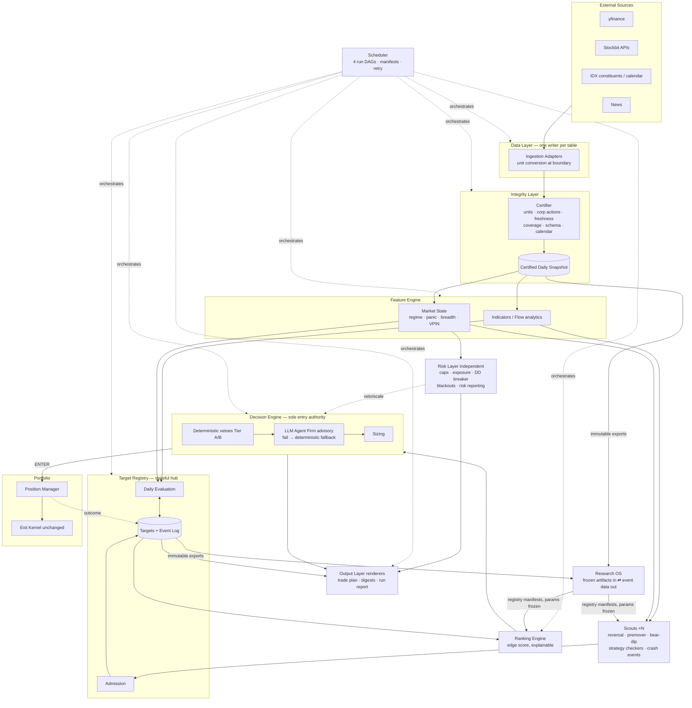
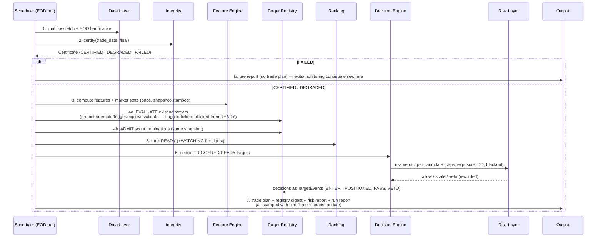
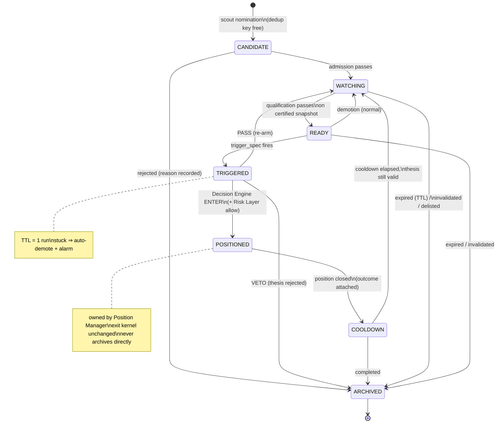

# ADR-001 — Production Engine v2 Architecture

**Status:** PROPOSED
**Date:** 2026-07-22
**Authors:** Principal Architecture Review (with owner)
**Inputs:** `Audit/PRODUCTION_ENGINE_AUDIT_2026-07-22.md` (source of truth), `Audit/INSTITUTIONAL_AUDIT_2026-07-02.md`, current codebase (read-only review)
**Decision type:** Structural redesign blueprint — no code in this document; nothing here is implemented yet.

---

## 1. Executive Summary

The current production engine is **signal-centric and pipeline-plural**: four semi-independent scan pipelines (momentum scan, multi-strategy scan, premover EOD, reversal screener) each regenerate ephemeral "today's signals" from scratch, each carrying its own copy of gating logic, each with its own path to opening a position. Watchlists are recomputed nightly artifacts with no memory, no age, and no lifecycle. The audit's findings are not 22 independent bugs — they are the **predictable failure modes of this shape**: duplicated gates drift (liquidity applied in one path, absent in another), ephemeral objects have no freshness (nothing owns "how old is this idea?"), parallel writers race (same-minute crons), and nothing stands between raw data and trading logic (unit ambiguity and unapplied corporate actions flow straight into decisions).

**Core decision of this ADR:** Production Engine v2 is built around **two canonical objects, one per plane**:

1. **Data plane — the Certified Daily Snapshot.** An immutable, integrity-certified view of the market data corpus for a trading date. No trading logic may read market data except through a certified snapshot. This single choke point structurally eliminates the volume-unit, corporate-action, freshness, and split-brain classes of defect.

2. **Decision plane — the Target.** A persistent, lifecycle-bearing record of a trading thesis on a ticker: why we care, what evidence supports it, what would trigger it, what would invalidate it, and everything that has happened to it. Signals stop being the main object; a signal becomes an **event that advances a target's state**. Trades become the outcome of a **single Decision Engine** acting on targets in `READY` state — the only component in the system permitted to open a position.

Around these two objects, v2 collapses the four pipelines into **one evaluation pipeline fed by N pluggable scouts**, inserts a **Data Integrity Layer** that must certify data before any trading logic runs, extracts **risk into an independent layer** with veto authority, and converts the scheduler from ~20 independent clock-triggered tasks into **four named runs, each an explicit DAG of stages** with persisted per-stage status, dependency verification, and retry.

All validated logic survives: the exit kernel, the strategy entry checkers, the edge-score/veto tiers, the walk-forward governance artifacts, and the agent firm are preserved **as libraries** invoked by the new stages. What is eliminated is the plumbing around them.

---

## 2. Current Architecture Weaknesses

These are the *structural* causes behind the audit findings; the findings themselves are cited as evidence.

### W1 — The main object is ephemeral ("today's signal")
Signals are regenerated from scratch up to five times a day, written to `scheduled_signals`, and forgotten. Watchlists (`reversal_watchlist`, `watchlist_premover`, `regime_watchlist`) are nightly artifacts glued together at read time (`unified_watchlist`). Consequences observed in the audit: no age caps (M-3), stale scans silently served as fresh (M-3, M-5), no memory of why a name was interesting or what happened to it, and no natural home for freshness rules (H-3). An ephemeral object cannot carry a lifecycle; therefore nothing does.

### W2 — Four pipelines, four copies of the gates
`scan_momentum_signals`, `scheduled_multi_strategy_scan`, `run_premover_eod`, and the screener/reversal path each implement their own sequence of sector/liquidity/fundamental/flow/regime gates — with different defaults, different fail-open behavior, and different coverage. Evidence: the Rp-5B turnover gate exists in the premarket path but not the EOD trade plan (H-4); `filter_liquidity` defaults **off** in the momentum path; the VPIN gate exists only in one path and is a no-op there (H-8). Duplicated logic does not drift *sometimes*; it drifts *always*.

### W3 — Multiple direct paths to opening a position
`daily_signal_scan`, `scheduled_multi_strategy_scan`, and `run_premover_eod` (enforce mode) each call `open_trade()` directly, each with their own pre-checks, creating race conditions (M-10) and making "what can cause a trade?" unanswerable without reading four call sites.

### W4 — No boundary between data and decisions
Trading logic reads `ohlcv` directly, everywhere (~30 call sites). There is no layer at which unit consistency (C-1), corporate-action adjustment (C-2), bar finality (M-11), or freshness (H-3) can be enforced once. The integrity checks that *do* exist (coverage, reconciliation, token health) are **observers that alert humans after downstream jobs already consumed the bad data** — they are monitoring, not gating.

### W5 — The scheduler owns clock times, not a pipeline
The EOD chain (16:00 scan → 16:15 finalize → 16:30 premover → 16:40 plan → 18:00 VPIN → 18:30 forward test) is sequenced purely by wall-clock offsets. No stage checks whether its upstream succeeded (M-6); two stages are deliberately scheduled at the same minute and race (M-7); six defined jobs were silently never registered (H-1, H-2) — possible only because registration is disconnected from the pipeline definition itself.

### W6 — Fail-open as the universal default
Missing keystats → pass. Missing OHLCV → pass. Flow unavailable → confirmed. Gate throws → pass. Individually defensible; together they mean a data outage does not stop trading — it removes the safety rails while trading continues (M-2). The system has no concept of *"the data is not good enough to trade on."*

### W7 — Configuration and identity fragmentation
Three DB-path resolution strategies (H-7), three divergent `stockbit_flow` schemas (H-6), strategy display-name aliases patched at lookup time, hardcoded index constituent lists with no writer for membership flags (M-4). There is no single module that owns "what is the database, what is the schema, what is the universe."

### W8 — Risk logic is scattered across altitudes
Market-level risk (regime, panic state, VPIN summary, breadth) is recomputed inside each scan; portfolio-level risk (max_open, exposure cap, DD breaker) lives inside `open_trade`; the risk *alert* tiers are computed but never delivered (H-1). No layer owns risk; therefore risk cannot veto anything it doesn't happen to be embedded in.

---

## 3. Production Engine v2 Principles

Normative. Every design element below must be justifiable against these; every future change should be tested against them.

- **P1 — One write path per fact.** Every table has exactly one writer module. Every derived fact (a feature, a rank, a decision) is computed in exactly one place and stored with its inputs' identity.
- **P2 — Data is certified before it is trusted.** No trading-logic stage reads market data except through a Certified Daily Snapshot. Certification is a hard gate, not an alert.
- **P3 — Entries fail closed; exits fail open.** Missing or degraded data blocks *new* risk and never blocks *reducing* risk. This asymmetry is codified once, in the Integrity and Risk layers — not re-decided per gate.
- **P4 — The Target is the unit of decision.** Nothing is bought because "a scan said so today." Things are bought because a Target reached `READY` and the Decision Engine confirmed it. Signals are events on targets.
- **P5 — One Decision Engine.** Exactly one component may open positions. Scouts nominate; evaluators promote; the Decision Engine decides. (Mirror: exactly one exit kernel — already true today; preserved.)
- **P6 — Deterministic replay.** Every daily run records the identity of its inputs (snapshot hash, registry state version, config version, code version). Same inputs ⇒ same outputs, byte-for-byte. Anything nondeterministic (LLM advisory, network fetches) is quarantined behind recorded artifacts.
- **P7 — Stages, not tasks.** The scheduler triggers *runs*; runs are DAGs of *stages* with declared dependencies, persisted status, and retry policy. A stage that didn't run is visible; a stage that failed blocks its dependents.
- **P8 — Validated logic is a library.** Strategy checkers, exit kernel, edge scoring, WF governance move into v2 unchanged in semantics. Re-validation effort is spent only where the audit demands it (volume units, corporate actions).
- **P9 — Research reads what production writes.** Research consumes immutable production artifacts (snapshots, event logs, decision records); production consumes only *frozen, versioned* research artifacts (registry manifests, parameter sets). Neither reaches into the other's internals. (This extends the existing M1 registry inversion — a pattern the current system already got right.)
- **P10 — Delete what is not wired.** A documented capability that does not execute is a defect (audit H-1/H-2). v2 has no "defined but unregistered" state: stages exist only inside run DAGs.

---

## 4. Canonical Domain Model

### 4.1 The main design question, answered

**Should the canonical object be Today's Signal or the Target?**

The Target — but only on the decision plane, and only if a second canonical object anchors the data plane. Reasoning:

- A *signal* is a stateless predicate evaluated at an instant ("VR > 1.8 and bullish close"). It cannot carry age, provenance, thesis, or accountability, which is exactly what the audit found missing.
- A *target* is a stateful commitment of attention: "we believe X about ticker T; here is the evidence; here is what would trigger us; here is what would invalidate us." Signals then become **observations** that update that commitment. This matches how the current system already *wants* to behave — the bear-dip watchlist promotes on regime flips, the premover list waits for breakouts, the reversal list anticipates next-day bounces — but each implements a private, partial, ephemeral version of the same idea.
- However, a target-centric decision plane is only as trustworthy as the data it evaluates against. Making the **Certified Daily Snapshot** the canonical object of the data plane is what turns the audit's two Critical findings (C-1, C-2) into structural impossibilities rather than fixed bugs.

**One caution (and its resolution):** not all validated strategies are "watch, then wait" shaped. Crash Recovery and Panic Rebound are event-driven — the "target" may only become identifiable the same day it triggers. The lifecycle therefore supports a **fast-path admission**: a scout may nominate a candidate that passes admission, evaluation, and qualification within a single run. The fast path traverses *every* gate in order — it skips waiting, never checking. This keeps one pipeline while accommodating both temperaments.

### 4.2 Entities

**Data plane**

| Entity | Identity | Nature | Notes |
|---|---|---|---|
| `MarketBar` | (ticker, date, source) | immutable after finality | Canonical units declared in schema: volume **in shares**, prices raw. Single ingestion boundary converts (fixes C-1). `is_final` retained. |
| `CorporateAction` | (ticker, date, action) | immutable | Now *read* by the snapshot builder, not just written (fixes C-2). |
| `TradingCalendar` | date | immutable | Sourced + validated; year-boundary alarm (audit L-5). |
| `UniverseMember` | (ticker, as_of) | slowly changing dimension | Membership flags (IDX30/LQ45/IDX80), listing status incl. `suspended` ≠ `delisted`, liquidity tier. Has a scheduled writer (fixes M-4, M-12). |
| `FlowRecord` / `BrokerFlow` / `Keystats` | (ticker, date) | upsert-till-final | Same finality discipline as bars. |
| **`CertifiedDailySnapshot`** | (trade_date, snapshot_hash) | **immutable** | The canonical data-plane object. See §6. |

**Decision plane**

| Entity | Identity | Nature | Notes |
|---|---|---|---|
| **`Target`** | target_id (ticker + thesis, *not* ticker alone) | mutable head + append-only history | The canonical decision-plane object. A ticker may host two targets with different theses (e.g., a reversal-bounce target and a breakout target) — dedup key is (ticker, thesis_type, direction). |
| `TargetEvent` | (target_id, seq) | append-only | Every observation, promotion, demotion, review, veto, decision. The target's current status is a *projection* of its events — the event log is the truth. |
| `Decision` | decision_id | immutable | One per Decision Engine verdict: enter / pass / veto, with full input identity (P6). |
| `Position` | position_id | mutable head + events | Owned by the Portfolio/Risk side; linked to the originating target and decision. Exit kernel unchanged. |
| `RunManifest` / `StageResult` | (run_id, stage) | immutable | Scheduler execution records (§8). |

**Frozen research artifacts** (produced by Research OS, consumed read-only): strategy registry manifests, approved universes, parameter sets, edge statistics (`wf_edge`) snapshots — versioned, hash-pinned, announced at startup (extends the existing registry loader).

### 4.3 Target fields

The fields proposed in the design brief are correct. Required additions, learned directly from audit failures:

| Field | Why |
|---|---|
| `thesis_type` + `direction` | Part of identity; enables two theses per ticker without conflation. |
| `source_scout` + `scout_version` | Provenance — replaces the R/S/V/P source-tag reconstruction done today at read time. |
| `strategy_binding` | Which validated strategy's checker/exit policy governs this target. Resolves today's display-name alias fragility at admission time, once. |
| `trigger_spec` (declarative) | *What promotes WATCHING→READY / READY→TRIGGERED.* Stored as data (e.g., `close > level L on VR > x`), evaluated by the one evaluator — not as code hidden in a scan loop. |
| `invalidation_spec` + `expiry_policy` | *What kills the thesis* (thesis invalidation) and *when patience runs out* (TTL per state). Fixes the "no age" class (M-3) by construction: a target cannot exist without an expiry policy. |
| `evidence[]` (timestamped, snapshot-hash-stamped) | Every evidence item records which certified snapshot produced it. Stale evidence is *visible*, not implicit. |
| `data_quality_at_admission` | Integrity flags at admission (e.g., "keystats missing", "recent corporate action"). Codifies fail-closed: missing data is recorded and blocks READY, rather than silently passing (M-2). |
| `liquidity_tier` (from UniverseMember, re-checked at qualification) | The liquidity gate becomes an admission + qualification property of the target, applied once, uniformly (fixes H-4's per-pipeline drift). |
| `cooldown_until` | Absorbs the post-stop-loss cooldown into the lifecycle instead of a query inside `open_trade`. |
| `priority_score` + score breakdown | The ranking output, stored with decomposition (extends `edge_breakdown` — explainability preserved). |
| `links` (decision_ids, position_ids) | Full audit trail Target → Decision → Position → Post-trade review. |
| `catalyst[]` (dated) | Already exists conceptually (`engine/catalyst.py`); becomes first-class so the veto carve-outs are data, not lookups. |

`hypothesis`, `confidence`, `review_history`, `removal_reason`, `archive_date` from the brief: all retained. `confidence` is split into `scout_confidence` (at admission) and `current_priority` (recomputed) to avoid one number meaning two things.

---

## 5. Target Lifecycle

### 5.1 Evaluation of the proposed statuses

Proposed: *Watching, Monitoring, Ready, Triggered, In Position, Exited, Archived, Expired, Rejected.* Assessment:

- **Watching vs Monitoring** — no operationally distinct semantics; every live target is monitored daily by the same evaluator. **Collapse into `WATCHING`** (intensity is a property — `priority` — not a state).
- **Expired / Rejected** — these are *reasons for archival*, not states. Making them states creates terminal-state proliferation and complicates queries ("all dead targets" = 3 states). **Collapse into `ARCHIVED` with mandatory `archive_reason ∈ {expired, rejected, invalidated, completed, superseded, delisted}`.**
- **Exited** — a target whose position closed is not dead; the thesis may re-arm (or must cool down). **Rename to `COOLDOWN`** with an explicit `cooldown_until`, after which the evaluator either re-admits to `WATCHING` (thesis still valid) or archives (`completed`).
- **Add `CANDIDATE`** — the gap between a scout's nomination and validated admission. Admission checks (dedup, universe membership, liquidity tier, data quality) run here; failures archive as `rejected` *with the reason recorded* — today's silent filtering becomes an auditable event.
- **Triggered** — retained, deliberately short-lived (TTL measured in one run): the state between "trigger condition observed" and "Decision Engine verdict recorded." It exists so that a Decision Engine failure leaves a visible stuck state rather than a silently lost trade.

### 5.2 Final state machine

```
CANDIDATE → WATCHING → READY → TRIGGERED → POSITIONED → COOLDOWN → (WATCHING | ARCHIVED)
     ↓          ↓         ↓         ↓            
  ARCHIVED  ARCHIVED  ARCHIVED  ARCHIVED   (POSITIONED never archives directly:
 (rejected) (expired/  (expired/ (vetoed/    position must close first → COOLDOWN)
            invalidated) demoted→ passed→
                       WATCHING) WATCHING)
```

Guarded transitions (all emitted as `TargetEvent`s; illegal transitions are schema-enforced):

| Transition | Guard | Actor |
|---|---|---|
| — → CANDIDATE | scout nomination; dedup key free or cooldown elapsed | Scout (via Registry API) |
| CANDIDATE → WATCHING | admission checks pass (universe, liquidity tier, data quality, no unresolved corporate action) | Admission stage |
| CANDIDATE → ARCHIVED(rejected) | any admission check fails — reason recorded | Admission stage |
| WATCHING → READY | all qualification gates pass on a certified snapshot **and** `trigger_spec` preconditions armed | Daily Evaluation stage |
| READY → WATCHING | qualification degrades (demotion is normal, not failure) | Daily Evaluation stage |
| READY → TRIGGERED | `trigger_spec` fires on certified data | Evaluation (EOD) or Intraday Observation |
| TRIGGERED → POSITIONED | Decision Engine verdict = ENTER and execution succeeds | **Decision Engine only** (P5) |
| TRIGGERED → WATCHING | verdict = PASS (conditions insufficient) — re-arms | Decision Engine |
| TRIGGERED → ARCHIVED(vetoed) | verdict = VETO (thesis-level rejection, e.g., Tier-A directional veto) | Decision Engine |
| POSITIONED → COOLDOWN | position closed by exit kernel; outcome attached | Position Manager |
| COOLDOWN → WATCHING / ARCHIVED | cooldown elapsed; thesis re-check | Daily Evaluation |
| any live → ARCHIVED(expired) | state TTL exceeded (per `expiry_policy`; defaults per thesis_type, e.g., reversal 3 sessions, premover 15, bear-dip 60 — matching today's empirically chosen horizons) | Daily Evaluation |
| any live → ARCHIVED(invalidated) | `invalidation_spec` fires (e.g., broker flow flips to distribution) | Daily Evaluation |
| any live → ARCHIVED(delisted/suspended-terminal) | universe status change | Universe sync stage |

Invariants: (1) exactly one live target per dedup key; (2) every `READY` and `TRIGGERED` evaluation stamps the snapshot hash it used; (3) a target in `POSITIONED` cannot be archived, expired, or re-triggered; (4) every archive carries a reason; (5) `TRIGGERED` older than one run auto-demotes with an alarm (stuck-state detector).

**Is daily evaluate-existing superior to nightly regeneration? Yes** — it converts the watchlist from a *recomputation* (whose failure silently serves stale output, M-3) into a *state advance* (whose failure leaves yesterday's state visibly unadvanced, with `last_review` proving it). It also gives stability: targets don't flicker in and out with data noise; they demote and re-promote with recorded cause. The admission phase (scouts) preserves the ability to discover new names daily. Both phases run inside the same EOD run, evaluation first, admission second, so new candidates are evaluated against the same snapshot the same night.

---

## 6. Data Integrity Layer

### 6.1 The Certification model

The Integrity Layer's product is the **Certified Daily Snapshot**: for each trading date, after ingestion completes, a certification stage runs all checks and issues a persisted **Data Readiness Certificate**:

```
Certificate {
  trade_date, snapshot_hash,          # hash over the corpus slice consumed
  verdict: CERTIFIED | DEGRADED | FAILED,
  coverage: {ohlcv_pct, flow_pct, broker_pct, keystats_age_p50},
  per_ticker_flags: {ticker: [stale, unit_anomaly, split_pending, missing_flow, ...]},
  checks: [{name, result, detail}],
  issued_at, layer_version
}
```

Downstream policy is fixed by principle P3 and enforced in exactly one place:

| Verdict | New entries (READY promotion, Decision Engine) | Exits / monitoring | Reports |
|---|---|---|---|
| CERTIFIED | allowed | allowed | normal |
| DEGRADED | allowed **only** for tickers with no flags; flagged tickers blocked with recorded reason | allowed (exits never blocked) | banner: degraded + which checks |
| FAILED | blocked globally | allowed, on best-available data, loudly flagged | failure report replaces trade plan |

This inverts today's model: integrity checks stop being alerts that race downstream jobs (W4) and become the gate those jobs read.

### 6.2 Responsibilities (each maps to audit findings)

1. **Unit validation (C-1).** Schema declares canonical units (volume = shares). The single ingestion boundary converts each source; a cross-source invariant check (same ticker-date volume ratio from scraper vs yfinance must be ≈1, alarm at ≈100) runs in certification. The historical corpus is reconciled once during migration (§12).
2. **Corporate actions (C-2).** The snapshot builder *applies* split adjustment (back-adjustment at read time; raw preserved). A detected-but-unconfirmed action (price gap consistent with a split, no action record yet) flags the ticker `split_pending` — blocking entries on that name until resolved. Crash/shock detectors receive *adjusted* series plus the action flags, so a split can never masquerade as a crash.
3. **Freshness (H-3).** Per-ticker last-bar age computed once, stamped into `per_ticker_flags`. No scan loop ever re-implements freshness; consumers simply cannot see stale tickers as clean.
4. **Schema validation (H-6).** One idempotent migration module owns every table; certification asserts schema version. The three-creators-of-`stockbit_flow` situation becomes impossible (P1).
5. **Trading calendar (L-5, audit §5).** Calendar completeness through the current year is a certification check; December alarms if next year is missing.
6. **Database consistency (H-7).** One `DB_PATH`, resolved absolute, in one config module; certification records the resolved path + file identity in every certificate — a split-brain run becomes self-evident in the manifest.
7. **Missing data / coverage.** Today's coverage checks move here, promoted from alert to verdict input.
8. **Finality (M-11, M-8).** Certification distinguishes intraday snapshots (provisional bars allowed, marked) from the EOD snapshot (final bars only for the trade date). The EOD decision stages consume only the EOD certificate.

**Placement rule:** the Integrity Layer contains *no trading judgment* — it never knows what a good setup is. Symmetrically, no trading component ever judges data quality — it reads flags. This is the separation of data integrity from trading logic requested in the objectives, expressed as an interface.

---

## 7. Pipeline Architecture

### 7.1 The layered pipeline, corrected

The proposed stack (Data → Integrity → Target Registry → Feature → Ranking → Decision → Output) is right in spirit with **one correction**: the Feature Engine must run *before* registry evaluation, because both admission (scouts) and evaluation (trigger/invalidation specs) consume features. The registry is not a pipeline stage that data flows *through* — it is the **stateful hub** that the evaluation stages read and write.

```
┌────────────────────────────────────────────────────────────────────┐
│  DATA LAYER          ingestion adapters (yfinance, Stockbit flow,  │
│                      broker, keystats, news, universe sync)        │
│                      → one writer per table (P1)                   │
├────────────────────────────────────────────────────────────────────┤
│  INTEGRITY LAYER     certification → CertifiedDailySnapshot        │
│                      (hard gate; §6)                               │
├────────────────────────────────────────────────────────────────────┤
│  FEATURE ENGINE      indicators, flow analytics, market state      │
│                      computed ONCE per ticker per snapshot,        │
│                      persisted with snapshot hash                  │
├──────────────┬─────────────────────────────────────────────────────┤
│  SCOUTS (N)  │  TARGET REGISTRY (stateful hub)                     │
│  nominate →  │  admission · daily evaluation · lifecycle           │
├──────────────┴─────────────────────────────────────────────────────┤
│  RANKING ENGINE      priority scoring of READY/WATCHING targets    │
│                      (edge score + tiers; pure, explainable)       │
├────────────────────────────────────────────────────────────────────┤
│  DECISION ENGINE     the only entry authority (P5):                │
│                      deterministic vetoes → advisory (LLM firm) →  │
│                      RISK LAYER veto → sizing → position open      │
├────────────────────────────────────────────────────────────────────┤
│  OUTPUT LAYER        trade plan, registry digest, run report,      │
│                      metrics — renderers only, no logic            │
└────────────────────────────────────────────────────────────────────┘
```

### 7.2 Scouts: one pipeline, N nominators

The four current pipelines become **scouts** — pure functions `(snapshot, features) → nominations`:

- ReversalScout (delta-flip + broker confirmation, ex-`reversal_filter`)
- PremoverScout (pre-breakout scoring, ex-`premover_detector`)
- BearDipScout (oversold-in-BEAR, ex-watchlist scout)
- MomentumScout / StrategySignalScout (ex-scan checkers, via the existing `_CHECKER_DISPATCH`)
- CrashEventScout (fast-path: Crash Recovery / Panic Rebound nominations with `trigger_spec` pre-armed)

Scouts **cannot** gate, rank, or trade. They emit nominations with thesis, evidence, trigger spec, and confidence. All gating lives in admission + qualification (once); all trading lives in the Decision Engine (once). This is the structural fix for W2/W3/H-4: a gate added or tuned once now applies to every idea source by construction.

### 7.3 Feature Engine

- Computed once per (ticker, snapshot), persisted keyed by snapshot hash — replaces today's five-scans-recompute-everything pattern and the fragile in-memory indicator cache as the cross-stage mechanism (the in-process cache remains a local optimization).
- Includes the **Market State** block (regime, panic state, breadth, market VPIN, accdist, IHSG technicals) computed exactly once per snapshot — today it is recomputed inside every scan and every report (W8).
- Session-window definitions (the flow "closing window", auction inclusion — audit M-1) live here as named, tested constants with one owner.

### 7.4 Ranking Engine

Preserved semantics from `edge_score`/`veto` (fixed anchors, hard statistical vetoes, explainable breakdown), re-scoped: it ranks **targets**, not signals, and its output is written to the target (`priority_score` + breakdown). Liquidity is *not* a ranking input — it is an admission/qualification gate (constraint, not alpha). Ranking never sees a target that shouldn't be tradable.

### 7.5 Decision Engine and the Risk Layer

**Where should risk live? As an independent layer — with two distinct altitudes, neither inside ranking nor inside signal generation:**

1. **Market/portfolio risk (pre-trade)** — an independent module with **veto and scaling authority over the Decision Engine**: session caps by market regime (`N_MAX`), aggregate exposure cap, max_open, DD circuit breaker (extended to mark-to-market equity, per audit §4), event-guard windows, blackout calendar. It is consulted exactly once per decision, and its verdict is recorded in the Decision record. It cannot be bypassed because there is only one Decision Engine (P5).
2. **Position risk (post-entry)** — the existing exit kernel + monitor, unchanged (audit's strongest module). Exits consult market risk state only as *information*, never as a gate (P3).

Rationale for independence: risk inside ranking conflates constraint with alpha (a risky market doesn't make a setup lower *quality* — it makes it un-actionable); risk inside signal generation is what produced today's scattered, partially-dead risk logic (W8). An independent layer with veto authority is also the natural owner of risk *reporting* — which fixes the never-delivered-alerts class (H-1) by making the Risk Layer's daily output a first-class stage in the EOD run, not an optional job.

**The LLM agent firm** remains inside the Decision Engine as the **advisory** step, strictly after deterministic vetoes and strictly before the Risk Layer, with its current degradation semantics (degraded/bypassed → deterministic fallback + alarm — the C-9 fix is preserved as a contract). It is never a data dependency and never the last gate: a hallucinated approval still cannot pass the Risk Layer's caps.

### 7.6 Output Layer

Renderers only: EOD Trade Plan (from Decision records), Registry Digest (state changes: promotions, demotions, expiries — replacing the ad-hoc watchlist messages), Run Report (stage statuses — replacing the never-delivered `daily_fetch_report`), Risk Report (from the Risk Layer), Post-trade Review (target outcome vs hypothesis). Outputs carry the certificate verdict and snapshot date in the header — degraded data is always visible to the reader (extends today's honest "VPIN settled ~20:15" footnote into a system-wide norm).

---

## 8. Scheduler Architecture

**Decision: the scheduler owns runs (pipeline stages), not tasks.**

### 8.1 Four named runs

| Run | Trigger | DAG (→ = dependency) |
|---|---|---|
| **NIGHTLY** | 20:00 WIB | broker-flow ingest → keystats/news ingest → universe sync → **EOD-certify(final)** → reconciliation → VPIN batch → forward-test cycle → research artifact export |
| **PREMARKET** | 08:15 WIB | token health → macro fetch → premarket-certify (reads last EOD certificate) → registry evaluation (overnight review) → ranking → premarket digest + market health report |
| **INTRADAY** (×k) | session hours | flow ingest → intraday-certify (provisional) → intraday observation (trigger detection on READY targets; position monitor) → [Decision Engine, if intraday entries enabled] |
| **EOD** | 16:05 WIB | final flow fetch → EOD bar finalize (scraper) → **certify(final)** → feature engine → registry evaluation (evaluate → admit) → ranking → decision engine → risk report → trade plan → registry digest → run report |

Notes: the current 16:00-scan-before-16:15-finalize inversion (M-8) is impossible here — the decision stages *depend on* the certification stage. The current same-minute race (M-7) is impossible — screener-equivalent ingestion is an upstream stage of the scan-equivalent evaluation. Whether INTRADAY runs retain Decision authority is Open Question OQ-2; v2 default is observation + exits only.

### 8.2 Execution model (determinism + failure handling)

- **Run manifest:** each run writes `RunManifest{run_id, run_type, trade_date, code_version, config_version, certificate_id}` and one `StageResult{status: pending|running|success|failed|skipped, attempt, duration, error, inputs_hash, outputs_hash}` per stage. This is the uniform logging the audit found missing (§5), and the replay key (P6).
- **Dependency enforcement:** a stage runs only when its declared upstreams are `success` (or `degraded-allowed`, explicitly). No stage reads the clock to infer readiness.
- **Retry:** network-bound stages get bounded retry with backoff *within* the run window; the run as a whole can be resumed — completed stages are skipped by `outputs_hash`, failed stages re-attempt. **Success is recorded after the work** (sentinel-on-success), fixing the dedup-blocks-retry defect (M-6).
- **Idempotence:** every stage is idempotent per (trade_date, inputs_hash) — re-running a green run is a no-op; re-running after a fix re-executes only what changed.
- **Watchdog:** the existing heartbeat is extended to assert *last-success age per run type* ("EOD run hasn't succeeded in 26h"), not just process liveness.
- **Registration = definition:** run DAGs are declared in one manifest module; there is no way to define a stage without placing it in a DAG (P10). The "defined but never scheduled" class (H-1/H-2) becomes unrepresentable.
- **Holiday handling:** the calendar check is a run-level precondition (skip the run, record `skipped(holiday)`), not a per-task guard that can silently fail open (L-4).

---

## 9. Component Diagram



---

## 10. Data Flow Diagram (EOD run — the decisive daily path)



Premarket run: re-evaluates the registry against the *last certified EOD snapshot* (explicitly labeled as such — no pretense of fresh data), producing the morning shortlist. Intraday runs: observation only by default — advance READY→TRIGGERED on provisional certified data, monitor positions, never bypass the Decision Engine.

---

## 11. State Diagram (Target lifecycle)



---

## 12. Migration Strategy

Strangler pattern; validated logic moves as libraries (P8); at every phase the system remains fully operational; each phase produces a parallel-run comparison before the next begins.

**Phase 0 — Stop the bleeding (independent of v2; from the audit's remediation order).**
Trivial audit fixes (VPIN typo, register-or-delete dead jobs, date guards, absolute DB_PATH). These reduce operational risk during the migration itself.

**Phase 1 — Data plane first (prerequisite for everything).**
One schema/migration module; one config module; unit ruling for C-1 executed via the audit's verification protocol, then historical volume reconciliation; corporate-action-adjusted snapshot builder; the Certifier producing certificates in **observe mode** (certificates written, nothing gated yet). Success criterion: 10 consecutive sessions of certificates whose flags match operator expectations; zero unit-invariant violations post-reconciliation.

**Phase 2 — Target Registry in shadow.**
Registry schema + event log; nightly job mirrors the existing watchlists/scans into targets (existing pipelines untouched and still authoritative). The registry digest is produced alongside current outputs. Success criterion: registry state explains 100% of legacy watchlist contents, plus the deltas (expiries, stale sources) the legacy path cannot see — this *demonstrates* the value before any behavior changes.

**Phase 3 — Single evaluation pipeline, decisions still legacy.**
Scouts extracted (checker logic reused verbatim); admission/qualification gates unified (one liquidity gate, fail-closed policy activated); Ranking runs on targets; the EOD run DAG replaces the 16:0x cron chain with certification now **gating** (P2 live). Legacy `open_trade` call sites still execute, but each is preceded by a shadow Decision Engine verdict, logged for comparison. Success criterion: ≥ 20 sessions where shadow decisions and legacy decisions are reconciled and every divergence is explained (expected divergences: liquidity gate now applied to the EOD plan, freshness blocks, fail-closed blocks).

**Phase 4 — Cutover and deletion.**
Decision Engine becomes the sole entry path; direct `open_trade` calls removed; Risk Layer gets veto authority; legacy scan jobs, duplicate gates, and the unified-watchlist read-time merge are **deleted** (P10 — deletion is part of the migration, not an afterthought). Remaining runs (NIGHTLY/PREMARKET/INTRADAY) migrate to DAGs. Post-cutover: 30-day heightened monitoring with the Phase-3 comparison harness kept runnable for regression checks.

**What is explicitly preserved untouched:** exit kernel + policies, position monitor semantics, cost model, WF governance artifacts and registry loader, edge-score anchors and veto tiers, agent-firm degradation contract, Telegram delivery mechanics.

**Rollback:** Phases 1–3 are additive (legacy path authoritative throughout); rollback = disable new stages. Phase 4 retains the legacy modules in-tree but unwired for one release; rollback = re-enable legacy jobs manifest.

---

## 13. Risks

| # | Risk | Likelihood | Impact | Mitigation |
|---|---|---|---|---|
| R1 | **Historical volume reconciliation (C-1) is wrong**, silently rebasing the corpus incorrectly | Med | Critical | Do the empirical unit ruling first (audit protocol); reconcile into a *new* column/table and cut over only after cross-source invariants hold for the full history; keep raw originals immutable |
| R2 | **Fail-closed reduces trade count** and the operator perceives v2 as "worse" | High | Med | Phase-3 shadow comparison quantifies exactly which trades fail-closed would have blocked and why, *before* cutover; make it an explicit sign-off |
| R3 | **Registry becomes a hoarder** (targets accumulate; evaluation slows; digest noise) | Med | Med | TTLs mandatory at admission; MAX live targets per scout with priority eviction; digest reports only state *changes* |
| R4 | **Over-engineering for a single-operator system** — DAG/certificate machinery adds ops burden | Med | High (adoption) | Keep implementation deliberately thin: certificates and manifests are SQLite rows, runs are in-process sequential stage lists, not a workflow engine; no new infrastructure dependencies |
| R5 | **Migration fatigue** — Phase 3 stalls, leaving two half-systems (the worst state) | Med | High | Phases gated by explicit success criteria; Phase 2 delivers standalone value (registry digest) even if later phases pause; Phase 4 includes deletion as a tracked deliverable |
| R6 | **Stockbit dependency remains a single point of failure** for flow + EOD bars regardless of architecture | High | High | Out of v2's structural scope but surfaced by it: certificates make Stockbit outages *visible and blocking* instead of silent; see OQ-4 for the authority question |
| R7 | **Determinism vs LLM advisory** — replay of a decision that consulted the firm | Certain | Low | Firm outputs recorded as artifacts in the Decision record; replay re-reads the artifact, never re-calls the LLM (already the trace pattern in `agent_traces` — formalized) |
| R8 | **Two-plane model misapplied** — someone adds trading judgment to the Certifier or data judgment to a scout | Med | Med | Contract tests: Certifier module imports no engine code; scouts/evaluators receive snapshots only via the API, never a DB handle to raw tables |

---

## 14. Open Questions

- **OQ-1 — Target identity granularity.** Is (ticker, thesis_type, direction) the right dedup key, or should confluence (reversal + premover on the same ticker) be one target with multiple evidence streams rather than two targets merged at ranking time? Current lean: separate targets, confluence expressed as a ranking feature — preserves clean per-thesis outcome attribution for research. Needs a decision before Phase 2 schema.
- **OQ-2 — Intraday decision authority.** Do the 5×/day intraday scans still earn their complexity, given the disabled momentum book and that most validated setups are EOD-decided? v2 default: intraday = observation + exits only; entries premarket/EOD. Reversing this is a config change, not an architecture change — but the default should be chosen from forward-test evidence.
- **OQ-3 — Event-sourcing depth.** Full event log as source of truth (status = projection) vs status column + append-only audit trail. Full ES is cleaner for research replay; the hybrid is simpler in SQLite. Lean: hybrid (status column maintained transactionally *with* the event insert) — revisit only if drift is ever observed.
- **OQ-4 — EOD bar authority (audit H-5).** Should Phase 1 also flip finality authority from the scraper to an official/yfinance EOD source, with the scraper demoted to intraday-provisional? Architecturally trivial in v2 (it's an Integrity Layer policy), but it changes the corpus and belongs with the C-1 reconciliation ruling.
- **OQ-5 — Database topology.** One SQLite file (status quo) vs splitting market-data DB from decision DB. Split improves WAL contention and blast radius (the 2.5 GB corpus vs the small hot decision state) but complicates the snapshot hash. Lean: keep one file through Phase 3; measure contention; decide at Phase 4.
- **OQ-6 — Shorts.** The distribution/SELL path exists but shorts are "exit triggers, not entries" today. Does the Target model carry short theses as first-class targets (direction field says yes) or remain long-only with shorts as invalidation signals? Defer to research; the schema supports both.
- **OQ-7 — Paper vs live boundary.** v2 treats the Position Manager as an interface; when live execution arrives, does the Decision Engine emit orders or intents? (Intents, almost certainly — but the broker adapter contract should be sketched before Phase 4 locks the Decision record schema.)

---

## 15. Recommended Architecture

**Adopt Production Engine v2 as specified:**

1. **Canonical objects:** Certified Daily Snapshot (data plane) + Target with event-sourced lifecycle (decision plane). "Today's signal" is demoted to an event type.
2. **Lifecycle:** `CANDIDATE → WATCHING → READY → TRIGGERED → POSITIONED → COOLDOWN → ARCHIVED(reason)`, guarded transitions, mandatory TTL + invalidation specs, fast-path admission for event-driven strategies.
3. **Pipeline:** Data → Integrity (hard gate) → Feature Engine → {Scouts → Admission} + {Daily Evaluation} on the Target Registry → Ranking → Decision Engine (sole entry authority, with independent Risk Layer veto) → Output renderers.
4. **Risk:** independent layer, two altitudes (pre-trade portfolio risk with veto authority; position risk in the unchanged exit kernel). Never inside ranking; never inside signal generation.
5. **Scheduler:** owns four run DAGs (NIGHTLY, PREMARKET, INTRADAY×k, EOD) with manifests, dependency enforcement, sentinel-on-success, idempotent resumable stages. Tasks that are not stages in a DAG do not exist.
6. **Evaluation model:** evaluate-existing-targets daily + scout admission, replacing regenerate-from-scratch.
7. **Research contract:** frozen artifacts in (registries, parameters), immutable event/snapshot exports out; the registry event log becomes the primary dataset for edge attribution, experiment frameworks, and post-trade review.

### Why this is the right shape (traceability to the audit)

| Audit finding class | v2 structural answer |
|---|---|
| C-1 volume units | Single ingestion boundary + schema-declared units + certification invariant |
| C-2 corporate actions | Snapshot builder applies adjustments; `split_pending` blocks entries; detectors see adjusted series |
| H: multiple pipelines | One evaluation pipeline; pipelines demoted to scouts that can only nominate |
| H: no persistent watchlist | The Target Registry *is* the persistent watchlist, with lifecycle and provenance |
| H: no freshness validation | Per-ticker freshness flags in every certificate; consumers cannot see stale as clean |
| H: missing scheduler jobs | Stages exist only inside run DAGs; unregistered work is unrepresentable |
| H: liquidity bias | Liquidity is a single admission/qualification gate applied to every idea source |
| H: split-brain DB | One config authority; DB identity recorded in every certificate and manifest |
| H: VPIN no-op | Gates are declarative qualification checks with recorded verdicts — a throwing gate fails closed and visibly |
| M: closing auction / session windows | Owned once by the Feature Engine with named, tested constants |
| M: missing target age | TTL/expiry mandatory at admission; ARCHIVED(expired) is a normal, visible outcome |
| M: dedup blocks retry | Sentinel-on-success + idempotent resumable stages in the run model |
| M: index membership writers | UniverseMember is a first-class slowly-changing dimension with a scheduled sync stage |

**Guiding trade-off accepted:** v2 spends complexity on *state and verification machinery* (registry, certificates, manifests) to buy simplicity where it matters — one pipeline, one decision path, one data gate. For a single-operator system this is justified only if the machinery stays thin (R4): SQLite rows and in-process stage lists, not infrastructure. That constraint is part of this recommendation.

**Next steps:** resolve OQ-1 and OQ-4 (they gate Phase 1/2 schemas) → execute Phase 0 audit fixes → begin Phase 1 (data plane) with the C-1 unit ruling as its first task.

---

*This ADR is a blueprint. No code, schema, or data has been modified. Companion document: `Audit/PRODUCTION_ENGINE_AUDIT_2026-07-22.md`.*
