# ADR-001 v2 — Production Engine Architecture (Frozen Baseline)

**Status:** FROZEN BASELINE — supersedes `docs/ADR-001-Production-Engine-v2.md` (v1) in full.
**Date:** 2026-07-22
**Role:** Chief Architect consolidation of three first-class inputs:
1. `Audit/PRODUCTION_ENGINE_AUDIT_2026-07-22.md` (defect evidence)
2. `docs/ADR-001-Production-Engine-v2.md` (v1 proposal)
3. `docs/ADR-001-Architecture-Challenge-Review.md` (adversarial review — findings binding)

**Governance:** Sections marked FROZEN may be changed only by a superseding ADR that names this document and states what breaks. Sections marked OPEN are implementation latitude within frozen constraints. The Freeze Matrix (§14) is authoritative.

**No code in this document. Nothing here is implemented yet.**

---

## 1. Executive Summary

Production Engine v2 is a single-pipeline, three-object architecture for a single-operator quantitative trading platform on IDX:

- **Data plane** — market data is ingested by exactly one writer per table, certified by a Data Integrity Layer, and **published** as immutable, versioned **Snapshot Artifacts**. No trading logic ever reads raw tables.
- **Decision plane** — persistent **Targets** carry trading theses through a four-state lifecycle in a Target Registry. Scouts nominate; one gate set admits; one evaluator promotes; one **Decision Authority** (hosting versioned Decision Policies) may open positions, under an independent Risk Layer veto.
- **Record plane** — every verdict on every considered target (enter, pass, veto) is written to an append-only **Decision Log** with complete provenance. This is the platform's scientific record.

The scheduler executes four named runs as DAGs of idempotent, resumable stages with persisted manifests. Work that is not a stage in a DAG does not exist.

All eight binding conditions of the Challenge Review (C1–C8) are incorporated. Every review finding is dispositioned in §2 — accepted, modified, or rejected with justification. The trigger DSL is **rejected permanently** (§8.5); the snapshot hash is **replaced permanently** by artifact publication with corpus versioning (§7); registry identity, the lifecycle, the Decision Authority/Policy split, and the Decision Log are **frozen** herein.

---

## 2. Challenge Review Disposition (complete)

Every finding from the Challenge Review, dispositioned. ACCEPTED = adopted as written; MODIFIED = adopted with a stated change; REJECTED = not adopted, justification given. No finding is silently dropped.

| Finding | Disposition | Landing |
|---|---|---|
| W1 — Trigger/invalidation DSL is over-engineering | **ACCEPTED** | §8.5 Evaluator model; DSL added to Anti-Principles AN-6 |
| W2 — Snapshot hash under-specified/impractical | **ACCEPTED** | §7 Publication model replaces it entirely |
| W3 — Missing ticker-level invariants | **ACCEPTED** | §8.4 Ticker Book View; §8.6 cooldown ledger; §9.2 Authority enforcement |
| W4 — One engine conflates authority/policy | **ACCEPTED** | §9 Decision Authority + Policies |
| W5 — TRIGGERED & COOLDOWN states don't pay; suspension missing | **ACCEPTED** | §10 four-state machine; trigger as event pair; `frozen` flag; cooldown ledger |
| W6 — Premarket duplicates EOD decision | **ACCEPTED** | §11 premarket = delta digest + risk refresh only |
| W7 — No corpus-correction protocol | **ACCEPTED** | §7.4 Correction & Supersession Protocol (pre-req to the C-1 reconciliation) |
| W8 — No operator-override surface | **ACCEPTED** | §8.8 Operator Commands (event-emitting) |
| HR1 — Version churn breaks comparability | **ACCEPTED** | §12 digest includes version-change line; Decision Log carries version vector |
| HR2 — Certifier threshold drift under trading pressure | **ACCEPTED** | Thresholds live in the versioned Parameter Store; changes appear in run reports (§7.3, §6.5) |
| HR3 — SQLite writer contention | **ACCEPTED** | Artifact reads for research (§7.2); single decision-plane writer process (INV-G3) |
| HR4 — Shadow-phase anchoring to legacy bugs | **ACCEPTED** | §13 Phase-2 criterion restated: *explain all differences*, not reproduce contents |
| HR5 — Comparison harness unowned | **ACCEPTED** | §13 Phase 1 deliverable |
| HR6 — Telegram single delivery channel | **MODIFIED** | Run reports also persist as local files (accepted now, §12); a *second external channel* is deferred to ADR-008 — adding an external dependency now contradicts the thinness constraint; the watchdog already runs outside the app process, which covers the "reporter is down" case |
| HR7 — Clock authority unowned | **ACCEPTED** | §6.6 Clock module (canonical entity) |
| HR8 — Event-log growth unnamed | **ACCEPTED** | §6 deletion/retention policies per object; NIGHTLY compaction check (values OPEN) |
| A1 — Snapshot publication | **ACCEPTED** | §7 |
| A2 — Decision Log canonical | **ACCEPTED** | §5, §9.4 |
| A3 — Ticker Book View | **ACCEPTED** | §8.4 |
| A4 — Authority/Policy split | **ACCEPTED** | §9 |
| A5 — Operator commands | **ACCEPTED** | §8.8 |
| A6 — Clock module | **ACCEPTED** | §6.6 |
| A7 — Versioned parameter store | **ACCEPTED** | §6.5 |
| A8 — Nightly invariant checker | **ACCEPTED** | §11 NIGHTLY run stage; invariants in §6 |
| Removal: DSL / snapshot hash / TRIGGERED / COOLDOWN / premarket re-eval | **ACCEPTED** (all five) | §8.5, §7, §10, §10, §11 |
| Keep CANDIDATE (with same-transaction pass-through) | **ACCEPTED** | §10 |
| Certifier+Feature = one stage, two modules | **ACCEPTED** | §7.3 |
| Registry maintenance = one stage (evaluate→admit) | **ACCEPTED** | §11 |
| Ranking stays separate from Authority; Risk stays separate | **ACCEPTED** | §9 |
| Reject event-driven orchestration; reject full ES/CQRS; hybrid state model | **ACCEPTED** | §8.7, AN-9 |
| Scouts: stateless, deterministic, flat (no hierarchy/composition) | **ACCEPTED** | §8.3 |
| OQ-1 resolved as (ticker, thesis_type, direction) + Book View | **ACCEPTED** | §8.2 (frozen) |
| Five-year: portfolio construction layer later; DB split seam now | **ACCEPTED** | Deferred ADR-006/-007; seam in §7.2 |

**Rejections: none at the finding level.** One modification (HR6). The review's findings were correct; this baseline's job was to make them precise and frozen.

---

## 3. Architecture Principles (Constitutional) — FROZEN

These are constitutional: any design or code change that violates one requires a superseding ADR, not a workaround.

- **AP-1 — One writer per fact.** Every table/artifact type has exactly one writer module. Every derived fact is computed in exactly one place.
- **AP-2 — Certify, then publish, then consume.** No trading logic reads market data except through a published Snapshot Artifact. Certification is a gate, never merely an alert.
- **AP-3 — Entries fail closed; exits fail open.** Degraded or missing data blocks new risk and never blocks reducing risk. This asymmetry is implemented once (Integrity verdict table + Authority) and nowhere else.
- **AP-4 — The Target is the unit of decision.** Positions originate only from Targets; signals are events on Targets.
- **AP-5 — One entry authority.** Exactly one component may open positions. Scouts nominate, evaluators promote, policies propose — only the Decision Authority disposes. (Mirror: one exit kernel.)
- **AP-6 — Every production decision is reproducible.** Each Decision Record carries the full version vector of its inputs (artifact, evaluators, policy, risk config, parameters, code). Same inputs ⇒ same verdict; nondeterministic advisories are recorded as artifacts and replayed from record, never re-invoked.
- **AP-7 — Every decision has immutable provenance; every archive has a reason.** Append-only records are never updated or deleted; corrections supersede with lineage.
- **AP-8 — Stages, not tasks.** All scheduled work exists as stages inside named run DAGs with persisted manifests. Success is recorded after the work.
- **AP-9 — Research reads what production publishes; production runs on what research freezes.** The interfaces are immutable artifacts (out) and versioned parameter sets / registered evaluators / policies (in). Neither side reaches into the other's internals.
- **AP-10 — History is repairable; the record is not.** Market data may be corrected under the Supersession Protocol (version-bumped, lineaged, reported). Decision Records and Target Events are never retro-modified.
- **AP-11 — Manual actions are commands.** Operator interventions go through the same APIs and emit events. Direct state surgery is a defect.
- **AP-12 — Machinery stays thin.** Certificates, manifests, artifacts, and logs are SQLite rows and files; runs are in-process sequential stage executions. No workflow engines, no message buses, no services, until a superseding ADR proves need.

## 4. Anti-Principles (Forbidden Designs) — FROZEN

- **AN-1 — Duplicate candidate pipelines.** No second path from market data to a position. New idea sources are Scouts; anything else is forbidden.
- **AN-2 — Direct position opening.** No module other than the Decision Authority may create a position. No "temporary" bypasses, including for backfills or tests against production state.
- **AN-3 — Hidden data transformations.** No unit conversion, adjustment, filtering, or session-window logic outside the ingestion boundary / Feature Engine's named, tested definitions.
- **AN-4 — Business logic inside the scheduler.** The scheduler sequences stages and records outcomes. It never filters, ranks, gates, or decides.
- **AN-5 — Fail-open entry gates.** A gate that cannot evaluate (missing data, thrown exception) blocks the candidate and records why. Fail-open is reserved for exit/monitoring paths only.
- **AN-6 — Runtime rule grammars.** No DSLs, no stored executable expressions, no eval of data as logic. Behavior lives in versioned, registered code; data supplies parameters only. (Freezes the W1 decision permanently.)
- **AN-7 — Multiple authorities for one invariant.** Ticker-level invariants live in the Book View + Authority only; data-quality verdicts live in the Certifier only; risk caps live in the Risk Layer only. Re-checking elsewhere is forbidden (it drifts).
- **AN-8 — Unwired capability.** Defining a stage, report, or check that is not reachable from a run DAG is a defect (audit H-1/H-2 class). Delete or wire — no third state.
- **AN-9 — Speculative infrastructure.** No CQRS, no event bus, no microservices, no generic plugin frameworks beyond the three registration points this document defines (scouts, evaluators, policies).
- **AN-10 — Silent staleness.** No consumer may present data without its as-of date and certificate verdict. Outputs that omit provenance are defects.

---

## 5. Canonical Objects — FROZEN

Three canonical objects, one per plane. Everything else is a supporting entity owned by exactly one module.

| Object | Plane | One-line responsibility | Owner (sole writer) |
|---|---|---|---|
| **Snapshot Artifact** | Data | "What was knowable, and how trustworthy, for trade date D" — immutable published bundle of certified bars + features + flags + market state, with version vector | Publication stage (Integrity Layer) |
| **Target** | Decision | "A thesis we are committed to tracking" — persistent lifecycle state + append-only event history | Target Registry |
| **Decision Record** | Record | "What we did with every actionable target, and why" — append-only verdicts with full provenance, including PASS and VETO | Decision Authority |

**Relationships:** Scouts read Artifacts → nominate Targets. Evaluation reads Artifacts, advances Targets, emits TriggerEvents. The Authority reads Targets + Artifacts + Book View, consults Policies and Risk, writes Decision Records, and (on ENTER) creates Positions. Positions report outcomes back as Target events. Research reads Artifacts + Target events + Decision Records; contributes frozen parameters, evaluators, and policies.

**Supporting entities (not canonical, one owner each):** corpus tables (`MarketBar`, `CorporateAction`, `FlowRecord`, `Keystats`, `TradingCalendar`, `UniverseMember`) — ingestion adapters; `Certificate` — Certifier; `RunManifest`/`StageResult` — Scheduler; `Position` + exits — Position Manager (existing kernel, unchanged); `ParameterSet` — Parameter Store; `TickerBook` — a *derived projection*, not stored state (§8.4); `OperatorEvent` — Operator Command surface; `Clock` — Clock module.

Objects evaluated and **not** made canonical (frozen decision, from the review): Portfolio, Position (owned by existing audited-strong machinery; revisit in ADR-005/-007), Thesis/Evidence (attributes of Target), Signal (an event type), Market State (a versioned feature block inside the Artifact).

---

## 6. Domain Model & Invariants — FROZEN (field lists OPEN at margins)

For each object: creation, mutation, ownership, versioning, auditability, deletion, recovery.

### 6.1 Snapshot Artifact
- **Content:** per active-universe ticker: final(or provisional-flagged) bar in canonical units; feature block (versioned feature set, computed on the corporate-action-adjusted basis); integrity flags. Plus: market-state block; the Certificate (verdict, coverage, checks); the **version vector** `{trade_date, corpus_version, feature_version, ca_version, universe_version, calendar_version, schema_version}`; `artifact_id` = content hash of the serialized artifact; `supersedes` lineage pointer (nullable); `kind ∈ {EOD, INTRADAY}`.
- **Creation:** only by the Publication stage after certification. INTRADAY artifacts are marked provisional and are never inputs to entry decisions (AP-3, §11).
- **Mutation:** none, ever (INV-A1). Supersession only (§7.4).
- **Versioning:** `corpus_version` — monotonic integer, single row, bumped by the data-writer on any mutation of settled history, corporate actions, universe membership, or calendar. `feature_version` — bumped when feature definitions change (code release).
- **Auditability:** artifact_id referenced by every evaluation, promotion, and Decision Record that consumed it.
- **Deletion/retention:** superseded artifacts retained ≥ the retention window (value OPEN, parameter store); the *current* artifact per trade date is永 retained. Never delete an artifact referenced by a Decision Record.
- **Recovery:** artifacts are re-derivable from corpus + version vector; a lost artifact is republished and must reproduce its content hash — a mismatch is a corpus-integrity alarm, not a silent replace.

### 6.2 Target (+ TargetEvent)
- **Identity:** `target_id` surrogate; **live-uniqueness key = (ticker, thesis_type, direction)** (§8.2, frozen).
- **Creation:** only via Registry admission from a Scout nomination or an Operator command; creation emits `ADMITTED` or `REJECTED` events — rejected nominations are recorded, not discarded silently.
- **Mutation:** status column updated **only** in the same transaction as the corresponding appended TargetEvent (hybrid model, frozen). Events are append-only, sequence-numbered per target. Every state-changing event stamps the `artifact_id` it was judged against and the acting module.
- **Ownership:** Target Registry module is the sole writer. The Authority and Position Manager write *through* registry APIs (which emit the events), never via SQL.
- **Versioning:** evaluator refs on the target (`admission_ref`, `promotion_ref`, `invalidation_ref` — §8.5) pin `{evaluator_id, version, params}`.
- **Auditability:** current status must equal the fold of the event history (INV-T2), checked nightly.
- **Deletion:** never. Terminal state is `ARCHIVED(reason)`; archived targets and their events are retained indefinitely (they are research data).
- **Recovery:** on crash, registry state is trustworthy iff INV-T2 holds; the nightly checker plus transactional co-write make divergence detectable and bounded to the in-flight transaction.

### 6.3 Decision Record
- **Content (frozen field set, extensible-append only):** `decision_id, run_id, trade_date, artifact_id, target_id, target_event_seq (the TriggerEvent or READY evaluation it answers), policy_id, policy_version, verdict ∈ {ENTER, PASS, VETO}, verdict_reason, size_intent, levels_proposed, risk_verdict {allow|scale|veto, detail}, book_state (serialized TickerBook at decision time), firm_artifact_id (nullable — recorded LLM advisory), parameter_set_version, code_version, created_at`.
- **Creation:** only by the Decision Authority; exactly one record per actionable target per decision pass (INV-D1: every TriggerEvent/READY presented to the Authority has a same-run Decision Record — the absence *is* the stuck-state alarm).
- **Mutation:** none. Outcome linkage is achieved by the Position referencing `decision_id` and the Target's later events — the record itself is never updated (AP-7). "Final outcome" is a *join*, not a field.
- **Ownership:** Decision Authority sole writer.
- **Versioning:** the record *is* a version vector; there is nothing to version about the record itself.
- **Auditability:** this is the platform's selection-bias-free dataset; PASS and VETO records are first-class citizens with the same field completeness as ENTER.
- **Deletion:** never. **Recovery:** append-only + single writer; a torn write is absent (transactional), never partial.

### 6.4 RunManifest / StageResult
Creation by Scheduler at run start / stage boundaries; append-only with the exception of the stage `status` field which transitions `pending→running→{success|failed|skipped}` exactly once per attempt (attempts are separate rows). Records `{run_id, run_type, trade_date, code_version, parameter_set_version, artifact_id(s) consumed, inputs_hash, outputs_hash}`. Retained indefinitely (small). Recovery: a run resumes by skipping stages whose `(inputs_hash, outputs_hash)` verify (§11.3).

### 6.5 ParameterSet
All tunable values (gate thresholds, TTL defaults, cooldown duration, certifier tolerances, risk caps, run timing) live in one versioned store: a new version is created by an Operator command (never edited in place), is immutable once referenced, and its version is stamped into every manifest and Decision Record. Replaces the scattered `paper_config`/.env/constants regime. Bootstrap values are seeded from today's empirically validated settings.

### 6.6 Clock
One module answers "what time/date is it, is today a trading day, which run window are we in" — injected everywhere, mockable in tests, WIB-fixed. Manifests record the clock inputs used. No other module may call system time for domain logic (enforced by convention + lint; contract test in Phase 1).

### 6.7 Global invariants — FROZEN
- **INV-G1:** at most one live (non-ARCHIVED) target per (ticker, thesis_type, direction).
- **INV-G2:** at most one open position per ticker (enforced by Authority via Book View, backed by a partial unique index).
- **INV-G3:** exactly one OS process writes the decision plane; exactly one writes each data-plane table.
- **INV-A1:** artifacts are never updated; supersession only, with lineage and reason.
- **INV-T2:** target status == fold(target events), verified nightly.
- **INV-D1:** every actionable presentation to the Authority yields exactly one Decision Record in the same run.
- **INV-R1:** no ENTER Decision Record exists with `risk_verdict = veto`. (Structural: risk cannot be out-voted by any advisory, including the LLM firm.)
- **INV-P1:** every Position references the `decision_id` that created it; every position close appends a target event with the outcome.

---

## 7. Data Plane: Ingestion → Certification → Publication — FROZEN

### 7.1 Ingestion
One adapter per source (yfinance, Stockbit flow/tradebook, broker summary, keystats, news, IDX constituents/calendar), one writer per table (AP-1). **Canonical units declared in schema — volume in shares, prices raw IDR — converted at the adapter boundary only** (AN-3). Finality discipline retained (`is_final`). The empirical C-1 unit ruling (audit protocol) is the first task of Phase 1 and parameterizes the scraper adapter's conversion constant; the architecture is invariant to its outcome.

### 7.2 Publication model (replaces v1's snapshot hash — frozen per C1)
Certification concludes by **publishing** the Snapshot Artifact (§6.1). Canonical storage: artifact tables in the database (thin, AP-12). A parquet/file mirror for research is exported by the NIGHTLY run — research never queries hot production tables (HR3). This export boundary is also the pre-built seam for the eventual data/decision DB split (Deferred ADR-006): all cross-plane traffic already flows through artifacts.

### 7.3 Certification (one stage, two modules)
The **publication stage** executes: integrity checks → feature computation → artifact assembly → certificate issuance → publish. Certifier and Feature Engine remain separate modules with a contract test (Certifier imports no engine code; Feature Engine performs no quality judgment — it reads flags). Checks (each traceable to the audit): unit invariants incl. cross-source volume ratio; corporate-action application + `split_pending` detection; per-ticker last-bar freshness; coverage vs universe; schema version; calendar completeness incl. next-year December alarm; DB identity (resolved path + file id recorded — split-brain becomes self-evident). Verdict table (frozen):

| Verdict | Entries | Exits/monitoring | Outputs |
|---|---|---|---|
| CERTIFIED | allowed | allowed | normal, provenance-stamped |
| DEGRADED | allowed only for unflagged tickers; flagged blocked with recorded reason | allowed | banner + failing checks listed |
| FAILED | blocked globally | allowed on best-available, loudly flagged | failure report replaces trade plan |

Certifier thresholds are ParameterSet values; changes are versioned and surfaced in run reports (HR2).

### 7.4 Correction & Supersession Protocol (frozen per C3 — prerequisite to the C-1 reconciliation)
Any mutation of settled history (bar repair, volume rebase, corporate-action insert, universe restatement) must: (1) be executed by the owning adapter under a **Correction record** `{scope, reason, operator/job, before-summary}`; (2) bump `corpus_version`; (3) mark affected trade dates for republication; (4) NIGHTLY republishes superseding artifacts with lineage; (5) the registry digest reports superseded dates (research notification). **Decision Records are never retro-invalidated** — they reference the artifact they saw; that is the point of provenance (AP-10). The Phase-1 volume reconciliation and corporate-action back-adjustment are executed *as the first two Corrections under this protocol*, which thereby gets battle-tested before daily operation depends on it.

---

## 8. Registry Design — FROZEN

### 8.1 Responsibilities
Admission (gate set applied to nominations), daily evaluation (state advancement), lifecycle enforcement (TTLs, invalidation, frozen flag), event history, and the read APIs (Book View, digest queries). The Registry contains no ranking, no risk, no decisions.

### 8.2 Identity — OQ-1 resolved, FROZEN
**Target identity = (ticker, thesis_type, direction), live-unique.** `thesis_type` is drawn from a registered catalog (initially: `reversal_bounce`, `premover_breakout`, `bear_dip_recovery`, `strategy_signal:<name>`, `crash_event:<name>`); a new horizon/timeframe variant is a new catalog entry — no separate timeframe dimension. Multi-thesis per ticker is allowed and expected; confluence is computed by the Ranking Engine from co-live targets as a feature, never by merging targets (clean per-thesis outcome attribution for research). Opposing-direction targets may coexist in the registry; *acting* on them is governed by the Book View (§8.4). Direction-precedence rule (frozen, from the validated legacy rule): the broker-confirmed directional class (`reversal_bounce`) outranks non-broker-confirmed theses in a direction dispute at decision time.

**Why not ticker-based:** collapses distinct theses into one mutable blob, destroying outcome attribution. **Why not free-form "opportunity":** unbounded identity defeats dedup and live-uniqueness — the two properties the audit's staleness findings demand.

### 8.3 Scouts — FROZEN properties
Stateless, deterministic, flat. A scout is a registered pure function over `(artifact) → nominations`; scouts never fetch (they read ingested data via artifacts only), never gate, never rank, never write registry state directly. No scout hierarchies or composition (confluence is Ranking's job). Registration is one of exactly three plugin points in the system (with evaluators and policies — AN-9).

### 8.4 Ticker Book View — FROZEN (per C4/W3)
A **derived, queryable projection** (not stored state): for a ticker → open position (with decision_id), ticker-level `cooldown_until`, `frozen` status, live targets by direction. Computed from Positions + cooldown ledger + universe/suspension records + Registry. Consumed by Admission (conflict recording) and enforced by the Decision Authority (INV-G2, cooldown, frozen, direction conflicts). No other module re-implements these checks (AN-7).

### 8.5 Evaluator model — DSL permanently rejected, FROZEN (per C2)
All conditional logic attached to targets (admission checks, promotion/trigger conditions, invalidation conditions) is expressed as **references to registered, versioned evaluator functions with declarative parameters**: `{evaluator_id, evaluator_version, params}`. Params are validated against the evaluator's declared parameter schema at admission. Changing logic = releasing a new evaluator version (code review + tests); existing targets keep their pinned version until re-admitted or migrated by an explicit, recorded operation. The existing validated strategy checkers are wrapped as the initial evaluator set (P8 preservation). Runtime rule grammars are constitutionally forbidden (AN-6). **This decision is final; no future ambiguity.**

### 8.6 Cooldown ledger — FROZEN
Ticker-level (not per-target): a losing stop-family exit writes `{ticker, cooldown_until, source_decision_id}` to the ledger. It blocks ENTER verdicts for the ticker across all theses until expiry. Duration is a ParameterSet value (seeded from today's 3-day rule).

### 8.7 State model — FROZEN
Hybrid: status column + append-only events, transactionally co-written; INV-T2 checked nightly. Full event sourcing and CQRS rejected (review §9, AN-9).

### 8.8 Operator Commands — FROZEN (per C6)
Minimal verb set, each an API call emitting `OperatorEvent`s: `force_archive(target, reason)`, `freeze_ticker` / `unfreeze_ticker`, `pause_entries` / `resume_entries` (global), `override_veto(decision_id, reason)` (creates a *new* Decision Record superseding-by-reference, never edits), `create_parameter_set_version`, `admit_manual_target`. Exposed via CLI and Telegram command. Direct SQL against the decision plane is a defect (AP-11).

---

## 9. Decision Architecture — FROZEN

### 9.1 Split (per C5/W4)
**Decision Authority** — the frame. Owns: presentation of actionable targets (READY evaluations + TriggerEvents), Book View enforcement (INV-G2, cooldown, frozen, direction precedence), invocation order (deterministic vetoes → advisory → risk), Decision Record writing (sole writer), position creation handoff. Changes rarely; tested exhaustively; has **no opinion about setups**.

**Decision Policies** — the content. One per strategy family (versioned, registered — the third and last plugin point). A policy receives `(target, artifact, features)` and proposes `{enter|pass, size_intent, levels}` using the strategy's own validated logic (counter-trend levels, edge-based sizing hints). Policies cannot touch the Book View, risk, or records — the frame does. Research evolution (new families, RL-derived policies) lands as new policy versions; the frame never changes for it.

### 9.2 Order of authority per candidate — FROZEN
`deterministic vetoes (Tier A/B, preserved semantics)` → `policy proposal` → `LLM firm advisory (optional; artifact recorded; degraded ⇒ deterministic fallback + alarm — existing contract preserved)` → `Risk Layer verdict (allow/scale/veto)` → `Authority disposition + Decision Record`. INV-R1 makes "advisory out-votes risk" structurally impossible.

### 9.3 Risk Layer — FROZEN placement
Independent module, two altitudes: (a) pre-trade portfolio risk with veto/scale authority, consulted exactly once per decision (session caps by regime, exposure cap, max_open, DD breaker extended to mark-to-market, blackout/event windows); (b) position risk = existing exit kernel + monitor, unchanged. Risk reporting is a first-class output stage in the EOD run (kills the audit's undelivered-alerts class). Risk is not inside ranking (constraint ≠ alpha) and not inside scouts/evaluation (that scattering is what the audit found).

### 9.4 Decision Log
Canonical object per §6.3. The Authority records **every** presentation: ENTER, PASS (re-arm), VETO (with tier/reason). PASS/VETO completeness is an explicit requirement, not best-effort — the counterfactual dataset is the point.

---

## 10. State Machine — FROZEN (per C4)

**States (4):** `CANDIDATE → WATCHING ⇄ READY → POSITIONED → (WATCHING | ARCHIVED)`; `ARCHIVED(reason)` reachable from every live state.
**Archive reasons (enum, frozen):** `rejected, expired, invalidated, completed, superseded, delisted, operator`.
**Orthogonal flag:** `frozen` (suspension/halt) — set/cleared by universe sync or operator; while set: evaluation skipped, TTL clocks paused, promotion to READY forbidden, POSITIONED+frozen reported daily as a risk condition. No SUSPENDED state (avoids state combinatorics).
**No TRIGGERED state; no COOLDOWN state.** Triggering is the event pair `TriggerEvent → DecisionRecord` within one run (INV-D1 is the stuck-state detector). Cooldown is the ticker ledger (§8.6).

| Transition | Guard | Actor |
|---|---|---|
| → CANDIDATE | scout nomination or operator; INV-G1 key free | Registry (admission intake) |
| CANDIDATE → WATCHING | admission checks pass (universe active, liquidity tier, data quality unflagged, no `split_pending`, conflict recorded) — may occur in the same transaction as intake | Registry (admission) |
| CANDIDATE → ARCHIVED(rejected) | any admission check fails; reason recorded | Registry (admission) |
| WATCHING → READY | qualification evaluator passes on current certified EOD artifact; not frozen | Registry (evaluation) |
| READY → WATCHING | qualification degrades (normal demotion) — or Authority verdict PASS | Registry / Authority |
| READY →(TriggerEvent)→ POSITIONED | trigger evaluator fires; Authority verdict ENTER; risk allow; position created | Authority (sole) |
| READY →(TriggerEvent)→ ARCHIVED(invalidated) | Authority verdict VETO at thesis level | Authority |
| POSITIONED → WATCHING | position closed, thesis evaluator says still valid; ticker cooldown ledger applies regardless | Registry, on Position-close event |
| POSITIONED → ARCHIVED(completed) | position closed, thesis consumed | Registry |
| live → ARCHIVED(expired) | state TTL exceeded (TTL from ParameterSet per thesis_type; paused while frozen) | Registry (evaluation) |
| live → ARCHIVED(invalidated) | invalidation evaluator fires | Registry (evaluation) |
| live → ARCHIVED(delisted) | universe terminal status | Registry (universe sync hook) |
| live → ARCHIVED(operator/superseded) | operator command / re-admission migration | Registry |

**Fast path (event-driven strategies):** nomination → admission → qualification → TriggerEvent → Decision may all occur within one EOD run. Every gate executes; only waiting is skipped.

```mermaid
stateDiagram-v2
    [*] --> CANDIDATE : scout / operator nomination
    CANDIDATE --> WATCHING : admission passes\n(may be same transaction)
    CANDIDATE --> ARCHIVED : rejected (recorded)
    WATCHING --> READY : qualification passes\n(certified EOD artifact, not frozen)
    READY --> WATCHING : demotion / Authority PASS
    READY --> POSITIONED : TriggerEvent → Authority ENTER\n(risk allow; Book View clear)
    READY --> ARCHIVED : Authority VETO (invalidated)\n/ expired / invalidated
    POSITIONED --> WATCHING : closed, thesis intact\n(ticker cooldown ledger applies)
    POSITIONED --> ARCHIVED : closed, completed
    WATCHING --> ARCHIVED : expired / invalidated / delisted / operator
    ARCHIVED --> [*]
    note right of READY : trigger is an EVENT PAIR\nTriggerEvent ↔ DecisionRecord (INV-D1)
    note right of POSITIONED : 'frozen' flag orthogonal to all states\npauses TTL + evaluation, reports daily
```

---

## 11. Scheduler — FROZEN (stage lists OPEN at margins)

### 11.1 Four runs (per C8)
| Run | Trigger | Stages (DAG order) |
|---|---|---|
| **NIGHTLY** (20:00) | clock | broker/keystats/news ingest → universe sync → corrections republication (§7.4) → research export (parquet mirror) → invariant checker (INV-T2, lineage, book consistency) → forward-test cycle → retention/compaction check |
| **PREMARKET** (08:15) | clock | token/health checks → overnight macro/news ingest → **delta digest** (state changes since EOD, version-change lines, superseded dates) + Risk Layer refresh on overnight inputs → premarket report. **No re-evaluation, no second decision pass, no LLM spend** (C8/W6) |
| **INTRADAY** (×k, session) | clock | flow ingest → provisional publication (`kind=INTRADAY`) → position monitoring/exits → observation logging. **No entry authority** (frozen default; reversal is ADR-003) |
| **EOD** (16:05) | clock | final flow fetch → EOD bar finalize → **publication stage** (certify+features+publish, §7.3) → registry maintenance (evaluate → admit, one stage) → ranking → Decision Authority pass → risk report → trade plan → registry digest → run report |

Holiday: run-level precondition via Clock; recorded as `skipped(holiday)`.

### 11.2 Execution model
In-process sequential stage execution per run (AP-12); manifests + stage results per §6.4; dependency enforcement by declared upstream success (never by clock inference); bounded retry with backoff for network-bound stages; **sentinel-on-success** everywhere.

### 11.3 Resume semantics — FROZEN rule
A rerun of a run for the same trade date: skips stages whose recorded `(inputs_hash → outputs_hash)` still verify; re-executes failed/stale stages. A stage whose inputs changed (e.g., corrected data republished) re-executes; downstream stages consequently re-execute. **Exception rule:** the Decision Authority stage is *never* silently re-executed after Decision Records exist for the run — a rerun that reaches it with existing records halts and requires an operator command (prevents double-entry on resume; the one place idempotence is enforced by refusal rather than repetition).

### 11.4 Watchdog
External process (existing pattern) asserts heartbeat *and* per-run-type last-success age. Run reports persist as local files in addition to Telegram (HR6-modified).

---

## 12. Outputs — FROZEN responsibilities (formats OPEN)
Renderers only, no logic: EOD Trade Plan (from Decision Records — ENTERs, with PASS/VETO counts), Registry Digest (state *changes*, expiries, frozen tickers, version-change and superseded-date lines), Risk Report (Risk Layer daily output), Run Report (stage statuses; also written to file), Premarket Delta Digest, Post-trade Review (position outcome joined to target history + originating decision). Every output header carries: trade date, artifact id/verdict, parameter-set version (AN-10).

---

## 13. Migration Strategy — FROZEN sequence (durations OPEN)

Strangler; legacy remains authoritative until Phase 4; every phase gated; validated logic moves as libraries.

- **Phase 0 — Audit triage** (unchanged from v1): trivial fixes incl. the dead-jobs decision, VPIN typo, date guards, absolute DB path.
- **Phase 1 — Data plane + record scaffolding.** One schema/migration module; Clock; ParameterSet store; Correction & Supersession Protocol **first**, then the C-1 unit ruling and volume reconciliation *as Corrections under it*; corporate-action adjusted basis; publication stage in observe mode (artifacts published, nothing gated); **comparison harness built here** (HR5); ADR-002 (EOD bar authority) decided in this phase. *Gate:* 10 sessions of artifacts with operator-confirmed flags; unit invariants green over full history; harness runs.
- **Phase 2 — Registry in shadow.** Registry + events + Book View + cooldown ledger + operator commands; nightly mirror of legacy watchlists into targets; digest published alongside legacy outputs. *Gate:* registry **explains all differences** from legacy watchlists (restated per HR4 — divergences enumerated and justified, legacy bugs not reproduced).
- **Phase 3 — Unified pipeline, shadow decisions.** Scouts extracted; single gate set live (fail-closed activated); publication gating ON (AP-2 live); EOD run DAG replaces the 16:0x cron chain; Authority + Policies + Decision Log run in shadow parallel to legacy `open_trade` paths. *Gate:* ≥20 sessions with every legacy-vs-shadow divergence explained and signed off (R2 sign-off explicit).
- **Phase 4 — Cutover + deletion.** Authority becomes sole entry path; legacy scan/gate/watchlist code **deleted** (tracked deliverable, AN-8); remaining runs on DAGs; 30-day heightened monitoring with the harness kept runnable.
- **Rollback:** Phases 1–3 additive (disable new stages); Phase 4 keeps legacy unwired in-tree for one release.

---

## 14. Architecture Freeze Matrix

| Section | Status |
|---|---|
| §3 Principles, §4 Anti-Principles | **FROZEN** (constitutional) |
| §5 Canonical objects (three) | **FROZEN** |
| §6 Invariants; object semantics | **FROZEN** (marginal field additions OPEN, append-only) |
| §7 Publication model; verdict table; Correction Protocol | **FROZEN** (serialization format, parquet layout, retention values OPEN) |
| §8.2 Identity; §8.3 Scouts; §8.5 Evaluator model (DSL rejection); §8.6 Ledger; §8.7 Hybrid state; §8.8 Command verbs | **FROZEN** (thesis-type catalog is append-open; param schemas OPEN) |
| §9 Authority/Policy split; order of authority; risk placement; Decision Log | **FROZEN** |
| §10 State machine (states, transitions, flags, reasons) | **FROZEN** |
| §11 Run set; execution model; resume rule incl. Authority-refusal | **FROZEN** (stage micro-ordering, retry counts, timings OPEN) |
| §12 Output responsibilities | **FROZEN** (formats/wording OPEN) |
| §13 Migration sequence and gates | **FROZEN** (durations OPEN) |
| Physical DDL, indexes, file paths, Telegram formatting, evaluator param schemas, TTL/threshold *values* | **OPEN** (implementation latitude; values live in ParameterSet, not architecture) |

## 15. Deferred ADR List

| ADR | Question | Trigger / due |
|---|---|---|
| ADR-002 | EOD bar authority: official/yfinance final vs scraper (audit H-5, v1 OQ-4) | **Due inside Phase 1**, decided with the C-1 ruling |
| ADR-003 | Intraday decision authority (v1 OQ-2): may INTRADAY runs present TriggerEvents to the Authority? | Only if forward-test evidence shows EOD-decided reversal underperforms; requires re-introducing a persisted trigger state — explicitly out of scope until then |
| ADR-004 | Short book as first-class targets (v1 OQ-6) | When research validates a short edge; schema already supports direction |
| ADR-005 | Live execution: intents, broker adapter, order lifecycle (v1 OQ-7) | Before any real-money execution; Decision Record `size_intent/levels` fields are the prepared seam |
| ADR-006 | DB split (corpus+artifacts / decision) (v1 OQ-5) | Trigger: measured writer contention or research-load interference despite the parquet mirror; the artifact boundary is the pre-built seam |
| ADR-007 | Portfolio construction / cross-strategy allocation layer | Trigger: >~10 concurrently live strategy families or capital-allocation research maturing; slots between Ranking and Authority |
| ADR-008 | Secondary alert/delivery channel | Trigger: first observed Telegram outage that the file-based run report + external watchdog failed to cover |

---

## Scores & Final Answer

**Architecture Confidence: 8.5 / 10.** The structure is now fully determined: three canonical objects with invariants, a four-state lifecycle with no placeholder states, a permanently settled evaluator model, a publication/correction protocol that survives its own migration, and constitutional principles with an explicit forbidden list. Confidence is not higher because two empirical unknowns remain outside architecture's reach (below), and because the thinness constraint (AP-12) is a discipline, not a mechanism — it will be tested by implementation culture.

**Implementation Readiness: 8 / 10.** Everything an implementer needs to start Phase 0–1 is specified; OPEN items are genuinely implementation latitude. Readiness is not 10 because Phase-1 outputs (unit ruling, ADR-002) parameterize later phases by design.

**"Would you implement this architecture exactly as written?"**

**YES WITH CONDITIONS** — and the conditions are deliberately *not architectural*. No design ambiguity remains; both conditions are empirical facts the architecture is built to absorb but cannot decide from the whiteboard:

1. **The C-1 unit ruling must be executed against the production database before the Phase-1 publication schema's conversion constants are finalized.** The architecture is invariant to the outcome (the adapter boundary absorbs either ruling), but implementing the scraper adapter before the ruling would encode a guess into the corpus. Sequenced as Phase 1, task 1 — the condition is that this sequencing is honored, not reordered for convenience.
2. **ADR-002 (EOD bar authority) must be decided within Phase 1**, because it determines which adapter owns finality before the registry ever consumes an EOD artifact. It is a one-page decision with the evidence already in the audit; it must not be allowed to drift into Phase 2.

If both are honored in sequence, the answer converts to an unqualified YES at the end of Phase 1, with no further architectural decisions standing between this document and full implementation.

---

*This document supersedes ADR-001 v1. Companion documents: the Audit (evidence), ADR-001 v1 (superseded proposal, retained for lineage), the Challenge Review (binding findings, fully dispositioned in §2). No code, schema, or data has been modified.*
