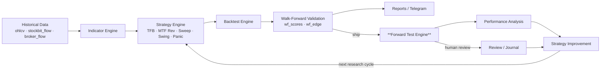
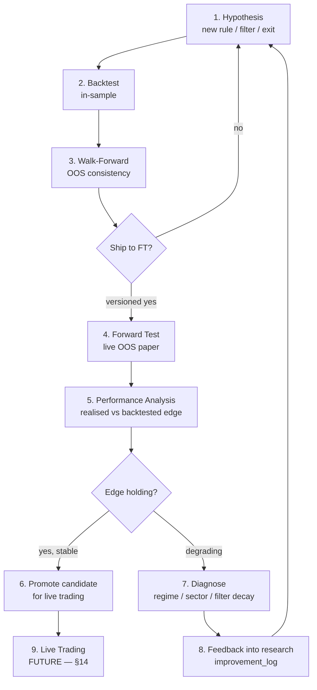
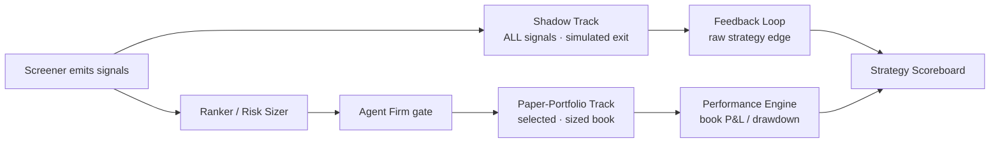
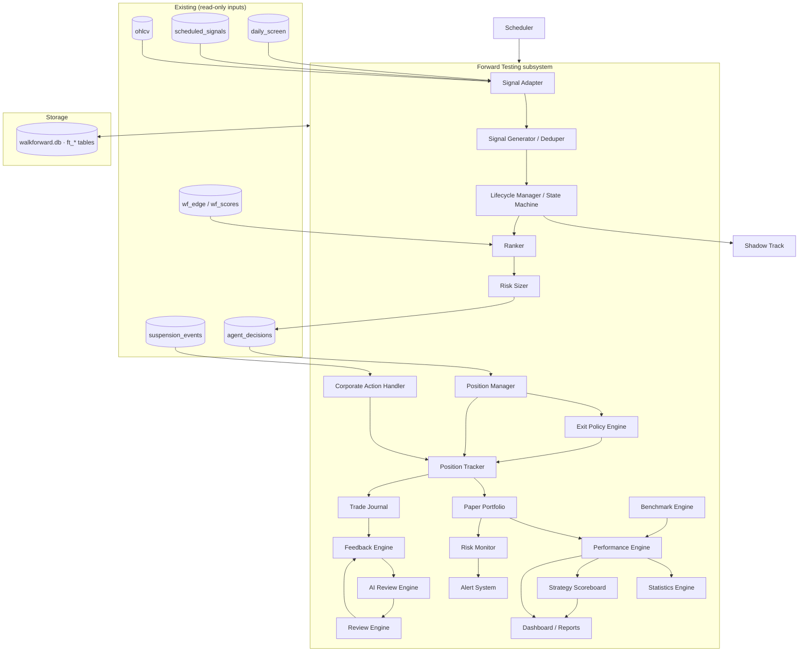
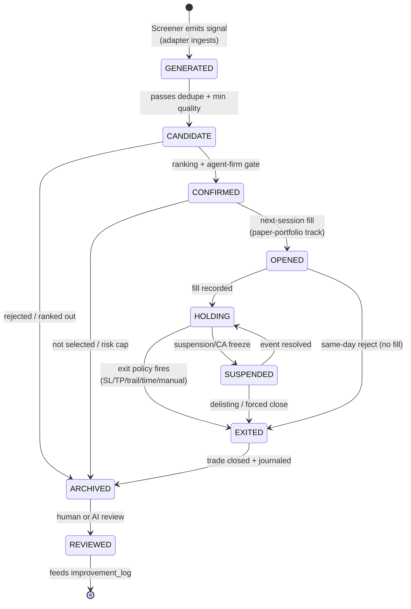
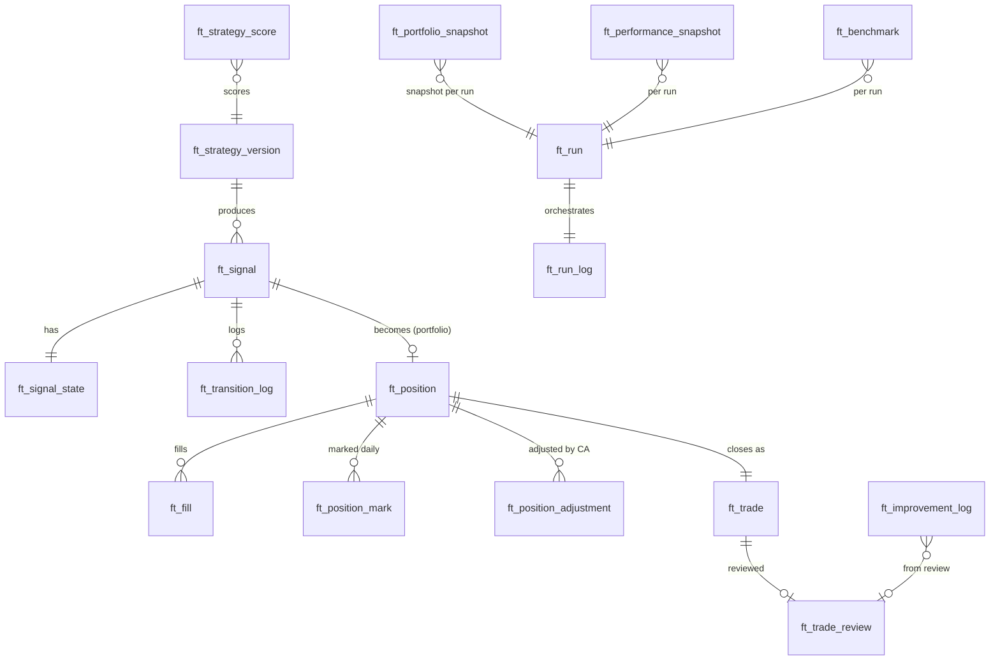
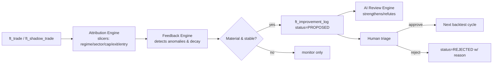
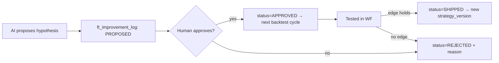
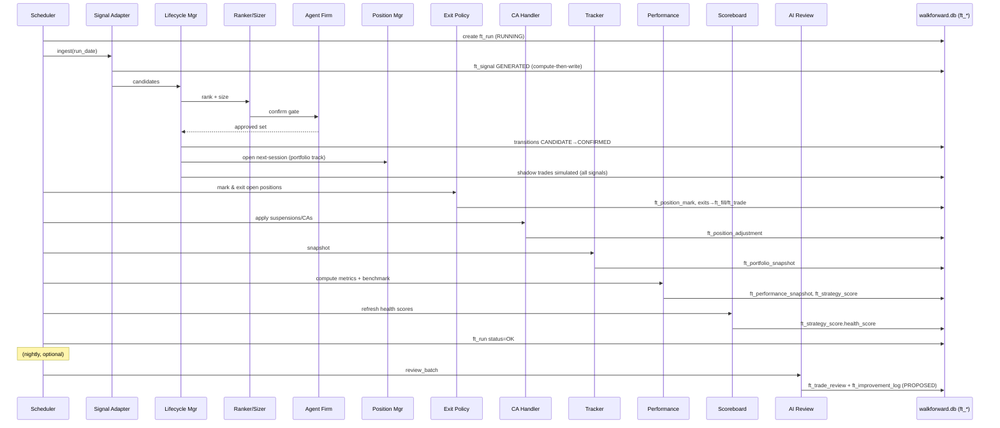
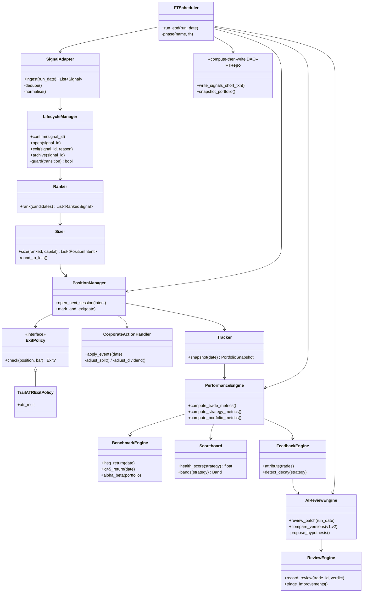

# Forward Testing Architecture — `idx-walkforward-5001`

**Status:** Blueprint (design only — no implementation)
**Date:** 2026-06-27
**Scope:** End-of-day (EOD), long-only, single-market (IDX/BEI) stock screening system
**Author role:** Principal Quant Engineer & Software Architect

---

## 0. How to read this document

This is an **architecture blueprint**, not code. SQL is expressed as schema tables (design artefacts), classes as responsibility contracts, and flows as Mermaid diagrams. Implementation (DDL, Python, tests) follows later under a separate plan.

A locked set of seven load-bearing decisions shape every section. They are restated in §1.5 and must not be silently contradicted by any module below.

### Tailoring posture (confirmed)
- **Anchored to `idx-walkforward-5001`** — references real artefacts: `scheduled_signals`, `daily_screen`, `wf_edge`, `wf_scores`, `backtest_windows`, `suspension_events`, `agent_decisions`, `reversal_watchlist`, `paper_config`, the 972-ticker universe, the SQLite/WAL single store, Flask on `:5001`, `scheduler/jobs.py`.
- **New clean schema + adapter** — Forward Test owns its own lifecycle tables (prefix `ft_`); existing tables stay read-only/intact.
- **Comprehensive with YAGNI flags** — every module is designed to production depth, but modules that are likely over-engineering for a single-operator IDX EOD system are marked `🔻YAGNI` with a deferral recommendation.

### Glossary
| Term | Meaning |
|---|---|
| **Forward Test (FT)** | The subsystem this document specifies: live, out-of-sample, paper validation of strategies after they ship. |
| **Shadow track** | Records *every* screener signal with a simulated exit — the unbiased truth base. |
| **Paper-portfolio track** | The ranked/approved/sized book you would actually have held. |
| **IHSG** | Jakarta Composite Index — primary benchmark. |
| **LQ45** | 45 most-liquid IDX stocks — secondary benchmark. |
| **Lot** | IDX trade unit = 100 shares (1 lot = 100 lembar). |
| **OOS** | Out-of-sample. |
| **WF** | Walk-forward (your existing `walkforward.db` validation). |

---

## SECTION 1 — SYSTEM OVERVIEW

### 1.1 Purpose
Forward testing is the bridge between **research** (backtest + walk-forward) and **belief**. A strategy that backtests well and passes WF is *hypothesised* to have edge. Forward testing converts that hypothesis into evidence by running the strategy on data it has never seen, with the exact entry/exit/sizing logic it will use live, and measuring the result with the same rigour as the backtest.

It exists to answer one question, continuously: ***"Is the edge we measured in backtest still present, in the real market, after we shipped?"***

### 1.2 Where it sits in the existing pipeline

Your current pipeline is:

```
Historical Data → Indicators → Strategies → Backtest → Walk-Forward → Reports
```

Forward testing inserts a live-validation loop **after** WF and feeds back **before** the next research cycle:



### 1.3 The complete research lifecycle



The loop has a deliberate **one-way valve**: forward-test results can *inform* research, but they must never *parameter-fit* research. Using FT performance to retune strategy parameters re-introduces in-sample bias and destroys the independence that makes FT meaningful. FT outputs feed `improvement_log` as **hypotheses for the next backtest cycle**, not as live parameter edits.

### 1.4 The dual-track principle (the spine of this design)



**Why dual-track is non-negotiable here:** your TFB "starvation" analysis could not separate *gate effect* from *selection effect* because you only observed the selected book. The shadow track records every emitted signal pre-selection, so "do the slope/volume gates help?" becomes a permanent, answerable query rather than a one-off forensic exercise.

### 1.5 The seven locked decisions
1. **Dual-track** — shadow-all + paper-portfolio.
2. **Pluggable `ExitPolicy` per strategy** — FT marks daily and fires the strategy's own exit rules; no naive holds.
3. **Position sizing** — configurable; default risk-parity-by-ATR with hard caps; Rp lot rounding.
4. **Signal lifecycle** — 8-state guarded machine (§3).
5. **Benchmark** — IHSG primary, LQ45 secondary, plus equal-weight basket neutral.
6. **AI Review Engine** — built on `agent_firm`; read-only; writes hypotheses only; human-approved.
7. **Storage** — clean `ft_*` schema inside the existing `walkforward.db`; adapters read from current tables.

---

## SECTION 2 — ARCHITECTURE

### 2.1 Component map



### 2.2 Module catalogue

Each module below carries: **Purpose · Responsibilities · Inputs · Outputs · Storage · API · Dependencies · Failure cases**. Bullets are condensed for readability.

#### 2.2.1 Signal Adapter
- **Purpose:** Translate existing screener output into the FT signal model without touching source tables.
- **Responsibilities:** Read `scheduled_signals` + `daily_screen` + `reversal_watchlist`; normalise into canonical `ft_signal`; dedupe (same ticker+strategy+day = one signal); tag source run.
- **Inputs:** `scheduled_signals`, `daily_screen`, `screen_run_log`, `ohlcv` (for close on signal day).
- **Outputs:** canonical signals handed to the Generator.
- **Storage:** writes only `ft_signal`, `ft_signal_state`. Reads existing tables.
- **API:** `ingest(run_date) -> [Signal]`.
- **Dependencies:** screener, indicator cache.
- **Failure cases:** screener produced no run for the day (stale data) → `ft_run_log.status=SKIPPED_NO_SCREEN`, alert, do not fabricate signals; duplicate run idempotency (re-ingesting a day must upsert, not double-count).

#### 2.2.2 Signal Generator / Lifecycle Manager
- **Purpose:** Own the state machine; move signals through states; enforce guards.
- **Responsibilities:** Apply ranking/risk/agent gates as transitions; record every transition with timestamp, actor, reason; expose current state.
- **Inputs:** canonical signals, ranker scores, agent decisions.
- **Outputs:** state transitions, candidate/confirmed lists.
- **Storage:** `ft_signal_state`, `ft_transition_log`.
- **API:** `confirm()`, `open()`, `exit()`, `archive()`, `review()`.
- **Dependencies:** Ranker, Agent Firm, Position Manager.
- **Failure cases:** illegal transition attempted → reject + log `ft_transition_log.violation=ILLEGAL`; partial-day crash → resume from last committed state (idempotent by `run_date`).

#### 2.2.3 Ranker & Risk Sizer
- **Purpose:** Convert confirmed signals into a sized, ranked book.
- **Responsibilities:** Score by WF edge + flow + conviction; apply sector cap, max positions, ATR risk sizing; round to IDX lots.
- **Inputs:** confirmed signals, `wf_edge`, ATR14, `paper_config` (capital, caps).
- **Outputs:** ordered, sized `ft_position` intents.
- **Storage:** reads `wf_edge`, `paper_config`; writes sizing fields on `ft_position`.
- **API:** `select_and_size(candidates, capital) -> [PositionIntent]`.
- **Dependencies:** indicator engine (ATR), `paper_config`.
- **Failure cases:** insufficient capital for any position → drop lowest-ranked, log; ATR missing → fall back to a conservative fixed-fraction and flag `sizing_method=FALLBACK`.

#### 2.2.4 Position Manager + Exit Policy Engine
- **Purpose:** Open, hold, and exit positions using each strategy's real exit rules.
- **Responsibilities:** Next-open fill simulation (IDX opens next session); daily mark; fire `ExitPolicy` checks (SL/TP/trail/time-stop/manual); produce `ft_fill` and `ft_trade` on exit.
- **Inputs:** daily OHLCV, ATR, `ft_position`, strategy exit config.
- **Outputs:** fills, realised trades, mark-to-market updates.
- **Storage:** `ft_position`, `ft_fill`, `ft_trade`, `ft_position_mark`.
- **API:** `mark_and_exit(date)`.
- **Dependencies:** Exit Policy registry, Corporate Action Handler.
- **Failure cases:** gap exit beyond SL/TP → fill at the gap-open price, record `slippage_reason=GAP`; missing OHLCV for a held ticker → hold state, flag, do not exit blindly.

#### 2.2.5 Corporate Action Handler
- **Purpose:** Keep positions economically correct across splits, dividends, rights, suspensions, delistings.
- **Responsibilities:** Detect events; adjust cost basis / lots / price; route suspensions and delistings.
- **Inputs:** `suspension_events`, corporate-action feed (IDX disclosures), `ohlcv`.
- **Outputs:** adjustment rows on `ft_position_adjustment`.
- **Storage:** `ft_position_adjustment`.
- **API:** `apply_events(date)`.
- **Dependencies:** `suspension_detector`, CA feed.
- **Failure cases:** unparseable CA → freeze the position (`status=SUSPENDED_UNCLEAR`), alert, hold for human review. (See §6.)

#### 2.2.6 Position Tracker / Paper Portfolio
- **Purpose:** Maintain the authoritative book state and a daily snapshot.
- **Responsibilities:** Aggregate open positions; daily equity/MV; cash; exposure by sector/strategy.
- **Outputs:** `ft_portfolio_snapshot` rows.
- **Storage:** `ft_portfolio_snapshot`.
- **API:** `snapshot(date)`.
- **Failure cases:** snapshot write fails (DB lock) → retry with backoff, never block other writers (§5 transaction rules).

#### 2.2.7 Performance / Statistics / Benchmark Engines
- **Purpose:** Produce comparable, WF-aligned metrics for trades, strategies, and the book.
- **Responsibilities:** Compute the §7 metric set on realised + mark-to-market; compute benchmark returns; attribute alpha.
- **Outputs:** `ft_strategy_score`, `ft_performance_snapshot`, `ft_benchmark`.
- **Failure cases:** insufficient sample (`n_trades < min`) → mark metric `confidence=LOW`, do not surface a number that implies significance.

#### 2.2.8 Risk Monitor / Alert System
- **Purpose:** Watch live book risk and emit notifications.
- **Responsibilities:** Drawdown breach, concentration, strategy-degradation triggers → Telegram (reuse `utils/telegram`).
- **Failure cases:** alert delivery failure → must not crash the run (your existing silent-HTTP-failure lesson — always check `resp.ok`, plain-text fallback).

#### 2.2.9 Strategy Scoreboard / Feedback / AI Review / Review Engines
- **Purpose:** Continuous evaluation and learning (§8, §9, §10).
- **Failure cases:** AI proposes a parameter change → hard-block; only hypotheses enter `ft_improvement_log` with `status=PROPOSED`.

#### 2.2.10 Scheduler
- **Purpose:** Orchestrate the daily flow (§5).
- **Responsibilities:** Sequence modules; enforce the compute-then-write transaction rule; idempotency by `run_date`; pid-aware lock (reuse the pattern from `_job_lock`).
- **Failure cases:** overlapping run → pid-aware guard refuses; crash mid-run → safe resume.

#### 2.2.11 Database
- **Purpose:** Persistent store (§4).
- **Failure cases:** locked → short transactions + `busy_timeout` + WAL (already your standard).

#### 2.2.12 Version Control (strategy + config)
- **Purpose:** Reproducibility. Every signal/position records the `strategy_version` and `config_hash` that produced it, so a metric is always attributable to a specific, recoverable version.
- **Failure cases:** strategy code changed mid-run without version bump → detect via `config_hash` mismatch, quarantine affected positions for re-review.

> 🔻**YAGNI note (§2):** "Dashboard" is deliberately a thin read-layer over `ft_*` tables appended to your existing Flask app, not a separate service. A standalone analytics UI is Phase 2 (§14).

---

## SECTION 3 — SIGNAL LIFECYCLE

### 3.1 State machine



### 3.2 States, owners, guards

| State | Owner | Meaning | Guard to enter |
|---|---|---|---|
| `GENERATED` | Adapter | Raw signal ingested from screener. | Exists in `scheduled_signals`/`daily_screen` for run_date. |
| `CANDIDATE` | Generator | Deduped, meets minimum quality (e.g. tradable, not suspended). | Unique (ticker, strategy, day); ticker not in suspension on signal day. |
| `CONFIRMED` | Lifecycle Mgr | Passed ranking + agent-firm gate. | Rank within selectable set; agent verdict APPROVED (or not vetoed per regime). |
| `OPENED` | Position Mgr | Fill simulated at next-session open. | Capital available; lot rounding ≥ 1 lot. |
| `HOLDING` | Position Mgr | Live position, marked daily. | Fill recorded in `ft_fill`. |
| `SUSPENDED` | CA Handler | Frozen pending corporate-action resolution. | Row in `suspension_events` or unresolved CA. |
| `EXITED` | Exit Policy | Closed; realised P&L computed. | Exit rule fired or forced. |
| `ARCHIVED` | Lifecycle Mgr | Immutable closed record. | Exit fully journaled. |
| `REVIEWED` | Review Engine | Human/AI reviewed; hypothesis emitted. | Reviewer sign-off recorded. |

### 3.3 Transition rules & auditability
- Every transition writes one `ft_transition_log` row: `(signal_id, from_state, to_state, at, actor, reason, run_date)`.
- Transitions are **idempotent by `run_date`**: re-running a day never duplicates a transition.
- **Illegal transitions are rejected and logged**, not silently coerced (e.g. `ARCHIVED → HOLDING` is impossible).

### 3.4 Dual-track mapping
- **Shadow track:** every `GENERATED → CANDIDATE` signal continues directly to a *simulated* `OPENED → EXITED` regardless of selection. It bypasses `CONFIRMED` selection but still records the same exit policy. This is what makes "raw strategy edge" measurable.
- **Paper-portfolio track:** only `CONFIRMED` signals that survive ranking + agent gate proceed to real `OPENED`.

> 🔻**YAGNI note (§3):** For EOD long-only, `CANDIDATE → CONFIRMED` is often a near-trivial pass-through of your existing ranker/agent gate. Model the state, but do not over-engineer a separate "confirmation" service — a thin guard reusing the ranker is sufficient until you have multiple confirmation sources (e.g. a second timeframe veto).

---

## SECTION 4 — DATABASE DESIGN

### 4.1 Storage model & transaction discipline (critical)
All `ft_*` tables live in the **existing `walkforward.db`** (SQLite, WAL mode, `busy_timeout=30s`). The hard rule, learned from your repeated "database is locked" incidents (news fetch, paper summary, WF refresh):

> **Compute-then-write.** No FT module may hold a write transaction open across a long computation. Compute results in memory, then commit in short transactions. The daily flow (§5) is structured so that at most one writer is active per phase, and every phase is resumable.

### 4.2 Entity relationships



### 4.3 Tables

> Schemas are design-level (column · type · key · note). Exact DDL is produced at implementation time. `TEXT` dates are ISO `YYYY-MM-DD`; timestamps ISO-8601 local. Money in IDR; prices in IDR.

#### `ft_strategy_version`
Tracks the exact code/config that produced a signal. **Reproducibility primitive.**
| column | type | key | note |
|---|---|---|---|
| `id` | INTEGER | PK | |
| `strategy` | TEXT | UNIQUE(strategy,version) | e.g. `TFB`, `MTF_REVERSAL` |
| `version` | TEXT | | semver or hash |
| `config_json` | TEXT | | full param set |
| `config_hash` | TEXT | | sha of config_json |
| `entry_rules_ref` | TEXT | | pointer to spec |
| `exit_policy_ref` | TEXT | | which ExitPolicy class |
| `created_at` | TEXT | | |
Indexes: `UNIQUE(strategy, version)`; `config_hash`.

#### `ft_signal`
Canonical signal. One row per (ticker, strategy, signal_date, track).
| column | type | key | note |
|---|---|---|---|
| `id` | INTEGER | PK | |
| `signal_date` | TEXT | IDX(signal_date, ticker, strategy, track) | |
| `ticker` | TEXT | | |
| `strategy` | TEXT | | FK→strategy_version.strategy |
| `strategy_version_id` | INTEGER | | FK |
| `track` | TEXT | `SHADOW`/`PORTFOLIO` | dual-track (see note) |
| `direction` | TEXT | | `LONG` (system is long-only) |
| `entry_price_intent` | REAL | | next-open intent |
| `atr14` | REAL | | for sizing/exits |
| `conviction` | REAL | | ranker score |
| `source_table` | TEXT | | `scheduled_signals`/`daily_screen` |
| `source_id` | INTEGER | | id in source table |
| `config_hash` | TEXT | | denormalised for fast query |
| `created_at` | TEXT | | |
Indexes: `UNIQUE(signal_date, ticker, strategy, track)`; `(strategy, signal_date)`; `(track, signal_date)`.

> **Dual-row modelling note:** the unique key includes `track`, so one emitted (ticker, strategy, date) yields **two** `ft_signal` rows: a `SHADOW` row (always, the moment the adapter ingests it) and a `PORTFOLIO` row (only if it survives ranking + agent gate). This keeps the two tracks independently queryable and avoids a single row mutating between tracks. The shadow row's lifecycle ends in `ft_shadow_trade`; the portfolio row's in `ft_position`→`ft_trade`.

#### `ft_signal_state`
Current lifecycle state (1:1 with ft_signal).
| column | type | key | note |
|---|---|---|---|
| `signal_id` | INTEGER | PK, FK→ft_signal | |
| `state` | TEXT | | §3 state enum |
| `since` | TEXT | | |
| `updated_at` | TEXT | | |

#### `ft_transition_log`
Immutable audit of every state change.
| column | type | key | note |
|---|---|---|---|
| `id` | INTEGER | PK | |
| `signal_id` | INTEGER | FK | |
| `from_state` | TEXT | | |
| `to_state` | TEXT | | |
| `at` | TEXT | | |
| `actor` | TEXT | | module/human/AI |
| `reason` | TEXT | | |
| `run_date` | TEXT | IDX(signal_id, run_date) | idempotency |
| `violation` | TEXT | | NULL or `ILLEGAL` |
Indexes: `(signal_id, run_date)`; `(run_date)`.

#### `ft_position` (paper-portfolio track)
| column | type | key | note |
|---|---|---|---|
| `id` | INTEGER | PK | |
| `signal_id` | INTEGER | FK, UNIQUE per open | |
| `ticker` | TEXT | IDX | |
| `strategy` | TEXT | | |
| `strategy_version_id` | INTEGER | FK | |
| `track` | TEXT | | `PORTFOLIO` (shadow uses ft_shadow_trade) |
| `entry_date` | TEXT | | |
| `entry_price` | REAL | | filled price |
| `lots` | INTEGER | | 100-share lots |
| `shares` | INTEGER | | lots×100 |
| `cost_basis` | REAL | | total cost incl. adjustments |
| `sl_price` / `tp_price` / `trail_anchor` / `atr_mult` | REAL | | exit params snapshot |
| `sizing_method` | REAL/TEXT | | `ATR_RISK`/`EQUAL`/`FALLBACK` |
| `status` | TEXT | | `OPEN`/`SUSPENDED`/`CLOSED` |
| `exit_date` / `exit_price` / `exit_reason` | | | |
| `pnl_rp` / `pnl_pct` / `r_multiple` | REAL | | realised on close |
| `highest_seen` / `mae` / `mfe` | REAL | | for §7 metrics |
Indexes: `(ticker, status)`; `(strategy, status)`; `(entry_date)`.

#### `ft_fill`
| column | type | key | note |
|---|---|---|---|
| `id` | INTEGER | PK | |
| `position_id` | INTEGER | FK | |
| `fill_date` | TEXT | | |
| `side` | TEXT | | `OPEN`/`EXIT`/`SCALE`/`PARTIAL` |
| `price` | REAL | | |
| `lots` | INTEGER | | |
| `reason` | TEXT | | exit reason if side=EXIT |
| `slippage_rp` | REAL | | gap slippage capture |
Index: `(position_id)`.

#### `ft_position_mark`
Daily mark-to-market for open positions (drives equity curve).
| column | type | key | note |
|---|---|---|---|
| `position_id` | INTEGER | FK | |
| `mark_date` | TEXT | | |
| `close` | REAL | | |
| `mv` | REAL | | shares×close |
| `unrealised_rp` / `unrealised_pct` | REAL | | |
| `drawdown_from_peak` | REAL | | |
PK: `(position_id, mark_date)`.

#### `ft_position_adjustment`
Corporate-action ledger per position.
| column | type | key | note |
|---|---|---|---|
| `id` | INTEGER | PK | |
| `position_id` | INTEGER | FK | |
| `ex_date` | TEXT | | |
| `action` | TEXT | | `SPLIT`/`CASH_DIV`/`STOCK_DIV`/`RIGHTS`/`SUSPEND`/`DELIST` |
| `ratio` | REAL | | |
| `lots_delta` | INTEGER | | |
| `cost_basis_delta` | REAL | | |
| `note` | TEXT | | |
Index: `(position_id, ex_date)`.

#### `ft_trade` (closed position)
One row per round-trip.
| column | type | key | note |
|---|---|---|---|
| `id` | INTEGER | PK | |
| `position_id` | INTEGER | FK, UNIQUE | |
| `track` | TEXT | | |
| `ticker`/`strategy`/`strategy_version_id` | | | |
| `entry_date`/`entry_price`/`exit_date`/`exit_price` | | | |
| `exit_reason` | TEXT | | `SL`/`TP`/`TRAIL`/`TIME`/`MANUAL`/`DELIST` |
| `hold_days` | INTEGER | | |
| `pnl_rp`/`pnl_pct`/`r_multiple` | REAL | | |
| `mae`/`mfe`/`edge_ratio` | REAL | | |
| `regime_at_entry` | TEXT | | for §9 attribution |
| `sector`/`market_cap_bucket` | TEXT | | for §9 attribution |
Indexes: `(strategy, exit_date)`; `(track, exit_date)`; `(ticker)`.

#### `ft_trade_review`
Human/AI review of a closed trade.
| column | type | key | note |
|---|---|---|---|
| `id` | INTEGER | PK | |
| `trade_id` | INTEGER | FK | |
| `reviewer` | TEXT | | `HUMAN`/`AI` |
| `verdict` | TEXT | | `GOOD`/`BAD_LUCK`/`BAD_ENTRY`/`BAD_EXIT`/`RULE_DEFECT` |
| `notes` | TEXT | | |
| `hypothesis_id` | INTEGER | FK→ft_improvement_log | link to research |
| `at` | TEXT | | |

#### `ft_shadow_trade`
Lightweight closed shadow trades (no daily marks by default — see §3.4 YAGNI).
| column | type | key | note |
|---|---|---|---|
| `signal_id` | INTEGER | PK/FK | |
| `ticker`/`strategy`/`strategy_version_id` | | | |
| `signal_date`/`entry_price`/`exit_date`/`exit_price` | | | |
| `exit_reason`/`pnl_pct`/`r_multiple` | | | |
Indexes: `(strategy, signal_date)`; `(ticker)`.

#### `ft_portfolio_snapshot`
Daily book equity.
| column | type | key | note |
|---|---|---|---|
| `snapshot_date` | TEXT | PK | |
| `run_id` | INTEGER | FK | |
| `cash` | REAL | | |
| `market_value` | REAL | | |
| `equity` | REAL | | cash+MV |
| `realised_rp_day` | REAL | | |
| `unrealised_rp` | REAL | | |
| `n_open` | INTEGER | | |
| `gross_exposure` | REAL | | |
| `drawdown_pct` | REAL | | |
Indexes: `(snapshot_date)`.

#### `ft_strategy_score`
Rolling per-strategy health (mirror of `wf_edge` columns for direct comparison).
| column | type | key | note |
|---|---|---|---|
| `strategy` | TEXT | PK(strategy, as_of) | |
| `strategy_version_id` | INTEGER | | |
| `as_of` | TEXT | | |
| `track` | TEXT | | |
| `n_trades` | INTEGER | | |
| `win_rate` | REAL | | |
| `expectancy_pct` / `expectancy_rp` | REAL | | matches wf_edge |
| `avg_return_pct` | REAL | | matches wf_scores |
| `sharpe` / `sortino` | REAL | | |
| `consistency_pct` | REAL | | matches wf_scores |
| `profit_factor` | REAL | | |
| `max_drawdown` | REAL | | |
| `health_score` | REAL | | §8 composite |
| `confidence` | TEXT | | `LOW`/`OK`/`HIGH` |
Indexes: `(strategy, as_of)`; `(as_of)`.

#### `ft_performance_snapshot` / `ft_benchmark`
Per-run portfolio metrics and benchmark returns (IHSG/LQ45/equal-weight). Columns mirror the §7 metric set + `benchmark_return`, `alpha`, `beta`, `tracking_error`.

#### `ft_improvement_log`
Hypotheses feeding back to research. **The only write-path from AI/review into the research loop.**
| column | type | key | note |
|---|---|---|---|
| `id` | INTEGER | PK | |
| `source` | TEXT | | `AI`/`HUMAN`/`FEEDBACK_ENGINE` |
| `strategy` | TEXT | | |
| `hypothesis` | TEXT | | plain-language |
| `evidence_json` | TEXT | | queries/numbers backing it |
| `status` | TEXT | | `PROPOSED`/`APPROVED`/`TESTED`/`REJECTED`/`SHIPPED` |
| `approved_by` | TEXT | | human |
| `created_at`/`updated_at` | TEXT | | |
Indexes: `(status)`; `(strategy)`.

#### `ft_run` / `ft_run_log`
| ft_run | ft_run_log |
|---|---|
| `id` PK; `run_date`; `kind` (`EOD`/`INTRADAY`); `started_at`/`finished_at`; `status` (`RUNNING`/`OK`/`PARTIAL`/`FAILED`/`SKIPPED_NO_SCREEN`); `pid` | `id` PK; `run_id` FK; `phase`; `started_at`/`finished_at`; `rows_in`/`rows_out`; `status`; `error` |

### 4.4 Keys & relationships summary
- All FKs are logical (SQLite FK pragmas enabled at connect). Cascade rules: deleting a `ft_run` is disallowed once it has snapshots (append-only).
- **Idempotency keys:** `ft_signal` unique on `(signal_date, ticker, strategy, track)`; `ft_transition_log` unique on `(signal_id, run_date)`; `ft_position_mark`/`ft_portfolio_snapshot` PK on date.

### 4.5 Index strategy
- Write-path indexes: unique constraints above.
- Read-path indexes (hot queries): `(strategy, exit_date)`, `(track, exit_date)`, `(strategy, signal_date)`, `(ticker, status)`, `(status)` on improvement_log.
- `EXPLAIN QUERY PLAN` review at implementation for the scoreboard rollups (§8).

### 4.6 Retention policy
| Data | Retention | Rationale |
|---|---|---|
| `ft_signal`/`ft_signal_state`/`ft_transition_log` | indefinite (or ≥ 5y) | audit + feedback truth |
| `ft_trade`/`ft_trade_review` | indefinite | performance record |
| `ft_position_mark` (daily marks) | 2y hot, then downsample to weekly | bulk of storage; weekly enough for long-term equity |
| `ft_shadow_trade` | indefinite (small) | raw-edge baseline |
| `ft_run_log` | 1y | operational |
| `ft_portfolio_snapshot` | indefinite (1 row/day) | equity curve |
| `ft_improvement_log` | indefinite | research memory |

> 🔻**YAGNI note (§4):** Do not pre-build partitioning or a separate analytics warehouse. At ~1 trade/day × N strategies, row volume is trivial for SQLite for years. Revisit only if daily marks exceed ~5M rows (then downsample per the table above). The one real scaling risk is `ft_position_mark` if you ever go intraday — that is gated behind the multi-timeframe extension (§14).

---

## SECTION 5 — DAILY FLOW

### 5.1 The end-of-day pipeline

```mermaid
flowchart TB
    A[T-0: Market Close 16:00 WIB] --> B[1. Download/Validate data<br/>ohlcv · flow · broker_flow]
    B --> C[2. Validate data completeness<br/>gaps? suspensions?]
    C --> D[3. Indicator Engine<br/>ATR · MA · VPIN · regime]
    D --> E[4. Run screeners<br/>daily_screen · screen_run_log]
    E --> F[5. Signal Adapter ingest → ft_signal GENERATED]
    F --> G[6. Lifecycle: CANDIDATE → CONFIRMED<br/>ranker + agent-firm]
    G --> H[7. Shadow track: simulate all signals]
    G --> I[8. Portfolio track: size + open next-session]
    H --> J[9. Mark & Exit existing positions<br/>ExitPolicy per strategy]
    I --> J
    J --> K[10. Corporate Actions apply]
    K --> L[11. Portfolio snapshot]
    L --> M[12. Performance + Statistics + Benchmark]
    M --> N[13. Strategy Scoreboard refresh]
    N --> O[14. Risk Monitor → Alerts/Telegram]
    O --> P[15. Archive closed → ft_trade]
    P --> Q[16. Feedback Engine attribution]
    Q --> R[17. Reports / Dashboard update]
    R --> S[18. (Nightly, optional) AI Review batch]
```

### 5.2 Phase contract (each phase is one resumable unit)
Every phase:
1. Acquires nothing long-lived (no cross-phase open transaction).
2. Writes its outputs in one short `BEGIN…COMMIT`.
3. Records a `ft_run_log` row with `status` and row counts.
4. Is **idempotent**: re-running for the same `run_date` upserts, never duplicates.

### 5.3 Scheduler mechanics
- Reuse `scheduler/jobs.py` + the pid-aware `_job_lock` pattern you already built for WF refresh.
- The FT EOD job is **one scheduled job**; internal phasing is in-process sequencing, not separate cron entries (avoids partial-run races).
- A `ft_run` row is created `RUNNING` at start, flipped to `OK`/`PARTIAL`/`FAILED` at end. Partial = some phases ok, downstream skipped with reason.

### 5.4 Per-step failure handling
| Step | Failure | Action |
|---|---|---|
| Data download | Source down / partial | Retry w/ backoff (your fetcher pattern); if still incomplete, `SKIPPED_NO_SCREEN`, alert, **do not run screeners on stale data**. |
| Validation | Gap/suspension detected | Record; screeners skip affected tickers; CA handler notified. |
| Screeners | Exception on a ticker | Per-ticker try/except; increment `tickers_err` in `screen_run_log`; continue. |
| Adapter | No screen run today | Abort FT run gracefully (can't forward-test what wasn't screened). |
| Agent firm | LLM timeout/error | Fail-open per your guardrails (or skip confirmation, flag `agent_skipped`); never block the book silently. |
| Mark/Exit | Missing OHLCV for held ticker | Hold, flag, do not force-exit. |
| DB write | `database is locked` | `busy_timeout` + retry; **never** hold the write across compute. |
| Alert send | HTTP failure | Check `resp.ok`, plain-text fallback, 429 retry (your telegram fix); never raise. |

> 🔻**YAGNI note (§5):** A distributed task queue (Celery/RQ) is not warranted. In-process phasing with a pid lock and resumable run rows handles single-operator EOD cleanly. Revisit only if the run window (post-16:00 WIB) grows beyond your tolerance.

---

## SECTION 6 — POSITION MANAGEMENT

### 6.1 Open
- **Fill model:** signals generated on close D are filled at **next session open D+1** (IDX reality: you act after the close). Record slippage vs `entry_price_intent`.
- **Lot rounding:** size → lots = floor(riskAmount / (atr×atr_mult×price) × …); round to 100-share lots; reject if < 1 lot.

### 6.2 Exits (delegated to ExitPolicy)
Each strategy binds an `ExitPolicy`. Checked daily after the close (or intramark-bar high/low if you model intraday — currently EOD, so use daily H/L conservatively).

| Exit type | Rule | Source |
|---|---|---|
| **Stop Loss** | fixed `sl_price` | strategy spec |
| **Take Profit** | fixed `tp_price` | strategy spec |
| **Trailing Stop** | `trail_anchor` × `atr_mult` (e.g. TFB 3.0×ATR) | your shipped trail work |
| **Time Exit** | max `hold_days` | R8 time-stop pattern |
| **Manual Exit** | human override via review/dashboard | logged with actor |
| **Regime Exit** | regime flip invalidates thesis | regime_filter |

- **Gap handling:** if daily H/L breaches a stop but open is beyond it, fill at the gap price, record `slippage_reason=GAP`.
- **Exit ordering on a conflict day:** SL first (capital protection), then TP, then trail, then time. Documented and deterministic.

### 6.3 Partial exits & scaling
- Supported via multiple `ft_fill` rows (`side=PARTIAL`/`SCALE`).
- **Scale-in:** pyramiding allowed only if the strategy spec defines it (most of yours don't — keep off by default).
- **Scale-out:** partial TP (e.g. 50% at TP1, trail rest) is strategy-defined.
- `cost_basis` and `lots` adjust per fill; `r_multiple` computed on blended basis.

> 🔻**YAGNI note (§6):** Partial exits/scaling add real complexity (blended cost, partial-realised P&L, MAE/MFE accounting). Implement only when a shipped strategy actually requires them. Until then, full-round-trip exits only.

### 6.4 Corporate actions (IDX-grounded)
| Event | Handling |
|---|---|
| **Stock split** (`stock split`) | Multiply `shares`/`lots` by ratio; divide `entry_price`, `sl/tp/trail` by ratio; record `ft_position_adjustment`. |
| **Reverse split** | Inverse of above. |
| **Cash dividend** | On ex-date: reduce `cost_basis` by dividend/share (or book as income per your accounting choice); note the 10% dividend tax. |
| **Stock dividend / bonus issue** | Increase `shares`; adjust price. |
| **Rights issue (HMETD)** | **Flag for human decision** — auto-exercising rights is out of scope. Default: assume non-exercise, adjust price for dilution, log; reviewer decides. |
| **Suspension** | Your `suspension_events` (1,486 rows) already detects these. Move position `status=SUSPENDED`; mark at last close; hold; do not exit; alert. On resume, re-evaluate exits. |
| **Delisting** | Force `EXITED` at last available price, `exit_reason=DELISTED`; flag for review (often a total loss). |

**Suspension is the highest-frequency IDX corporate-action risk** — you already have the detector; the FT system consumes it, it does not reimplement detection.

### 6.5 Failure cases
- Unknown/unparseable CA → freeze (`SUSPENDED_UNCLEAR`), alert, human review before any further marking.
- Ticker disappears from OHLCV feed (data vendor drop, not delisting) → distinguish from delisting via `idx_tickers` status; freeze, do not force-exit.

---

## SECTION 7 — PERFORMANCE ENGINE

### 7.1 Metric framework
Three levels — **per trade, per strategy, per portfolio** — each computed **realised** (closed trades) and **mark-to-market** (open + closed). All on an equity curve built from `ft_portfolio_snapshot`. Metrics are **WF-aligned**: the per-strategy set deliberately mirrors `wf_edge`/`wf_scores` columns so forward-realised edge is directly comparable to backtested/WF edge.

### 7.2 Metric catalogue

| Metric | Level | Definition (concise) |
|---|---|---|
| **Win Rate** | trade/strategy | profitable trades ÷ total |
| **Expectancy (% / Rp / R)** | trade/strategy | mean P&L per trade, in %, IDR, and R-multiples |
| **Profit Factor** | strategy | gross profit ÷ gross loss |
| **Payoff Ratio** | strategy | avg win ÷ avg loss |
| **Sharpe** | strategy/portfolio | mean(excess returns) ÷ std(returns) × √annualisation |
| **Sortino** | strategy/portfolio | like Sharpe, downside-deviation only |
| **Max Drawdown** | portfolio | max peak-to-trough on equity curve |
| **Recovery Factor** | portfolio | net profit ÷ max drawdown |
| **Avg Hold Days** | trade/strategy | mean `hold_days` |
| **R Multiple** | trade | realised P&L ÷ risk (entry−SL) |
| **MAE** | trade | max adverse excursion (worst unrealised loss while open) |
| **MFE** | trade | max favourable excursion (best unrealised gain while open) |
| **Edge Ratio** | trade/strategy | mean MFE ÷ mean MAE (reward-to-risk efficiency) |
| **Expectancy Score** | strategy | expectancy × frequency (penalises rare-but-good) |
| **Calmar** | portfolio | annualised return ÷ max drawdown |
| **Alpha / Beta** | portfolio | vs IHSG (CAPM regression) |
| **Tracking Error** | portfolio | std(excess vs benchmark) |
| **Hit Consistency** | strategy | % of rolling windows profitable (mirrors `consistency_pct`) |
| **Trade Frequency** | strategy | signals/month → trades/month |

### 7.3 Rolling & calendar cuts
- **Rolling:** 20/60/120/252-trade and 1/3/6/12-month windows. Stored per `as_of` in `ft_strategy_score`.
- **Calendar:** monthly, quarterly, yearly aggregations in `ft_performance_snapshot`.
- **Regime-conditional:** every trade tagged `regime_at_entry` (bull/bear/range from your regime_filter) so metrics slice by regime — directly answering "which regimes work?" (§9).

### 7.4 Confidence discipline
- Metrics with `n_trades < min_sample` (e.g. 30) are flagged `confidence=LOW` and **not rendered as a hard number** in reports — show the count and a caveat. This prevents the n=25 fallacy that nearly misled the TFB gate decision.

### 7.5 Per-section contract
- **Inputs:** `ft_trade`, `ft_position_mark`, `ft_portfolio_snapshot`, `ft_benchmark`.
- **Outputs:** `ft_strategy_score`, `ft_performance_snapshot`, dashboard DTOs.
- **Dependencies:** Statistics Engine (math), Benchmark Engine (IHSG/LQ45).
- **Failure cases:** divide-by-zero (no losses → PF undefined) → report `PF=∞` explicitly, not a crash; degenerate equity curve → mark `confidence=LOW`.

---

## SECTION 8 — STRATEGY SCOREBOARD

### 8.1 Purpose
Each strategy continuously accumulates a **health score** so degradation is visible before it becomes a drawdown. The scoreboard is the single screen that answers "which strategies are earning their place in the book?"

### 8.2 Strategies tracked (your live set)
`TFB` (Trend Following Breakout), `MTF_REVERSAL`, `FLOW_SWEEP` (Flow-Confirmed Liquidity Sweep), `SWING`, `PANIC_REBOUND`, plus any future (Momentum, Dividend, Mean-Reversion). Each keyed by `strategy_version`.

### 8.3 Health score (composite, transparent, not a black box)
A weighted, normalised composite in **[0, 100]**. Weights are explicit and tunable, never learned (no overfitting the scoreboard itself):

```
health = 30·edge_score + 25·consistency_score + 20·risk_score + 15·frequency_score + 10·recency_score
```

| Component | Inputs | Normalised to [0,1] |
|---|---|---|
| `edge_score` | expectancy_pct, profit_factor | vs strategy's own WF expectancy baseline |
| `consistency_score` | consistency_pct (rolling-window profitability) | direct |
| `risk_score` | max_drawdown, recovery factor, Sortino | drawdown inverse + recovery |
| `frequency_score` | trades/month vs expected | penalise both drought and overtrading |
| `recency_score` | last-60d vs full-history expectancy | decay weight on stale edge |

### 8.4 Health bands & actions
| Band | Score | Interpretation | Default action |
|---|---|---|---|
| 🟢 Strong | ≥ 75 | Edge holding, beats WF baseline | Full allocation |
| 🟡 Watch | 50–74 | Mixed signals / low confidence | Reduce allocation cap; monitor |
| 🟠 Degraded | 30–49 | Realised < backtested materially | Cut allocation; AI review triggered |
| 🔴 Broken | < 30 | Edge absent or inverted | Pause new entries; human review mandatory |

### 8.5 Critical design rule — forward vs backtest comparison
Every scoreboard row carries both **forward-realised** and **WF-baseline** values (the `wf_edge` snapshot at ship time). The most important column is the **delta**: `realised_expectancy − wf_expectancy`. A strategy can be profitable yet *degrading* if its forward edge is materially below its WF edge. This delta is the early-warning system.

> 🔻**YAGNI note (§8):** Resist auto-rebalancing allocation from the score alone. The score **informs**; a human approves allocation changes (or a conservative deterministic rule does, e.g. "🟠 → halve cap"). Auto-allocation creates an optimisation loop that overfits forward results.

---

## SECTION 9 — FEEDBACK LOOP

### 9.1 Purpose
An automated attribution engine that turns closed trades into structured research questions — the same questions you've been answering manually in `docs/review.md`. The loop makes them **persistent queries**, not one-off forensics.

### 9.2 The questions → the queries that answer them
| Research question | Source tables | Method |
|---|---|---|
| Which filters improve performance? | `ft_shadow_trade` (pre/post-gate cohorts) | Compare edge of gated vs blocked signals, scored with **real exits** (the TFB lesson — never raw hold). |
| Which filters reduce performance? | same | Inverse: cohorts where the gate removes winners. |
| Which market regimes work? | `ft_trade.regime_at_entry` | Edge sliced by regime (bull/bear/range). |
| Which sectors perform best? | `ft_trade.sector` | Edge by GICS sector. |
| Which market caps perform best? | `ft_trade.market_cap_bucket` | Edge by cap bucket. |
| Which exits are weak? | `ft_trade.exit_reason`, MAE/MFE | Distribution of R by exit type; time-stops that cap winners. |
| Which entries are weak? | `ft_trade` entry conditions | Edge by entry-condition facet. |
| Which indicators become stale? | rolling `ft_strategy_score` trend | Detect monotonic decay in edge_score/consistency over rolling windows. |

### 9.3 Research workflow


### 9.4 Anti-overfit guardrail
Feedback **never edits parameters**. It proposes hypotheses ("the volume gate appears to remove winners in ranging regimes — re-test with VR threshold 1.5x"). The hypothesis is tested in the **next backtest/WF cycle**, where it belongs. This preserves FT's out-of-sample purity.

### 9.5 Failure cases
- Spurious correlation from small samples → require `min_sample` per slice; mark `confidence=LOW`.
- Multiple-comparison inflation (slicing by many facets) → Bonferroni-style caution in reporting; prefer pre-registered hypotheses over data-mined slices.

---

## SECTION 10 — AI REVIEW ENGINE

### 10.1 Hard constraints (non-negotiable)
- The AI **never modifies strategy code or parameters**.
- It **never auto-executes** trades or allocation changes.
- All outputs are **hypotheses** in `ft_improvement_log` with `status=PROPOSED`, requiring explicit human approval before influencing anything.

### 10.2 Built on your existing `agent_firm`
Reuses `engine/agent_firm/client.py`, `guardrails.py`, `prompts/`, and your parse_json_content / json_object-mode hardening. New agent role: `reviewer` (read-only over FT tables), distinct from the screening `firm` role.

### 10.3 Responsibilities
- **Review trades:** classify closed trades (good/bad-luck/bad-entry/bad-exit/rule-defect) into `ft_trade_review`.
- **Detect patterns / failure clusters:** cluster losing trades by regime+sector+exit (e.g. "TFB losers concentrate in ranging regime + small-cap").
- **Suggest improvements:** concrete, testable hypotheses → `ft_improvement_log`.
- **Generate hypotheses** from attribution anomalies surfaced by the Feedback Engine.
- **Compare strategy versions:** A/B the realised edge of `strategy_version` v1 vs v2 on overlapping windows.
- **Produce research reports:** periodic markdown synthesis (you already have `research_reports/`).

### 10.4 Inputs / outputs
- **Inputs (read-only):** `ft_trade`, `ft_shadow_trade`, `ft_strategy_score`, `ft_trade_review`, `wf_edge` (baseline), `ft_improvement_log`.
- **Outputs:** `ft_trade_review` rows (reviewer=AI), `ft_improvement_log` rows (source=AI, status=PROPOSED), markdown reports.
- **API:** `review_batch(run_date)`, `compare_versions(v1, v2)`, `monthly_report()`.

### 10.5 Approval gate


### 10.6 Failure cases
- LLM hallucinates a metric → guardrails validate every number against the DB before writing; reject unverifiable claims.
- Prompt-injection via ticker names / news → sanitize inputs; AI writes only to `ft_improvement_log`, never to strategy code, so blast radius is zero.
- Cost/quota → batch nightly, cap tokens/run (you already monitor quota).

> 🔻**YAGNI note (§10):** Do not build a self-improving/auto-tuning agent. The entire value is in **human-AI division of labour**: AI surfaces patterns at scale; human owns the decision. Automation beyond "propose hypotheses" breaks the out-of-sample contract.

---

## SECTION 11 — PROJECT STRUCTURE

Mapped onto your existing repo (new package: `forward_testing/`):

```
idx-walkforward-5001/
├── engine/                     # existing: indicators, strategies, walkforward
│   ├── strategies.py           # existing strategy defs (source of signals)
│   ├── strategy_registry/      # existing registry
│   └── agent_firm/             # existing LLM firm — AI Review builds on this
├── forward_testing/            # NEW — this architecture
│   ├── adapters/
│   │   └── signal_adapter.py   # scheduled_signals/daily_screen → ft_signal
│   ├── lifecycle/
│   │   ├── states.py           # state enum + transition rules
│   │   └── manager.py          # Lifecycle Manager (state machine)
│   ├── portfolio/
│   │   ├── ranker.py
│   │   ├── sizer.py            # ATR risk sizing, lot rounding
│   │   ├── position_manager.py
│   │   ├── exit_policy.py      # pluggable ExitPolicy per strategy
│   │   ├── corporate_actions.py
│   │   └── tracker.py
│   ├── analytics/
│   │   ├── performance.py      # §7 metrics
│   │   ├── statistics.py
│   │   ├── benchmark.py        # IHSG/LQ45/eq-weight
│   │   ├── risk_monitor.py
│   │   └── scoreboard.py       # §8 health score
│   ├── journal/
│   │   └── trade_journal.py
│   ├── review/
│   │   ├── review_engine.py
│   │   ├── feedback.py         # §9 attribution
│   │   └── ai_review.py        # §10 (on agent_firm)
│   ├── storage/
│   │   ├── schema.py           # ft_* table defs (DDL generator)
│   │   ├── repo.py             # compute-then-write DAOs
│   │   └── migrations/         # schema versions
│   ├── scheduler/
│   │   └── daily_flow.py       # §5 orchestrator (one job, phased)
│   ├── reports/
│   │   └── ft_reports.py       # Telegram + dashboard DTOs
│   └── config/
│       └── ft_config.py        # paper_config bridge + caps
├── routes/
│   └── forward_test.py         # NEW Flask blueprint on :5001 (dashboard reads)
├── scheduler/
│   └── jobs.py                 # existing — register the FT EOD job here
├── tests/
│   └── forward_testing/        # unit + lifecycle + daily-flow integration
└── docs/
    └── Forward_Testing_Architecture.md   # this document
```

> 🔻**YAGNI note (§11):** One Flask blueprint (`routes/forward_test.py`) reusing your existing shell/nav is enough — no separate dashboard service (§14). The `storage/migrations/` dir is a single-file versioned schema at first, not a full Alembic-style framework.

---

## SECTION 12 — EVENT FLOW

### 12.1 Full-day sequence (end-to-end)



### 12.2 Write ordering & isolation
- The diagram shows logical ordering. Physically, each arrow's write is its own short transaction.
- Only **one writer per phase**; reads (performance, scoreboard) happen after writes commit.
- The nightly AI batch is a **separate run** (`ft_run.kind=AI_REVIEW`) so an LLM outage never blocks the EOD close-out.

---

## SECTION 13 — CLASS DIAGRAM

Responsibilities only — no implementation. Names map to §11 files.



---

## SECTION 14 — FUTURE EXTENSIONS

Each is an **extension point** designed-in now, not built now. Flagged by priority for a single-operator IDX EOD system.

| Extension | How the design accommodates it | Priority |
|---|---|---|
| **Live trading** | `PositionManager` + `ExitPolicy` are the live path's core; a `LiveBroker` implements the same interface as the paper fill writer. `ft_fill` already models slippage/reason. Add a `track=LIVE` enum value + broker order-id column. | High (natural next step once FT proves edge) |
| **Broker API (IDX)** | A `BrokerGateway` interface behind `PositionManager`; paper writer is one impl, live broker another. KYG/RDN order placement is the broker adapter's problem, not FT's. | Medium (only after live trading decision) |
| **Telegram (you have it)** | Alerts + daily report already route via `utils/telegram`. Add `/ft` commands (scoreboard, open positions, today's exits). | High (cheap, high value) |
| **Discord / Mobile** | Same alert DTOs; new transport adapters. No core change. | Low 🔻YAGNI until you actually use them |
| **REST API** | `routes/forward_test.py` blueprint already exposes read DTOs; add write endpoints (manual exit, review) with auth. | Medium |
| **Multi-market** | `ticker` + `market` columns (default `IDX`); benchmark engine multi-market; CA handler per-market rules. Schema already market-agnostic. | Low 🔻YAGNI (you're IDX-only) |
| **Multi-timeframe / intraday** | ExitPolicy already bar-aware; intraday needs higher-frequency `ft_position_mark` (storage spike — see §4.6) and a separate scheduler window. | Low 🔻YAGNI (you're EOD) |
| **Cloud deployment** | Stateless phases + SQLite→Postgres swap is localised in `FTRepo` (the only SQL surface). Scheduler → managed cron. | Low 🔻YAGNI until scale demands |

> **The deliberate non-goal:** this system is **not** architected to become a live execution platform first. It is a **validation** platform. Live trading is a *consumer* of FT's proven strategies, reached only when a strategy's forward edge holds. Designing FT as a "live system with paper mode" inverts the priority and risks shipping unproven edges to a broker.

---

## SECTION 15 — FINAL REVIEW (self-critique & redesign)

### 15.1 Missing components identified in review
1. **Data quality gate as a first-class module.** The flow assumes clean OHLCV. **Add `DataQualityGate`** between download and indicators: gap detection, stale-quote detection, split-unadjusted detection. *Redesign:* a failed DQ gate hard-stops the FT run (`SKIPPED_BAD_DATA`) rather than forward-testing on corrupt data — a silent corrupt-data run is worse than no run.
2. **Clock / calendar service.** IDX calendar (holidays, half-days) is implicit. **Add `TradingCalendar`** so "next session open" and `hold_days` are correct through holidays and `suspension_events`. Without it, time-stops miscount.
3. **Reconciliation.** No daily check that `ft_position` sums equal `ft_portfolio_snapshot`. **Add a `reconcile()` phase** that asserts invariants and alerts on drift — catches the bugs that silently corrupt performance numbers.
4. **Strategy onboarding / retirement.** No formal lifecycle for adding a new strategy or retiring a dead one. **Add `strategy_lifecycle`**: PROPOSED → SHADOW → PORTFOLIO-ELIGIBLE → RETIRED, each gated by sample size and scoreboard band.

### 15.2 Hidden risks
- **Selection bias leaking through dual-track.** If the shadow track's simulated fills use different assumptions than the portfolio track (slippage, gaps), comparisons are invalid. *Mitigation:* both tracks share one `FillModel` and one `ExitPolicy` registry — single source of truth.
- **Look-ahead in exits.** Using a daily High/Low to decide a stop, then filling at the stop price, assumes you know intraday path. *Mitigation:* document the conservative assumption (breach → fill at worst of open/breach for stops; explicit gap handling) and keep it identical to backtest so WF/FT stay comparable.
- **Strategy-version drift.** Code changes without a version bump silently attribute new behaviour to old results. *Mitigation:* `config_hash` is computed from the live config each run; mismatch quarantines positions (§2.2.12).
- **Overfitting the scoreboard/feedback.** Tuning weights or chasing every attribution slice re-introduces in-sample bias. *Mitigation:* scoreboard weights are fixed + human-set; feedback proposes hypotheses for the next *backtest*, never live edits (§9.4).

### 15.3 Scalability
- **SQLite at 3GB and growing.** Your real scaling risk is not FT (tiny row counts) but the shared store. FT's `ft_position_mark` is the only high-volume table; the §4.6 downsample policy bounds it. *Redesign commitment:* FT never adds a long-running writer to the shared DB — the compute-then-write rule is architectural, not stylistic.
- **Single-process scheduler.** Fine for EOD. The design does not depend on concurrency; if you later parallelise, phases are independent and resumable.

### 15.4 Research gaps
- **No regime-conditional benchmark.** Alpha vs IHSG in a bear regime is misleading. *Gap:* add a regime-matched benchmark basket (e.g. compare a long strategy only in regimes where being long is sensible) — otherwise you "beat the market" trivially in bull regimes and learn nothing.
- **Survivorship in the universe.** If `idx_tickers` drops delisted tickers, backtests/WF/FT all flatter. *Gap:* ensure the universe snapshot is **point-in-time** (`ft_signal` records the ticker set as-of signal date) so a delisted loser stays in the history.

### 15.5 Operational risks (specific to your setup)
- **DB lock recurrence.** Highest historical risk in this repo. FT's entire storage layer is designed around not repeating it (§4.1, §5.2). This is the single most important operational invariant.
- **Silent Telegram failures.** Your known bug class. Every alert path checks `resp.ok` + plain-text fallback (§2.2.8).
- **Single operator.** No second pair of eyes on a broken strategy shipping. *Mitigation:* the human-approval gate on `ft_improvement_log` and the scoreboard 🟠/🔴 bands force a checkpoint before damage compounds.
- **Stale data masquerading as edge.** A strategy can show "profitable" forward results on data that wasn't actually available at decision time. *Mitigation:* `ft_signal.signal_date` + next-session-open fill model + DQ gate together enforce point-in-time honesty.

### 15.6 Redesigns applied to reach institutional quality
| Weak point | Redesign |
|---|---|
| Exits judged naively (the TFB mistake) | Dual-track + real `ExitPolicy`; raw-hold metrics forbidden in decisions |
| n=25 fallacy | `confidence` flags + min-sample gates everywhere a number is shown |
| Forward results leaking into parameters | One-way valve: feedback → `improvement_log` → next backtest, never live edits |
| Silent data/lock failures | DQ gate hard-stop; compute-then-write; `ft_run` status; alert-on-every-phase |
| No reproducibility | `strategy_version` + `config_hash` on every signal/position/trade |
| Survivorship/selection blind spots | Point-in-time universe snapshot; dual-track shadow baseline |
| Scoreboard overfit | Fixed, human-set weights; allocation changes human-approved |

---

## APPENDIX A — Adapter contract (FT ↔ existing tables)

| FT reads (read-only) | Used for |
|---|---|
| `scheduled_signals` | primary signal source → `ft_signal` |
| `daily_screen` | enriched screen context, VPIN, vol_ratio |
| `reversal_watchlist` | MTF reversal candidates |
| `wf_edge`, `wf_scores` | ranker scoring + scoreboard WF baseline |
| `suspension_events` | corporate-action/suspension routing |
| `agent_decisions` | confirmation gate |
| `ohlcv` | fills, marks, exits |
| `idx_tickers` | universe, sector, market-cap |
| `paper_config` | capital, caps (bridge to FT config) |

| FT writes (owns) | Purpose |
|---|---|
| all `ft_*` tables | the forward-testing lifecycle & analytics |

No existing table is written by FT. No existing table's schema is altered. Integration risk = zero; the adapter is the only seam.

---

## APPENDIX B — Decision register (locked)

| # | Decision | Choice |
|---|---|---|
| 1 | Track model | **Dual-track** (shadow-all + paper-portfolio) |
| 2 | Exit model | **Pluggable `ExitPolicy` per strategy** (real exits, no naive holds) |
| 3 | Position sizing | **Risk-parity-by-ATR default**, configurable, Rp lot rounding |
| 4 | Signal lifecycle | **8-state guarded machine**, dual-track aware |
| 5 | Benchmark | **IHSG primary, LQ45 secondary**, equal-weight neutral |
| 6 | AI review | **Read-only, hypothesis-only**, on `agent_firm`, human-approved |
| 7 | Storage | **Clean `ft_*` schema in `walkforward.db`**, adapters to existing tables |

---

*End of blueprint. This document is the design deliverable; implementation (DDL, modules, tests) follows under a separate plan grounded in §11.*
