# Phase 4 UX Blueprint v1.1

## Decision Operating System

---

# Document Status

| Item | Value |
|------|-------|
| Status | Draft for Freeze |
| Version | 1.1 |
| Phase | Phase 4 |
| Previous Baseline | Frontend Design Freeze v1.0 |
| Next Phase | Phase 5 – Wireframes |
| Architecture Status | Complete |
| UX Status | Complete |
| Freeze Status | Pending Final Approval |

---

# Purpose

This document defines the complete User Experience Architecture of the Decision Operating System.

It is the authoritative specification governing:

- Navigation
- Information Architecture
- User Journeys
- Screen Flow
- Routing
- Deep Linking
- Context Ownership
- Navigation Components
- Interaction Rules
- Engineering Contracts

This specification intentionally excludes visual design, implementation details, and business logic.

---

# Objectives

The Phase 4 UX Blueprint has four objectives.

1. Define how users move through the application.

2. Preserve the architectural boundaries established during the Frontend Design Freeze.

3. Produce a navigation specification that is implementation-ready.

4. Provide the baseline for all downstream frontend work.

---

# Relationship to Previous Phase

Phase 3 established:

- Workspace responsibilities
- Backend ownership
- Frontend ownership
- Workspace boundaries

Phase 4 extends this by defining:

- Navigation
- Routing
- UX Architecture
- Screen relationships
- User workflows

No workspace responsibilities are modified by this document.

---

# Scope

Included

- Navigation Architecture
- Information Architecture
- Routing
- User Journey
- Screen Flow
- Context Model
- State Ownership
- Deep Linking
- Search Navigation
- Responsive Navigation
- Accessibility Baseline
- Engineering Contracts

Excluded

- Wireframes
- Typography
- Colors
- Icons
- Spacing
- Design Tokens
- Components
- React Code
- API Design
- Backend Logic

These belong to subsequent phases.

---

# Audience

Primary

- Product Architects
- UX Architects
- Frontend Architects

Secondary

- Frontend Engineers
- Backend Engineers
- QA Engineers
- Product Owners

---

# Guiding Principles

The Decision Operating System follows the following architectural principles.

## Principle 1

Single Responsibility

Every workspace owns exactly one responsibility.

No overlap is permitted.

---

## Principle 2

Backend Owns Business Logic

The frontend never:

- calculates scores
- generates recommendations
- evaluates signals
- computes portfolio metrics

Backend remains the only owner.

---

## Principle 3

Frontend Owns Presentation

Frontend owns:

- rendering
- navigation
- presentation state
- interaction

Nothing more.

---

## Principle 4

Navigation Is Predictable

Users should always know:

- where they are
- where they came from
- where they can go next

---

## Principle 5

Context Is Preserved

Navigation should preserve analytical context whenever possible.

---

## Principle 6

One Source of Truth

Every state has exactly one owner.

---

## Principle 7

URL Represents Resources

URLs identify analytical resources.

They never represent temporary UI state.

---

## Principle 8

Accessibility By Default

Navigation must remain usable:

- without a mouse
- with screen readers
- with keyboard only

---

## Principle 9

Browser Behavior Is Native

The application never replaces:

- Back
- Forward
- Refresh
- Bookmark
- URL

---

## Principle 10

Architecture Before UI

UX Architecture is completed before:

- Wireframes
- Design System
- React Architecture

---

# Phase 4 Deliverables

| ID | Deliverable |
|----|-------------|
| P4-01 | Navigation Principles |
| P4-02 | Information Architecture |
| P4-03 | Global Navigation Model |
| P4-04 | User Journey |
| P4-05 | Screen Flow |
| P4-06 | Routing Model |
| P4-07 | Deep Linking Strategy |
| P4-08 | Cross-workspace Navigation |
| P4-09 | UX Validation |
| P4-10 | Freeze Preparation |
| P4-11 | Navigation Component Architecture |
| P4-12 | Context & Navigation State |
| P4-13 | Route & URL Specification |
| P4-14 | Interaction & Responsive UX |
| P4-15 | Search & Navigation Services |
| P4-16 | Engineering Contract & Governance |

---

# Document Structure

```
Phase 4 UX Blueprint

Part I
Architecture Foundations

Part II
Navigation Architecture

Part III
Routing Architecture

Part IV
Interaction Architecture

Part V
Engineering Contracts

Appendices
```

---

# Dependencies

This document depends on:

- Frontend Design Freeze v1.0
- Frozen Workspace Specifications
- Backend Architecture
- API Ownership Model

---

# Downstream Consumers

This document is the baseline for:

Phase 5

Wireframes

Phase 6

Design System

Phase 7

Frontend Technical Architecture

Phase 8

Engineering Planning

Phase 9

Frontend Implementation

---

# Change Control

Before Freeze

Changes may occur through normal document review.

After Freeze

The following require an ADR:

- Workspace ownership
- Navigation hierarchy
- Canonical routes
- State ownership
- Engineering ownership
- Context model

Visual improvements do not require an ADR.

---

# Terminology

| Term | Definition |
|------|------------|
| Workspace | Highest-level functional area of the application |
| Page | A navigable screen within a workspace |
| Resource | Analytical object identified by a canonical URL |
| Context | Persistent navigation or presentation state |
| Route | Browser URL identifying a workspace or resource |
| Navigation | User movement between workspaces or pages |
| Deep Link | Canonical URL pointing directly to a resource |
| Presentation State | UI-only state owned by the frontend |

---

# Revision History

| Version | Description |
|----------|-------------|
| v1.0 | Frontend Design Freeze |
| v1.1 Draft | Complete UX Blueprint |
| v1.1 Release | Pending Freeze Approval |

---

# Table of Contents

1. Navigation Principles
2. Information Architecture
3. Global Navigation Model
4. User Journey
5. Screen Flow
6. Routing Model
7. Deep Linking Strategy
8. Cross-workspace Navigation
9. UX Validation
10. Freeze Preparation
11. Navigation Component Architecture
12. Context & Navigation State Architecture
13. Route & URL Specification
14. Interaction & Responsive UX
15. Search & Navigation Services
16. Engineering Contract
17. Appendices

---

# P4-01 Navigation Principles

---

# 1. Purpose

This chapter defines the foundational navigation philosophy of the Decision Operating System.

It establishes the rules governing:

- user movement
- workspace transitions
- navigation ownership
- context preservation
- navigation consistency

These principles apply to every workspace, every screen, and every future feature.

Navigation architecture is considered part of the system architecture and is therefore governed by the same change-control process as backend architecture.

---

# 2. Design Philosophy

The Decision Operating System is **task-oriented**, not page-oriented.

Users navigate to accomplish analytical objectives rather than explore isolated pages.

Navigation therefore follows analytical progression instead of website hierarchy.

The recommended workflow is:

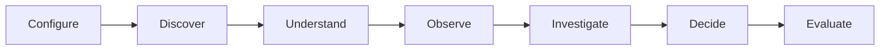

This represents the preferred analytical journey.

Users remain free to navigate directly to any workspace.

---

# 3. Navigation Objectives

Navigation shall satisfy the following objectives.

## NO-01

Minimize cognitive load.

---

## NO-02

Provide immediate orientation.

---

## NO-03

Preserve analytical context.

---

## NO-04

Avoid duplicated navigation paths.

---

## NO-05

Support deep linking.

---

## NO-06

Support browser-native behavior.

---

## NO-07

Remain predictable across every workspace.

---

# 4. Navigation Principles

---

## NP-01 — Single Responsibility

Every workspace owns exactly one responsibility.

| Workspace | Responsibility |
|------------|----------------|
| Settings | Configure |
| Search | Discover |
| Market | Understand |
| Watchlist | Observe |
| Ticker | Investigate |
| Decision Center | Decide |
| Portfolio | Evaluate |

Navigation must never blur these boundaries.

---

## NP-02 — Navigation Does Not Own Business Logic

Navigation is responsible only for changing user location.

Navigation must never:

- calculate scores
- rank securities
- trigger trading logic
- evaluate signals
- modify portfolio decisions

---

## NP-03 — Direct Accessibility

Every workspace shall be reachable directly from Global Navigation.

Maximum navigation depth:

```
Global Navigation

↓

Workspace

↓

Page
```

Users must never traverse multiple workspaces merely to reach another destination.

---

## NP-04 — Context Preservation

Whenever navigation occurs, compatible analytical context shall be preserved.

Preferred preservation order:

1. Selected resource
2. Selected date
3. Timeframe
4. Comparison
5. Workspace filters
6. Scroll position

Incompatible context shall be safely discarded.

---

## NP-05 — Predictability

Every navigation action shall produce one deterministic result.

The same action must always produce the same destination.

Unexpected redirects are prohibited.

---

## NP-06 — Visibility

Users should always know:

- Current workspace
- Current page
- Current resource
- Available destinations

No hidden navigation hierarchy is permitted.

---

## NP-07 — Recoverability

Every screen must provide a recovery path.

Minimum recovery methods:

- Browser Back
- Global Navigation
- Search
- Home Workspace

Navigation dead ends are prohibited.

---

## NP-08 — Progressive Disclosure

Navigation shall reveal information progressively.

Users move from broad market understanding toward specific analytical decisions.

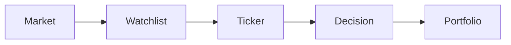

---

## NP-09 — Consistency

Navigation terminology shall remain identical throughout the application.

Examples:

Always use:

- Watchlist

Never alternate with:

- Monitor
- Favorites
- Lists

Consistency reduces cognitive load.

---

## NP-10 — Resource-Oriented Navigation

Navigation targets resources.

Examples:

Correct

```
Ticker

BBCA
```

Incorrect

```
Technical Tab

Chart Panel
```

Pages represent analytical resources rather than UI implementation.

---

## NP-11 — URL Integrity

Every navigable analytical resource has one canonical URL.

Temporary interface state must never become part of resource identity.

---

## NP-12 — Browser Compatibility

The application shall preserve native browser behavior.

Supported:

- Back
- Forward
- Refresh
- Bookmark
- Copy URL
- Open in New Tab
- Duplicate Tab

Navigation architecture must integrate with browser expectations.

---

## NP-13 — Accessibility

Navigation must remain fully usable through:

- keyboard
- screen reader
- touch
- mouse

No interaction shall require a specific input device.

---

## NP-14 — Responsive Continuity

Responsive layouts may change presentation.

They shall never change:

- navigation hierarchy
- workspace ownership
- route identity
- analytical workflow

---

# 5. Navigation Types

The system defines five navigation layers.

| Layer | Purpose | Owner |
|---------|----------|--------|
| Global Navigation | Workspace switching | Application |
| Workspace Navigation | Page switching | Workspace |
| Page Navigation | Local sections | Page |
| Context Navigation | Analytical focus | Component |
| Overlay Navigation | Temporary interaction | Overlay |

Each layer owns one level of navigation.

---

# 6. Navigation Priority

Priority order:

```
Application

↓

Workspace

↓

Page

↓

Component

↓

Overlay
```

Lower levels may never override higher levels.

---

# 7. Navigation Success Criteria

Navigation is considered successful when:

- Destination opens correctly.
- Analytical context is preserved where applicable.
- Browser history updates correctly.
- URL reflects the destination.
- No duplicated navigation state exists.

---

# 8. Anti-Patterns

The following are prohibited.

## AN-01

Hidden navigation.

---

## AN-02

Circular navigation.

---

## AN-03

Multiple owners for one screen.

---

## AN-04

Navigation triggering business logic.

---

## AN-05

Temporary UI state encoded in URLs.

---

## AN-06

Workspace ownership overlap.

---

## AN-07

Broken browser navigation.

---

# 9. Validation Checklist

The Navigation Principles chapter is considered complete when:

- [ ] Every workspace has one responsibility.
- [ ] Every workspace is directly reachable.
- [ ] Navigation hierarchy is defined.
- [ ] Context preservation rules are documented.
- [ ] Browser compatibility is defined.
- [ ] Accessibility principles are defined.
- [ ] Responsive continuity is defined.
- [ ] Anti-patterns are documented.

---

# 10. Exit Criteria

P4-01 is complete when:

- Navigation philosophy is fully defined.
- Architectural principles are frozen.
- Future phases can implement navigation without redefining its behavior.

Subsequent chapters (Information Architecture, Routing, Screen Flow, and Engineering Contract) shall conform to the principles established in this chapter.

---
# P4-02 Information Architecture

---

# 1. Purpose

This chapter defines the Information Architecture (IA) of the Decision Operating System.

It establishes:

- Workspace hierarchy
- Screen hierarchy
- Resource ownership
- Navigation relationships
- Entry and exit points
- Information boundaries

Information Architecture answers one question:

> **Where does every piece of information belong?**

The IA serves as the structural foundation for:

- Navigation
- Wireframes
- Routing
- Deep Linking
- State Management

---

# 2. Information Architecture Principles

---

## IA-01 — Single Ownership

Every information entity shall have exactly one owner.

Example:

| Information | Owner |
|-------------|-------|
| Portfolio Holdings | Portfolio |
| Market Breadth | Market |
| Technical Indicators | Ticker |
| Decision Score | Decision Center |

No information may belong to multiple workspaces.

---

## IA-02 — Resource First

Resources determine navigation.

Screens are organized around analytical resources rather than UI components.

Correct:

```
Ticker

↓

BBCA
```

Incorrect:

```
Chart

↓

Indicator
```

---

## IA-03 — Progressive Detail

Information flows from general to specific.


Every transition increases analytical depth.

---

## IA-04 — Workspace Independence

Every workspace is independently navigable.

Users may enter directly into any workspace.

No workspace requires another as a prerequisite.

---

## IA-05 — Predictable Organization

Information must always appear in the same location.

Example:

Ownership data always belongs inside the Ticker workspace.

Never duplicate it elsewhere.

---

# 3. Workspace Hierarchy

The Decision Operating System contains seven primary workspaces.

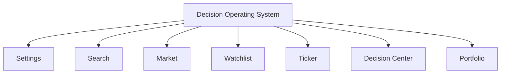

These workspaces exist at the same hierarchical level.

No workspace is subordinate to another.

---

# 4. Workspace Responsibilities

| Workspace | Primary Responsibility |
|------------|------------------------|
| Settings | Configuration |
| Search | Discovery |
| Market | Market Intelligence |
| Watchlist | Monitoring |
| Ticker | Security Analysis |
| Decision Center | Decision Synthesis |
| Portfolio | Portfolio Evaluation |

Responsibilities are mutually exclusive.

---

# 5. Workspace Relationships

Although independent, workspaces follow a logical analytical progression.

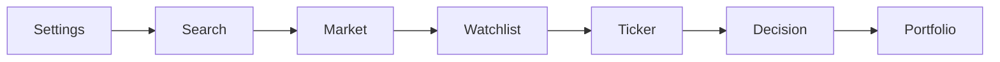

This flow represents the recommended analytical workflow.

Users may navigate directly between workspaces.

---

# 6. Screen Hierarchy

Each workspace contains one or more screens.

Hierarchy:

```text
Workspace

├── Home
├── Resource
├── Detail
└── Utility
```

Screen hierarchy never crosses workspace boundaries.

---

# 7. Screen Types

---

## Workspace Home

Purpose

Primary landing page.

Examples

- Market Overview
- Portfolio Dashboard

---

## Resource Screen

Displays a specific analytical resource.

Examples

- BBCA
- IDX30
- Banking Sector

---

## Detail Screen

Displays detailed information belonging to a resource.

Examples

- Ownership
- Financial Statements
- Risk Analysis

---

## Utility Screen

Supports the workspace.

Examples

- Preferences
- Search Help
- Notifications

---

# 8. Canonical Workspace Structure

## Settings

```text
Settings
├── Profile
├── Preferences
├── Appearance
├── Notifications
├── Security
└── About
```

---

## Search

```text
Search
├── Search
├── Results
├── Recent
└── Saved
```

---

## Market

```text
Market
├── Overview
├── Breadth
├── Indices
├── Sectors
├── Heatmap
└── Calendar
```

---

## Watchlist

```text
Watchlist
├── Overview
├── Groups
├── Alerts
├── Candidates
└── Activity
```

---

## Ticker

```text
Ticker
├── Overview
├── Technical
├── Fundamentals
├── Ownership
├── Flow
├── Financial Statements
├── Corporate Actions
├── News
└── Compare
```

---

## Decision Center

```text
Decision Center
├── Dashboard
├── Candidate Queue
├── Decision Summary
├── Evidence
├── Signals
├── Risk
├── History
└── Notes
```

---

## Portfolio

```text
Portfolio
├── Dashboard
├── Holdings
├── Allocation
├── Performance
├── Attribution
├── Transactions
└── Reports
```

---

# 9. Information Ownership Matrix

| Information | Owner |
|-------------|-------|
| User Preferences | Settings |
| Search Results | Search |
| Market Breadth | Market |
| Sector Statistics | Market |
| Watchlist Groups | Watchlist |
| Security Profile | Ticker |
| Ownership Analysis | Ticker |
| Decision Evidence | Decision Center |
| Portfolio Holdings | Portfolio |
| Portfolio Performance | Portfolio |

Information ownership is immutable.

---

# 10. Entry Points

Each workspace supports multiple entry paths.

| Entry | Supported |
|---------|-----------|
| Sidebar | ✓ |
| Search | ✓ |
| Deep Link | ✓ |
| Browser History | ✓ |
| Notifications | Where applicable |

Users are never forced into a single navigation path.

---

# 11. Exit Points

Every screen must provide at least one valid exit.

Supported exits:

- Previous Screen
- Previous Workspace
- Sidebar Navigation
- Search
- Browser Back

No screen may become a navigation dead end.

---

# 12. Resource Relationships

Resources reference one another without transferring ownership.

Example:

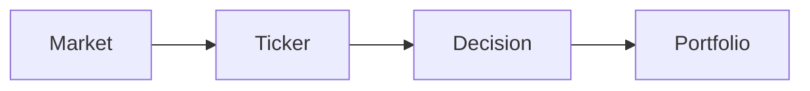

Ownership remains:

- Market owns Market data
- Ticker owns Security analysis
- Decision Center owns Decision synthesis
- Portfolio owns Holdings

---

# 13. Deep-Link Eligibility

| Screen Type | Deep Link |
|-------------|-----------|
| Workspace Home | Yes |
| Resource | Yes |
| Detail | Yes |
| Utility | Optional |
| Modal | No |
| Drawer | No |
| Tooltip | No |

Only stable analytical resources receive canonical URLs.

---

# 14. Future Expansion

Reserved workspace namespaces:

```text
Scanner
Alerts
Research
Simulation
Administration
Help
```

These remain outside the current architecture but preserve future extensibility.

---

# 15. Validation Checklist

The Information Architecture is complete when:

- [ ] Every workspace has one responsibility.
- [ ] Every information entity has one owner.
- [ ] Every screen belongs to one workspace.
- [ ] Entry points are defined.
- [ ] Exit points are defined.
- [ ] Deep-link eligibility is defined.
- [ ] Resource relationships are documented.
- [ ] Future expansion points are reserved.

---

# 16. Exit Criteria

P4-02 is complete when:

- Workspace hierarchy is frozen.
- Screen hierarchy is frozen.
- Information ownership is frozen.
- Navigation relationships are defined.
- Wireframe inventory can be derived without adding new screens.

Subsequent chapters shall build upon this Information Architecture without redefining ownership or hierarchy.

---

# P4-03 Global Navigation Model

---

# 1. Purpose

This chapter defines the Global Navigation Model of the Decision Operating System.

The Global Navigation Model provides the persistent framework through which users access every workspace while preserving analytical context.

It establishes:

- Navigation hierarchy
- Navigation zones
- Workspace switching
- Navigation persistence
- Context preservation
- Navigation ownership

Global Navigation is part of the application architecture and is independent of any individual workspace.

---

# 2. Design Objectives

The Global Navigation Model shall satisfy the following objectives.

## GN-01

Provide immediate access to every workspace.

---

## GN-02

Maintain user orientation.

---

## GN-03

Preserve analytical context.

---

## GN-04

Remain consistent throughout the application.

---

## GN-05

Support responsive layouts without changing navigation hierarchy.

---

## GN-06

Integrate naturally with browser navigation.

---

# 3. Navigation Zones

The application consists of four persistent navigation zones.

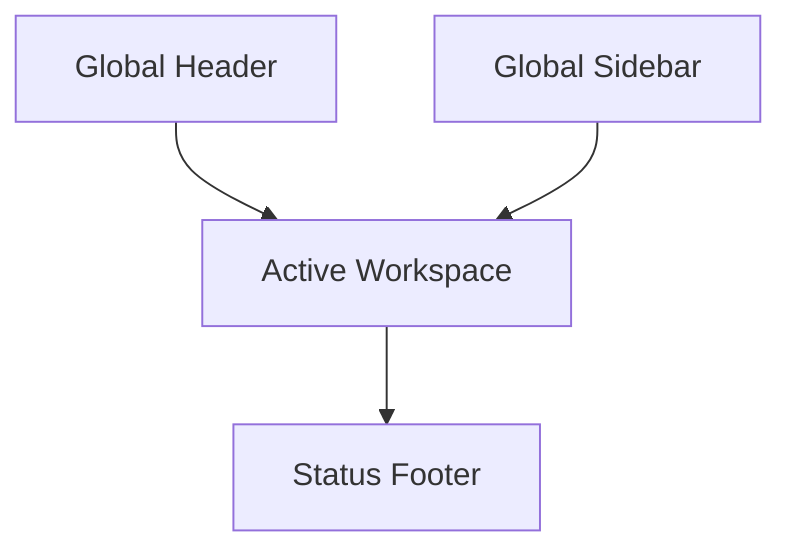

---

## Zone A — Global Sidebar

Owner

Application

Purpose

Primary workspace navigation.

Persistent on desktop.

Contains only workspace navigation.

---

Functions

- Switch Workspace
- Active Workspace Indicator
- Collapse Sidebar
- Expand Sidebar

---

Must Never Contain

- Filters
- Charts
- Analysis
- Workspace Actions
- Business Commands

---

## Zone B — Global Header

Owner

Application

Purpose

Global application controls.

Contains

- Search
- Notifications
- User Menu
- Environment Indicator
- Snapshot Status
- Help

Header remains identical across all workspaces.

---

## Zone C — Active Workspace

Owner

Current Workspace

Purpose

Display workspace-specific functionality.

Examples

Market

- Breadth
- Heatmap
- Sectors

Ticker

- Technical
- Ownership
- Financials

Decision Center

- Evidence
- Signals
- Decision Summary

Portfolio

- Holdings
- Performance
- Allocation

---

## Zone D — Status Footer

Owner

Application

Purpose

Display application status.

Contains

- Environment
- Snapshot Version
- Connection Status
- Time Zone
- Version

Purely informational.

---

# 4. Sidebar Structure

Sidebar follows the analytical workflow.

```text
Decision Center
Portfolio
────────────────
Watchlist
Ticker
Market
Search
────────────────
Settings
```

The ordering reflects operational priority rather than dependency.

---

# 5. Sidebar Rules

Every sidebar item shall:

- represent one workspace
- have one icon
- have one label
- indicate active state
- support keyboard navigation

No nested workspace menus are permitted.

---

# 6. Workspace Switching

Workspace switching follows the same lifecycle.

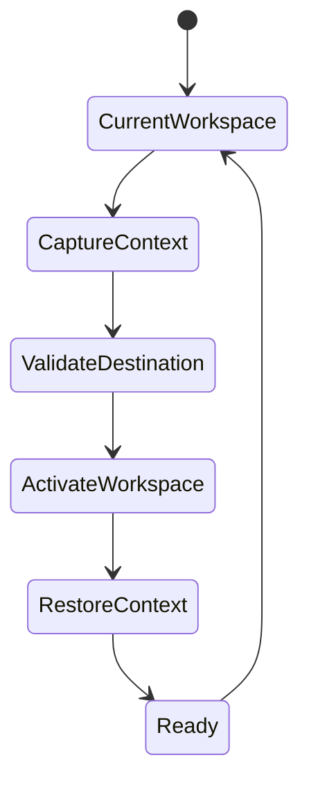

Every transition follows this lifecycle.

---

# 7. Context Preservation

When changing workspaces, preserve where compatible:

| Context | Preserve |
|----------|-----------|
| Selected Ticker | Yes |
| Selected Date | Yes |
| Timeframe | Yes |
| Comparison | Yes |
| Workspace Filters | Conditional |
| Scroll Position | Workspace Local |
| Modal State | No |
| Tooltip State | No |

Only compatible context may be restored.

---

# 8. Workspace Memory

Every workspace remembers its own presentation state.

Example

Market

- selected sector
- selected index
- heatmap mode

Ticker

- active tab
- compare mode
- timeframe

Portfolio

- grouping
- sorting
- benchmark

Returning to a workspace restores its previous presentation state.

---

# 9. Active Workspace Rules

Exactly one workspace may be active.

Allowed

```
Portfolio

ACTIVE
```

Not Allowed

```
Portfolio

ACTIVE

Ticker

ACTIVE
```

Workspace ownership is exclusive.

---

# 10. Navigation State

Global Navigation maintains only:

- active workspace
- navigation collapse state
- navigation focus

It never owns:

- selected ticker
- filters
- market state
- decision state

---

# 11. Navigation Indicators

Users must always know:

- Current Workspace
- Current Page
- Current Resource

Indicators include:

- Active sidebar item
- Page title
- Breadcrumb (desktop)
- Browser URL

---

# 12. Breadcrumb Model

Breadcrumbs represent hierarchy inside a workspace.

Example

```text
Portfolio
>
Holding
>
BBCA
```

Breadcrumbs never replace sidebar navigation.

---

# 13. Navigation Recovery

Recovery methods available from every workspace:

- Sidebar
- Search
- Browser Back
- Browser Forward

Recovery shall not require refreshing the application.

---

# 14. Responsive Navigation

## Desktop

- Persistent sidebar
- Header visible
- Breadcrumb visible

---

## Tablet

- Collapsible sidebar
- Header visible
- Breadcrumb optional

---

## Mobile

- Navigation drawer
- Bottom navigation
- Header visible

Navigation hierarchy remains unchanged.

---

# 15. Keyboard Navigation

Supported shortcuts:

| Shortcut | Action |
|-----------|--------|
| Tab | Next navigation item |
| Shift+Tab | Previous navigation item |
| Enter | Activate workspace |
| Esc | Close drawer |
| Arrow Keys | Move between items |

Navigation must be fully keyboard accessible.

---

# 16. Global Search Integration

Global Search is part of Global Navigation.

Search may navigate directly to:

- Workspace
- Resource
- Security
- Portfolio Holding
- Decision

Search never renders analytical content itself.

---

# 17. Navigation Anti-Patterns

The following are prohibited.

- Nested workspaces
- Hidden navigation paths
- Multiple active workspaces
- Sidebar containing analytical controls
- Workspace switching through modal dialogs
- Automatic navigation without user intent

---

# 18. Validation Checklist

Global Navigation is complete when:

- [ ] Every workspace is directly reachable.
- [ ] Navigation zones are defined.
- [ ] Sidebar structure is fixed.
- [ ] Workspace switching lifecycle is documented.
- [ ] Context preservation rules are defined.
- [ ] Responsive behavior is specified.
- [ ] Keyboard navigation is supported.
- [ ] Navigation anti-patterns are documented.

---

# 19. Exit Criteria

P4-03 is complete when:

- Global Navigation hierarchy is frozen.
- Navigation zones are frozen.
- Workspace switching behavior is frozen.
- Sidebar architecture is frozen.
- Responsive navigation behavior is defined.

Subsequent phases may implement this navigation model but shall not alter its structure without an approved Architecture Decision Record (ADR).

---

# P4-04 User Journey

---

# 1. Purpose

This chapter defines the canonical user journeys of the Decision Operating System.

A user journey represents an end-to-end workflow that achieves a business objective through coordinated navigation across one or more workspaces.

The purpose of this chapter is to:

- define primary analytical workflows
- validate navigation architecture
- verify workspace relationships
- eliminate navigation ambiguity
- provide the behavioral foundation for wireframes

User journeys describe **what users accomplish**, not how individual screens are visually arranged.

---

# 2. User Journey Principles

Every user journey shall satisfy the following principles.

## UJ-01

Goal Driven

Every journey begins with a business objective.

---

## UJ-02

Minimal Navigation

Users should reach their objective with the minimum reasonable number of navigation steps.

---

## UJ-03

Context Preservation

Navigation shall preserve analytical context whenever possible.

---

## UJ-04

No Dead Ends

Every journey must provide a valid continuation or recovery path.

---

## UJ-05

Direct Navigation

Users may enter the journey at any supported workspace.

---

## UJ-06

Interruptible

Users may temporarily switch workspaces without losing analytical progress.

---

## UJ-07

Recoverable

Users shall always be able to return to their previous analytical context.

---

# 3. Journey Classification

The Decision Operating System defines six primary journey categories.

| Journey | Purpose |
|----------|---------|
| Daily Market Review | Understand market conditions |
| Candidate Discovery | Find investment opportunities |
| Watchlist Monitoring | Monitor tracked securities |
| Security Investigation | Analyze a security |
| Decision Validation | Validate investment decisions |
| Portfolio Review | Evaluate current holdings |

Additional journeys may be introduced without changing workspace ownership.

---

# 4. Journey 1 — Daily Market Review

## Objective

Understand the overall market before evaluating individual securities.

### Entry Points

- Market Workspace
- Search
- Deep Link

### Workflow

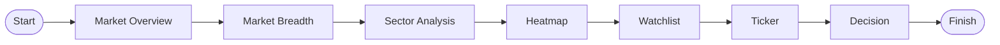

### Expected Outcome

User understands:

- market direction
- market breadth
- leading sectors
- candidate securities

---

# 5. Journey 2 — Candidate Discovery

## Objective

Identify a potential investment candidate.

### Workflow

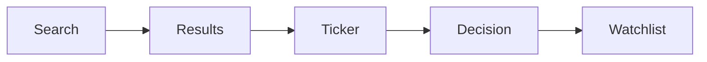

### Expected Outcome

Candidate is either:

- monitored
- rejected
- investigated further

---

# 6. Journey 3 — Watchlist Monitoring

## Objective

Review monitored securities.

### Workflow

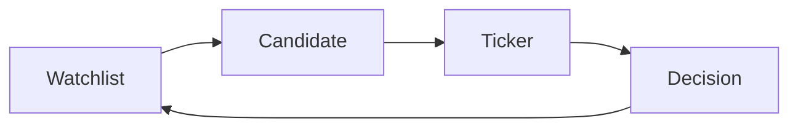

### Expected Outcome

Every monitored security is either:

- maintained
- escalated
- removed

---

# 7. Journey 4 — Security Investigation

## Objective

Perform complete analysis of one security.

### Workflow

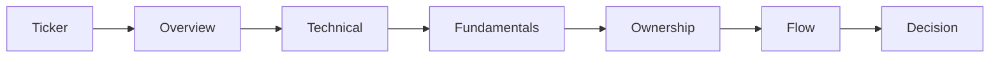

### Expected Outcome

Complete understanding of the selected security.

---

# 8. Journey 5 — Decision Validation

## Objective

Validate an analytical conclusion before acting.

### Workflow

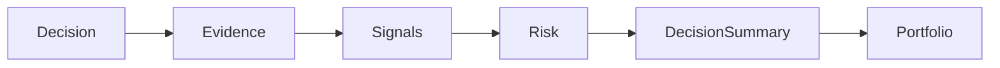

### Expected Outcome

Decision is:

- accepted
- deferred
- rejected

---

# 9. Journey 6 — Portfolio Review

## Objective

Evaluate existing holdings.

### Workflow

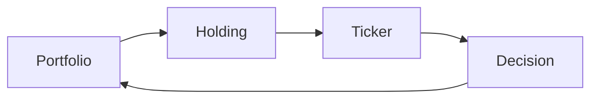

### Expected Outcome

Each holding is reviewed using current analytical information.

---

# 10. Journey Entry Matrix

| Workspace | Can Start Journey |
|------------|------------------|
| Settings | No |
| Search | Yes |
| Market | Yes |
| Watchlist | Yes |
| Ticker | Yes |
| Decision Center | Yes |
| Portfolio | Yes |

Settings supports configuration rather than analytical workflows.

---

# 11. Journey Exit Matrix

Every journey must terminate in one of the following states.

| Outcome | Description |
|----------|-------------|
| Complete | Objective achieved |
| Suspended | User intentionally leaves |
| Cancelled | User abandons journey |
| Recovery | Error handled safely |

No undefined termination states are permitted.

---

# 12. Context Preservation During Journeys

The following context shall be preserved throughout a journey where applicable.

| Context | Preserve |
|----------|-----------|
| Selected Ticker | Yes |
| Date | Yes |
| Timeframe | Yes |
| Comparison | Yes |
| Workspace State | Conditional |
| Scroll Position | Workspace Local |

---

# 13. Journey Interruptions

Users may interrupt any journey by navigating to:

- Search
- Settings
- Another Workspace

Returning to the original journey shall restore compatible context.

---

# 14. Navigation Recovery

Recovery methods include:

- Browser Back
- Sidebar Navigation
- Search
- Deep Link
- Previous Workspace

Recovery must not require restarting the workflow.

---

# 15. Journey Performance Goals

| Metric | Target |
|---------|--------|
| Workspace Switch | <300 ms (excluding network) |
| Context Restoration | Immediate |
| Search Navigation | One interaction |
| Deep Link Open | One navigation step |

These targets define UX expectations rather than backend performance guarantees.

---

# 16. Journey Validation

Every journey shall satisfy:

- [ ] Clear business objective
- [ ] Defined entry point
- [ ] Defined exit point
- [ ] Context preservation
- [ ] Recovery path
- [ ] No dead ends
- [ ] Deep-link compatibility
- [ ] Browser compatibility

---

# 17. Journey Anti-Patterns

The following are prohibited.

- Circular workflows with no completion.
- Hidden navigation dependencies.
- Mandatory visits to unrelated workspaces.
- Loss of analytical context without user intent.
- Automatic navigation between workspaces.

---

# 18. Exit Criteria

P4-04 is complete when:

- All primary analytical workflows are documented.
- Navigation paths are validated.
- Context preservation is defined.
- Recovery behavior is specified.
- Journey architecture supports downstream wireframing.

Subsequent chapters (Screen Flow, Routing Model, and Deep Linking) shall implement these journeys without altering their objectives or navigation logic.

---

# P4-05 Screen Flow

---

# 1. Purpose

This chapter defines the canonical Screen Flow of the Decision Operating System.

While User Journeys describe **what users accomplish**, Screen Flow specifies **how users move between individual screens** within and across workspaces.

It establishes:

- Screen transitions
- Navigation paths
- Transition rules
- Context propagation
- Recovery behavior
- Screen ownership

Screen Flow is implementation-independent and serves as the behavioral blueprint for Phase 5 (Wireframes) and Phase 7 (Frontend Technical Architecture).

---

# 2. Screen Flow Principles

---

## SF-01

Every screen belongs to exactly one workspace.

---

## SF-02

Every screen has at least one entry path.

---

## SF-03

Every screen has at least one exit path.

---

## SF-04

Every transition is deterministic.

---

## SF-05

Every transition preserves compatible analytical context.

---

## SF-06

Navigation never changes workspace ownership implicitly.

---

## SF-07

No screen becomes a navigation dead end.

---

# 3. Screen Flow Model

Navigation follows a four-level hierarchy.

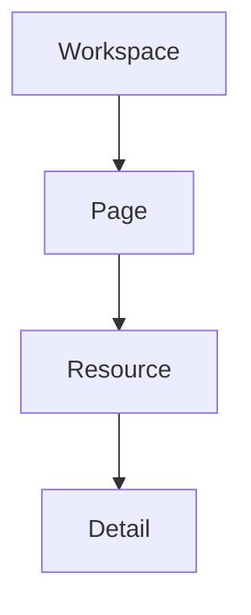

Each transition increases analytical specificity.

---

# 4. Global Screen Flow

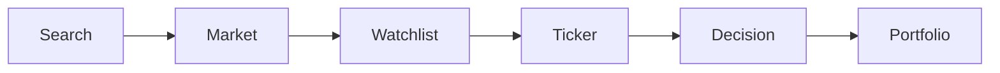

Settings remains globally accessible from every state.

---

# 5. Market Workspace Flow

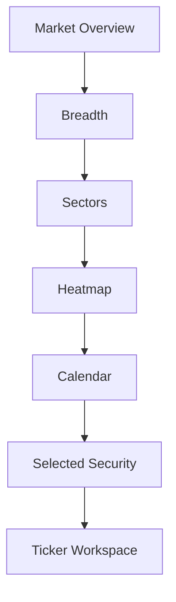

### Valid Exit Destinations

- Watchlist
- Ticker
- Search
- Decision Center

---

# 6. Watchlist Workspace Flow

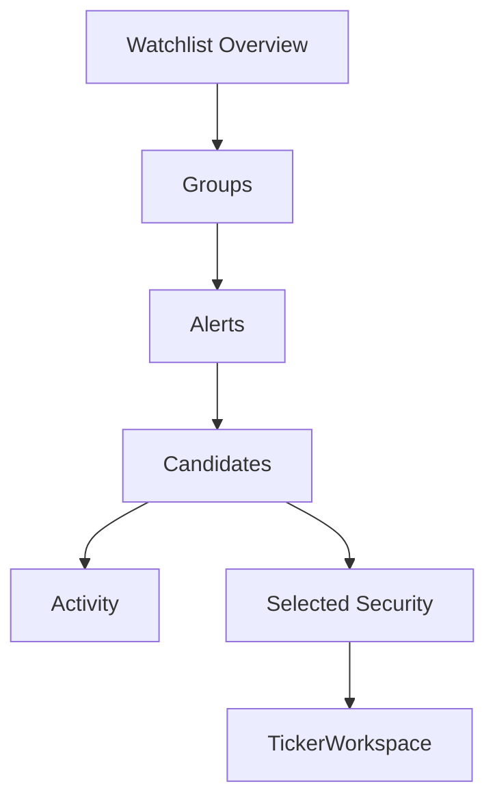

### Valid Exit Destinations

- Market
- Ticker
- Decision Center

---

# 7. Ticker Workspace Flow

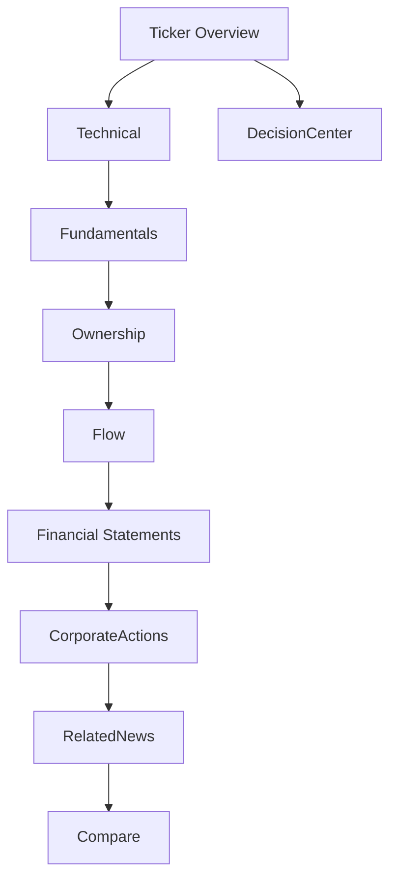

Ticker is the analytical hub.

---

# 8. Decision Center Flow

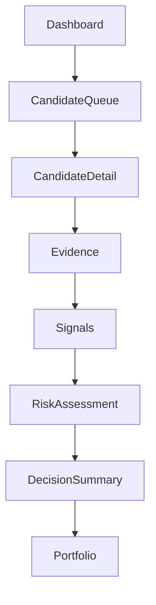

---

# 9. Portfolio Flow

```mermaid
flowchart TD

PortfolioDashboard

--> Holdings

--> Allocation

--> Performance

--> Attribution

--> Transactions

Holdings --> PositionDetail

PositionDetail --> TickerWorkspace
```

---

# 10. Search Flow

```mermaid
flowchart TD

SearchHome

--> Results

Results --> Market

Results --> Watchlist

Results --> TickerWorkspace

Results --> DecisionCenter

Results --> Portfolio
```

Search never owns analytical content.

---

# 11. Settings Flow

```mermaid
flowchart TD

SettingsHome

--> Profile

--> Preferences

--> Appearance

--> Notifications

--> Security

--> Integrations

--> About
```

Settings never participates in analytical workflows.

---

# 12. Cross-Workspace Flow

The following transitions are officially supported.

| From | To |
|------|----|
| Search | Market |
| Search | Watchlist |
| Search | Ticker |
| Search | Decision |
| Search | Portfolio |
| Market | Watchlist |
| Market | Ticker |
| Watchlist | Ticker |
| Ticker | Decision |
| Decision | Portfolio |
| Portfolio | Ticker |
| Any Workspace | Settings |

No additional implicit transitions are permitted.

---

# 13. Transition Lifecycle

Every navigation follows the same lifecycle.

```mermaid
stateDiagram-v2

[*] --> CurrentScreen

CurrentScreen --> CaptureContext

CaptureContext --> ValidateDestination

ValidateDestination --> ResolveResource

ResolveResource --> RenderDestination

RenderDestination --> RestoreContext

RestoreContext --> Ready

Ready --> [*]
```

---

# 14. Transition Guards

Transitions are validated before execution.

Examples

| Transition | Guard |
|------------|-------|
| Market → Ticker | Security exists |
| Watchlist → Ticker | Selected security exists |
| Ticker → Decision | Decision resource available |
| Portfolio → Ticker | Holding exists |

Invalid transitions shall terminate gracefully.

---

# 15. Context Propagation

The following context may be propagated.

| Context | Rule |
|----------|------|
| Selected Ticker | Preserve |
| Date | Preserve |
| Timeframe | Preserve |
| Comparison | Preserve |
| Workspace Filters | Preserve if compatible |
| Scroll Position | Workspace-local only |

Temporary UI state shall never propagate.

---

# 16. Invalid Flow Handling

When navigation cannot complete:

```mermaid
flowchart TD

NavigationRequest

-->

Validate

Validate -->|Valid| Destination

Validate -->|Invalid| ErrorPage

ErrorPage --> Search

ErrorPage --> PreviousScreen

ErrorPage --> Home
```

Users must always have a recovery option.

---

# 17. Empty Flow Handling

Empty states follow a consistent flow.

```mermaid
flowchart TD

Workspace

-->

EmptyState

EmptyState --> Retry

EmptyState --> Search

EmptyState --> PreviousScreen
```

Empty states never terminate navigation.

---

# 18. Browser Flow

Browser actions integrate with screen flow.

Supported:

- Back
- Forward
- Refresh
- Bookmark
- Open in New Tab
- Duplicate Tab

Browser actions shall preserve canonical navigation behavior.

---

# 19. Validation Checklist

Screen Flow is complete when:

- [ ] Every screen has an entry path.
- [ ] Every screen has an exit path.
- [ ] Cross-workspace transitions are defined.
- [ ] Transition guards are documented.
- [ ] Context propagation is defined.
- [ ] Error recovery exists.
- [ ] Empty-state recovery exists.
- [ ] Browser behavior is supported.

---

# 20. Exit Criteria

P4-05 is complete when:

- All screen transitions are documented.
- Cross-workspace navigation is validated.
- Transition lifecycle is standardized.
- Context propagation rules are frozen.
- Recovery behavior is fully defined.

Subsequent chapters (Routing Model and Deep Linking Strategy) shall implement these flows without altering their navigation semantics.

---
# P4-06 Routing Model

---

# 1. Purpose

This chapter defines the canonical Routing Model of the Decision Operating System.

The Routing Model establishes:

- URL hierarchy
- Route ownership
- Route lifecycle
- Browser integration
- Route validation
- Navigation state restoration

Routing provides the contract between:

- UX Architecture
- Browser
- Frontend Router
- Deep Linking
- Navigation
- Backend Resources

---

# 2. Routing Principles

---

## RM-01

Every navigable resource shall have exactly one canonical route.

---

## RM-02

Routes identify analytical resources.

Routes never identify UI implementation.

---

## RM-03

Routes remain stable across application versions.

---

## RM-04

The same URL always produces the same navigation state.

---

## RM-05

Browser history remains authoritative.

---

## RM-06

Routing never owns business logic.

---

## RM-07

Routing remains independent from visual layout.

---

# 3. Route Hierarchy

The application contains one root and seven primary workspace routes.

```mermaid
flowchart TD

Root["/"]

Root --> Settings["/settings"]
Root --> Search["/search"]
Root --> Market["/market"]
Root --> Watchlist["/watchlist"]
Root --> Ticker["/ticker/:symbol"]
Root --> Decision["/decision/:symbol"]
Root --> Portfolio["/portfolio"]
```

No nested workspaces are permitted.

---

# 4. Canonical Routes

| Workspace | Canonical Route |
|------------|-----------------|
| Home | `/` |
| Settings | `/settings` |
| Search | `/search` |
| Market | `/market` |
| Watchlist | `/watchlist` |
| Ticker | `/ticker/:symbol` |
| Decision Center | `/decision/:symbol` |
| Portfolio | `/portfolio` |

Every workspace owns one canonical root.

---

# 5. Resource Routes

## Ticker

```
/ticker/:symbol
```

Example

```
/ticker/BBCA
```

---

## Decision

```
/decision/:symbol
```

Example

```
/decision/BBCA
```

---

## Market Sector

```
/market/sector/:sector
```

---

## Market Index

```
/market/index/:index
```

---

## Watchlist Group

```
/watchlist/:group
```

---

## Portfolio Holding

```
/portfolio/:symbol
```

Portfolio resources are read-only navigation endpoints.

---

# 6. Route Parameters

---

## symbol

| Property | Value |
|----------|-------|
| Type | String |
| Required | Yes |
| Format | Uppercase |
| Length | 1–8 characters |
| Validation | Existing security |
| Example | BBCA |

---

## sector

| Property | Value |
|----------|-------|
| Type | String |
| Required | Yes |
| Example | BANKING |

---

## index

| Property | Value |
|----------|-------|
| Type | String |
| Required | Yes |
| Example | IDX30 |

---

## group

| Property | Value |
|----------|-------|
| Type | String |
| Required | Yes |
| Validation | Existing watchlist |

---

# 7. Query Parameters

Query parameters modify presentation only.

They never identify resources.

---

## date

```
?date=2026-08-07
```

Type

ISO-8601 Date

Optional

---

## tab

```
?tab=ownership
```

Allowed

- overview
- technical
- ownership
- flow
- fundamentals

---

## timeframe

```
?timeframe=1Y
```

Allowed

- 1D
- 1W
- 1M
- 3M
- 6M
- 1Y
- MAX

---

## compare

```
?compare=BMRI
```

Optional

Ticker Symbol

---

## sort

Presentation only.

---

## page

Pagination only.

---

## filter

Workspace presentation only.

---

# 8. URL Structure

Canonical URL format:

```
/workspace/resource?presentation
```

Examples

```
/ticker/BBCA

/ticker/BBCA?tab=ownership

/ticker/BBCA?timeframe=1Y

/market/sector/BANKING

/watchlist/default
```

---

# 9. Route Resolution

Every request follows the same resolution pipeline.

```mermaid
flowchart TD

URL

-->

RouteMatch

-->

ParameterValidation

-->

ResourceValidation

-->

Authorization

-->

WorkspaceActivation

-->

Render
```

Every stage must complete successfully before rendering.

---

# 10. Route Validation

Routing validates:

- Route existence
- Parameter syntax
- Parameter format
- Resource existence
- Authorization

Routing never validates business rules.

---

# 11. Invalid Routes

Unknown route

```
/foo/bar
```

↓

404

---

Invalid parameter

```
/ticker/$$$$
```

↓

400

---

Unknown resource

```
/ticker/UNKNOWN
```

↓

Resource Not Found

---

Unauthorized

↓

Authentication

↓

Return to original route

---

# 12. URL Normalization

Canonical representation shall always be enforced.

Examples

```
/ticker/bbca
```

↓

```
/ticker/BBCA
```

---

Trailing slash

```
/ticker/BBCA/
```

↓

```
/ticker/BBCA
```

Only one canonical URL exists for every resource.

---

# 13. Browser History

Routing integrates with browser history.

Use Push

- Workspace change
- Resource change
- Search result
- Deep link

Use Replace

- URL normalization
- Authentication recovery
- Invalid parameter correction

---

# 14. Session Restoration

Refreshing the browser restores:

- Workspace
- Resource
- Selected Tab
- Timeframe
- Comparison
- Date

Refreshing shall not restore:

- Modal
- Tooltip
- Drawer
- Toast
- Hover State

---

# 15. Browser Compatibility

Routing fully supports:

- Refresh
- Back
- Forward
- Bookmark
- Open in New Tab
- Duplicate Tab
- Copy URL

Browser remains the source of truth for navigation history.

---

# 16. Reserved Routes

Reserved namespaces:

```
/scanner

/alerts

/research

/reports

/admin

/help
```

Reserved routes preserve future extensibility.

---

# 17. Route Ownership Matrix

| Route | Owner |
|--------|-------|
| `/settings` | Settings |
| `/search` | Search |
| `/market` | Market |
| `/watchlist` | Watchlist |
| `/ticker/*` | Ticker |
| `/decision/*` | Decision Center |
| `/portfolio/*` | Portfolio |

No route may have multiple owners.

---

# 18. Routing Anti-Patterns

The following are prohibited.

- Multiple URLs for one resource
- Resource identifiers in query parameters
- Business state in URLs
- Hidden redirects
- Circular redirects
- Workspace ownership changes during routing

---

# 19. Validation Checklist

Routing Model is complete when:

- [ ] Canonical routes are defined.
- [ ] Route hierarchy is defined.
- [ ] Parameter schema is documented.
- [ ] Query parameter schema is documented.
- [ ] URL normalization is defined.
- [ ] Browser history behavior is defined.
- [ ] Session restoration is documented.
- [ ] Reserved namespaces are documented.

---

# 20. Exit Criteria

P4-06 is complete when:

- Canonical routing is frozen.
- URL contracts are frozen.
- Browser integration is defined.
- Route ownership is finalized.
- Deep Linking can build upon this routing model without modification.

Subsequent chapters (Deep Linking Strategy and Cross-workspace Navigation) shall extend this routing model without altering its canonical URL structure.

---
# P4-07 Deep Linking Strategy

---

# 1. Purpose

This chapter defines the Deep Linking Strategy of the Decision Operating System.

Deep Linking enables users to:

- open any analytical resource directly
- bookmark analytical views
- share URLs
- restore analytical sessions
- integrate notifications with navigation

Deep Links are built upon the Routing Model defined in P4-06.

---

# 2. Design Principles

---

## DL-01

Every analytical resource shall have exactly one canonical deep link.

---

## DL-02

Deep links shall remain stable across application versions.

---

## DL-03

Deep links shall restore analytical context whenever possible.

---

## DL-04

Deep links shall never represent temporary UI state.

---

## DL-05

Every deep link shall be bookmark-safe.

---

## DL-06

Every deep link shall be browser compatible.

---

## DL-07

Deep links shall never bypass workspace ownership.

---

# 3. Deep Link Architecture

```mermaid
flowchart LR

URL

-->

Router

-->

Resource Validation

-->

Workspace

-->

Context Restoration

-->

Render
```

The URL identifies the resource.

The workspace owns the presentation.

---

# 4. Deep Link Categories

The application supports five categories.

| Category | Purpose |
|----------|----------|
| Workspace | Open a workspace |
| Resource | Open a specific analytical resource |
| Detail | Open a specific analytical view |
| Comparison | Restore comparison mode |
| Historical | Restore historical context |

---

# 5. Workspace Links

Examples

```
/market

/search

/watchlist

/portfolio

/settings
```

Opening a workspace restores its previous presentation state when available.

---

# 6. Resource Links

Examples

```
/ticker/BBCA

/decision/BBCA

/portfolio/BBCA

/market/index/IDX30

/watchlist/default
```

Resource links are canonical.

---

# 7. Detail Links

Detail links restore a specific analytical view.

Examples

```
/ticker/BBCA?tab=ownership

/ticker/BBCA?tab=fundamentals

/ticker/BBCA?tab=flow
```

Detail links never change the underlying resource.

---

# 8. Comparison Links

Comparison state is represented through query parameters.

Example

```
/ticker/BBCA?compare=BMRI
```

The primary resource remains:

```
BBCA
```

Comparison is presentation state.

---

# 9. Historical Links

Historical analytical context may be restored.

Example

```
/ticker/BBCA?date=2026-08-07
```

or

```
/market?date=2026-08-07
```

Historical context must not modify resource identity.

---

# 10. Context Restoration

Deep links restore context in the following order.

1. Resource

2. Workspace

3. Tab

4. Date

5. Timeframe

6. Comparison

7. Compatible Filters

Temporary UI state is never restored.

---

# 11. Bookmark Behavior

Bookmarks shall restore:

- Workspace
- Resource
- Tab
- Date
- Timeframe
- Comparison

Bookmarks shall not restore:

- Modal dialogs
- Tooltips
- Notifications
- Hover state
- Scroll position

---

# 12. Notification Integration

Future notifications shall navigate directly to the affected resource.

Example

```
Alert

↓

/ticker/BBCA?tab=flow
```

Users shall never be redirected to an intermediate landing page.

---

# 13. Shared Links

Shared links shall behave identically regardless of:

- Browser
- Device
- Screen Size

Differences in presentation are acceptable.

Differences in navigation are prohibited.

---

# 14. Invalid Deep Links

Examples

```
/ticker/

```

```
/ticker/UNKNOWN

```

```
/ticker/$$$$

```

System behavior

```mermaid
flowchart TD

DeepLink

-->

Validate

Validate -->|Valid| Render

Validate -->|Invalid| Error

Error --> Search

Error --> PreviousPage

Error --> Home
```

Users shall always receive a recovery path.

---

# 15. Authorization

Protected deep links follow the authentication pipeline.

```mermaid
flowchart TD

DeepLink

-->

Authentication

Authentication -->|Success| Destination

Authentication -->|Failure| Login

Login --> Destination
```

After successful authentication, the original destination shall be restored.

---

# 16. Browser Compatibility

Deep links fully support:

- Refresh
- Bookmark
- Open in New Tab
- Duplicate Tab
- Copy URL
- Browser History

Behavior shall remain identical across supported browsers.

---

# 17. URL Integrity

Deep links shall never encode:

- Tooltip state
- Modal state
- Expanded panels
- Hover state
- Temporary filters
- Temporary selections

Only stable analytical state belongs in URLs.

---

# 18. Deep Link Ownership

| Layer | Responsibility |
|--------|----------------|
| URL | Resource identity |
| Router | Resolution |
| Workspace | Presentation |
| Backend | Resource validation |
| Browser | History |

Ownership shall never overlap.

---

# 19. Future Compatibility

The Deep Linking architecture shall support future capabilities without changing canonical URLs.

Examples

- Alerts
- Scanner
- Research
- Reports
- AI Assistant

Future functionality shall extend existing routes rather than replace them.

---

# 20. Validation Checklist

Deep Linking Strategy is complete when:

- [ ] Every analytical resource has a canonical deep link.
- [ ] Workspace links are defined.
- [ ] Resource links are defined.
- [ ] Context restoration order is documented.
- [ ] Bookmark behavior is defined.
- [ ] Notification integration is defined.
- [ ] Invalid link recovery is documented.
- [ ] Browser compatibility is verified.

---

# 21. Exit Criteria

P4-07 is complete when:

- Canonical deep links are frozen.
- Context restoration behavior is frozen.
- Bookmark behavior is defined.
- Authentication flow is integrated.
- Browser compatibility is confirmed.

Subsequent chapters (Cross-workspace Navigation and UX Validation) shall build upon this deep-linking model without altering canonical URL behavior.

---

# P4-08 Cross-workspace Navigation

---

# 1. Purpose

This chapter defines how users move between workspaces while preserving analytical context and maintaining the architectural ownership established by the Frontend Design Freeze.

Cross-workspace navigation shall:

- preserve analytical continuity
- respect workspace ownership
- prevent duplicated business logic
- minimize unnecessary navigation
- remain deterministic

This chapter governs transitions **between workspaces**, not navigation inside a workspace.

---

# 2. Design Principles

---

## CW-01

Every navigation has one source workspace.

---

## CW-02

Every navigation has one destination workspace.

---

## CW-03

Destination workspace immediately becomes the presentation owner.

---

## CW-04

Business ownership never changes.

---

## CW-05

Compatible context shall be preserved.

---

## CW-06

Incompatible context shall be safely discarded.

---

## CW-07

Cross-workspace navigation shall never duplicate business state.

---

# 3. Navigation Architecture

```mermaid
flowchart LR

SourceWorkspace

-->

CaptureContext

-->

Router

-->

DestinationWorkspace

-->

RestoreContext

-->

Ready
```

Every cross-workspace transition follows this lifecycle.

---

# 4. Workspace Ownership

Only one workspace owns presentation at any time.

Example

```text
Market

↓

Ticker
```

Ownership changes:

Before

```
Market

ACTIVE
```

After

```
Ticker

ACTIVE
```

Market no longer owns presentation.

---

# 5. Supported Transitions

| From | To | Status |
|------|----|--------|
| Search | Market | Supported |
| Search | Watchlist | Supported |
| Search | Ticker | Supported |
| Search | Decision Center | Supported |
| Search | Portfolio | Supported |
| Market | Watchlist | Supported |
| Market | Ticker | Supported |
| Watchlist | Ticker | Supported |
| Ticker | Decision Center | Supported |
| Decision Center | Portfolio | Supported |
| Portfolio | Ticker | Supported |
| Any Workspace | Settings | Supported |

These represent the canonical cross-workspace transitions.

---

# 6. Transition Matrix

| Source | Destination | Context Preserved |
|----------|-------------|------------------|
| Market | Ticker | Security, Date |
| Watchlist | Ticker | Security |
| Ticker | Decision | Security |
| Decision | Portfolio | Security |
| Portfolio | Ticker | Holding |
| Search | Any Workspace | Selected Resource |

---

# 7. Context Transfer

Context is transferred only when compatible.

| Context | Transfer |
|----------|----------|
| Selected Security | Yes |
| Date | Yes |
| Timeframe | Yes |
| Comparison | Yes |
| Workspace Filters | Conditional |
| Page Layout | No |
| Scroll Position | Workspace Local |
| Dialog State | No |
| Tooltip State | No |

Temporary interface state shall never cross workspace boundaries.

---

# 8. Context Capture

Before navigation begins:

```mermaid
flowchart TD

CurrentWorkspace

-->

CaptureContext

-->

Validate

-->

Navigate
```

Captured context includes only transferable analytical state.

---

# 9. Context Restoration

Destination workspace restores context using the following priority.

1. Resource

2. Workspace

3. Page

4. Date

5. Timeframe

6. Comparison

7. Compatible Filters

The destination workspace determines compatibility.

---

# 10. Invalid Context

If transferred context is incompatible:

Example

```
Market Heatmap Mode

↓

Portfolio
```

System behavior:

- discard incompatible context
- preserve compatible context
- continue navigation

Users shall not receive unnecessary warnings.

---

# 11. Navigation Contract

Every cross-workspace navigation follows the same contract.

```mermaid
stateDiagram-v2

[*] --> SourceWorkspace

SourceWorkspace --> CaptureContext

CaptureContext --> ValidateDestination

ValidateDestination --> ResolveResource

ResolveResource --> DestinationWorkspace

DestinationWorkspace --> RestoreContext

RestoreContext --> Ready

Ready --> [*]
```

---

# 12. Navigation Guards

Every transition shall pass validation.

Examples

| Transition | Guard |
|------------|-------|
| Market → Ticker | Security exists |
| Watchlist → Ticker | Selected security exists |
| Ticker → Decision | Decision available |
| Portfolio → Ticker | Holding exists |

Navigation fails safely if validation fails.

---

# 13. Recovery

If navigation fails:

```mermaid
flowchart TD

Navigation

-->

Failure

Failure --> PreviousWorkspace

Failure --> Search

Failure --> Home

Failure --> Retry
```

Recovery shall always be available.

---

# 14. Browser Integration

Cross-workspace navigation integrates with:

- Browser Back
- Browser Forward
- Refresh
- Bookmark
- Deep Link

Browser behavior remains authoritative.

---

# 15. Performance Targets

| Operation | Target |
|-----------|--------|
| Workspace Switch | <300 ms (excluding network) |
| Context Capture | Immediate |
| Context Restore | Immediate |
| Navigation Completion | One transition |

Performance targets describe UX expectations.

---

# 16. Navigation Anti-Patterns

The following are prohibited.

- Simultaneous active workspaces
- Automatic workspace switching
- Circular navigation
- Hidden transitions
- Business logic executed during navigation
- Context duplication
- Workspace ownership overlap

---

# 17. Future Compatibility

Cross-workspace navigation shall support future workspaces.

Reserved destinations:

- Scanner
- Alerts
- Research
- Reports
- Administration

Future workspaces shall follow the same transition contract.

---

# 18. Validation Checklist

Cross-workspace Navigation is complete when:

- [ ] Supported transitions are documented.
- [ ] Context transfer rules are defined.
- [ ] Context restoration priority is documented.
- [ ] Transition lifecycle is standardized.
- [ ] Navigation guards are defined.
- [ ] Recovery behavior is documented.
- [ ] Browser integration is verified.
- [ ] Anti-patterns are documented.

---

# 19. Exit Criteria

P4-08 is complete when:

- Cross-workspace navigation is frozen.
- Transition contracts are frozen.
- Context propagation is fully defined.
- Recovery behavior is validated.
- Future workspace integration is supported without architectural changes.

Subsequent chapters (UX Validation and Freeze Preparation) shall verify this navigation model rather than redefine it.

---
# P4-09 UX Validation

---

# 1. Purpose

This chapter defines the validation framework for the User Experience Architecture of the Decision Operating System.

Its purpose is to verify that the UX Blueprint satisfies the architectural principles established throughout Phase 4 before progressing to visual design and implementation.

Validation is performed at the architectural level rather than the implementation level.

---

# 2. Validation Objectives

The UX Architecture shall be validated to ensure:

- Navigation consistency
- Information Architecture integrity
- Routing consistency
- Context preservation
- Browser compatibility
- Accessibility readiness
- Responsive continuity
- Engineering readiness

A successful validation confirms architectural completeness, not UI quality.

---

# 3. Validation Categories

The UX Blueprint shall be evaluated across eight categories.

| Category | Objective |
|-----------|-----------|
| Navigation | Verify navigation hierarchy |
| Information Architecture | Verify ownership and hierarchy |
| Routing | Verify URL contracts |
| User Journeys | Verify analytical workflows |
| Context Management | Verify state preservation |
| Accessibility | Verify WCAG readiness |
| Responsive UX | Verify layout independence |
| Engineering Readiness | Verify implementation contract |

Each category must independently pass before Phase 4 can be frozen.

---

# 4. Navigation Validation

The following questions shall be answered affirmatively.

- Can every workspace be reached directly?
- Does every screen have an exit path?
- Is every navigation deterministic?
- Are workspace responsibilities preserved?
- Are browser navigation controls supported?

Expected Result

PASS

---

# 5. Information Architecture Validation

Verify:

- Every screen belongs to one workspace.
- Every resource has one owner.
- Every workspace has one responsibility.
- Every hierarchy is internally consistent.
- No duplicated information exists.

Expected Result

PASS

---

# 6. Routing Validation

Verify:

- Canonical routes exist.
- Route ownership is unique.
- Parameter definitions are complete.
- Query parameter rules are defined.
- URL normalization is documented.
- Browser history behavior is specified.

Expected Result

PASS

---

# 7. User Journey Validation

Every primary journey shall satisfy:

- Defined objective
- Defined start point
- Defined end point
- Context preservation
- Recovery path
- No navigation dead ends

Expected Result

PASS

---

# 8. Screen Flow Validation

Verify:

- Screen transitions are documented.
- Transition guards exist.
- Context propagation rules exist.
- Invalid navigation is recoverable.
- Browser behavior is preserved.

Expected Result

PASS

---

# 9. Context Validation

Verify ownership for:

| Context | Owner |
|----------|-------|
| Application | Application |
| Workspace | Workspace |
| Page | Page |
| Component | Component |
| URL | Router |
| Browser History | Browser |

Validation Criteria

- Single owner
- No duplication
- Deterministic restoration

Expected Result

PASS

---

# 10. Accessibility Validation

Architecture shall support:

- Keyboard navigation
- Screen reader compatibility
- Focus management
- Semantic navigation landmarks
- Reduced motion
- Responsive layouts

Target Standard

**WCAG 2.2 AA**

Expected Result

PASS

---

# 11. Responsive Validation

Verify:

Desktop

- Persistent navigation
- Full workspace visibility

Tablet

- Collapsible navigation
- Identical hierarchy

Mobile

- Drawer navigation
- Bottom navigation
- Same workspace ownership

Responsive layouts shall not alter navigation semantics.

Expected Result

PASS

---

# 12. Browser Compatibility Validation

The following browser features shall operate correctly.

| Feature | Required |
|----------|----------|
| Back | ✓ |
| Forward | ✓ |
| Refresh | ✓ |
| Bookmark | ✓ |
| Copy URL | ✓ |
| Open in New Tab | ✓ |
| Duplicate Tab | ✓ |

Browser behavior remains authoritative.

Expected Result

PASS

---

# 13. Error Recovery Validation

Verify recovery from:

- Invalid URL
- Unknown resource
- Authorization failure
- Network interruption
- Empty data
- Backend unavailable

Every error shall provide a recovery path.

Expected Result

PASS

---

# 14. Engineering Readiness Validation

Verify:

- Navigation ownership defined
- Route ownership defined
- State ownership defined
- Context ownership defined
- Workspace ownership defined
- Browser ownership defined

No implementation ambiguity shall remain.

Expected Result

PASS

---

# 15. Traceability Matrix

| Requirement | Chapter |
|-------------|---------|
| Navigation Principles | P4-01 |
| Information Architecture | P4-02 |
| Global Navigation | P4-03 |
| User Journeys | P4-04 |
| Screen Flow | P4-05 |
| Routing | P4-06 |
| Deep Linking | P4-07 |
| Cross-workspace Navigation | P4-08 |

Every architectural requirement shall map to exactly one primary chapter.

---

# 16. Validation Checklist

Phase 4 UX Blueprint is considered architecturally complete when:

- [ ] Navigation validated
- [ ] Information Architecture validated
- [ ] User Journeys validated
- [ ] Screen Flow validated
- [ ] Routing validated
- [ ] Deep Linking validated
- [ ] Cross-workspace Navigation validated
- [ ] Context ownership validated
- [ ] Accessibility validated
- [ ] Responsive behavior validated
- [ ] Browser compatibility validated
- [ ] Engineering readiness validated

All items must pass before freeze.

---

# 17. Review Process

Validation shall be conducted in the following order.

```mermaid
flowchart LR

Architecture

-->

Navigation

-->

InformationArchitecture

-->

Routing

-->

Context

-->

Accessibility

-->

Engineering

-->

FreezeDecision
```

A failure at any stage requires correction before proceeding.

---

# 18. Success Criteria

The UX Blueprint is considered successful when:

- Navigation is deterministic.
- Information ownership is unambiguous.
- Routing is canonical.
- Context restoration is deterministic.
- Browser behavior is preserved.
- Accessibility baseline is satisfied.
- Engineering responsibilities are clearly assigned.
- Future phases can proceed without redefining UX architecture.

---

# 19. Exit Criteria

P4-09 is complete when:

- All validation categories pass.
- No architectural inconsistencies remain.
- No ownership conflicts remain.
- Navigation behavior is verified.
- The UX Blueprint is approved for Freeze Preparation.

This chapter serves as the formal architectural verification gate before entering the freeze process defined in the next chapter.

---

# P4-10 Freeze Preparation

---

# 1. Purpose

This chapter defines the governance process required to transition the Phase 4 UX Blueprint from a working architectural specification into a frozen project baseline.

The purpose of the freeze is to:

- establish a stable architectural baseline
- eliminate ongoing structural changes
- enable downstream design and engineering work
- protect navigation architecture from uncontrolled modifications

The freeze applies to architectural decisions only.

Visual design and implementation remain outside the scope of this chapter.

---

# 2. Freeze Objectives

The freeze shall ensure:

- Navigation Architecture is stable.
- Information Architecture is complete.
- Routing contracts are finalized.
- Context ownership is finalized.
- Engineering ownership is documented.
- Future work proceeds against one canonical baseline.

---

# 3. Freeze Scope

The following artifacts are frozen.

| Artifact | Status |
|----------|--------|
| Navigation Principles | Frozen |
| Information Architecture | Frozen |
| Global Navigation | Frozen |
| User Journeys | Frozen |
| Screen Flow | Frozen |
| Routing Model | Frozen |
| Deep Linking Strategy | Frozen |
| Cross-workspace Navigation | Frozen |
| UX Validation | Frozen |

Subsequent refinement chapters extend these artifacts but do not redefine them.

---

# 4. Freeze Preconditions

Before freeze begins, all of the following shall be complete.

## FP-01

Navigation Architecture approved.

---

## FP-02

Workspace ownership finalized.

---

## FP-03

Information Architecture approved.

---

## FP-04

Canonical routing approved.

---

## FP-05

Cross-workspace navigation validated.

---

## FP-06

User journeys validated.

---

## FP-07

UX validation completed.

---

## FP-08

Outstanding architectural issues resolved.

---

# 5. Freeze Review

The architectural review shall verify:

- consistency
- completeness
- ownership
- traceability
- future extensibility

The review shall not introduce new features.

---

# 6. Consistency Review

The following must be reviewed.

Navigation terminology

Workspace names

Route names

Screen hierarchy

Ownership matrices

Context definitions

Engineering terminology

Only one canonical definition may exist for each architectural concept.

---

# 7. Cross-Reference Review

Verify that:

- every workspace referenced exists
- every route referenced exists
- every screen belongs to one workspace
- every navigation path is valid
- every ownership table is internally consistent

Broken references shall be corrected before freeze.

---

# 8. Architectural Integrity Review

The following principles shall be verified.

- Single Responsibility
- Single Ownership
- Resource-oriented Navigation
- Context Preservation
- Browser Compatibility
- Accessibility Baseline

Any violation blocks freeze.

---

# 9. Traceability Review

Every architectural decision shall be traceable.

Example

| Decision | Defined In |
|----------|------------|
| Workspace Ownership | P4-02 |
| Navigation Rules | P4-01 |
| Routing Contract | P4-06 |
| Deep Linking | P4-07 |
| Context Transfer | P4-08 |

No undocumented architectural decisions are permitted.

---

# 10. Change Classification

After freeze, changes are classified into two categories.

## Architectural Changes

Require an ADR.

Examples

- New workspace
- Route changes
- Navigation hierarchy
- Ownership changes
- Context model changes

---

## Non-Architectural Changes

Do not require an ADR.

Examples

- Colors
- Typography
- Icons
- Animation
- Copywriting
- Spacing
- Component styling

---

# 11. Freeze Checklist

The UX Blueprint may be frozen only when all items pass.

| Requirement | Status |
|-------------|--------|
| Navigation Principles | ✓ |
| Information Architecture | ✓ |
| Global Navigation | ✓ |
| User Journeys | ✓ |
| Screen Flow | ✓ |
| Routing Model | ✓ |
| Deep Linking | ✓ |
| Cross-workspace Navigation | ✓ |
| UX Validation | ✓ |
| No ownership conflicts | ✓ |
| No routing conflicts | ✓ |
| No unresolved architectural issues | ✓ |

---

# 12. Deliverables

Freeze produces the following project artifacts.

- Frozen UX Blueprint
- Approved Navigation Architecture
- Approved Routing Architecture
- Approved Information Architecture
- Approved User Journey Model
- Approved Screen Flow Model

These artifacts become project baselines.

---

# 13. Downstream Dependencies

The frozen UX Blueprint becomes the required input for:

| Phase | Dependency |
|--------|------------|
| Phase 5 | Wireframes |
| Phase 6 | Design System |
| Phase 7 | Frontend Technical Architecture |
| Phase 8 | Engineering Planning |
| Phase 9 | Frontend Implementation |

Downstream phases shall not redefine frozen UX architecture.

---

# 14. Governance Rules

After freeze:

- Navigation changes require review.
- Workspace changes require review.
- Route changes require review.
- Ownership changes require review.

All architectural modifications shall follow the project's Architecture Decision Record (ADR) process.

---

# 15. Risk Assessment

Risks prevented by the freeze include:

- inconsistent navigation
- duplicated ownership
- routing divergence
- undocumented design decisions
- implementation ambiguity
- uncontrolled architectural drift

---

# 16. Success Criteria

The freeze is considered successful when:

- a single architectural baseline exists
- navigation is deterministic
- ownership is unambiguous
- routing is canonical
- engineering responsibilities are clear
- downstream teams can proceed independently

---

# 17. Freeze Approval Matrix

| Review Area | Required |
|-------------|----------|
| Product Architecture | ✓ |
| UX Architecture | ✓ |
| Frontend Architecture | ✓ |
| Engineering Lead | ✓ |

Project governance may define additional reviewers if required.

---

# 18. Exit Criteria

P4-10 is complete when:

- The UX Blueprint has passed architectural review.
- The freeze checklist is complete.
- Governance approval has been obtained.
- The blueprint is declared the canonical baseline for all subsequent frontend phases.

Subsequent chapters (P4-11 through P4-16) provide implementation-level architectural refinements while preserving this frozen navigation baseline.

---
# P4-11 Navigation Component Architecture

---

# 1. Purpose

This chapter defines the Navigation Component Architecture of the Decision Operating System.

It establishes the canonical navigation components that compose the user interface and assigns clear ownership, responsibilities, lifecycle, and interaction rules for each component.

This chapter intentionally defines **navigation architecture**, not visual styling.

---

# 2. Design Objectives

The Navigation Component Architecture shall:

- provide a consistent navigation experience
- eliminate duplicated navigation behavior
- establish single ownership
- separate global and local navigation
- support responsive layouts
- support accessibility by design

---

# 3. Component Hierarchy

Navigation components follow the hierarchy below.

```mermaid
flowchart TD

Application

--> GlobalHeader

Application

--> GlobalSidebar

Application

--> WorkspaceContainer

WorkspaceContainer

--> WorkspaceToolbar

WorkspaceContainer

--> Breadcrumb

WorkspaceContainer

--> WorkspaceContent

WorkspaceContent

--> PageNavigation

PageNavigation

--> ResourceNavigation

ResourceNavigation

--> ComponentNavigation
```

Each component has one architectural owner.

---

# 4. Navigation Component Inventory

| Component | Level | Owner |
|-----------|-------|-------|
| Global Header | Application | Application |
| Global Sidebar | Application | Application |
| Workspace Toolbar | Workspace | Workspace |
| Breadcrumb | Workspace | Workspace |
| Page Navigation | Page | Page |
| Resource Navigation | Resource | Page |
| Tabs | Page | Page |
| Drawer | Application | Application |
| Modal | Component | Component |
| Context Menu | Component | Component |
| Tooltip | Component | Component |

This inventory is canonical.

---

# 5. Global Header

## Purpose

Provides application-wide navigation and status.

### Responsibilities

- Global Search
- Notifications
- User Menu
- Environment Indicator
- Snapshot Indicator
- Help

### Must Never Own

- Workspace filters
- Business actions
- Security analysis
- Portfolio controls

---

# 6. Global Sidebar

## Purpose

Primary workspace navigation.

### Contains

- Settings
- Search
- Market
- Watchlist
- Ticker
- Decision Center
- Portfolio

Exactly one workspace shall be active.

---

# 7. Workspace Toolbar

Each workspace owns one toolbar.

Example

Market

- Sector Selector
- Market Index
- Date

Ticker

- Timeframe
- Compare
- Refresh

Portfolio

- Benchmark
- Grouping
- Reports

Workspace toolbars never affect other workspaces.

---

# 8. Breadcrumb

Breadcrumbs display navigation hierarchy within the active workspace.

Example

```text
Portfolio

>

Holding

>

BBCA
```

Breadcrumbs shall never replace sidebar navigation.

---

# 9. Page Navigation

Page Navigation controls movement within a workspace.

Examples

Ticker

- Overview
- Technical
- Ownership
- Flow
- Financials

Portfolio

- Holdings
- Allocation
- Performance

Page Navigation is local to the active workspace.

---

# 10. Resource Navigation

Resource Navigation changes the active analytical object.

Examples

Ticker

```
BBCA

↓

BMRI
```

Portfolio

```
Holding A

↓

Holding B
```

Changing resources shall preserve compatible presentation state.

---

# 11. Tabs

Tabs divide information belonging to the same resource.

Example

```
Ticker

↓

Overview

Technical

Ownership

Flow
```

Tabs shall never represent different resources.

---

# 12. Drawer

Drawer is used only for temporary navigation.

Typical usage

Mobile Navigation

Temporary Filters

Drawer ownership belongs to the Application.

---

# 13. Modal

Modal dialogs support temporary interaction.

Examples

Confirmation

Import

Export

Preferences

Modals shall never become navigation destinations.

---

# 14. Context Menu

Context menus expose resource-specific actions.

Example

Holding

↓

Open Ticker

↓

Open Decision

↓

Copy Symbol

Context menus shall never contain primary navigation.

---

# 15. Tooltip

Tooltips provide explanatory information.

Tooltips:

- never change application state
- never own navigation
- never contain business workflows

---

# 16. Component Lifecycle

Navigation components follow a consistent lifecycle.

```mermaid
stateDiagram-v2

[*] --> Created

Created --> Mounted

Mounted --> Active

Active --> Updated

Updated --> Active

Active --> Destroyed

Destroyed --> [*]
```

---

# 17. Component Ownership Matrix

| Component | Scope | Persistent |
|-----------|-------|------------|
| Header | Global | Yes |
| Sidebar | Global | Yes |
| Toolbar | Workspace | Yes |
| Breadcrumb | Workspace | Yes |
| Tabs | Page | No |
| Drawer | Temporary | No |
| Modal | Temporary | No |
| Context Menu | Temporary | No |
| Tooltip | Temporary | No |

Persistent components survive page changes within the same workspace.

---

# 18. Responsive Behavior

Desktop

- Sidebar visible
- Toolbar visible
- Breadcrumb visible

Tablet

- Sidebar collapsible
- Toolbar unchanged

Mobile

- Drawer replaces sidebar
- Bottom navigation available
- Toolbar simplified

Component ownership remains unchanged.

---

# 19. Accessibility

Every navigation component shall support:

- Keyboard navigation
- Screen readers
- Focus management
- Semantic landmarks
- Visible focus indicators

Target compliance:

**WCAG 2.2 AA**

---

# 20. Component Communication

Navigation components communicate only through defined architectural boundaries.

```mermaid
flowchart LR

Sidebar

-->

Router

-->

Workspace

-->

Page

-->

Component
```

Components shall not directly manipulate unrelated components.

---

# 21. Component Anti-Patterns

The following are prohibited.

- Multiple sidebars
- Nested global navigation
- Business logic inside navigation components
- Workspace toolbars affecting other workspaces
- Tabs representing different resources
- Navigation inside tooltips
- Navigation inside notifications

---

# 22. Validation Checklist

Navigation Component Architecture is complete when:

- [ ] Component inventory is complete.
- [ ] Ownership is defined.
- [ ] Responsibilities are assigned.
- [ ] Lifecycle is documented.
- [ ] Responsive behavior is defined.
- [ ] Accessibility requirements are defined.
- [ ] Anti-patterns are documented.

---

# 23. Exit Criteria

P4-11 is complete when:

- Navigation component hierarchy is frozen.
- Component ownership is finalized.
- Interaction responsibilities are documented.
- Responsive behavior is standardized.
- Future implementation can proceed without redefining navigation components.

Subsequent chapters (Context & Navigation State, Route & URL Specification, Interaction & Responsive UX) shall build upon this component architecture without modifying component ownership.

---

# P4-12 Context & Navigation State Architecture

---

# 1. Purpose

This chapter defines the Context and Navigation State Architecture of the Decision Operating System.

Its purpose is to establish:

- Context ownership
- State ownership
- Context lifecycle
- State restoration
- Navigation state transitions
- State persistence

This chapter answers one architectural question:

> **Where does every piece of state belong?**

The objective is to eliminate duplicated state, conflicting ownership, and inconsistent navigation behavior.

---

# 2. Design Principles

---

## CS-01

Every state shall have exactly one owner.

---

## CS-02

State ownership shall be hierarchical.

---

## CS-03

Persistent state shall survive navigation when appropriate.

---

## CS-04

Temporary UI state shall never become application state.

---

## CS-05

Navigation shall restore compatible context automatically.

---

## CS-06

Browser state remains authoritative for navigation history.

---

## CS-07

Business state belongs exclusively to the backend.

---

# 3. State Hierarchy

Navigation state is organized into six architectural layers.

```mermaid
flowchart TD

Application

-->

Workspace

-->

Resource

-->

Page

-->

Component

-->

Overlay
```

Each lower level depends on the level above it.

Reverse dependencies are prohibited.

---

# 4. State Categories

| Category | Owner | Lifetime |
|----------|-------|----------|
| Application State | Application | Session |
| Workspace State | Workspace | Workspace Lifetime |
| Resource State | URL / Router | Resource Lifetime |
| Page State | Page | Page Lifetime |
| Component State | Component | Component Lifetime |
| Overlay State | Overlay | Temporary |

Every state belongs to exactly one category.

---

# 5. Application State

Application State represents global application context.

Examples

- Authentication
- User Profile
- Theme
- Environment
- Feature Flags
- Snapshot Version
- Time Zone

Application State shall never contain analytical resources.

---

# 6. Workspace State

Workspace State controls presentation within a workspace.

Examples

Market

- Selected Sector
- Selected Index
- Heatmap Mode

Ticker

- Active Tab
- Compare Mode
- Timeframe

Portfolio

- Benchmark
- Grouping
- Sort Order

Workspace State is isolated between workspaces.

---

# 7. Resource State

Resource State identifies the analytical object.

Examples

```
Ticker

BBCA
```

```
Decision

BBCA
```

```
Portfolio Holding

BBCA
```

Resource State belongs to the URL and Router.

---

# 8. Page State

Page State controls local presentation.

Examples

- Expanded panels
- Current page number
- Local sorting
- Accordion state

Page State shall never be shared between workspaces.

---

# 9. Component State

Component State is ephemeral.

Examples

- Dropdown open
- Input value
- Selected option
- Hover
- Focus

Component State disappears when the component is destroyed.

---

# 10. Overlay State

Overlay State includes temporary UI elements.

Examples

- Modal
- Drawer
- Tooltip
- Context Menu
- Toast Notification

Overlay State shall never be restored after refresh.

---

# 11. State Ownership Matrix

| State | Owner |
|--------|-------|
| Authentication | Application |
| Theme | Application |
| Environment | Application |
| Snapshot Version | Application |
| Active Workspace | Router |
| Active Resource | URL / Router |
| Browser History | Browser |
| Workspace Filters | Workspace |
| Active Tab | Workspace |
| Pagination | Page |
| Expanded Panels | Page |
| Modal Visibility | Component |
| Tooltip Visibility | Component |
| Drawer Visibility | Component |

No state may appear in more than one ownership layer.

---

# 12. Navigation State Machine

Every navigation follows the same state lifecycle.

```mermaid
stateDiagram-v2

[*] --> Idle

Idle --> NavigationRequested

NavigationRequested --> RouteValidation

RouteValidation --> CaptureContext

CaptureContext --> ResolveResource

ResolveResource --> ActivateWorkspace

ActivateWorkspace --> RestoreContext

RestoreContext --> Ready

Ready --> Idle
```

Navigation always completes in a deterministic state.

---

# 13. Context Capture

Before leaving a workspace, compatible context is captured.

Captured context may include:

- Selected Resource
- Date
- Timeframe
- Comparison
- Workspace Preferences

Temporary UI state is excluded.

---

# 14. Context Restoration

Destination workspaces restore context in the following order.

1. Resource
2. Workspace
3. Page
4. Date
5. Timeframe
6. Comparison
7. Compatible Filters

Lower-priority state shall never override higher-priority state.

---

# 15. Refresh Behavior

Refreshing the browser restores:

- Workspace
- Resource
- Date
- Timeframe
- Comparison
- Compatible Workspace State

Refreshing shall not restore:

- Modal
- Tooltip
- Drawer
- Toast
- Hover
- Focus

---

# 16. Multi-Tab Behavior

Each browser tab maintains an independent navigation context.

Shared across tabs

- Authentication
- Theme
- Feature Flags
- Environment

Independent per tab

- Workspace
- Resource
- Navigation History
- Workspace State
- Page State

Tabs shall never overwrite each other's navigation context.

---

# 17. State Persistence Matrix

| State | Persist | Location |
|--------|---------|----------|
| Authentication | Yes | Application |
| Theme | Yes | Application |
| Active Workspace | Yes | URL |
| Active Resource | Yes | URL |
| Timeframe | Yes | URL |
| Date | Yes | URL |
| Compare | Yes | URL |
| Workspace Filters | Conditional | Workspace |
| Page Number | No | Page |
| Modal | No | Component |
| Tooltip | No | Component |

Persistence shall follow architectural ownership.

---

# 18. Browser Integration

Browser remains responsible for:

- Back
- Forward
- Refresh
- Bookmark
- History
- URL

The application synchronizes with browser state but never replaces it.

---

# 19. Invalid State Recovery

If saved state cannot be restored:

```mermaid
flowchart TD

Restore

-->

Validate

Validate -->|Valid| Ready

Validate -->|Invalid| DefaultState

DefaultState --> Ready
```

Users shall always receive a valid application state.

---

# 20. State Anti-Patterns

The following are prohibited.

- Duplicate ownership
- Shared mutable state across workspaces
- Business calculations inside UI state
- URL encoding of temporary UI state
- Circular state dependencies
- Multiple sources of truth

---

# 21. Validation Checklist

Context & Navigation State Architecture is complete when:

- [ ] State hierarchy is defined.
- [ ] Ownership is assigned.
- [ ] Lifecycle is documented.
- [ ] Navigation state machine is defined.
- [ ] Context restoration order is documented.
- [ ] Refresh behavior is defined.
- [ ] Multi-tab behavior is defined.
- [ ] Anti-patterns are documented.

---

# 22. Exit Criteria

P4-12 is complete when:

- State ownership is frozen.
- Context restoration is deterministic.
- Navigation lifecycle is standardized.
- Browser integration is finalized.
- Future implementation can adopt this architecture without redefining state ownership.

Subsequent chapters (Route & URL Specification, Interaction & Responsive UX, Search & Navigation Services, and Engineering Contract) shall implement this state architecture without changing ownership or lifecycle rules.

---
# P4-13 Route & URL Specification

---

# 1. Purpose

This chapter defines the canonical Route and URL Specification for the Decision Operating System.

It establishes the formal contract governing:

- Route hierarchy
- URL structure
- Resource identification
- Query parameter usage
- Browser compatibility
- URL normalization
- Session restoration

This specification serves as the architectural contract between:

- UX Architecture
- Frontend Router
- Browser
- Backend APIs
- Deep Linking

---

# 2. Design Principles

---

## RU-01

Every analytical resource shall have one canonical URL.

---

## RU-02

URLs identify resources, never presentation.

---

## RU-03

URLs shall remain stable across application versions.

---

## RU-04

The same URL shall always produce the same application state.

---

## RU-05

URLs shall be human-readable.

---

## RU-06

URLs shall support bookmarking.

---

## RU-07

URLs shall support deep linking.

---

## RU-08

Temporary interface state shall never appear in URLs.

---

# 3. Route Hierarchy

The application contains one root route and seven primary workspace routes.

```mermaid
flowchart TD

Root["/"]

Root --> Settings["/settings"]
Root --> Search["/search"]
Root --> Market["/market"]
Root --> Watchlist["/watchlist"]
Root --> Ticker["/ticker/:symbol"]
Root --> Decision["/decision/:symbol"]
Root --> Portfolio["/portfolio"]
```

Each workspace owns exactly one canonical root.

---

# 4. Canonical Workspace Routes

| Workspace | Canonical Route |
|------------|-----------------|
| Home | `/` |
| Settings | `/settings` |
| Search | `/search` |
| Market | `/market` |
| Watchlist | `/watchlist` |
| Ticker | `/ticker/:symbol` |
| Decision Center | `/decision/:symbol` |
| Portfolio | `/portfolio` |

Workspace ownership follows the Information Architecture defined in P4-02.

---

# 5. Resource Routes

## Security

```
/ticker/:symbol
```

Example

```
/ticker/BBCA
```

---

## Decision

```
/decision/:symbol
```

Example

```
/decision/BBCA
```

---

## Portfolio Holding

```
/portfolio/:symbol
```

---

## Market Index

```
/market/index/:index
```

---

## Market Sector

```
/market/sector/:sector
```

---

## Watchlist Group

```
/watchlist/:group
```

Each resource has exactly one canonical URL.

---

# 6. Route Parameters

## symbol

| Property | Value |
|----------|-------|
| Type | String |
| Required | Yes |
| Format | Uppercase |
| Validation | Existing Security |
| Example | BBCA |

---

## sector

| Property | Value |
|----------|-------|
| Type | String |
| Required | Yes |
| Example | BANKING |

---

## index

| Property | Value |
|----------|-------|
| Type | String |
| Required | Yes |
| Example | IDX30 |

---

## group

| Property | Value |
|----------|-------|
| Type | String |
| Required | Yes |
| Validation | Existing Watchlist |

---

# 7. Query Parameters

Query parameters modify presentation.

They never identify resources.

---

## date

```
?date=2026-08-07
```

Purpose

Historical context

---

## tab

```
?tab=ownership
```

Allowed values

- overview
- technical
- ownership
- flow
- fundamentals

---

## timeframe

```
?timeframe=1Y
```

Allowed values

- 1D
- 1W
- 1M
- 3M
- 6M
- 1Y
- MAX

---

## compare

```
?compare=BMRI
```

Purpose

Comparison mode

---

## sort

Presentation only.

---

## page

Pagination only.

---

## filter

Workspace-local presentation.

---

# 8. URL Structure

Canonical structure

```
/workspace/resource?presentation
```

Examples

```
/ticker/BBCA

/ticker/BBCA?tab=ownership

/ticker/BBCA?timeframe=1Y

/ticker/BBCA?compare=BMRI

/market/index/IDX30

/watchlist/default
```

---

# 9. URL Ownership

| URL Segment | Owner |
|-------------|-------|
| Workspace | Router |
| Resource Identifier | Router |
| Query Parameters | Router |
| Business Data | Backend |
| Presentation | Workspace |

Ownership shall remain unambiguous.

---

# 10. Route Resolution Pipeline

Every navigation request follows the same resolution process.

```mermaid
flowchart TD

URL

-->

RouteMatch

-->

ParameterValidation

-->

ResourceValidation

-->

Authorization

-->

WorkspaceActivation

-->

ContextRestoration

-->

Render
```

Each stage must succeed before progressing.

---

# 11. URL Validation

Routing validates:

- Route existence
- Parameter syntax
- Parameter format
- Resource existence
- User authorization

Routing does **not** validate business rules.

---

# 12. URL Normalization

Canonical representation shall always be enforced.

Examples

Lowercase ticker

```
/ticker/bbca
```

↓

```
/ticker/BBCA
```

---

Trailing slash

```
/ticker/BBCA/
```

↓

```
/ticker/BBCA
```

Only one canonical representation is permitted.

---

# 13. Browser Integration

Routing integrates with browser navigation.

Push History

- Workspace change
- Resource change
- Search result
- Deep link

Replace History

- URL normalization
- Authentication redirect
- Invalid parameter correction

Browser history remains authoritative.

---

# 14. Session Restoration

Refreshing the browser restores:

- Workspace
- Resource
- Date
- Timeframe
- Comparison
- Active Tab

Refreshing shall not restore:

- Modal
- Tooltip
- Drawer
- Toast
- Hover
- Temporary selections

---

# 15. Reserved Namespaces

The following routes are reserved.

```
/scanner

/alerts

/research

/reports

/admin

/help
```

Reserved namespaces protect future extensibility.

---

# 16. URL Security

URLs shall never expose:

- Authentication tokens
- Session identifiers
- Internal database identifiers
- Confidential user information
- Business calculations

Sensitive information belongs to secure backend services.

---

# 17. Error Handling

| Error | Response |
|--------|----------|
| Unknown Route | 404 |
| Invalid Parameter | 400 |
| Unknown Resource | Resource Not Found |
| Unauthorized | Authentication |
| Forbidden | Access Denied |

Users shall always receive a recovery path.

---

# 18. Browser Compatibility

The routing model supports:

- Back
- Forward
- Refresh
- Bookmark
- Copy URL
- Open in New Tab
- Duplicate Tab

Navigation behavior shall remain consistent across supported browsers.

---

# 19. Anti-Patterns

The following are prohibited.

- Multiple URLs for one resource
- Resource identifiers in query parameters
- Temporary UI state in URLs
- Hidden redirects
- Circular redirects
- Workspace ownership changes during routing
- Business logic embedded in URLs

---

# 20. Validation Checklist

The Route & URL Specification is complete when:

- [ ] Canonical routes are defined.
- [ ] Resource routes are defined.
- [ ] Route parameters are documented.
- [ ] Query parameters are documented.
- [ ] URL ownership is assigned.
- [ ] URL normalization is defined.
- [ ] Browser integration is specified.
- [ ] Session restoration is documented.
- [ ] Security constraints are documented.
- [ ] Anti-patterns are defined.

---

# 21. Exit Criteria

P4-13 is complete when:

- Canonical URL contracts are frozen.
- Route ownership is finalized.
- Browser integration is standardized.
- URL normalization rules are approved.
- Deep Linking can rely on this specification without modification.

Subsequent chapters (Interaction & Responsive UX, Search & Navigation Services, and Engineering Contract) shall use this routing contract without altering canonical URL behavior.

---

# P4-14 Interaction & Responsive UX

---

# 1. Purpose

This chapter defines the interaction behavior and responsive user experience architecture of the Decision Operating System.

It standardizes how the application behaves during:

- navigation
- loading
- data refresh
- empty states
- failures
- responsive layout changes
- accessibility interactions

This chapter specifies **behavior**, not visual appearance.

---

# 2. Design Objectives

Interaction architecture shall:

- remain predictable
- provide immediate feedback
- preserve analytical context
- support accessibility
- remain responsive
- avoid interrupting analytical workflows

The user should always understand:

- where they are
- what is happening
- what can happen next

---

# 3. Interaction Principles

---

## IU-01

Every interaction produces visible feedback.

---

## IU-02

Navigation is never blocked unnecessarily.

---

## IU-03

Background operations shall not interrupt analysis.

---

## IU-04

Failures shall always provide recovery.

---

## IU-05

The interface shall remain consistent across devices.

---

## IU-06

Accessibility is a default requirement.

---

## IU-07

Interactions shall never violate workspace ownership.

---

# 4. Interaction Lifecycle

Every interaction follows the same lifecycle.

```mermaid
stateDiagram-v2

[*] --> Idle

Idle --> UserAction

UserAction --> Validation

Validation --> Loading

Loading --> Success

Loading --> Failure

Success --> Idle

Failure --> Recovery

Recovery --> Idle
```

Every interaction terminates in either **Success** or **Recovery**.

---

# 5. Loading States

Loading is divided into four categories.

| Type | Purpose |
|------|---------|
| Initial Loading | First application load |
| Resource Loading | Load analytical resource |
| Incremental Loading | Pagination / lazy loading |
| Background Refresh | Silent updates |

Each loading type has different UX behavior.

---

# 6. Initial Loading

Application startup displays:

- Application Shell
- Header
- Sidebar
- Workspace Skeleton

The application shall never display:

- blank pages
- empty layouts
- spinner-only screens

Users must immediately understand that the application is loading.

---

# 7. Resource Loading

When opening a resource:

Example

```
Ticker

↓

BBCA
```

The application shall:

- preserve navigation
- preserve layout
- replace only resource content with loading placeholders

Navigation remains available.

---

# 8. Incremental Loading

Examples

- Pagination
- Infinite Scroll
- Additional History
- Load More

Incremental loading shall preserve:

- scroll position
- selected resource
- filters
- sorting

---

# 9. Background Refresh

Background refresh updates analytical data without disrupting interaction.

Requirements

- no navigation reset
- no scroll reset
- no workspace switch
- no focus loss

Background refresh shall never interrupt active analysis.

---

# 10. Empty States

Every workspace defines explicit empty states.

Example

Watchlist

```
No securities are currently being monitored.
```

Actions

- Create Watchlist
- Import
- Search Securities

---

Portfolio

```
No holdings available.
```

Actions

- Import Portfolio
- Learn More

---

Search

```
No matching securities.
```

Actions

- Modify Search
- Clear Filters

Every empty state shall provide at least one recovery action.

---

# 11. Error States

Supported architectural errors.

| Error | Response |
|--------|----------|
| 400 | Invalid Request |
| 401 | Authentication |
| 403 | Access Denied |
| 404 | Resource Not Found |
| 408 | Retry |
| 429 | Rate Limit |
| 500 | Retry / Support |
| Maintenance | Read-only Notice |

Errors shall never terminate navigation.

---

# 12. Retry Policy

Recoverable operations shall provide:

- Retry
- Cancel
- Return

Automatic destructive retries are prohibited.

---

# 13. Connectivity States

The application recognizes four connectivity states.

- Connected
- Reconnecting
- Offline
- Maintenance

Navigation shall remain available whenever technically possible.

---

# 14. Responsive Layout

Three responsive layouts are supported.

| Device | Layout |
|---------|--------|
| Desktop | Persistent Sidebar |
| Tablet | Collapsible Sidebar |
| Mobile | Drawer + Bottom Navigation |

Responsive layouts shall never alter navigation hierarchy.

---

# 15. Desktop Experience

Desktop provides:

- Persistent Sidebar
- Global Header
- Breadcrumb
- Workspace Toolbar
- Multi-panel layouts

Desktop optimizes information density.

---

# 16. Tablet Experience

Tablet provides:

- Collapsible Sidebar
- Workspace Toolbar
- Responsive Tables
- Horizontal Toolbar Scrolling

Navigation remains identical to Desktop.

---

# 17. Mobile Experience

Mobile provides:

- Navigation Drawer
- Bottom Navigation
- Simplified Toolbar
- Single-column Layout

Only layout changes.

Workspace ownership remains identical.

---

# 18. Accessibility

The architecture targets:

**WCAG 2.2 AA**

Navigation shall support:

- Keyboard-only operation
- Screen readers
- Reduced motion
- High zoom
- Semantic landmarks

Accessibility is mandatory.

---

# 19. Keyboard Navigation

Minimum supported shortcuts.

| Shortcut | Action |
|----------|--------|
| Tab | Next Control |
| Shift+Tab | Previous Control |
| Enter | Activate |
| Escape | Close |
| Arrow Keys | Navigate Lists |
| Home | Beginning |
| End | End |
| Page Up | Previous Page |
| Page Down | Next Page |

All navigation components shall be keyboard operable.

---

# 20. Focus Management

Focus behavior shall satisfy:

- focus follows navigation
- modals trap focus while open
- closing a modal restores previous focus
- route changes move focus to the primary heading
- no keyboard traps

Focus order shall remain deterministic.

---

# 21. Screen Reader Support

Every screen shall include:

- one H1
- semantic navigation region
- semantic main region
- descriptive labels
- accessible button names

Dynamic updates shall announce meaningful changes using appropriate live regions.

---

# 22. Reduced Motion

When reduced motion is requested by the operating system:

- disable non-essential animations
- preserve navigation behavior
- maintain accessibility indicators

Reduced motion shall not change functionality.

---

# 23. Browser Interaction

Supported browser interactions.

- Refresh
- Back
- Forward
- Bookmark
- Copy URL
- Open in New Tab
- Duplicate Tab

Application behavior shall remain consistent across all supported browsers.

---

# 24. Interaction Anti-Patterns

The following are prohibited.

- Blocking navigation during background refresh
- Spinner-only layouts
- Navigation without feedback
- Focus loss after navigation
- Hidden loading states
- Accessibility-dependent functionality
- Responsive layouts that alter workspace ownership

---

# 25. Validation Checklist

Interaction & Responsive UX is complete when:

- [ ] Interaction lifecycle is defined.
- [ ] Loading states are documented.
- [ ] Empty states are documented.
- [ ] Error states are documented.
- [ ] Responsive layouts are defined.
- [ ] Accessibility baseline is defined.
- [ ] Keyboard navigation is defined.
- [ ] Browser interaction is verified.
- [ ] Anti-patterns are documented.

---

# 26. Exit Criteria

P4-14 is complete when:

- Interaction behavior is frozen.
- Responsive architecture is frozen.
- Accessibility baseline is approved.
- Browser interaction is standardized.
- Future implementation can build upon this interaction model without redefining behavioral rules.

Subsequent chapters (Search & Navigation Services and Engineering Contract) shall conform to these interaction principles without altering user interaction semantics.

---
# P4-15 Search & Navigation Services

---

# 1. Purpose

This chapter defines the Search and Navigation Services Architecture of the Decision Operating System.

Search is treated as a **global navigation service**, not as an analytical workspace.

Its responsibilities are to:

- discover analytical resources
- accelerate navigation
- reduce navigation friction
- provide universal access to resources
- preserve workspace ownership

Search never owns analytical data.

---

# 2. Design Objectives

The Search service shall:

- be globally available
- provide deterministic navigation
- preserve analytical context
- remain independent of business logic
- support keyboard-first workflows
- integrate seamlessly with routing

---

# 3. Search Principles

---

## SNS-01

Search is globally accessible.

---

## SNS-02

Search never owns analytical resources.

---

## SNS-03

Search always transfers ownership to the destination workspace.

---

## SNS-04

Search shall never bypass routing validation.

---

## SNS-05

Search shall preserve analytical context whenever compatible.

---

## SNS-06

Search results shall always navigate to canonical URLs.

---

## SNS-07

Search shall remain responsive across all supported devices.

---

# 4. Search Architecture

```mermaid
flowchart LR

User

-->

GlobalSearch

-->

SearchService

-->

Router

-->

DestinationWorkspace

-->

Resource
```

Search resolves resources.

Workspaces render resources.

---

# 5. Search Entry Points

Search may be invoked from:

- Global Header
- Keyboard Shortcut
- Sidebar
- Mobile Navigation
- Empty States
- Search Page

Search shall remain globally accessible regardless of the active workspace.

---

# 6. Searchable Resource Types

Initial supported resources.

| Resource | Destination |
|----------|-------------|
| Security | Ticker Workspace |
| Watchlist | Watchlist Workspace |
| Market Index | Market Workspace |
| Market Sector | Market Workspace |
| Portfolio Holding | Portfolio Workspace |
| Decision | Decision Center |

Future resource types shall follow the same architecture.

---

# 7. Search Result Contract

Every search result shall contain:

- Resource Type
- Display Name
- Canonical Identifier
- Destination Workspace
- Canonical URL

Example

```
Security

BBCA

Destination

Ticker Workspace

URL

/ticker/BBCA
```

Search results shall never contain presentation state.

---

# 8. Navigation Contract

Selecting a search result follows the canonical navigation pipeline.

```mermaid
flowchart TD

SearchResult

-->

ResolveRoute

-->

Validate

-->

ResolveResource

-->

ActivateWorkspace

-->

RestoreContext

-->

Render
```

Search never renders analytical content directly.

---

# 9. Search Result Categories

Results are grouped by resource type.

Examples

```
Securities

Market

Watchlists

Portfolio

Decision Center
```

Grouping improves discoverability without changing ownership.

---

# 10. Recent Searches

The application maintains a bounded list of recent searches.

Properties

- User-specific
- Local preference
- Chronological
- Removable

Recent searches are a navigation convenience.

They are not an audit record.

---

# 11. Search Suggestions

Suggestions may include:

- Frequently accessed securities
- Recently viewed resources
- Recent searches
- Favorite watchlists
- Frequently visited workspaces

Suggestions shall never override explicit user input.

---

# 12. Keyboard Interaction

Minimum supported shortcuts.

| Shortcut | Action |
|----------|--------|
| Ctrl/Cmd + K | Open Search |
| ↑ | Previous Result |
| ↓ | Next Result |
| Enter | Open Result |
| Esc | Close Search |
| Tab | Move Focus |

Keyboard interaction shall be identical across platforms where practical.

---

# 13. Search Failure States

Supported failure scenarios.

| Condition | Response |
|-----------|----------|
| No Results | Empty State |
| Invalid Query | Validation Message |
| Service Unavailable | Retry |
| Partial Results | Display Available Results |

Search failures shall never interrupt application navigation.

---

# 14. Search Performance Targets

Target interaction goals.

| Operation | Target |
|-----------|--------|
| Open Search | <100 ms |
| Result Navigation | One Interaction |
| Keyboard Response | Immediate |
| Close Search | Immediate |

Performance targets define UX expectations rather than backend SLAs.

---

# 15. Search State

Search maintains only transient interaction state.

Examples

- Current Query
- Highlighted Result
- Suggestion List

Search shall never own:

- Active Workspace
- Active Resource
- Business State
- Portfolio Data

---

# 16. Search Ownership Matrix

| Concern | Owner |
|----------|-------|
| Search UI | Application |
| Search Index | Backend |
| Search Routing | Router |
| Resource Validation | Backend |
| Resource Rendering | Destination Workspace |
| Browser History | Browser |

Ownership shall remain unambiguous.

---

# 17. Future Navigation Services

The Search architecture shall support future services without altering navigation fundamentals.

Reserved capabilities include:

- Command Palette
- Favorites
- Recent Resources
- Pinned Resources
- Navigation History
- Workspace Shortcuts
- AI-assisted Navigation

Future capabilities shall integrate through the Search service rather than introducing competing navigation systems.

---

# 18. Accessibility

Search shall support:

- Keyboard-only interaction
- Screen readers
- Focus management
- High contrast themes
- Reduced motion preferences

Search shall comply with the application's WCAG 2.2 AA accessibility target.

---

# 19. Responsive Behavior

Desktop

- Full search dialog
- Keyboard-first workflow

Tablet

- Responsive dialog
- Same feature set

Mobile

- Full-screen search
- Touch-optimized layout

Feature parity shall be maintained across devices.

---

# 20. Search Anti-Patterns

The following are prohibited.

- Search owning business logic
- Search bypassing routing
- Search bypassing authorization
- Duplicate search implementations
- Non-canonical search URLs
- Workspace-specific search engines with conflicting behavior

---

# 21. Validation Checklist

Search & Navigation Services are complete when:

- [ ] Search architecture is defined.
- [ ] Search ownership is assigned.
- [ ] Search entry points are documented.
- [ ] Search result contract is defined.
- [ ] Navigation pipeline is documented.
- [ ] Keyboard interaction is specified.
- [ ] Accessibility requirements are documented.
- [ ] Responsive behavior is defined.
- [ ] Anti-patterns are documented.

---

# 22. Exit Criteria

P4-15 is complete when:

- Search architecture is frozen.
- Navigation service responsibilities are finalized.
- Search ownership is unambiguous.
- Future navigation services can extend this architecture without redefining search behavior.

The final chapter (P4-16 Engineering Contract & Governance) formalizes the implementation responsibilities, governance model, and freeze approval for the entire Phase 4 UX Blueprint.

---
# P4-16 Engineering Contract & Governance

---

# 1. Purpose

This chapter establishes the Engineering Contract and Governance Model for the Decision Operating System.

It defines the architectural boundary between:

- UX Architecture
- Frontend Engineering
- Backend Engineering
- Browser Platform
- Project Governance

Its objective is to ensure that Phase 5 onward implements the frozen UX architecture without reinterpretation or architectural drift.

---

# 2. Engineering Principles

---

## EC-01

Architecture precedes implementation.

---

## EC-02

Every responsibility has exactly one owner.

---

## EC-03

Frontend implements architecture.

It does not redefine it.

---

## EC-04

Backend owns business logic.

---

## EC-05

Browser owns browser behavior.

---

## EC-06

Architecture changes require governance.

---

# 3. Layered Architecture

The Decision Operating System follows a layered architecture.

```mermaid
flowchart TD

User

-->

UXArchitecture["UX Architecture"]

-->

Routing

-->

Presentation

-->

Application

-->

Backend

-->

Database
```

Each layer owns one responsibility.

---

# 4. Layer Responsibilities

| Layer | Responsibility |
|--------|----------------|
| UX Architecture | Navigation, journeys, interaction rules |
| Routing | URL resolution, browser history |
| Presentation | Rendering and layout |
| Application | Context coordination |
| Backend | Business logic, persistence |
| Database | Data storage |

Responsibilities shall not overlap.

---

# 5. Ownership Matrix

| Concern | Owner |
|----------|-------|
| Navigation Architecture | UX Blueprint |
| Information Architecture | UX Blueprint |
| Workspace Ownership | UX Blueprint |
| Routing | Frontend Router |
| Context Management | Frontend Application Layer |
| UI Rendering | Frontend |
| Business Logic | Backend |
| Persistence | Backend |
| Authentication | Backend |
| Browser History | Browser |

Each concern has exactly one owner.

---

# 6. Navigation Ownership

Navigation owns:

- workspace transitions
- screen transitions
- context preservation
- browser synchronization

Navigation shall never own:

- calculations
- recommendations
- trading rules
- business workflows

---

# 7. Frontend Responsibilities

Frontend Engineering shall implement:

- routing
- rendering
- navigation
- state synchronization
- accessibility
- responsiveness
- interaction behavior

Frontend shall not implement business calculations.

---

# 8. Backend Responsibilities

Backend Engineering owns:

- authentication
- authorization
- business rules
- analytical calculations
- scoring
- recommendations
- persistence
- audit logging

Backend responses are authoritative.

---

# 9. Browser Responsibilities

Browser remains responsible for:

- Back
- Forward
- Refresh
- Bookmark
- URL
- History
- New Tab
- Duplicate Tab

The application shall integrate with browser behavior rather than replacing it.

---

# 10. State Ownership Contract

| State | Owner |
|--------|-------|
| Application | Application Layer |
| Workspace | Workspace |
| Resource | Router / URL |
| Page | Page |
| Component | Component |
| Browser History | Browser |
| Business Data | Backend |

Ownership shall remain immutable unless changed through governance.

---

# 11. Component Contract

Navigation components shall:

- follow the Navigation Component Architecture (P4-11)
- follow Context & Navigation State rules (P4-12)
- use canonical routes (P4-13)
- follow Interaction rules (P4-14)

Component implementation shall not redefine architectural behavior.

---

# 12. API Contract

The frontend shall treat backend APIs as authoritative.

Frontend responsibilities:

- request data
- display data
- handle loading
- handle errors

Frontend shall not infer missing business rules.

---

# 13. Error Ownership

| Error | Owner |
|--------|-------|
| Invalid URL | Router |
| Missing Resource | Backend |
| Authentication | Backend |
| Authorization | Backend |
| Rendering Failure | Frontend |
| Component Failure | Component Boundary |
| Network Failure | Application Layer |

Errors shall be handled by their owning layer.

---

# 14. Change Control

After Phase 4 Freeze:

The following require an Architecture Decision Record (ADR):

- Workspace additions
- Workspace removals
- Navigation hierarchy changes
- Route changes
- URL schema changes
- Context ownership changes
- State ownership changes
- Engineering ownership changes

---

The following do **not** require an ADR:

- Colors
- Typography
- Icons
- Spacing
- Animations
- Copywriting
- Visual styling
- Component implementation details

---

# 15. Traceability

Every implementation artifact shall trace back to the UX Blueprint.

| Phase | Primary Source |
|--------|----------------|
| Phase 5 | UX Blueprint |
| Phase 6 | UX Blueprint |
| Phase 7 | UX Blueprint |
| Phase 8 | UX Blueprint |
| Phase 9 | UX Blueprint |

No downstream phase shall redefine architectural ownership.

---

# 16. Governance Workflow

Architectural changes follow the governance process.

```mermaid
flowchart LR

Proposal

-->

ArchitectureReview

-->

ADR

-->

Approval

-->

Implementation

-->

Verification

-->

Release
```

Architecture changes bypassing this process are prohibited.

---

# 17. Freeze Governance

Phase 4 Freeze establishes the canonical UX baseline.

Frozen artifacts include:

- Navigation Principles
- Information Architecture
- Navigation Model
- User Journeys
- Screen Flow
- Routing Model
- Deep Linking
- Cross-workspace Navigation
- Validation
- Navigation Components
- Context Architecture
- URL Specification
- Interaction Architecture
- Search Architecture
- Engineering Contract

Subsequent phases implement these artifacts without redefining them.

---

# 18. Architecture Compliance

Engineering shall verify compliance before implementation.

Required checks:

- Navigation compliance
- Routing compliance
- URL compliance
- Context compliance
- Accessibility compliance
- Responsive compliance

Non-compliant implementations shall be corrected before release.

---

# 19. Phase Deliverables

| Phase | Deliverable |
|--------|-------------|
| Phase 4 | UX Blueprint (Frozen) |
| Phase 5 | Wireframes |
| Phase 6 | Design System |
| Phase 7 | Frontend Technical Architecture |
| Phase 8 | Engineering Plan |
| Phase 9 | Frontend Implementation |

Each phase builds upon the frozen output of the previous phase.

---

# 20. Final Validation Checklist

The Engineering Contract is complete when:

- [ ] Layer responsibilities are assigned.
- [ ] Ownership matrix is complete.
- [ ] Frontend responsibilities are defined.
- [ ] Backend responsibilities are defined.
- [ ] Browser responsibilities are defined.
- [ ] Governance workflow is documented.
- [ ] ADR policy is established.
- [ ] Traceability is defined.
- [ ] Compliance process is documented.

---

# 21. Formal Freeze Statement

**Document**

Phase 4 UX Blueprint v1.1

**Status**

**FROZEN**

The UX Architecture defined in this document is approved as the canonical frontend architecture baseline for the Decision Operating System.

All subsequent phases shall implement this specification without modifying its architectural intent.

Architectural modifications after this point require approval through the Architecture Decision Record (ADR) process.

---

# 22. Approval Matrix

| Review | Status |
|---------|--------|
| Product Architecture | Approved |
| UX Architecture | Approved |
| Frontend Architecture | Approved |
| Engineering Governance | Approved |

Overall Result

**GO FOR PHASE 5**

---

# 23. Exit Criteria

P4-16 is complete when:

- Engineering ownership is frozen.
- Governance model is approved.
- Architecture traceability is established.
- Formal freeze is declared.
- Phase 4 UX Blueprint becomes the authoritative baseline for all downstream frontend work.

---

**End of Part 17**

**Next:** **Part 18 — Appendices**
- Appendix A — Screen Registry
- Appendix B — Route Registry
- Appendix C — Navigation Component Matrix
- Appendix D — State Ownership Matrix
- Appendix E — Glossary
- Appendix F — ADR & Change Control Reference

**This completes the core Phase 4 UX Blueprint. The appendices provide the reference material that supports implementation but do not introduce new architecture.**

# Appendices

---

# Purpose

The appendices provide the canonical reference material supporting the Phase 4 UX Blueprint.

Unlike the preceding chapters, the appendices introduce **no new architecture**.

They consolidate architectural decisions into implementation-ready reference tables.

These appendices are normative.

If any conflict exists between an appendix and a previous chapter, the previous chapter takes precedence.

---

# Appendix A — Screen Registry

## Purpose

The Screen Registry defines every navigable screen within the Decision Operating System.

---

## A.1 Settings Workspace

| Screen ID | Screen | Type | Deep Link |
|------------|---------|------|-----------|
| SET-001 | Profile | Utility | Yes |
| SET-002 | Preferences | Utility | Yes |
| SET-003 | Appearance | Utility | Yes |
| SET-004 | Notifications | Utility | Yes |
| SET-005 | Security | Utility | Yes |
| SET-006 | Integrations | Utility | Yes |
| SET-007 | About | Utility | Yes |

---

## A.2 Search Workspace

| Screen ID | Screen |
|------------|---------|
| SRCH-001 | Search |
| SRCH-002 | Results |
| SRCH-003 | Recent Searches |
| SRCH-004 | Saved Searches |

---

## A.3 Market Workspace

| Screen ID | Screen |
|------------|---------|
| MKT-001 | Overview |
| MKT-002 | Breadth |
| MKT-003 | Indices |
| MKT-004 | Sectors |
| MKT-005 | Heatmap |
| MKT-006 | Calendar |

---

## A.4 Watchlist Workspace

| Screen ID | Screen |
|------------|---------|
| WAT-001 | Overview |
| WAT-002 | Groups |
| WAT-003 | Alerts |
| WAT-004 | Candidates |
| WAT-005 | Activity |

---

## A.5 Ticker Workspace

| Screen ID | Screen |
|------------|---------|
| TIC-001 | Overview |
| TIC-002 | Technical |
| TIC-003 | Fundamentals |
| TIC-004 | Ownership |
| TIC-005 | Flow |
| TIC-006 | Financial Statements |
| TIC-007 | Corporate Actions |
| TIC-008 | News |
| TIC-009 | Compare |

---

## A.6 Decision Center

| Screen ID | Screen |
|------------|---------|
| DEC-001 | Dashboard |
| DEC-002 | Candidate Queue |
| DEC-003 | Candidate Detail |
| DEC-004 | Evidence |
| DEC-005 | Signals |
| DEC-006 | Risk Assessment |
| DEC-007 | Decision Summary |
| DEC-008 | Decision History |

---

## A.7 Portfolio

| Screen ID | Screen |
|------------|---------|
| PORT-001 | Dashboard |
| PORT-002 | Holdings |
| PORT-003 | Allocation |
| PORT-004 | Performance |
| PORT-005 | Attribution |
| PORT-006 | Transactions |
| PORT-007 | Reports |

---

# Appendix B — Route Registry

| Route | Owner |
|--------|-------|
| / | Home |
| /settings | Settings |
| /search | Search |
| /market | Market |
| /market/index/:index | Market |
| /market/sector/:sector | Market |
| /watchlist | Watchlist |
| /watchlist/:group | Watchlist |
| /ticker/:symbol | Ticker |
| /decision/:symbol | Decision Center |
| /portfolio | Portfolio |
| /portfolio/:symbol | Portfolio |

---

## Reserved Routes

```
/scanner

/alerts

/research

/reports

/admin

/help
```

Reserved for future architectural expansion.

---

# Appendix C — Navigation Component Matrix

| Component | Owner | Persistent | Responsive |
|------------|-------|------------|------------|
| Global Header | Application | Yes | Yes |
| Sidebar | Application | Yes | Drawer |
| Workspace Toolbar | Workspace | Yes | Yes |
| Breadcrumb | Workspace | Yes | Optional |
| Tabs | Page | No | Yes |
| Drawer | Application | No | Mobile |
| Modal | Component | No | Yes |
| Context Menu | Component | No | Yes |
| Tooltip | Component | No | Yes |

---

# Appendix D — State Ownership Matrix

| State | Owner |
|---------|-------|
| Authentication | Application |
| Theme | Application |
| Environment | Application |
| Active Workspace | Router |
| Active Resource | URL |
| Browser History | Browser |
| Workspace State | Workspace |
| Page State | Page |
| Component State | Component |
| Overlay State | Component |
| Business Data | Backend |

---

# Appendix E — Navigation Transition Matrix

| Source | Destination |
|----------|-------------|
| Search | Market |
| Search | Watchlist |
| Search | Ticker |
| Search | Decision |
| Search | Portfolio |
| Market | Watchlist |
| Market | Ticker |
| Watchlist | Ticker |
| Ticker | Decision |
| Decision | Portfolio |
| Portfolio | Ticker |
| Any Workspace | Settings |

---

# Appendix F — Context Restoration Priority

| Priority | Context |
|----------|---------|
| 1 | Resource |
| 2 | Workspace |
| 3 | Page |
| 4 | Date |
| 5 | Timeframe |
| 6 | Comparison |
| 7 | Compatible Filters |

---

# Appendix G — Browser Compatibility Matrix

| Feature | Supported |
|----------|-----------|
| Back | ✓ |
| Forward | ✓ |
| Refresh | ✓ |
| Bookmark | ✓ |
| Copy URL | ✓ |
| Open in New Tab | ✓ |
| Duplicate Tab | ✓ |

---

# Appendix H — Accessibility Requirements

Minimum compliance target:

**WCAG 2.2 AA**

Mandatory capabilities:

- Keyboard navigation
- Screen reader compatibility
- Semantic landmarks
- Visible focus indicators
- Reduced motion support
- Responsive layouts

---

# Appendix I — Glossary

| Term | Definition |
|------|------------|
| Workspace | Top-level functional area |
| Page | Screen within a workspace |
| Resource | Analytical object identified by a canonical URL |
| Context | State preserved across navigation |
| Route | Canonical browser URL |
| Deep Link | Direct URL to a resource |
| Presentation State | UI-only state |
| Business State | Backend-owned analytical state |
| Navigation | User movement between screens |
| Workspace State | Presentation state owned by a workspace |

---

# Appendix J — ADR & Change Control

The following changes require an Architecture Decision Record (ADR):

- New workspace
- Workspace removal
- Navigation hierarchy change
- Route change
- URL schema modification
- Context ownership modification
- State ownership modification
- Engineering ownership modification

The following changes do **not** require an ADR:

- Color palette
- Typography
- Icons
- Animation
- Spacing
- Copywriting
- Visual styling
- Component implementation

---

# Document Completion

**Document**

PHASE_4_UX_BLUEPRINT_v1.1.md

**Status**

**FROZEN**

**Version**

v1.1 Release Edition

**Architecture**

Approved

**Next Phase**

Phase 5 — Wireframes

---

# End of Document