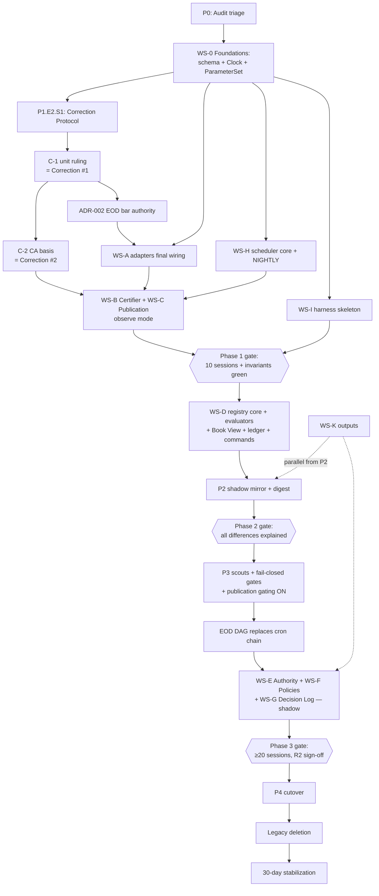

# PLAN-001 — Production Engine v2 Implementation Master Plan

**Status:** ACTIVE — engineering playbook
**Date:** 2026-07-23
**Authority:** Subordinate to `docs/ADR-001-v2-Frozen-Baseline.md` (FROZEN). This plan implements; it does not design. Any conflict between this plan and the ADR is resolved in favor of the ADR.
**Inputs (frozen):** `Audit/PRODUCTION_ENGINE_AUDIT_2026-07-22.md` (evidence), `docs/ADR-001-v2-Frozen-Baseline.md` (architecture).
**Trace convention:** every task carries a trace tag `[§n / AP-n / INV-xx / C-n / H-n / M-n]` pointing at the ADR section, principle, invariant, or audit finding it implements. A task with no trace tag is out of scope by definition.
**Conflict rule:** if implementation reveals an architectural conflict, work stops on that task and an **ADR-candidate** is recorded in §16 of this document (`ADR-CAND-nnn`). The design is never changed in-line (ADR governance clause).

**No code in this document.**

---

## 1. Executive Summary

Production Engine v2 replaces an audited, partially-defective cron-and-scripts trading engine with a three-plane architecture (Data / Decision / Record) built around three canonical objects: **Snapshot Artifact**, **Target**, **Decision Record** [§5]. The architecture is frozen; this plan converts it into an executable program.

The program is organized as **12 workstreams** (WS-0 Foundations through WS-K Outputs) executed across the **five frozen migration phases** of ADR §13 (Phase 0 Audit Triage → Phase 1 Data Plane → Phase 2 Registry Shadow → Phase 3 Unified Pipeline Shadow → Phase 4 Cutover + Deletion). The prompt-suggested phases "Shadow Mode", "Migration", "Cutover", "Cleanup" map into frozen Phases 2–4; the sequence itself is not renegotiable [§13 FROZEN].

**The shape of the program:**

1. **Phase 0** clears the audit's trivial-but-dangerous items (dead jobs, VPIN typo, DB path, date guards) so the legacy engine is a trustworthy comparison baseline.
2. **Phase 1** is the load-bearing phase: schema module, Clock, ParameterSet, the Correction & Supersession Protocol, then the **C-1 unit ruling and C-2 corporate-action basis executed as the first two Corrections under that protocol** — battle-testing it before daily operation depends on it [§7.4]. The publication stage runs in observe mode; the comparison harness (HR5) is built here; **ADR-002 (EOD bar authority) is decided inside this phase** [§15].
3. **Phase 2** stands up the Target Registry in shadow, mirroring legacy watchlists nightly into targets, gated on *explaining* (not reproducing) every divergence [HR4].
4. **Phase 3** activates the full pipeline — fail-closed gates, publication gating, the EOD DAG, Authority + Policies + Decision Log — in shadow parallel to legacy entry paths, for ≥20 sessions.
5. **Phase 4** flips entry authority, **deletes** legacy scan/gate/watchlist code as a tracked deliverable [AN-8], and runs 30 days of heightened monitoring with the harness kept runnable.

**Critical path:** WS-0 → C-1 ruling → ADR-002 → publication observe mode → 10-session Phase-1 gate → Registry shadow → 20-session Phase-3 gate → cutover. Calendar duration is dominated by the two session-count gates (10 + ≥20 trading sessions), which are irreducible by adding effort — parallelize everything else around them.

**Program verdict (§17): YES WITH CONDITIONS** — the conditions are empirical and operational, not architectural, and are enumerated precisely.

---

## 2. Work Breakdown Structure (summary)

Optimal decomposition: the prompt's example workstreams B (Integrity) and C (Snapshot Publication) are kept separate modules but share one delivery stage [§7.3 "one stage, two modules"]; a Foundations workstream (WS-0) is added because Clock, ParameterSet, and the schema module are prerequisites to every other workstream; Outputs (WS-K) is split out because renderers cut across planes [§12].

| WS | Name | Plane | ADR anchor | Complexity | Primary phase(s) |
|---|---|---|---|---|---|
| WS-0 | Foundations (schema module, Clock, ParameterSet, DB identity) | cross | §6.5, §6.6, H-6, H-7 | M | 0–1 |
| WS-A | Data Plane (ingestion adapters, units, corporate actions, universe, calendar) | Data | §7.1, C-1, C-2, H-5, M-4, M-9, M-11, M-12 | L | 1 |
| WS-B | Integrity Layer (Certifier, checks, verdict table) | Data | §7.3, AP-2, AP-3 | M | 1 |
| WS-C | Snapshot Publication (artifact, corpus versioning, supersession, mirror) | Data | §6.1, §7.2, §7.4, INV-A1 | M | 1 |
| WS-D | Target Registry (identity, state machine, events, Book View, ledger, evaluators, scouts, operator commands) | Decision | §8, §10, INV-G1, INV-T2 | XL | 2–3 |
| WS-E | Decision Authority (frame, order of authority, Risk Layer integration) | Decision | §9.1–9.3, AP-5, INV-G2, INV-R1 | L | 3 |
| WS-F | Decision Policies (per-strategy-family wraps of validated logic) | Decision | §9.1, AN-6 | M | 3 |
| WS-G | Decision Log (record schema, INV-D1 enforcement) | Record | §6.3, §9.4, AP-6, AP-7 | M | 3 |
| WS-H | Scheduler (DAG runtime, manifests, resume, watchdog) | cross | §6.4, §11, AP-8, AN-4 | L | 1–3 |
| WS-I | Migration Harness & Shadow Mode (comparison, mirror, classification) | cross | §13, HR4, HR5 | L | 1–3 |
| WS-J | Cutover & Deletion (authority flip, legacy deletion, stabilization) | cross | §13 Phase 4, AN-8 | M | 4 |
| WS-K | Outputs & Reporting (renderers: trade plan, digests, risk/run reports) | Record | §12, AN-10, HR6 | M | 2–4 |

Complexity scale: S (<1 wk-effort), M (1–2 wk), L (2–4 wk), XL (>4 wk). Calendar durations are OPEN per ADR §13 and are additionally floored by the session-count gates.

---

## 3. Implementation Phases — Epics → Stories → Tasks

Phase set is FROZEN [§13]. IDs: `Pp.Ee.Ss.Tt`. Every task is independently reviewable (one PR-sized unit). Task lists are exhaustive for Phases 0–1 (they start immediately) and story-complete with representative tasks for Phases 2–4 (their task decomposition is refined at the preceding phase-exit review — see DoD §13).

### Phase 0 — Audit Triage [§13 Phase 0]

> Purpose: make the **legacy** engine an honest comparison baseline before v2 shadowing. No v2 machinery is built in Phase 0. Rollback: every change is an isolated trivial fix, revertible per-commit.

**P0.E1 — Kill silent no-ops and dead wiring**
- P0.E1.S1 — VPIN gate integrity `[H-8]`
  - T1: fix `_db_connect` NameError; convert except-path to fail-closed skip with alarm `[H-8, AN-5]`
  - T2: regression test: enabled VPIN filter provably blocks a synthetic ticker `[H-8]`
- P0.E1.S2 — Dead jobs/reports decision `[H-1, H-2]`
  - T1: register the risk-bundle + EOD-risk-summary jobs OR delete tiering (explicit decision recorded in commit) `[H-1]`
  - T2: decide `run_foreign_snapshot` fate; register or delete `[H-1]`
  - T3: register-or-delete the three dead report functions `[H-2, AN-8]`
  - T4: grep-audit: zero imported-but-unregistered jobs remain `[AN-8]`

**P0.E2 — Baseline data honesty**
- P0.E2.S1 — Date guards `[M-5, H-3 minimal]`
  - T1: EOD coverage-fallback date guard (`last bar date == trade_date`) `[M-5]`
  - T2: minimal freshness guard in scan loops + monitor (skip + aggregate alert) `[H-3]` — full guard becomes a Certifier check in Phase 1
- P0.E2.S2 — DB identity `[H-7]`
  - T1: `config` resolves absolute `DB_PATH` once; all modules import it; delete per-module fallbacks `[H-7]`
  - T2: startup logs resolved path + file id (pre-figures the Certifier DB-identity check §7.3)
- P0.E2.S3 — Small severities worth the baseline
  - T1: `/metrics` column fix `[L-1]`; T2: delete dead `_parse_args` `[L-3]`; T3: calendar-year-missing alarm `[L-5]`; T4: holiday fail-open note logged `[L-4]`

**Phase 0 exit:** see §15. Everything else from the audit's "this week" list (M-1, M-3, M-9, M-8, M-7, M-6a…) is **deliberately NOT fixed in legacy** — those defects are remediated structurally by v2 workstreams, and fixing them twice both wastes effort and contaminates the shadow-comparison baseline (harness must *explain* them instead [HR4]).

### Phase 1 — Data Plane + Record Scaffolding [§13 Phase 1]

> Purpose: certified, published, versioned market data; all scaffolding (schema, clock, parameters, corrections, harness); ADR-002 decided. Publication in **observe mode**: artifacts published, nothing gated. Rollback: purely additive — disable publication stage; legacy pipeline untouched.

**P1.E1 — Foundations (WS-0)**
- P1.E1.S1 — Single schema/migration module `[H-6, §13]`
  - T1: one idempotent schema module: CREATE + ordered ALTER migration list per table, executed at startup
  - T2: delete the two stale `stockbit_flow` CREATE variants; delete ad-hoc `init_flow_db` `[H-6]`
  - T3: fresh-DB bootstrap test: empty file → full schema → every production INSERT path succeeds `[H-6]`
  - T4: v2 tables DDL (artifact, certificate, target, target_event, decision_record, run_manifest, stage_result, parameter_set, correction, cooldown_ledger, operator_event) — fields per §6, physical DDL OPEN
- P1.E1.S2 — Clock module `[§6.6, HR7]`
  - T1: Clock entity: now/today/is-trading-day/run-window, WIB-fixed, injected, mockable
  - T2: contract test + lint rule: no domain module calls system time `[§6.6]`
  - T3: trading calendar ownership moves under Clock; next-year-December alarm wired `[L-5, §7.3]`
- P1.E1.S3 — ParameterSet store `[§6.5, HR2]`
  - T1: versioned store: create-version command, immutable-once-referenced, version stamped everywhere
  - T2: bootstrap version seeded from today's validated settings (`paper_config`/.env/constants inventoried into one seed list) `[§6.5]`
  - T3: migration shim: legacy code reads via a compat adapter until deletion (avoids two sources of truth)

**P1.E2 — Correction & Supersession Protocol first (WS-C)** `[§7.4, C3, AP-10]`
- P1.E2.S1 — Protocol machinery
  - T1: Correction record `{scope, reason, operator/job, before-summary}`; sole-writer = owning adapter
  - T2: `corpus_version` single-row monotonic counter; bump rules wired to settled-history/CA/universe/calendar mutations `[§6.1]`
  - T3: republication marking: affected trade dates flagged for NIGHTLY republish with lineage `[§7.4]`
  - T4: digest line for superseded dates (consumed by WS-K)
- P1.E2.S2 — **C-1 unit ruling (FIRST DATA TASK — sequencing is a program condition)** `[C-1, §7.1, ADR final condition 1]`
  - T1: empirical protocol per audit: 3 liquid + 3 illiquid tickers, scraper-date vs yfinance-date vs exchange-published volume
  - T2: ruling recorded (one page, in `docs/`); adapter conversion constant parameterized by it
  - T3: historical volume reconciliation executed **as Correction #1** under P1.E2.S1
  - T4: permanent cross-source unit-invariant test (same-day volume ratio ≈ 1) → becomes a Certifier check `[§7.3]`
- P1.E2.S3 — Corporate-action adjusted basis `[C-2, §6.1]`
  - T1: CA-adjusted computation basis for the feature block (raw bars remain raw in corpus; adjustment at feature computation) `[AN-3]`
  - T2: back-adjustment executed **as Correction #2**; `split_pending` detection check `[§7.3]`
  - T3: parity test: adjusted features across a known IDX split produce no fake crash/shock `[C-2]`
- P1.E2.S4 — **ADR-002: EOD bar authority — decided in this phase, not later** `[§15, H-5, ADR final condition 2]`
  - T1: one-page ADR-002 from audit evidence (official/yfinance final vs scraper); names which adapter owns `is_final`
  - T2: adapter finality wiring per the ruling; `INSERT OR REPLACE` authority conflicts removed `[H-5, M-11]`

**P1.E3 — Ingestion adapters (WS-A)** `[§7.1, AP-1, AN-3]`
- P1.E3.S1 — One adapter per source, one writer per table; canonical units converted at boundary only; per-adapter unit tests
- P1.E3.S2 — Adapter hardening: broker-flow upsert + 429 backoff `[M-9]`; today's provisional bars `is_final=0` per ADR-002 `[M-11]`; flow session-window constants fixed with synthetic 16:0x-bar test `[M-1]`
- P1.E3.S3 — Universe & calendar writers: scheduled constituent sync writing membership flags with as-of date `[M-4]`; scheduled discovery; `suspended` distinguished from `delisted` `[M-12]`; feeds the `frozen` flag later (§10)

**P1.E4 — Certifier + Feature Engine + Publication (WS-B, WS-C)** `[§7.3 — one stage, two modules]`
- P1.E4.S1 — Certifier module: each check traceable — unit invariants incl. cross-source ratio `[C-1]`, CA application + `split_pending` `[C-2]`, per-ticker last-bar freshness `[H-3]`, coverage vs universe, schema version, calendar completeness `[L-5]`, DB identity `[H-7]`; thresholds from ParameterSet `[HR2]`; verdict table CERTIFIED/DEGRADED/FAILED `[§7.3 FROZEN]`
- P1.E4.S2 — Feature Engine module: named, tested definitions; reads integrity flags, performs no quality judgment; contract test both directions (Certifier imports no engine code) `[§7.3]`
- P1.E4.S3 — Artifact assembly + publish: content per §6.1 incl. version vector, `artifact_id` content hash, `supersedes`, `kind`; INV-A1 enforced (no UPDATE path exists); serialization format decided (OPEN latitude)
- P1.E4.S4 — Republication determinism: artifact re-derived from corpus + version vector reproduces content hash; mismatch = corpus-integrity alarm `[§6.1 recovery]`
- P1.E4.S5 — Parquet research mirror exported by NIGHTLY `[§7.2, HR3]` — the pre-built ADR-006 seam
- P1.E4.S6 — **Observe mode:** publication runs daily, nothing consumes it for gating yet `[§13 Phase 1]`

**P1.E5 — Scheduler core (WS-H)** `[§11, AP-8]`
- P1.E5.S1 — RunManifest/StageResult per §6.4; sentinel-on-success everywhere `[M-6]`; attempts as rows
- P1.E5.S2 — DAG stage executor: in-process sequential `[AP-12]`, dependency by declared upstream success (never clock inference) `[M-6, §11.2]`, bounded retry+backoff for network stages
- P1.E5.S3 — Resume semantics: skip on verified `(inputs_hash → outputs_hash)`; changed inputs cascade re-execution; **Authority-refusal rule stubbed now, enforced in Phase 3** `[§11.3 FROZEN]`
- P1.E5.S4 — NIGHTLY run assembled first (lowest risk): ingest → universe sync → corrections republication → research export → invariant checker (INV-T2 stub, lineage, book consistency) → forward-test cycle → retention check `[§11.1]`
- P1.E5.S5 — Watchdog extension: per-run-type last-success age; run reports also to local files `[§11.4, HR6-modified]`
- P1.E5.S6 — Holiday precondition via Clock, recorded `skipped(holiday)` `[§11.1, L-4]`

**P1.E6 — Comparison harness (WS-I)** `[HR5, §13]`
- P1.E6.S1 — Harness skeleton: given a trade date, capture legacy outputs (watchlists, plan candidates, gate verdicts) and v2 outputs (artifacts now; targets/decisions later) into comparable normalized records
- P1.E6.S2 — Divergence ledger: every mismatch gets a row `{date, object, field, legacy, v2, classification, explanation, status}` — the Phase 2/3 gate currency `[HR4]`
- P1.E6.S3 — Harness runs from the NIGHTLY DAG (wired, not orphaned) `[AN-8]`

**Phase 1 exit gate [§13 FROZEN]:** 10 sessions of artifacts with operator-confirmed flags; unit invariants green over full history; harness runs. Plus engineering criteria in §15.

### Phase 2 — Registry in Shadow [§13 Phase 2]

> Purpose: Target Registry live and correct without any decision consequence. Rollback: additive — disable mirror + digest; legacy untouched.

**P2.E1 — Registry core (WS-D)**
- P2.E1.S1 — Identity + INV-G1: `(ticker, thesis_type, direction)` live-unique; thesis-type catalog seeded (`reversal_bounce`, `premover_breakout`, `bear_dip_recovery`, `strategy_signal:<name>`, `crash_event:<name>`) `[§8.2 FROZEN]`
- P2.E1.S2 — Four-state machine + events: hybrid status column + append-only sequence-numbered events, transactionally co-written; every state-changing event stamps `artifact_id` + acting module `[§10, §8.7, §6.2]`
- P2.E1.S3 — Transition guards exactly per §10 table incl. same-transaction CANDIDATE pass-through, ARCHIVED reason enum, TTLs from ParameterSet
- P2.E1.S4 — `frozen` flag orthogonal: set/cleared by universe sync (from P1.E3.S3) or operator; pauses TTL + evaluation; POSITIONED+frozen daily risk line `[§10]`
- P2.E1.S5 — INV-T2 checker (status == fold(events)) wired into NIGHTLY `[§6.2, A8]`

**P2.E2 — Evaluator model (WS-D)** `[§8.5 FROZEN, AN-6]`
- P2.E2.S1 — Evaluator registration point: `{evaluator_id, version, params}` refs; param schema validation at admission; pinned versions per target
- P2.E2.S2 — Wrap existing validated strategy checkers as the initial evaluator set (P8 preservation — wrap, don't rewrite)
- P2.E2.S3 — Explicit recorded migration operation for re-pinning targets to new evaluator versions

**P2.E3 — Book View + cooldown ledger (WS-D)** `[§8.4, §8.6 FROZEN]`
- P2.E3.S1 — Derived Book View projection (open position, cooldown_until, frozen, live targets by direction); consumed by Admission (conflict recording); single implementation `[AN-7]`
- P2.E3.S2 — Ticker cooldown ledger; duration from ParameterSet (seeded 3-day) `[§8.6]`
- P2.E3.S3 — Partial unique index backing INV-G2 (enforced by Authority in Phase 3) `[§6.7, M-10]`

**P2.E4 — Operator commands (WS-D)** `[§8.8 FROZEN, AP-11]`
- P2.E4.S1 — Verb set exactly as frozen: `force_archive`, `freeze/unfreeze_ticker`, `pause/resume_entries`, `override_veto` (new superseding-by-reference record), `create_parameter_set_version`, `admit_manual_target`; each emits `OperatorEvent`s
- P2.E4.S2 — CLI + Telegram command exposure; direct-SQL detection note in ops checklist

**P2.E5 — Shadow mirror + digest (WS-I, WS-K)** `[§13 Phase 2]`
- P2.E5.S1 — Nightly mirror: legacy watchlists → target nominations through the real admission path (gates exercise for real; conflicts recorded)
- P2.E5.S2 — Registry Digest published alongside legacy outputs (state changes, expiries, frozen tickers, version lines) `[§12]`
- P2.E5.S3 — Harness extension: legacy watchlist membership vs registry live-target set; divergence ledger classification per §9 of this plan

**Phase 2 exit gate [§13 FROZEN]:** registry **explains all differences** from legacy watchlists — divergences enumerated and justified; legacy bugs not reproduced `[HR4]`. Plus §15.

### Phase 3 — Unified Pipeline, Shadow Decisions [§13 Phase 3]

> Purpose: the full v2 EOD pipeline runs end-to-end daily; decisions recorded in shadow; legacy still owns real entries. Rollback: disable EOD DAG stages; legacy cron chain still present until Phase 4.

**P3.E1 — Scouts extracted (WS-D)** `[§8.3 FROZEN]`
- S1: scout registration point; each legacy candidate source (screener signals, premover, reversal, crash/strategy events) extracted as a stateless pure `(artifact) → nominations` function; per-scout golden tests against recorded artifacts
- S2: scouts read artifacts only — no fetching, no gating, no ranking `[AN-1, AN-3]`

**P3.E2 — Single gate set, fail-closed (WS-D/WS-B)** `[§13, AP-3, AN-5, M-2, H-4]`
- S1: admission gate set live: universe active, liquidity tier (kills H-4 structurally), data quality unflagged, no `split_pending`, conflict recorded
- S2: fail-closed activated for entry paths (missing data / gate exception → blocked + recorded); exits stay fail-open `[AP-3 — implemented once, in verdict table + Authority]`
- S3: expectation-setting deliverable: measured candidate-count drop reported before/after (from harness), so fewer signals is a known outcome, not a surprise

**P3.E3 — Publication gating ON (WS-B/WS-C)** `[AP-2 live]`
- S1: no trading logic reads raw tables — all consumers flipped to artifact reads; grep-audit for raw-table reads in decision-plane modules
- S2: verdict enforcement live: DEGRADED blocks flagged tickers' entries; FAILED blocks globally, exits continue `[§7.3 FROZEN]`

**P3.E4 — EOD DAG replaces the 16:0x cron chain (WS-H)** `[§11.1]`
- S1: EOD run assembled: final flow fetch → EOD finalize → publication → registry maintenance (evaluate→admit, one stage) → ranking → Authority pass → risk report → trade plan → registry digest → run report
- S2: legacy 16:00/16:15/16:30/16:40 jobs unregistered from cron, invoked only as DAG stages or superseded (kills M-7/M-8 structurally)
- S3: PREMARKET run: token/health → overnight ingest → delta digest + risk refresh → report; **no re-evaluation, no second decision pass, no LLM spend** `[§11.1 FROZEN, C8/W6]`
- S4: INTRADAY run: flow ingest → provisional publication (`kind=INTRADAY`) → monitoring/exits → observation logging; **no entry authority** `[§11.1 FROZEN; reversal = ADR-003 only]`

**P3.E5 — Decision Authority + Risk (WS-E)** `[§9 FROZEN]`
- S1: Authority frame: presentation of READY evaluations + TriggerEvents; Book View enforcement (INV-G2, cooldown, frozen, direction precedence incl. broker-confirmed rule §8.2); no setup opinions
- S2: order of authority exactly: deterministic vetoes (Tier A/B preserved) → policy proposal → LLM firm advisory (artifact recorded; degraded ⇒ deterministic fallback + alarm) → Risk verdict → disposition `[§9.2 FROZEN]`
- S3: Risk Layer as independent module: session caps by regime, exposure cap, max_open, DD breaker **extended to mark-to-market** (audit risk-filter gap), blackout/event windows; consulted exactly once per decision; INV-R1 structural (no ENTER row can carry risk-veto) `[§9.3]`
- S4: position creation handoff to existing Position Manager (unchanged kernel); Position references `decision_id` (INV-P1); close appends target event
- S5: Authority-refusal resume rule enforced: rerun reaching Authority with existing records halts, requires operator command `[§11.3 FROZEN]`

**P3.E6 — Decision Policies (WS-F)** `[§9.1 FROZEN]`
- S1: policy registration point (third and last plugin point `[AN-9]`); one policy per strategy family wrapping validated logic (counter-trend levels, edge-based sizing hints)
- S2: policies receive `(target, artifact, features)`, return `{enter|pass, size_intent, levels}`; cannot touch Book View / risk / records (contract test)

**P3.E7 — Decision Log (WS-G)** `[§6.3, §9.4]`
- S1: Decision Record with the frozen field set; sole-writer Authority; append-only, no UPDATE path exists
- S2: INV-D1 live: every presentation yields exactly one same-run record; absence = stuck-state alarm in NIGHTLY checker
- S3: PASS/VETO completeness verified with same field completeness as ENTER (the counterfactual dataset is the point)

**P3.E8 — Shadow decisions + outputs (WS-I, WS-K)**
- S1: Authority runs in shadow parallel to legacy `open_trade` paths — records written, no positions created by v2
- S2: harness extension: per-candidate decision comparison (see Shadow Mode Plan §9)
- S3: output renderers live per §12 (Trade Plan from Decision Records, digests, risk report, run report, post-trade review); every header carries trade date + artifact id/verdict + parameter-set version `[AN-10]`

**Phase 3 exit gate [§13 FROZEN]:** ≥20 sessions with every legacy-vs-shadow divergence explained and signed off (R2 sign-off explicit). Plus §15.

### Phase 4 — Cutover + Deletion [§13 Phase 4]

> Purpose: v2 becomes the sole entry path; legacy code deleted; stabilization. Rollback: legacy kept unwired in-tree for one release [§13].

**P4.E1 — Cutover (WS-J)**
- S1: cutover rehearsal on a non-trading day (checklist §14 executed end-to-end, rolled back)
- S2: authority flip: legacy `open_trade` invocation paths disconnected; Authority sole entry `[AP-5, AN-2]`; INTRADAY/PREMARKET/NIGHTLY confirmed on DAGs
- S3: first-5-sessions daily review ritual (every Decision Record manually reviewed by operator)

**P4.E2 — Deletion (WS-J)** `[AN-8 — explicit deliverable]`
- S1: deletion inventory: every legacy scan/gate/watchlist module listed with its v2 replacement (from §8 migration map) — reviewed before deletion
- S2: legacy scan/gate/watchlist code deleted; imports pruned; tests that tested deleted code deleted with it
- S3: legacy kept unwired in-tree for one release, then removed; compat ParameterSet shim (P1.E1.S3.T3) deleted
- S4: grep-audit: zero unwired capability remains `[AN-8]`

**P4.E3 — Stabilization (WS-J)**
- S1: 30-day heightened monitoring; harness kept runnable `[§13]`
- S2: deferred-ADR trigger watch armed (ADR-003..008 triggers from §15 wired into monitoring where measurable — e.g., writer-contention metric for ADR-006, Telegram-outage detection for ADR-008)
- S3: program retrospective + ADR-candidate list (§16) reviewed and dispositioned

---

## 4. Dependency Graph

### Classification

- **Critical path:** P0 → WS-0 → Correction Protocol → **C-1 ruling** → **ADR-002** → publication observe → **10-session gate** → registry shadow → **Phase-2 gate** → EOD DAG + Authority shadow → **20-session gate** → cutover → deletion. The three gates are calendar-bound (trading sessions), not effort-bound.
- **Parallelizable:** WS-A adapter hardening (M-9/M-11/M-1) alongside Correction Protocol; WS-H scheduler core alongside WS-B/C; WS-I harness alongside everything in P1; WS-K renderers from P2 onward; evaluator wrapping (P2.E2) alongside registry core; policy wraps (P3.E6) alongside Authority frame; risk-layer consolidation (P3.E5.S3) alongside scouts.
- **Blocking tasks (hard blockers):** C-1 ruling blocks adapter conversion constants and all volume-dependent Certifier checks; ADR-002 blocks finality wiring and EOD artifact trust; schema module blocks every v2 table; Correction Protocol blocks C-1/C-2 execution (frozen sequencing); harness blocks all three gates.
- **Optional tasks:** distinct glyph for synthesized firm confidence (audit output note); L-6/L-7/L-8 cosmetics — fold into files touched anyway, else defer to P4.E2 deletion sweep.
- **Deferred ADR tasks (explicitly NOT in this program)** `[§15]`: ADR-003 intraday authority, ADR-004 short book, ADR-005 live execution, ADR-006 DB split, ADR-007 portfolio construction, ADR-008 second channel. Their *seams* are in-scope (artifact export boundary, `size_intent/levels` fields, direction in schema); their *implementations* are out of scope — building any of them is a scope defect.

---

## 5. Critical Path (narrative)

1. **Weeks-effort before the first gate:** WS-0 + Correction Protocol + C-1 + ADR-002 + Certifier/Publication. This is the maximum-parallelism zone — but C-1 and ADR-002 are single-threaded decisions and must land early (they are the program's two named conditions).
2. **Phase-1 gate = 10 trading sessions** of published artifacts with operator-confirmed flags. Start the session counter the day observe-mode publication first runs green; harness and remaining P1 stories complete inside the window.
3. **Phase-2 gate is analysis-bound:** the effort is in the divergence ledger, not the registry code. Budget explicit operator time for explanation/classification.
4. **Phase-3 gate = ≥20 trading sessions** (~1 month calendar). Shadow starts only when the EOD DAG runs the full stage list; partial shadowing does not count toward the 20.
5. **Cutover is a scheduled event**, not a drift: rehearsed, checklisted, dated, with the rollback path tested before the flip.

Minimum calendar floor ≈ 10 + ≥20 trading sessions plus build/analysis time between gates. Durations remain OPEN per ADR; do not commit external dates against session-gated phases.

---

## 6. Workstream Specifications

Format: Purpose / Scope / Deliverables / Dependencies / Risks / Acceptance / Rollback / Complexity / Order.

### WS-0 — Foundations
- **Purpose:** the three cross-cutting entities everything else injects: schema module, Clock, ParameterSet `[§6.5, §6.6, H-6]`.
- **Scope:** DDL for all v2 tables (physical form OPEN); startup migration execution; Clock with calendar ownership; versioned parameter store + bootstrap seed + legacy compat shim. **Out:** any business logic.
- **Deliverables:** schema module; fresh-DB bootstrap test; Clock + lint/contract test; ParameterSet v1 seeded; seed inventory doc.
- **Dependencies:** Phase 0 complete (DB path sane).
- **Risks:** seed inventory misses a hidden constant → v2 behaves differently than legacy for a non-architectural reason (detected by harness, classified as seed defect).
- **Acceptance:** empty DB → full schema → all INSERT paths green; zero direct system-time calls in domain modules; every manifest/record stamps parameter version.
- **Rollback:** additive tables; legacy reads via shim unchanged.
- **Complexity:** M. **Order:** first; blocks all.

### WS-A — Data Plane
- **Purpose:** one adapter per source, one writer per table, canonical units at the boundary, maintained universe/calendar `[§7.1, AP-1, AN-3]`.
- **Scope:** adapters (yfinance, Stockbit flow/tradebook, broker summary, keystats, news, IDX constituents/calendar); C-1 constant; ADR-002 finality wiring; M-9/M-11/M-1 hardening; M-4/M-12 universe writers. **Out:** any feature computation or quality judgment.
- **Deliverables:** adapter set + per-adapter unit tests; C-1 ruling doc + Correction #1; ADR-002 doc; constituent-sync + discovery schedules.
- **Dependencies:** WS-0; Correction Protocol (for C-1/C-2 execution); C-1 before conversion constants **(frozen sequencing — do not reorder for convenience)**.
- **Risks:** C-1 ruling ambiguous across date ranges (see R-01); IDX source instability for constituents; historical reconciliation surprises.
- **Acceptance:** cross-source unit invariant green over full history; single writer per table verified by grep-audit; membership flags have a writer and an as-of date.
- **Rollback:** Corrections are versioned + lineaged — a wrong rebase is corrected by a superseding Correction, never by edit `[§7.4]`.
- **Complexity:** L. **Order:** Phase 1, after Correction Protocol.

### WS-B — Integrity Layer
- **Purpose:** certification as a gate, never merely an alert `[AP-2, §7.3]`.
- **Scope:** Certifier module + check set (each check traceable to an audit finding); verdict table; thresholds from ParameterSet. **Out:** feature computation (WS-C side of the stage); enforcement at decision time (WS-E honors verdicts).
- **Deliverables:** Certifier; per-check unit tests incl. synthetic-defect fixtures (stale bar, missing coverage, split_pending, unit drift, wrong DB); Certifier⊥FeatureEngine contract test.
- **Dependencies:** WS-A (data to certify), WS-0.
- **Risks:** threshold miscalibration → chronic DEGRADED noise (HR2 mitigated by versioned thresholds + report surfacing); check gaps only visible on real bad days.
- **Acceptance:** every audit data-defect class (C-1, C-2, H-3, H-7, M-4, M-5, L-5) has a corresponding failing-fixture test that flips the verdict.
- **Rollback:** observe mode until Phase 3; gating is a flag flip per plane.
- **Complexity:** M. **Order:** Phase 1, with WS-C.

### WS-C — Snapshot Publication
- **Purpose:** immutable versioned artifacts as the only cross-plane interface `[§6.1, §7.2, AP-9]`.
- **Scope:** artifact assembly/serialization; corpus/feature versioning; Correction & Supersession Protocol; republication; retention; parquet mirror. **Out:** DB split (ADR-006 — only the seam).
- **Deliverables:** publication stage; Correction Protocol + its first two real Corrections; republication determinism test; NIGHTLY mirror export; retention parameter (value OPEN, in ParameterSet).
- **Dependencies:** WS-0, WS-A, WS-B.
- **Risks:** artifact size/serialization performance for ~900 tickers (implementation latitude to solve; if it forces a design change → ADR-candidate); hash instability across serialization library versions (pin + determinism test).
- **Acceptance:** INV-A1 unenforceable-by-accident (no update API exists); re-derivation reproduces `artifact_id`; superseded lineage query works; no decision-referenced artifact deletable.
- **Rollback:** superseding artifacts with lineage; never delete/edit.
- **Complexity:** M. **Order:** Phase 1.

### WS-D — Target Registry
- **Purpose:** the Target lifecycle as sole decision-plane state `[§8, §10, AP-4]`.
- **Scope:** identity + INV-G1; state machine + events + INV-T2; evaluator registration + legacy-checker wraps; Book View; cooldown ledger; operator commands; scouts (Phase 3); admission gate set. **Out:** ranking, risk, decisions `[§8.1]`.
- **Deliverables:** registry module (sole writer, API-only access `[AP-11]`); state-machine test suite covering every §10 transition + guard + the frozen fast path; evaluator wraps with golden parity tests vs legacy checkers; Book View + ledger; command CLI/Telegram.
- **Dependencies:** Phase-1 gate (artifacts to evaluate against); WS-0.
- **Risks:** legacy checker wrap parity (largest correctness surface — golden tests mandatory); event/status divergence bugs (bounded by transactional co-write + nightly INV-T2); thesis-type catalog misfits legacy watchlist semantics (catalog is append-open — extend, don't bend identity).
- **Acceptance:** INV-G1 enforced at DB level; every transition reachable only via its §10 guard; fold(events)==status property test; archived targets retained with reasons; rejected nominations recorded.
- **Rollback:** shadow-only in Phase 2 — disable mirror; registry tables inert.
- **Complexity:** XL (largest workstream — split across P2/P3 as planned). **Order:** Phases 2–3.

### WS-E — Decision Authority
- **Purpose:** the single entry authority frame `[§9.1, AP-5]`.
- **Scope:** presentation; Book View enforcement; frozen invocation order; Decision Record writing; position handoff; Authority-refusal resume rule; Risk Layer (pre-trade altitude). **Out:** any setup opinion (policies); exit logic (existing kernel, unchanged).
- **Deliverables:** Authority module; Risk Layer module (consolidating scattered caps/breakers into one place `[§9.3]` incl. mark-to-market DD extension); INV-G2/R1/D1/P1 enforcement + tests; refusal-rule test (rerun with existing records halts).
- **Dependencies:** WS-D (targets, Book View), WS-G (record schema), WS-F (at least one policy), WS-C (artifacts).
- **Risks:** subtle behavior differences vs legacy `open_trade` chain (the shadow phase exists precisely for this); LLM-advisory nondeterminism contaminating shadow comparison (mitigated: advisory recorded as artifact, replayed from record, never re-invoked `[AP-6]`).
- **Acceptance:** INV-R1 structurally untestable-to-violate; exactly one record per presentation per run; direction-precedence rule (broker-confirmed outranks) covered by test; risk consulted exactly once.
- **Rollback:** shadow until Phase 4; the flip is a wiring change, reversible one release.
- **Complexity:** L. **Order:** Phase 3.

### WS-F — Decision Policies
- **Purpose:** strategy content behind the frame `[§9.1]`.
- **Scope:** policy registration point; one policy per live strategy family wrapping validated logic. **Out:** new strategy logic (feature addition — forbidden); RL policies (future versions land here without frame change).
- **Deliverables:** policy interface + registry; wrapped policies with golden parity tests vs legacy proposals; contract test (policy cannot reach Book View/risk/records).
- **Dependencies:** WS-E interface; WS-D evaluator/target shapes.
- **Risks:** legacy entry logic entangled with gating/risk (untangling misclassifies logic → caught by parity + shadow divergences).
- **Acceptance:** each policy pure over `(target, artifact, features)`; versioned; parity green.
- **Rollback:** per-policy version rollback (re-pin).
- **Complexity:** M. **Order:** Phase 3, parallel with WS-E.

### WS-G — Decision Log
- **Purpose:** the selection-bias-free scientific record `[§6.3, §9.4]`.
- **Scope:** record schema (frozen field set, extensible-append only); write path inside Authority transaction; INV-D1 nightly check; join-based outcome linkage. **Out:** any UPDATE path (must not exist).
- **Deliverables:** schema + write path; PASS/VETO field-completeness test; replay fixture set (recorded presentations → expected records).
- **Dependencies:** WS-0; WS-E (writer).
- **Risks:** field-completeness erosion for PASS/VETO under time pressure (explicit acceptance test guards it).
- **Acceptance:** no UPDATE/DELETE code path; every record's version vector complete; `book_state` serialization round-trips.
- **Rollback:** append-only — nothing to roll back; wrong records are superseded-by-reference via `override_veto` semantics `[§8.8]`.
- **Complexity:** M. **Order:** Phase 3 (schema in Phase 1 scaffolding).

### WS-H — Scheduler
- **Purpose:** four named runs as DAGs of idempotent resumable stages `[§11, AP-8]`.
- **Scope:** manifests/stage results; executor; resume semantics incl. Authority refusal; four run definitions; watchdog extension; retention/compaction check. **Out:** any business logic `[AN-4]`; workflow engines `[AP-12]`.
- **Deliverables:** DAG runtime + manifest persistence; NIGHTLY (P1), EOD/PREMARKET/INTRADAY (P3); resume test matrix (crash at each stage boundary × rerun); watchdog per-run-type age checks; file-persisted run reports.
- **Dependencies:** WS-0 (Clock, schema).
- **Risks:** stage granularity mistakes (too coarse → resume useless; too fine → manifest noise) — stage micro-ordering is OPEN latitude, adjust freely; hash-verification cost on large outputs.
- **Acceptance:** kill -9 at any stage boundary → rerun completes without duplicate side effects; changed upstream input cascades; sentinel-on-success everywhere (M-6 class extinct); holiday skip recorded.
- **Rollback:** legacy cron chain remains until Phase 3 EOD flip; DAGs disable per-run.
- **Complexity:** L. **Order:** core in Phase 1; full run set Phase 3.

### WS-I — Migration Harness & Shadow Mode
- **Purpose:** the instrument that makes every gate objective `[HR5, HR4]`.
- **Scope:** capture of legacy + v2 outputs; normalization; divergence ledger; classification workflow; gate reports. **Out:** fixing divergences (owning workstreams do that).
- **Deliverables:** harness (P1: artifacts vs legacy screen data; P2: watchlists vs targets; P3: entries vs Decision Records); divergence ledger with classification states; per-gate summary report.
- **Dependencies:** WS-0; grows with each phase.
- **Risks:** comparison normalization itself buggy → false confidence (mitigate: harness has its own fixture tests; a seeded known-divergence must be detected); anchoring to legacy bugs (mitigate: classification includes `legacy-defect` as a *terminal, sign-off-able* state `[HR4]`).
- **Acceptance:** runs from NIGHTLY DAG; every gate criterion computable from ledger queries; seeded-divergence detection test green.
- **Rollback:** n/a (read-only instrument); kept runnable through Phase-4 stabilization `[§13]`.
- **Complexity:** L. **Order:** skeleton Phase 1; extended each phase.

### WS-J — Cutover & Deletion
- **Purpose:** the flip and the funeral `[§13 Phase 4, AN-8]`.
- **Scope:** rehearsal; authority flip; deletion inventory + execution; stabilization monitoring; deferred-ADR trigger arming. **Out:** any new capability.
- **Deliverables:** rehearsal report; flip change; deletion inventory doc + deletion PRs; 30-day monitoring log; retrospective.
- **Dependencies:** Phase-3 gate signed off.
- **Risks:** deletion removes something still-referenced (inventory review + one-release unwired grace period covers); post-cutover behavior drift without legacy comparator (harness stays runnable — replay-based).
- **Acceptance:** grep-audits: no path to position creation outside Authority `[AN-2]`; no unwired capability `[AN-8]`; legacy modules absent after grace release.
- **Rollback:** documented flip-back procedure, tested in rehearsal; legacy unwired in-tree one release.
- **Complexity:** M. **Order:** Phase 4 only.

### WS-K — Outputs & Reporting
- **Purpose:** renderers only, no logic `[§12]`.
- **Scope:** EOD Trade Plan, Registry Digest, Risk Report, Run Report (+file), Premarket Delta Digest, Post-trade Review; provenance headers `[AN-10]`. Formats OPEN.
- **Deliverables:** renderer per output; header contract test (date + artifact id/verdict + parameter version present); Telegram + file delivery.
- **Dependencies:** the objects they render (WS-C/D/E/G, Risk Layer).
- **Risks:** logic creep into renderers (contract: renderers take records in, emit text, compute nothing — review checklist item).
- **Acceptance:** every output reproducible from persisted records alone (a renderer re-run yields identical content for a past date).
- **Rollback:** cosmetic; per-renderer.
- **Complexity:** M. **Order:** incremental from Phase 2.

---

## 7. Testing Strategy

Global rule: **no implementation is complete without its verification defined and green** (DoD §13). Test categories per ADR-relevant class:

| Category | Definition | Applies to |
|---|---|---|
| Unit | module-local behavior, fixtures | all WS |
| Integration | cross-module through real SQLite | WS-A↔B↔C, D↔E↔G, H over all |
| Regression | audited-defect classes must stay dead (each C/H/M finding → a named test) | WS-A/B/D/E/H |
| Migration | fresh-DB bootstrap; Correction execution; historical rebase verification | WS-0/A/C |
| Replay | recompute from persisted records reproduces outputs (artifact re-derivation → hash; Authority replay → identical verdicts; renderer re-run → identical text) | WS-C/E/G/K |
| Determinism | same artifact + version vector ⇒ same nominations/evaluations/verdicts; LLM advisory replayed from record, never re-invoked `[AP-6]` | WS-D/E/F |
| Recovery | crash-injection at stage boundaries; resume matrix; lost-artifact republication; INV-T2 divergence detection | WS-H/C/D |
| Acceptance | phase-gate criteria computed from harness ledger + invariant checker | per phase |

### Per-workstream matrix (key tests beyond the obvious unit level)

- **WS-0:** migration test (empty→full schema→all INSERTs); Clock contract/lint; ParameterSet immutability-once-referenced test.
- **WS-A:** per-adapter unit conversion tests; cross-source unit invariant over full history (regression for C-1); CA-split parity (regression for C-2); 429-backoff and upsert tests (M-9); finality tests per ADR-002 ruling (M-11/H-5); synthetic 16:0x-bar session-window test (M-1); constituent-sync as-of test (M-4).
- **WS-B:** one failing-fixture per check; verdict-table truth test (CERTIFIED/DEGRADED/FAILED × entries/exits behavior `[§7.3]`); threshold-from-ParameterSet test (HR2); Certifier⊥FeatureEngine contract.
- **WS-C:** INV-A1 (no mutation API); republication determinism (hash reproduce); supersession lineage; retention respects decision references; mirror export parity vs DB artifacts.
- **WS-D:** full §10 transition matrix (every transition, every guard, every actor; illegal transitions rejected); fast-path same-run test; INV-G1 uniqueness; fold(events)==status property test (randomized event sequences); frozen-flag semantics (TTL pause, promotion forbidden); cooldown-blocks-all-theses test; evaluator param-schema validation; golden parity: wrapped evaluator vs legacy checker on recorded data; operator commands emit events, never mutate directly.
- **WS-E:** invocation-order test (frozen §9.2); INV-R1 structural; INV-D1 one-record-per-presentation; INV-G2 + partial index race test (regression for M-10); direction-precedence; degraded-advisory fallback + alarm; refusal-rule (rerun halts); INV-P1 position↔decision linkage.
- **WS-F:** per-policy golden parity vs legacy proposal on ≥20 recorded sessions; purity contract (no Book View/risk/record access).
- **WS-G:** append-only (no UPDATE path); PASS/VETO field completeness; version-vector completeness; replay fixtures.
- **WS-H:** resume matrix (crash × stage × rerun); dependency-not-clock test (upstream failure blocks downstream); sentinel-on-success (failure leaves retryable state — regression for M-6); holiday skip; Authority-refusal integration.
- **WS-I:** harness self-test (seeded known-divergence detected); normalization fixtures; ledger-query gate computations.
- **WS-J:** rehearsal is the test; grep-audit scripts as CI checks (AN-2/AN-8).
- **WS-K:** header contract; renderer replay (identical output from records); no-computation review checklist.

**Legacy test estate:** 1,193 passing tests are an asset. Tests covering logic that *moves as libraries* (exit kernel, strategy checkers, edge scoring) move with it. Tests covering deleted legacy wiring are deleted with it in P4.E2 — deleting them earlier would blind the shadow-phase comparator.

---

## 8. Migration Plan (Strangler expansion)

Legacy remains authoritative until Phase 4 [§13]. Per-component map — **Deletion is an explicit deliverable in every row** (owner: WS-J, executed P4.E2):

| Old component | New component | Dual running | Verification | Cutover | Deletion |
|---|---|---|---|---|---|
| Ad-hoc CREATE TABLE / init_flow_db variants | Schema module (WS-0) | none (P1 immediate) | fresh-DB bootstrap test | P1 | stale CREATEs deleted **in P1** (H-6 fix) |
| `paper_config`/.env/constants | ParameterSet (WS-0) | shim: legacy reads via compat adapter | seed-inventory diff = ∅ | P1 (reads), P4 (shim) | shim + scattered constants, P4.E2 |
| Per-module time/calendar calls | Clock (WS-0) | none | lint + contract test | P1 | direct calls removed as touched; lint enforces |
| Scraper/yfinance dual writes, ambiguous units | Adapters w/ canonical units + ADR-002 finality (WS-A) | P1: both write per new rules | cross-source invariant; reconciliation vs exchange | P1 (Corrections #1/#2) | old write paths deleted in P1; legacy readers P4 |
| Hardcoded constituent lists, manual discovery | Universe sync + discovery schedule (WS-A) | P1–P3 both present | as-of flags vs published IDX lists | P3 (gates read new flags) | hardcoded lists, P4.E2 |
| Coverage *alerts* (pipeline-health jobs) | Certifier verdicts as gates (WS-B) | P1–P2 observe (alert-equivalent) | 10 sessions operator-confirmed flags | P3 (gating ON) | alert-only checks folded/deleted, P4.E2 |
| Raw-table reads by trading logic | Snapshot Artifact reads (WS-C) | P1–P2: raw reads continue; artifacts published | harness: artifact contents vs screen-data equivalents | P3 (AP-2 live; grep-audit) | raw-read code paths, P4.E2 |
| Watchlists (reversal/premover/unified/regime) | Target Registry (WS-D) | P2–P3: nightly mirror both directions visible | Phase-2 gate: all differences explained | P3 (registry feeds pipeline) | watchlist builders/tables, P4.E2 |
| Scattered gate calls (liquidity/fundamental/flow/VPIN…) | Single admission gate set, fail-closed (WS-D/B) | P3 shadow both | per-gate verdict comparison in harness | P3 | scattered gate call sites, P4.E2 |
| Strategy checkers (validated) | Evaluators (wrapped, pinned versions) | P2–P3 | golden parity tests | P2 (wrap ≠ rewrite) | originals remain **as the wrapped library** — only their old call sites deleted, P4.E2 |
| `open_trade` + entry chains (multi-strategy scan, premover EOD, daily scan) | Authority + Policies + Decision Log (WS-E/F/G) | **P3: full shadow ≥20 sessions** | decision-level comparison (§9 below); R2 sign-off | **P4 flip** | entry-chain code, P4.E2 (after one-release unwired grace) |
| Risk checks scattered in scans/entries | Risk Layer, consulted once (WS-E) | P3 shadow | risk-verdict comparison per candidate | P4 | scattered checks, P4.E2 |
| 16:0x cron chain, sentinel-before-work | EOD DAG + manifests (WS-H) | P3: DAG runs; legacy jobs unregistered as superseded | run-report vs legacy-output equivalence | P3 | cron registrations + sentinel logic, P4.E2 |
| Exit kernel + Position Manager | **unchanged** `[§9.3, audited-strong]` | n/a | INV-P1 linkage only | n/a | **not deleted — explicitly preserved** |
| print()-based job logging | manifests + run reports (WS-H/K) | P1–P3 | manifest completeness per run | P3 | ad-hoc prints as modules deleted, P4.E2 |

Rollback per phase [§13 FROZEN]: Phases 1–3 fully additive (disable new stages); Phase 4 keeps legacy unwired in-tree one release, flip-back procedure rehearsed.

---

## 9. Shadow Mode Plan

Two shadow scopes: **Phase 2** (registry vs watchlists) and **Phase 3** (decisions vs legacy entries). One instrument (WS-I), one ledger, one classification scheme.

### 9.1 Comparison metrics
- **P2 — registry:** watchlist-membership overlap per source (legacy list vs live targets of matching thesis_type); state assignment sanity (would-be READY vs legacy "actionable"); admission-rejection reasons distribution; TTL-expiry vs legacy staleness (M-3 class).
- **P3 — decisions, per candidate per session:** presentation parity (candidate reached the Authority ⇔ reached legacy entry evaluation); verdict parity (ENTER/PASS/VETO vs legacy open/skip + reason); gate-verdict vector parity per gate; size_intent & levels deltas (numeric, % terms); risk-verdict parity; timing basis (both computed on the same certified EOD artifact date).
- **Pipeline health:** stage success rates, run durations, INV-D1 zero-miss, artifact verdict distribution.

### 9.2 Tolerance thresholds
Values live in ParameterSet (set at phase start, versioned — HR2 discipline applies to the harness too). Structural tolerances:
- Verdict parity: **exact match required** unless divergence row is classified terminal (below). No numeric tolerance on ENTER/PASS/VETO.
- Levels/sizing: proposed initial tolerance ±1 tick on levels, ±5% on size_intent (legacy rounding differences) — tighter is better; every out-of-tolerance row needs a ledger entry.
- Membership: 100% of asymmetric rows (in-one-not-other) require classification; no percentage waiver.

### 9.3 Mismatch classification (ledger states)
| Class | Meaning | Terminal? | Gate effect |
|---|---|---|---|
| `legacy-defect` | v2 correct; legacy exhibits an audited/newly-found bug (cite finding) | yes, with sign-off | counts as explained `[HR4 — do NOT reproduce]` |
| `v2-defect` | new engine wrong | no — blocker | must be fixed; resets that comparison |
| `basis-difference` | different data basis (e.g., legacy read pre-final bar — M-8 class; artifact used final) | yes, with explanation | explained |
| `seed-difference` | ParameterSet seed ≠ effective legacy constant | no — fix seed or document intent | explained after disposition |
| `nondeterminism` | legacy race/ordering artifact (M-7/M-10 class) | yes, cite mechanism | explained |
| `unexplained` | cause unknown | no — **hard blocker** | gate cannot pass with any row in this state |

### 9.4 Failure handling
- `v2-defect` in shadow: fix forward; the affected comparison stream's session counter is **reset only for the defective comparison class**, not the whole phase, unless the defect implicates decision verdicts (then the ≥20-session counter restarts — decision correctness is the gate's object).
- Harness failure (no comparison for a session): session does not count; investigate before next session.
- Legacy failure during shadow (legacy job dies): recorded; comparison marked `legacy-absent`; does not count toward the 20.

### 9.5 Promotion criteria (Phase 3 → 4)
1. ≥20 consecutive-counted sessions of full-pipeline shadow `[§13 FROZEN]`.
2. Zero `unexplained`; zero open `v2-defect`; all terminal classes signed off (R2 sign-off explicit, recorded in ledger).
3. INV-D1/T2/G1/G2/R1 checkers green every session of the window.
4. PASS/VETO records field-complete throughout.
5. Ops checklists (§10) exercised at least once each (incl. a deliberate resume and one operator command of each verb in a test context).

### 9.6 Rollback triggers (Phase 4, post-flip)
Immediate flip-back (rehearsed procedure) if within stabilization: any position created outside Authority (AN-2 violation — also an incident); INV-R1/D1 checker failure; a FAILED-verdict day where entries were not blocked; Decision Record write failure during a live pass. Investigate-first (pause entries via `pause_entries`, no flip): verdict-distribution anomaly vs shadow-period baseline; artifact publication failure (legacy is not a fallback data path after cutover — the run halts per AP-2).

---

## 10. Operational Readiness

Checklists become files under `docs/ops/` (deliverable P3.E8/P4.E1); summarized here.

**Daily operation:** confirm NIGHTLY/PREMARKET/EOD run reports (file + Telegram) — every stage green or explained; artifact verdict for the day known (CERTIFIED expected; DEGRADED → read flagged list; FAILED → no-entries day, exits live); registry digest reviewed (expiries, frozen, version-change lines); INV checker line green; watchdog silent.

**Deployment:** deploy only between EOD completion and NIGHTLY start; schema migrations run by the schema module on startup (never by hand); code_version stamp visible in next manifest; if feature definitions changed → feature_version bump confirmed; post-deploy: next run's manifest reviewed.

**Rollback (deployment-level):** revert release; startup migration list is append-only so schema rolls forward-compatibly; verify manifest code_version reverted; if artifacts were published by the bad release, supersede via Correction Protocol — never delete.

**Incident response:** classify: data-plane (bad/missing data → the Certifier should have caught it; if not, file check-gap + Correction), decision-plane (wrong verdict → Decision Record has full provenance; replay it), process (run died → resume semantics; Authority-refusal rule if records exist). Operator interventions **only** via command verbs `[AP-11]`; direct SQL is itself an incident.

**Recovery:** DB restore → fresh-bootstrap guarantee (H-6 fix) + republication determinism re-derives artifacts; INV-T2 validates registry; positions reconcile via INV-P1 joins. Lost artifact → republish, hash must match `[§6.1]`.

**Monitoring:** watchdog (external): heartbeat + per-run-type last-success age `[§11.4]`; in-band: stage failures, INV checkers, verdict distribution, DEGRADED-day counts, decision-latency of the EOD pass; ledger growth vs retention check `[HR8]`.

**Audit (periodic):** monthly grep-audits (AN-2 no external position creation; AN-8 no unwired capability; single-writer check); quarterly replay of a random past session (artifact re-derivation + Authority replay + renderer re-run must reproduce records/outputs bit-for-bit).

---

## 11. Risk Register

P/I: L/M/H. Owner roles for a single-operator platform: **Arch** (architecture hat — ADR-candidates, sign-offs), **Eng** (implementation hat), **Ops** (operation hat). Same human, distinct sign-off lanes — a gate sign-off requires explicitly switching hats (write the sign-off note as that role).

| ID | Risk | P | I | Mitigation | Detection | Recovery | Owner |
|---|---|---|---|---|---|---|---|
| R-01 | C-1 ruling ambiguous: unit basis differs across date ranges/sources inconsistently | M | H | audit's 6-ticker protocol; extend sampling across the scraper/yfinance boundary dates before rebasing | cross-source invariant test over full history | rebase executed as Correction — supersede again if wrong `[§7.4]` | Eng |
| R-02 | Historical volume rebase (Correction #1) corrupts research continuity | M | M | before-summary in Correction record; parquet mirror snapshot pre-rebase; research notified via digest | forward-test cycle result shifts unexplainably | superseding Correction restores; lineage preserved | Eng |
| R-03 | ADR-002 drifts past Phase 1 (the ADR's named failure mode) | M | H | scheduled as P1.E2.S4 with the gate blocking on it; one-page scope | phase-exit checklist item | none needed if honored — the point is sequencing | Arch |
| R-04 | Evaluator/policy wraps not parity-faithful to validated legacy logic | M | H | wrap-don't-rewrite rule; golden parity tests on recorded sessions before shadow starts | shadow divergence ledger (`v2-defect` class) | fix forward in shadow; counter rules §9.4 | Eng |
| R-05 | Fail-closed flip collapses candidate flow (signal drought) | H | M | P3.E2.S3 measured-drop report; thresholds in ParameterSet, tunable with versioned trace | candidate counts in run report vs baseline | threshold version change (recorded), never gate bypass `[AN-5]` | Ops |
| R-06 | Shadow anchors to legacy bugs (HR4 inversion) | M | H | classification scheme has `legacy-defect` terminal state; gate wording is *explain*, not match | ledger review at gate | re-classify; Arch sign-off lane | Arch |
| R-07 | 20-session gate stalls on chronic small divergences | M | M | tolerance values in ParameterSet; seed-difference class resolves config noise early (P1 seed inventory) | ledger aging report | disposition backlog weekly; tighten seeds | Ops |
| R-08 | Thinness erosion — helper frameworks creep in (AP-12 is discipline, not mechanism) | M | M | review checklist line: "does this add a moving part?"; AN-9 grep for new plugin points | code review | remove or file ADR-candidate | Arch |
| R-09 | Scope creep: fixing legacy findings twice, or building deferred-ADR features | M | M | Phase-0 explicit not-fixed list; deferred-ADR out-of-scope rule §4 | PR trace tags — task without trace = reject | revert; record ADR-candidate if genuine need | Arch |
| R-10 | Single-operator bandwidth: analysis-bound gates (P2/P3) starve build work | H | M | gates are calendar-gated anyway — schedule ledger review as daily ritual during shadow; keep build off critical path then | ledger disposition lag | extend shadow window (durations OPEN) — never thin the gate | Ops |
| R-11 | SQLite contention emerges before ADR-006 trigger formally met | L | M | artifact reads for research + parquet mirror already offload `[HR3]`; INV-G3 single-writer processes | run-duration + lock-error monitoring | file ADR-006 trigger evidence; do not split ad hoc | Arch |
| R-12 | LLM advisory nondeterminism breaks replay/determinism suite | M | M | advisory recorded as firm_artifact_id, replayed from record `[AP-6]`; degraded ⇒ deterministic fallback | determinism test in CI | fallback path; alarm | Eng |
| R-13 | Cutover discovers a hidden legacy entry path (AN-1 violation pre-existing) | L | H | P4.E2.S1 deletion inventory built by tracing every `open_trade`/INSERT-position call site before the flip | AN-2 grep-audit in CI from P3 | flip-back procedure; add path to inventory | Eng |
| R-14 | Watchdog/Telegram outage during stabilization masks a failure | L | H | file-persisted run reports + external watchdog (HR6-modified); daily-ops checklist reads files, not only Telegram | watchdog last-success age | ADR-008 trigger fires → file it, don't improvise a channel | Ops |
| R-15 | Retention/compaction unset → unbounded growth (HR8) | M | L | NIGHTLY retention check from P1; values in ParameterSet (OPEN) | retention-check stage output | set values; superseded-artifact pruning per §6.1 rules | Ops |

---

## 12. Definition of Done

| Level | Done means |
|---|---|
| **Task** | PR-sized; trace tag present; code + its named tests green; no unwired capability introduced `[AN-8]`; review checklist (thinness, no-logic-in-renderers/scheduler, single-writer) passed |
| **Story** | all tasks done; story-level integration test green; behavior demonstrable against real (or recorded) data; divergence ledger clean of open `v2-defect` rows it caused |
| **Epic** | all stories done; epic's regression class (the audit findings it retires) has named tests; documentation touched (ops checklist / module contract) if operator-facing |
| **Workstream** | acceptance criteria in §6 met; its rows in the migration map (§8) at their target phase state; its test matrix (§7) fully green in CI |
| **Phase** | frozen §13 gate met + engineering exit criteria (§15) met; sign-off recorded per role lane (Eng: tests/criteria; Arch: divergence classifications + any ADR-candidates dispositioned; Ops: checklists exercised); next phase's task decomposition refined |
| **Program** | Phase 4 complete incl. deletion + 30-day stabilization; quarterly-replay audit passes once; all ADR-candidates dispositioned (implemented as superseding ADRs or closed); retrospective written |

---

## 13. Implementation Checklist (rolling, per-phase entry)

Before starting any phase:
- [ ] Previous phase exit criteria (§15) signed off in all three role lanes
- [ ] This phase's stories decomposed to tasks with trace tags
- [ ] ParameterSet version for the phase pinned (tolerances, thresholds)
- [ ] Harness extended for this phase's comparison scope and self-tested
- [ ] Rollback lever for this phase identified and tested (additive-disable or flip-back)
- [ ] No open `unexplained` ledger rows carried across a gate
- [ ] ADR-candidate register (§16) reviewed — none block this phase

Before merging any task:
- [ ] Trace tag valid (§ / AP / INV / finding)
- [ ] Named tests exist and are green
- [ ] Thinness check (no new moving parts) `[AP-12]`
- [ ] No business logic in scheduler/renderer code paths `[AN-4, §12]`
- [ ] Single-writer rule unbroken `[AP-1, INV-G3]`

---

## 14. Go-Live Checklist (Phase 4 flip day)

Rehearsed in full (including rollback) on a non-trading day before execution.

1. [ ] Phase-3 gate sign-off document exists (≥20 sessions, ledger clean, R2 recorded)
2. [ ] Cutover date chosen: after EOD completion, before next NIGHTLY; not a day before a known event window
3. [ ] Backup of DB taken; restore rehearsed within the last 30 days
4. [ ] ParameterSet version frozen for the first live week (no tuning during stabilization week 1)
5. [ ] Flip: legacy entry invocation disconnected; Authority wired as sole entry `[AP-5]`
6. [ ] Grep-audit AN-2 green in CI on the flip commit
7. [ ] Legacy code confirmed unwired-but-present (one-release grace)
8. [ ] Watchdog per-run-type ages reset and confirmed alerting (test fire)
9. [ ] Operator commands smoke-tested live: `pause_entries` → `resume_entries` round-trip
10. [ ] Flip-back procedure printed (literally accessible without the system working)
11. [ ] Next session: every Decision Record manually reviewed (first-5-sessions ritual)
12. [ ] Rollback triggers (§9.6) posted where the operator will see them
13. [ ] Stabilization calendar: 30-day heightened monitoring scheduled; harness runnable confirmed
14. [ ] Deletion inventory approved and dated (deletion begins only after first clean week)

---

## 15. Phase Exit Criteria

Frozen gate first [§13], then engineering criteria added by this plan (additive only — a plan may strengthen a gate, never weaken it).

**Phase 0 exit:**
- All P0 tasks merged; zero imported-but-unregistered jobs `[H-1/H-2/AN-8]`; VPIN filter provably blocks `[H-8]`; absolute DB path everywhere `[H-7]`; date guards live `[M-5/H-3-min]`
- Legacy baseline declared: a dated statement that legacy outputs are now honest enough to compare against

**Phase 1 exit:**
- FROZEN: 10 sessions of artifacts with operator-confirmed flags; unit invariants green over full history; harness runs
- C-1 ruling documented; Corrections #1 and #2 executed **under the protocol** (order verified from Correction records)
- ADR-002 decided and wired (hard blocker — R-03)
- Fresh-DB bootstrap test green; Clock lint clean; ParameterSet seed inventory diff ∅
- NIGHTLY on the DAG with resume test matrix green; sentinel-on-success verified
- Certifier: every check has a failing-fixture test; verdict truth table test green

**Phase 2 exit:**
- FROZEN: registry explains all differences from legacy watchlists (enumerated, justified; legacy bugs not reproduced)
- Ledger: zero `unexplained`, zero open `v2-defect`; all terminal classifications signed (Arch lane)
- INV-G1 + INV-T2 green nightly across the shadow window; full §10 transition test matrix green
- Evaluator golden parity green; all operator verbs exercised at least once in test context

**Phase 3 exit:**
- FROZEN: ≥20 sessions, every legacy-vs-shadow divergence explained and signed off (R2 explicit)
- Promotion criteria §9.5 all met (invariant checkers green throughout; PASS/VETO completeness; ops checklists exercised)
- AP-2 verified: grep-audit zero raw-table reads in decision plane; AN-2 grep-audit in CI
- EOD/PREMARKET/INTRADAY on DAGs; legacy cron chain empty of superseded jobs
- Authority-refusal rule demonstrated (deliberate rerun test)

**Phase 4 exit (= program end):**
- Go-live checklist executed; 30 days stabilization complete with zero rollback-trigger events (or each dispositioned)
- Deletion inventory fully executed after grace release; AN-8 grep-audit green
- Quarterly-replay audit passed once post-cutover
- Retrospective + ADR-candidate dispositions filed

---

## 16. ADR-Candidate Register (conflict escape valve)

Per program rules: implementation conflicts with the frozen architecture are recorded here, never resolved by in-line redesign. Format: `ADR-CAND-nnn — {conflict, ADR section implicated, evidence, proposed disposition}`. A candidate blocks only the tasks that physically cannot proceed; everything else continues.

*Empty at program start. The Deferred ADR list (ADR §15: ADR-002…008) is separate — those are scheduled or trigger-armed, not conflicts.*

---

## 17. Final Answer

**Is this implementation plan sufficient for engineering execution without further architectural work?**

## YES WITH CONDITIONS

No architectural work remains — the ADR froze every structural decision, and every task above traces to a frozen section or an audit finding. The conditions are the same class the ADR itself identified: empirical facts and operational values the architecture deliberately left outside itself. Precisely:

1. **Sequencing condition (inherited, ADR final condition 1):** the C-1 unit ruling (P1.E2.S2) executes against the production database **before** any adapter conversion constant is finalized, and **as Correction #1 under the Supersession Protocol** — the ordering P1.E1 → P1.E2.S1 → P1.E2.S2 is not reorderable for convenience. This plan enforces it structurally (protocol is a dependency of the ruling's execution), but it remains a condition because it is honored by discipline, not mechanism.
2. **Decision condition (inherited, ADR final condition 2):** ADR-002 (EOD bar authority) is decided inside Phase 1 (P1.E2.S4). It is a Phase-1 exit blocker in §15; if it slips, the phase does not exit. Risk R-03 tracks it.
3. **Seed condition (new, operational):** the ParameterSet bootstrap inventory (P1.E1.S3.T2) must be *complete* — every effective legacy constant (`paper_config`, .env, in-code constants, the 3-day cooldown, gate thresholds, ADV floors) enumerated before the Phase-1 gate. An incomplete seed silently manufactures shadow divergences (R-07) and can invalidate the 20-session window. This is inventory work, not design work.
4. **Tolerance condition (new, operational):** shadow-mode tolerance values (§9.2) and mismatch-classification sign-off discipline must be fixed in a ParameterSet version **at the start** of Phase 2 and Phase 3 respectively — moving tolerances mid-window voids the gate. Values are OPEN latitude; freezing them per-window is the condition.

**What is still missing is exactly and only:** the C-1 empirical ruling (minutes of work against the production DB, per the audit protocol), the ADR-002 one-page decision (evidence already in the audit), the completed parameter seed inventory, and the per-window tolerance values. None is architectural; all are scheduled inside Phase 1 or at phase starts. When conditions 1–2 land (end of Phase 1), this answer converts to an unqualified **YES** — matching the ADR's own convertibility clause.

---

*Companion documents: `ADR-001-v2-Frozen-Baseline.md` (authority), `PRODUCTION_ENGINE_AUDIT_2026-07-22.md` (evidence). This plan contains no code and modifies no schema or data.*

---

## 18. Changelog (living — task decomposition & ADR-candidate register only, EXEC-001 §7/§13)

Dated, append-only. Entries record changes routed through EXEC-001 §7 Change Control as "task decomposition refinement, task addition/split within a phase's frozen scope" — never phase scope/sequence/gate changes (those require Arch-lane escalation, not a plan update).

- **2026-07-23 — Added P0.E0 (Protocol bring-up).** EXEC-001 §15/§17 condition 2 require the pre-merge gate script operational, and the EXEC-001/PLAN-001/ADR-001-v2/Audit documents committed together, before any P0.E1/P0.E2 task starts. This was undocumented as a task, so it is added here via change control:
  - **P0.E0.S1.T1** — commit the four constitutional documents (+ the ADR decision-trail documents that produced the frozen baseline) together; verify authority chain. Evidence: `docs/evidence/P0/P0.E0.S1.T1/`.
  - **P0.E0.S2.T1** — bring-up scaffolding: `docs/EXEC-DECISIONS.md`, `docs/EXEC-STATUS.md`, `docs/ops/MIGRATIONS.md` + the seven §10 ops checklists, `docs/evidence/P0/` skeleton incl. 14 P0.E1/P0.E2 task cards, and `scripts/pre_merge_gate.py` (the one tooling deliverable EXEC-001 §15 adds). Evidence: `docs/evidence/P0/P0.E0.S2.T1/`.

  Neither task touches a FROZEN surface (ADR §14) or changes phase scope/sequence/gate criteria — pure process/tooling bring-up, hence routed as a plan update, not an ADR-candidate.

- **2026-07-26 — Added P0.E1.S2.T5 (payoff task for DEBT-001/DEBT-002).** P0.E1.S2.T3's cold review found `auto_trade_status_report` (registered by T3) has two content-accuracy defects pre-dating T3, newly consequential now that the function actually runs: (a) its query selects every `paper_trades` row in the window, not only rows `run_premover_eod`'s auto-trade path opened — mislabeling risk under its "🤖 Auto-Trade Status" header; (b) it mixes `datetime.now(WIB)` and bare `datetime.now()` for what should be one reference "today", inconsistent with the rest of `scheduler/reports.py`. Filed as `DEBT-001`/`DEBT-002` (`docs/EXEC-DECISIONS.md`); this entry supplies the payoff task ID both require per EXEC-001 §8 ("debt with no payoff task is rejected at review"). Same story (P0.E1.S2 — Dead jobs/reports decision) as T3, since it is a direct extension of that story's own investigation, not new-phase scope:
  - **P0.E1.S2.T5** — scope `auto_trade_status_report`'s query to auto-trade-originated `paper_trades` rows via a join against the existing `premover_auto_log` table (no schema change needed — that table already records ticker/date/mode/would_trade per evaluation); fix the `yesterday` computation to use `datetime.now(WIB)` consistently. Evidence: `docs/evidence/P0/P0.E1.S2.T5/`.

  Trivial-complexity content fix on legacy code already in this story's file, discovered while executing this story's own audit item — not a new phase, not a FROZEN-surface change, hence a plan update rather than an ADR-candidate.

- **2026-07-26 — Added P0.E1.S2.T6 (new AN-8 finding from T4's repository audit).** `P0.E1.S2.T4`'s general grep-audit (`scripts/audits/an8_unregistered_jobs.py`) found `run_vpin_backfill` (`scheduler/jobs.py:894`) — fully implemented, imported into `scheduler/__init__.py` since VPIN batch work landed, referenced nowhere else in the entire repository (not `add_job`-ed, no route, no CLI entry point, no test) — the exact H-1/H-2 unwired-capability class, previously unnamed by the Audit. T4's scope is audit-and-document, not disposition (per its own instructions); this entry supplies the follow-up task and, per the audit script's own `ALLOWLIST` mechanism, is cited so the gate does not fail on a documented, already-tracked finding while it awaits disposition. Same story as T1–T3/T5 (P0.E1.S2 — Dead jobs/reports decision), since it is the same defect class discovered mid-story, not new-phase scope:
  - **P0.E1.S2.T6** — decide `run_vpin_backfill`'s fate (register on a schedule, or delete) using the same register-or-delete methodology as T1–T3; update `scripts/audits/an8_unregistered_jobs.py`'s `ALLOWLIST` to remove the citation once dispositioned. Evidence: `docs/evidence/P0/P0.E1.S2.T6/`.

  Not a FROZEN-surface change; a legacy scheduler function's disposition, same as T1–T3 — plan update, not an ADR-candidate.

- **2026-07-30 — P0.E1.S2.T5 implemented on branch `p0/e1-s2-t5-auto-trade-scope`.** `auto_trade_status_report`'s query scoped via an `EXISTS` join against `premover_auto_log` (`mode='enforce'`, `would_trade=1`) exactly as proposed when the task was added; `yesterday` now uses `datetime.now(WIB)`. 5 new named tests (`tests/test_auto_trade_status_report.py`), each confirmed to fail against the pre-fix code and pass after. Full suite 1,241 passed/1 skipped/0 failed (+5 from baseline 1,236). Gate green. `DEBT-001`/`DEBT-002` close on merge, not before. Evidence bundle complete; awaiting cold review + merge (EXEC-001 §4).

