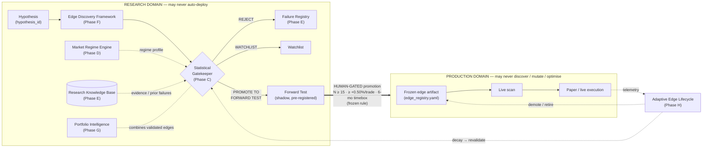
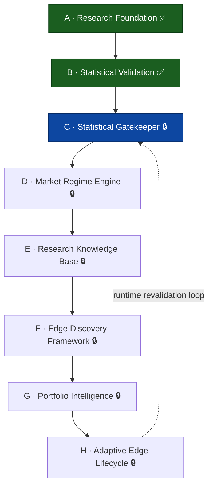

# Research Master Plan — v2

# 🔒 ARCHITECTURE BASELINE — FROZEN

**Freeze status:** FROZEN — permanent architectural baseline for all future research work.
**Frozen:** 2026-07-12
**Branch of record:** `ops/hardening-2026-07-10`
**Current institutional verdict:** GO WITH CONDITIONS (score ≈ 7.3 / 10).
**Supersedes:** the implicit roadmap previously spread across
`Audit/REMEDIATION_PLAN.md`, `Audit/RESEARCH_ENGINE_AUDIT_2026-07-11.md`, and the
Phase A / Phase B enhancement reports.

> **What "FROZEN" means.** The roadmap (Phases A–H), the dependency chain, the
> architecture invariants, and the non-goals below are the **permanent baseline**.
> They are not re-opened by ordinary work. The roadmap is **not redesigned**, **no
> phase is added**, and **no phase is removed**. Implementation of any phase must
> conform to this baseline; a deviation requires an explicit, documented amendment
> to this file — not a silent divergence in code.
>
> **This freeze is design only.** No implementation, no code changes, no
> configuration changes, no Phase C work. Phase C is **not** started. Production
> execution is out of scope and must remain unchanged.

---

## 1. Why this baseline exists

The first two phases of the research-engine hardening effort are **complete and
committed**. Their completion changes the roadmap's centre of gravity: the engine
has moved from *"can we trust a single backtest number?"* (Phase A) and *"can we
quantify and audit that number?"* (Phase B) to the real institutional question —
*"how does any strategy, existing or newly discovered, earn its way toward
capital, and how do we keep it honest for its whole life?"*

That question decomposes into six forward phases (C–H). The organising principle is
unchanged from the owner's original ordering — **correctness → trust → stability →
alpha** — now extended into **a permanent promotion gate, a regime model, a
knowledge base, automated discovery, portfolio construction, and a lifecycle loop.**
This document freezes that decomposition as the baseline.

---

## 2. Roadmap at a glance

| Phase | Name | Purpose (one line) | Status |
|---|---|---|---|
| **A** | Research Foundation | Make per-ticker backtest output trustworthy & reproducible | ✅ **Completed** |
| **B** | Statistical Validation & Audit Resolution | Quantify uncertainty; resolve the audit register | ✅ **Completed** |
| **C** | Statistical Gatekeeper | One mandatory statistical promotion gate for every strategy | 🔒 Frozen — **not started** |
| **D** | Market Regime Engine | Determine under which regimes an edge exists; every strategy gets a regime profile | 🔒 Frozen — planned |
| **E** | Research Knowledge Base | Preserve every experiment — no orphans, no lost failures | 🔒 Frozen — planned |
| **F** | Edge Discovery Framework | Automatically generate candidate strategies | 🔒 Frozen — planned |
| **G** | Portfolio Intelligence | Research combinations of multiple validated edges | 🔒 Frozen — planned |
| **H** | Adaptive Edge Lifecycle | Continuously monitor edge quality; promote / demote / retire / recover | 🔒 Frozen — planned |

**Legend:** ✅ done & committed · 🔒 baseline frozen (C is the next design target; C–H not started).

---

## 3. Architecture — the two domains and the one-way boundary

The entire plan is built on a single invariant: **research proposes, humans
promote, production executes.** Discovery, mutation, optimisation and statistical
validation live *only* in the research domain. Production consumes *frozen,
approved* edge artifacts and never generates them.

**Reading the diagram.** Everything left of the heavy arrow is research. The heavy
arrow is the *only* path from research to production, and it is **human-gated** by
the frozen forward-test promotion rule. The dashed arrows back from production
(telemetry → lifecycle → revalidation) are how a live edge stays honest — but they
re-enter through the **same** gate (Phase C), never around it.

---

## 4. Dependency chain (frozen)

The canonical execution order is strictly linear. Each phase's **primary
predecessor** is the phase immediately above it; no phase may begin before its
predecessor's completion criteria are met and verified.

**Confirmed:** `A ↓ B ↓ C ↓ D ↓ E ↓ F ↓ G ↓ H`. The only arrow that returns
upward (H → C) is a **runtime** revalidation data-flow, not a build-order
dependency — it does not let any phase begin before its predecessors, so the
build order remains acyclic.

**Reconciliation of the earlier C↔D coupling.** The v2 design note described a
"two-way coupling" between C and D. Under the freeze this is resolved to a strict
ordering: the **hard, blocking dependency is C → D**. C ships first using the
existing 3-class regime as an *interim* taxonomy; D later formalises the regime
engine, and C *consumes* that richer taxonomy as a **non-blocking refinement**.
The refinement does not reverse execution order and does not let D precede C.

---

## 5. Phase descriptions (each with the seven frozen fields)

Every phase is specified with the same seven fields: **Objective · Prerequisites ·
Inputs · Outputs · Dependencies · Completion criteria · Non-goals.** For the two
completed phases, the fields are stated in the past tense with delivered evidence.

### Phase A — Research Foundation ✅ Completed

- **Objective:** make per-ticker backtest output trustworthy and reproducible.
- **Prerequisites:** the 2026-07-11 Research Engine audit (findings R-1…R-4).
- **Inputs:** raw corpus (`ohlcv`, `corporate_actions`), existing walk-forward /
  backtest stack, the `routes/` boundary surface.
- **Outputs (delivered):** `data/adjustments.py` (gap-verified corporate-action
  guard — validated no-op on current corpus); CI-enforced production/research
  boundary tests scoped to `routes/`; canonical-delegating optimizer (look-ahead
  relic removed, parity test); append-only `research_runs` ledger + dataset
  fingerprint + `run_id` (`research/tracking.py`).
- **Dependencies:** none (root phase).
- **Completion criteria (met):** R-1…R-4 CLOSED; per-ticker expectancy trustworthy
  and reproducible; verdict RESEARCH READY (5.9) → GO WITH CONDITIONS (≈7.0);
  baseline suite 1,371 passing.
- **Non-goals:** modifying production execution; uncertainty quantification (that is
  Phase B); physical DB separation (R-5).

### Phase B — Statistical Validation & Audit Resolution ✅ Completed

- **Objective:** quantify uncertainty on promoted claims and resolve the audit register.
- **Prerequisites:** Phase A complete (trustworthy per-ticker output to analyse).
- **Inputs:** the Phase A corpus + tracking spine; the NR7 flagship claim; the
  remaining audit findings (R-5, R-6, R-7, R-9, R-10, R-11).
- **Outputs (delivered):** `research/statistics.py` — bootstrap CI, one-sided
  tests, Benjamini-Hochberg + Bonferroni multiplicity, PSR, DSR (17 deterministic
  tests); the NR7 evidence set (BULL 95% CI [+0.32%, +2.06%], p_adj 0.011, PSR
  99.6%); roller-cron fix (124 → 12 fires/yr); dead package deleted.
- **Dependencies:** A.
- **Completion criteria (met):** statistical tooling shipped, tested, exercised on
  the live claim; 7/10 findings CLOSED (R-1,2,3,4,6,9,11); 3 KEEP-OPEN with
  evidence (R-5,7,10); verdict ≈7.3; suite 1,388 passing.
- **Non-goals:** changing production; building the permanent gate (Phase C);
  physical DB split (R-5); parallel-sweep wiring (R-7); registry lifecycle states
  (R-10). The 42-cell DSR here is an **explicitly temporary proxy** (see §8).

---

### Phase C — Statistical Gatekeeper 🔒 *next design target — not started*

- **Objective:** one **mandatory** statistical promotion gate that every strategy —
  existing or newly discovered — must pass before it may be promoted to a forward
  test. No side door. The gate's most permissive verdict is only *"eligible to
  forward-test"*; it makes **no** production-deployment decision.
- **Prerequisites:** Phase B complete (`research/statistics.py` available).
- **Inputs:** a strategy's full trade set; per-regime cell breakdown; the complete
  family of cells/parameters the claim was mined from; the frozen forward-test rule.
- **Outputs:** a single verdict per strategy — **`REJECT` · `WATCHLIST` · `PROMOTE
  TO FORWARD TEST`** — plus the evidence bundle (CIs, adjusted p-values, PSR/DSR,
  WF and OOS results) that justifies it, written to the Knowledge Base (Phase E).
- **Gate criteria (all mandatory):**
  - Minimum sample requirements (N-floor per strategy and per regime cell).
  - Confidence-interval validation — the CI **lower bound** is tested against the
    promotion bar, not the point estimate.
  - Multiple-testing correction — BH + Bonferroni across the **full** family.
  - Deflated Sharpe Ratio — computed from the **complete distribution of actual
    scan Sharpes** (the institutional replacement for the Phase B proxy; see §8).
  - PSR — Probabilistic Sharpe Ratio paired with the Sharpe estimate.
  - Walk-forward validation — the pooled, cost-inclusive, survivorship-handled WF
    (~16 OOS windows) as a gate input.
  - Out-of-sample validation — a held-out segment distinct from the WF windows.
  - Forward-testing requirement — PROMOTE means *promote to a pre-registered
    forward test* under the frozen rule (N ≥ 15, ≥ +0.50%/trade, 6-mo timebox).
- **Dependencies:** B. (Consumes D's regime taxonomy as a non-blocking refinement.)
- **Completion criteria:** every roster strategy and every future candidate routes
  through the gate; the gate is deterministic and reproducible; it emits only the
  three states; the Phase B 42-cell DSR **proxy is retired** for the real figure;
  no statistical shortcut remains downstream of the gate.
- **Non-goals:** production deployment decisions; parameter optimisation; strategy
  discovery; any promotion path that bypasses the gate.

### Phase D — Market Regime Engine 🔒 Planned — not started

- **Objective:** determine **under which market regimes an edge exists**, and attach
  a required **regime profile to every strategy**.
- **Prerequisites:** Phase C gate exists (per-cell claims are validated, not raw).
- **Inputs:** price/liquidity history; the existing 3-class regime classifier; the
  14×3 regime-edge scan; per-cell statistical evidence from C.
- **Outputs:** a formal regime taxonomy — **Bull / Bear / Sideways × High/Low
  Volatility × High/Low Liquidity + regime-transition detection** — and a queryable
  regime profile per strategy stating where its edge is present, absent, or reversed.
- **Dependencies:** C.
- **Completion criteria:** the taxonomy is the canonical input to C's multiplicity
  correction; every roster strategy carries a regime profile with attached evidence;
  transition states are detected, not only steady-state labels.
- **Non-goals:** replacing the gate's statistics; making promotion decisions;
  changing production regime usage.

### Phase E — Research Knowledge Base 🔒 Planned — not started

- **Objective:** **preserve every research experiment** — no orphans, no lost
  failures. Negative results are first-class evidence.
- **Prerequisites:** Phase C emitting decisions worth archiving; Phase A's
  `research_runs` spine.
- **Inputs:** every research run; every C verdict and its evidence bundle; every
  hypothesis.
- **Outputs:** **Hypothesis Library · Experiment Registry · Failure Registry ·
  Validation Archive · Evidence Archive.** Every experiment records `hypothesis_id`,
  rationale, dataset fingerprint, config hash, commit hash, statistical evidence,
  conclusion, and rejection reason.
- **Dependencies:** A (ledger), C (decisions), D (regime context).
- **Completion criteria:** every experiment is traceable end-to-end; every rejection
  is documented and preserved; the Failure Registry is queryable by Phase F. **No
  orphan experiments.**
- **Non-goals:** deleting or mutating history (append-only); making promotion
  decisions; storing production execution data.

### Phase F — Edge Discovery Framework 🔒 Planned — not started

- **Objective:** **automatically generate candidate strategies** (design of the
  machinery; not a mandate to run unattended).
- **Prerequisites:** C (gate), D (regime profiles), E (knowledge base) all present.
- **Inputs:** the Feature Library primitives; existing validated edges (for
  mutation); the Failure Registry (to avoid re-mining dead hypotheses).
- **Outputs:** **Feature Library · Strategy Generator · Mutation Engine · Candidate
  Validator · Promotion Pipeline** — with every candidate routed through the Phase C
  gate and survivors queued for forward test.
- **Dependencies:** C, D, E.
- **Completion criteria:** candidates flow generator → validator (C) → forward-test
  queue, fully tracked in E; **zero** side channels to production.
- **Non-goals:** direct production promotion; bypassing C; deploying automatically.

### Phase G — Portfolio Intelligence 🔒 Planned — not started

- **Objective:** research **combinations** of multiple validated edges.
- **Prerequisites:** ≥ 2 edges through the C gate (typically post-F); D regime
  profiles available.
- **Inputs:** validated-edge return streams; regime profiles; capital/risk constraints.
- **Outputs:** **correlation analysis** (incl. regime-conditional), **capital
  allocation research**, **risk budgeting**, and **portfolio robustness** evidence
  for the validated-edge set.
- **Dependencies:** C, D, F.
- **Completion criteria:** a research artifact describing correlation, allocation,
  and risk budget for the validated set, with robustness/stress evidence.
- **Non-goals:** live allocation decisions; deploying a portfolio automatically;
  discovering new edges (that is F).

### Phase H — Adaptive Edge Lifecycle 🔒 Planned — not started

- **Objective:** **continuously monitor edge quality** and manage each edge across
  its whole life.
- **Prerequisites:** C (revalidation gate), E (evidence archive), and enforced
  registry lifecycle states (open item **R-10**).
- **Inputs:** production telemetry (paper/live results); each edge's validated
  regime profile; the forward-test GO/NO-GO machinery and the backtest roller.
- **Outputs:** **edge-decay detection · revalidation (through the Phase C gate) ·
  promotion · demotion · retirement · recovery** — each an evidence-gated state
  transition recorded in E.
- **Dependencies:** C, D, E, and R-10.
- **Completion criteria:** every promoted edge has an automated decay watch;
  demotion / retirement / recovery are evidence-gated transitions; revalidation
  always re-enters through C, never around it.
- **Non-goals:** deploying or de-deploying automatically without the human-gated
  boundary; bypassing C on revalidation; discovering new edges.

---

## 6. Deliverable — Dependency matrix

Read across a row: what the phase **hard-depends on** (must be complete first), its
**primary predecessor** in the linear chain, and what it **feeds**. Every hard
dependency precedes its phase in the chain — **no phase bypasses a declared
dependency, and no phase depends on a successor.**

| Phase | Hard dependencies | Primary predecessor | Feeds | Bypass check |
|---|---|---|---|---|
| **A** | — | — | B, E | ✅ root |
| **B** | A | A | C | ✅ dep precedes |
| **C** | B | B | D, E, F, G, H | ✅ dep precedes |
| **D** | C | C | E, F, G, H | ✅ dep precedes |
| **E** | A, C, D | D | F, H | ✅ all precede E |
| **F** | C, D, E | E | G | ✅ all precede F |
| **G** | C, D, F | F | H | ✅ all precede G |
| **H** | C, D, E, R-10 | G | C (runtime revalidation only) | ✅ all precede H; H→C is runtime, not build |

**No-bypass conclusion:** the frozen chain `A→B→C→D→E→F→G→H` is acyclic in build
order; the single upward edge (H→C) is a runtime revalidation loop and does not
violate the ordering.

---

## 7. Deliverable — Phase completion checklist

A phase is **not** complete until every box is checked and verified.

**Applies to every phase (generic gate):**
- [ ] Objective met and demonstrated with evidence.
- [ ] All hard dependencies verified complete (per §6).
- [ ] Declared outputs produced and recorded in the Knowledge Base (once E exists).
- [ ] Completion criteria met and independently verifiable.
- [ ] Non-goals respected (no scope creep into a later phase).
- [ ] Reproducibility contract satisfied (§10): seed, fingerprint, commit, run_id.
- [ ] No architecture invariant (§9) weakened.
- [ ] Test suite green; no production behaviour changed unless explicitly authorised.

**Per-phase status:**
- [x] **A — Research Foundation** — R-1…R-4 CLOSED; suite 1,371; verdict ≈7.0.
- [x] **B — Statistical Validation & Audit Resolution** — 7/10 CLOSED; suite 1,388; verdict ≈7.3.
- [ ] **C — Statistical Gatekeeper** — gate emits only REJECT/WATCHLIST/PROMOTE; DSR proxy retired; no downstream shortcut. *(not started)*
- [ ] **D — Market Regime Engine** — full taxonomy + per-strategy regime profile. *(not started)*
- [ ] **E — Research Knowledge Base** — five registries; no orphan experiments. *(not started)*
- [ ] **F — Edge Discovery Framework** — every candidate through C; zero prod side channels. *(not started)*
- [ ] **G — Portfolio Intelligence** — correlation/allocation/risk-budget/robustness artifact. *(not started)*
- [ ] **H — Adaptive Edge Lifecycle** — decay watch + evidence-gated transitions via C. *(not started; needs R-10)*

---

## 8. Deliverable — Statistical validation (Phase C replaces the Phase B proxy)

**Documented for the record, per the freeze mandate:**

1. **The Phase B 42-cell DSR proxy was sufficient for audit purposes.** In Phase B,
   the Deflated Sharpe for the full 42-cell regime family used an `sr_trials_std`
   **estimated from only the 3 NR7 regime cells**. This proxy was adequate to
   answer the audit's question — *does the NR7 Sharpe case survive full
   multiplicity?* — and its answer (DSR collapses toward 0 under the full family)
   is directionally trustworthy and decision-relevant.

2. **The institutional implementation (Phase C) will compute the Deflated Sharpe
   using the complete distribution of the actual scan Sharpes** — the real Sharpe
   of every cell in the scan family, not a 3-cell estimate. This retires the proxy
   in favour of an exact figure.

3. **No statistical shortcuts remain after Phase C.** Once the gate is in place, the
   proxy is removed; every promotion-relevant claim carries a bootstrap CI (lower
   bound tested), full-family BH/Bonferroni correction, PSR, and an exact DSR from
   the real scan distribution — plus WF, OOS, and a pre-registered forward test.
   The proxy is a Phase-B-only artifact and must not persist into a promotion path.

---

## 9. Deliverable — Architecture invariants

Non-negotiable rules that constrain every phase. Status column is **honest about
present enforcement**: `ENFORCED` = true today; `MANDATED (pending X)` = required by
the baseline but not yet fully enforced, with the open item that closes the gap.

| # | Invariant | Status | Enforcement / gap |
|---|---|---|---|
| 1 | Research and Production are **separated** | ⚠️ **MANDATED (pending R-5)** | Logically separated + CI-enforced import boundary (R-2) today; **physical** DB split is open (R-5 — 14 prod readers share one SQLite). |
| 2 | Production **never discovers** strategies | ✅ ENFORCED | Discovery lives only in `research/`; production is feature-frozen. |
| 3 | Production **never optimizes** parameters | ✅ ENFORCED | Optimizer is research-only; production loads frozen params. |
| 4 | Production **never promotes** strategies automatically | ✅ ENFORCED | Promotion is the human-gated forward-test boundary. |
| 5 | Research **never deploys** automatically | ✅ ENFORCED | One-way boundary; deploy is a human step. |
| 6 | Every experiment is **reproducible** | ✅ ENFORCED | Seed + dataset fingerprint + commit + run_id (`research/tracking.py`). |
| 7 | Every experiment is **traceable** | ⚠️ **MANDATED (formalised in E)** | `research_runs` provides the spine today; full hypothesis→evidence trace lands in Phase E. |
| 8 | Every **rejected hypothesis is preserved** | ⚠️ **MANDATED (pending E)** | Failure Registry is a Phase E deliverable; append-only ledger exists today. |
| 9 | Every promoted edge has **statistical evidence** | ⚠️ **MANDATED (pending C)** | Phase B stats exist for NR7; the *mandatory* gate is Phase C. |
| 10 | Every promoted edge has **forward-test evidence** | ⚠️ **MANDATED (pending R-10)** | Frozen forward-test rule defined; but `NR7_BULL_v1` is currently APPROVED with **shadow N=0** — R-10 closes this by gating APPROVED on shadow-N. |

**Honesty note (required by the freeze):** invariants 1, 7, 8, 9, 10 are the
**target baseline**, not yet fully enforced. The one active exception to invariant
10 — the NR7 approval with shadow N=0 — is a known R-10 gap, not a silent violation;
Phase H + R-10 close it. The baseline is frozen; its *enforcement* is completed by
the phases and open items below.

---

## 10. Deliverable — Future implementation rules

Binding on anyone implementing any phase C–H:

1. **Conform to this baseline.** Implement to the frozen phase specs (§5). A change
   to objectives, order, dependencies, or invariants requires a documented amendment
   to this file first — never a silent code divergence.
2. **Respect the linear chain.** Do not start a phase before its primary predecessor
   and all hard dependencies (§6) are verified complete.
3. **The gate is the only door.** Every path to a forward test goes through Phase C;
   every path to production goes through the human-gated forward-test boundary. No
   exceptions, no side channels (binds Phase F especially).
4. **Reproducibility is mandatory** for every result behind a decision: fixed seed,
   dataset fingerprint, config hash, git commit, run_id.
5. **Append-only evidence.** Rejections and killed/contaminated runs are preserved
   as honest history; never overwrite or delete experiment records.
6. **Production stays frozen** unless a change is separately and explicitly
   authorised; research work must not modify production execution as a side effect.
7. **Retire proxies at their phase.** The Phase B 42-cell DSR proxy is removed in
   Phase C (§8); no temporary statistical shortcut may outlive the phase that
   introduced it.
8. **Every strategy carries a regime profile** (post-D) and a full experiment trace
   (post-E) before it can be promoted.

---

## 11. Deliverable — Open items carried forward

Four audit items are **conditions**, not phases. They gate specific phases and are
the delta between GO WITH CONDITIONS (≈7.3) and INSTITUTIONAL RESEARCH READY.

| Item | Condition | Gates | Status |
|---|---|---|---|
| **R-6 residual** | Retire the 42-cell DSR **proxy** for an exact DSR from the real scan Sharpe distribution | Phase **C** | Designed into C (§8) |
| **R-5** | Physical research/production DB split after retiring the 14 prod readers | Invariant #1; blast-radius containment under all phases | KEEP OPEN (evidence-backed) |
| **R-7** | Parallel walk-forward wiring (2.03× proven, byte-identical output) | Throughput for **C** (scan cost) and **F** (discovery volume) | KEEP OPEN (design validated) |
| **R-10** | Evidence-gated registry lifecycle states enforced in the loader | Invariant #10; Phase **H** | KEEP OPEN (design frozen in A) |

None of these are started by this freeze. They are recorded so each phase knows its
true prerequisites and so invariants 1, 8, and 10 have named closure paths.

---

## 12. Reproducibility & traceability contract

Every artifact this plan produces inherits the Phase A contract, unchanged:

- **Seeded** — every stochastic routine carries a fixed seed (Phase B convention
  `SEED=20260711`), so CIs, bootstraps, and DSR are regenerable.
- **Fingerprinted** — every run records the dataset fingerprint (order-independent
  integer-sum over settled `ohlcv` + `corporate_actions`).
- **Pinned** — git commit + config hash on every result.
- **Append-only** — `research_runs` (and the Phase E registries that extend it) are
  never overwritten; killed and contaminated runs are preserved as honest history.

---

## 13. What this document is and is not

- **It is** the frozen roadmap, phase specs, architecture and dependency diagrams,
  dependency matrix, completion checklist, invariants, implementation rules, and
  carried-forward open items — the **permanent architectural baseline**.
- **It is not** an implementation authorization. No code, configuration, or
  production behaviour is changed by this document.
- **Change control:** the baseline changes only by an explicit, dated amendment to
  this file. The roadmap is not redesigned; no phase is added or removed.
- **Phase C is not started.** Work stops at this frozen baseline.

*End of Research Master Plan v2 — ARCHITECTURE BASELINE — FROZEN.*
