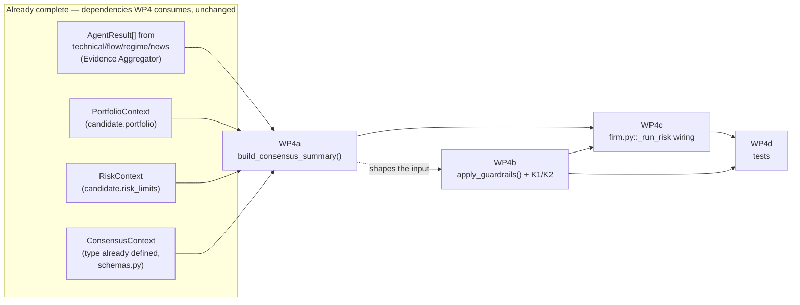

# AF-3 — Agent Firm Decision Flow: Completion Audit and Work Breakdown

**Date:** 2026-07-29 · **Status:** Planning/audit only — no code changed by this document.
**Scope:** Priority 1 only — complete the Decision Flow (Production Engine → Candidate → Context →
Prompt Builder → Provider Router → Evidence Aggregator → Consensus Engine → Review Policy →
Structured Review Output). Ranking, watchlist generation, Telegram, dashboard, and publishing are
explicitly out of scope (later work packages).
**Constraints honored:** no Production Engine change, no architectural redesign, Provider Layer
(ADR-AF-005) untouched, existing ADRs (AF-001..004) followed, not re-opened.
**Method:** every claim below is verified against the actual working tree (including uncommitted
changes — `git status` shows substantial in-flight, uncommitted work already implementing most of
this flow) and against a live test run, not against document claims alone, per CLAUDE.md's own
Decision-Making Hierarchy ("a CI-enforced test is ground truth over any document's claim").
Verification commands used: `git status`/`git diff --stat`, direct reads of every file in the flow,
`.winvenv/Scripts/python.exe -m pytest tests/agent_firm/ -q --ignore=tests/agent_firm/providers`
(**152 passed**).

---

## 1. Current Implementation Status

**Overall: ~95% complete.** Six of seven flow stages are fully implemented, tested, and wired
end-to-end from all five live Production Engine call sites. One stage (Review Policy) is
functionally complete for what already shipped, but is missing one previously-specified,
still-undone sub-component.

| Stage | Status | Evidence |
|---|---|---|
| Production Engine → Candidate | **100%** — unchanged, out of scope | `SignalCandidate` constructed at 5 call sites (`scheduler/scanner.py` x2, `scheduler/jobs.py` x2, `monitor.py` x1) |
| Context (Tier 1 assembly) | **100%** | `engine/agent_firm_context.py` — all 8 Tier 1 builders + batch cache (`get_batch_context`/`reset_batch_context`) + per-candidate assembly (`build_candidate_context`), called at all 5 sites, threading real `market_risk_score` values (not dead defaults — verified by grep) |
| Prompt Builder | **100%** | `prompts/{technical,flow,regime,news}_v1.md` + `risk_v2.md`, all updated in the working tree to reference typed Tier 1 fields |
| Provider Router | **100% (declared complete, ADR-AF-005; out of scope)** | `engine/agent_firm/providers/*` — router, registry, factory, circuit breaker, AIMD governor, classification, events/alerts/metrics all present and exercised by their own test suite (see §7 for one unrelated hygiene defect found, not in scope) |
| Evidence Aggregator | **100%** | `firm.py::_run_analysts` → `agents/{technical,flow,regime,news}.py`, each reading its own typed field off `candidate` (e.g. `candidate.technical`), no raw SQL, no context dict |
| Consensus Engine | **100%** | `firm.py::_run_bull`/`_run_bear` → `agents/bull.py`/`bear.py`, unmodified in this pass because they never needed Tier 1 context (they consume prior `AgentResult`s only) — correctly out of ADR-AF-002's Tier 1 scope |
| Review Policy | **~75%** | `firm.py::_run_risk` → `agents/risk.py` (fully wired to `PortfolioContext`/`RiskContext`, qualitative `size_tier` per ADR-AF-003) **+** `guardrails.py` (only the original 2 deterministic guardrails exist; the 2 additional, already-specified guardrails are not implemented — see §2) |
| Structured Review Output | **100%** | `AgentDecision` — persisted (`firm.py::_persist`), `size_tier` populated, `size_hint` deliberately left `None` (owned downstream by `engine/position_sizing.py` per ADR-AF-003 — correct, not a gap) |

**152/152 tests pass** for the entire Decision Flow (`tests/agent_firm/*.py`, excluding the
Provider-layer subtree, which is out of this task's scope and has an unrelated, pre-existing
defect — §7).

---

## 2. Gap Analysis

**Exactly one substantive gap exists**, and it is already fully specified in prior documentation —
this is not new design work, it is finishing a documented, partially-started package.

### Gap: `ConsensusContext` is defined but never built or consumed

- `engine/agent_firm/schemas.py::ConsensusContext` exists (`negative_count`, `positive_count`,
  `aligned_bullish`, `already_open_position`, `entries_blocked`) — Tier 2, "assembled by Agent Firm
  itself, after the analyst agents run" per ADR-AF-002.
- Its documented builder, `guardrails.py::build_consensus_summary()`, **does not exist**.
  `guardrails.py` today contains only `apply_guardrails()` (2 checks: bearish-flow contradiction,
  confidence-floor-in-weak-regime) and `normalize_quant()`.
- The two additional, already-specified deterministic veto paths — **K1** (≥3 negative analyst
  verdicts → veto) and **K2** (already-open-position → veto, code-enforced rather than merely
  LLM-instructed) — are not implemented. `risk_v2.md` currently *asks* the LLM not to double up on
  an open position (a soft, model-decided policy); it does not have the deterministic,
  LLM-cannot-override guarantee the existing two guardrails already provide for their own checks.
- Confirmed **not** retired or descoped: `ADR-AF-002-CONTEXT_OWNERSHIP.md` (2026-07-29, the most
  recent ADR touching this area) still lists `ConsensusContext`/WP4 as live, unresolved scope; no
  `DECISION_LOG` entry or ADR withdraws it.

### One correction to the prior plan, found during this audit (reduces remaining effort)

`AF2_WORK_PACKAGE_SEQUENCE.md`'s WP4 section names a "hidden prerequisite": that
`agents/risk.py::run()`'s signature would need to change to accept a new context parameter,
breaking 4 test files. **This is now stale** — it was written before WP2/WP3 (since completed)
solved exactly this delivery problem a different way: `risk.py` already reads
`candidate.portfolio`/`candidate.risk_limits` directly off `SignalCandidate` (confirmed by direct
read). Building `ConsensusContext` today requires **no change to `risk.run()`'s signature** — all
its inputs (`analyst_results`, `candidate.portfolio`, `candidate.risk_limits`) are already available
at the call site inside `firm.py::_run_risk`. This meaningfully shrinks WP4's scope and risk
relative to how it was originally sized.

### Two out-of-scope observations (not part of this gap analysis's remediation, flagged for the record)

1. `tests/agent_firm/providers/test_quota_hydration_edge_cases.py` imports
   `_hydrate_quota_holds` from `providers/router.py`, which does not exist — a collection error that
   fails `pytest tests/agent_firm/ -q` run as one command (must `--ignore=tests/agent_firm/providers`
   to get a clean collection). This is entirely inside the Provider Layer, declared complete and
   out of scope for this task — not fixed here, but flagged because it currently blocks a bare
   `pytest -q` from succeeding, which CLAUDE.md's "Before Starting Any Task" checklist requires
   before reporting work done.
2. `schemas.py`'s module docstring ("WP1 (Foundation) status: these types exist... but are not yet
   attached to any live evaluation... Wiring is later work") is stale — WP2/WP3 wiring is complete
   and live. Comment-only, zero behavioral effect; low-priority cleanup, not part of this work
   breakdown.

---

## 3. Remaining Work Packages

Only **WP4** is required to close the Decision Flow gap. It decomposes into three small,
independently testable pieces:

| Package | Description | New code? |
|---|---|---|
| **WP4a** | `guardrails.py::build_consensus_summary(analyst_results, portfolio_ctx, risk_ctx) -> ConsensusContext` — pure function, counts analyst verdicts + reads `portfolio_ctx.has_open_position()`/`risk_ctx.entries_blocked` (both already exist) | New function only |
| **WP4b** | Extend `apply_guardrails()` with the K1 (≥3 negative → veto) and K2 (open position → veto) checks, additive to the existing 2 checks, same "only ever downgrades approve→veto" contract | Extend existing function |
| **WP4c** | Wire `firm.py::_run_risk` to call `build_consensus_summary()` and pass its result into `apply_guardrails()` | Small edit to one existing call site |
| **WP4d** | Tests: extend `tests/agent_firm/test_guardrails.py` (new cases for `build_consensus_summary`, K1, K2); verify no regression in `test_firm.py`/`test_risk.py`/`test_firm_v2.py` | New/extended test cases |

No package touches: `providers/*`, `schemas.py` (the type already exists), `engine/agent_firm_context.py`,
`scheduler/*`, `monitor.py`, `agents/{technical,flow,regime,news,bull,bear}.py`, or `evaluate()`'s
signature (ADR-AF-004 stays satisfied — no new parameter is added to `evaluate`/`evaluate_staged`).

---

## 4. Dependency Graph

WP4a and WP4b can be developed in parallel once WP4a's return shape (`ConsensusContext`, already
frozen by `schemas.py`) is treated as the fixed interface — WP4b only needs to know that shape, not
WP4a's implementation. WP4c depends on both being done. WP4d depends on WP4a+WP4b+WP4c existing to
test against.

---

## 5. Critical Path

**WP4a → WP4c → WP4d** is the critical path (WP4b can run in parallel with WP4a since both consume
the same fixed `ConsensusContext` shape and don't depend on each other's implementation, only on the
already-frozen schema). Total critical-path length: 3 small, sequential edits — no package is
individually large. The realistic bottleneck is not code volume but the **shadow-mode decision**
(§7): WP4b's K1/K2 checks are the first *new* deterministic veto paths since the original two
guardrails shipped, and they change live approve/veto outcomes, which is the one piece of this work
that isn't purely mechanical.

---

## 6. Files Requiring Modification

| File | Change | Risk |
|---|---|---|
| `engine/agent_firm/guardrails.py` | Add `build_consensus_summary()`; extend `apply_guardrails()` with K1/K2 | Low (additive functions; existing 2 checks' behavior/signature can stay backward compatible if the new consensus argument is optional/defaulted) |
| `engine/agent_firm/firm.py` (`_run_risk`) | Call `build_consensus_summary()`, pass result to `apply_guardrails()` | Low (single call site, already has every input in scope) |
| `tests/agent_firm/test_guardrails.py` | New test cases for `build_consensus_summary()`, K1, K2 | None (test-only) |
| `tests/agent_firm/test_firm.py`, `test_risk.py`, `test_firm_v2.py` | Verify/extend fixtures if a new veto path changes an existing test's expected decision | Low — only if a current fixture happens to trip K1/K2; needs a check pass, not a rewrite |
| `docs/agent_firm/AF1_CONTEXT_OBJECT_CATALOG.md`, `AF2_WORK_PACKAGE_SEQUENCE.md` | Optional: mark WP4 closed once implemented (repo convention: superseding note, not a silent edit) | None (documentation) |

**Not required:** `schemas.py` (type exists), `engine/agent_firm_context.py`, any `agents/*.py` other
than none (risk.py's existing signature already suffices — see §2 correction), any `prompts/*.md`
(optional cosmetic update only), `providers/*`, any `scheduler/*` or `monitor.py` file, `evaluate()`/
`evaluate_staged()` signatures.

---

## 7. Risk Assessment

| Risk | Severity | Mitigation |
|---|---|---|
| **K1/K2 are the first new deterministic veto paths added since the original two guardrails shipped — they will change some real approve/veto outcomes.** | Medium — this is a genuine behavior change, not a refactor | Follow this repo's own standing convention (`AUTH_MODE`/`EDGE_SCORE_MODE`/`SECTORS_APP_MODE`'s shadow/enforce pattern): land WP4a-c logging what K1/K2 *would* decide without applying it for a bake-in period, then flip to enforcing. `AF1_REMEDIATION_PLAN.md`'s own text ("shadow-mode discipline still applies") already anticipated this for this exact package. |
| **Test-fixture friction:** existing fixtures in `test_firm.py`/`test_risk.py`/`test_firm_v2.py` may implicitly satisfy K1 or K2's trigger condition without meaning to, flipping an existing test's expected outcome. | Low-Medium | Run the full suite after WP4b lands, before writing WP4d's new assertions — any newly-red existing test is either a fixture that needs updating or a sign the new guardrail is too aggressive; treat as a signal either way. |
| **Provider-layer test collection defect** (`_hydrate_quota_holds` missing from `router.py`) currently blocks a bare `pytest -q`. | Low functional risk to this task (Decision Flow tests run clean when isolated), but blocks the "run tests before reporting done" checklist item repo-wide. | Out of this task's scope (Provider Layer declared complete, no redesign). Flag to whoever owns the Provider Layer; do not fix opportunistically inside a Decision-Flow-scoped change, per this task's own "no architectural redesign" constraint. |
| **Sequencing divergence from the last-recorded roadmap.** `Audit/PRODUCTION_ENGINE_NEXT_MILESTONE.md` (also dated 2026-07-29) names "Operations Dashboard / Job History" as the next milestone, not Decision Flow completion. | None to this task's execution — this is an explicit, user-directed priority override, not a conflict requiring resolution. Noted for the record only, consistent with this repository's practice of surfacing sequencing facts rather than silently overriding them. | No action needed; informational. |
| **Backward compatibility of `apply_guardrails()`'s signature.** | Low | Add the consensus argument as a new, defaulted parameter (mirrors ADR-AF-004's own additive-parameter precedent for `SignalCandidate`/`AgentDecision` fields) so any external test double or future caller that doesn't pass it keeps working unchanged — K1/K2 simply don't fire without a consensus summary, same fail-open posture the rest of this pipeline uses. |

**No risk to the Production Engine, Provider Layer, or any already-shipped ADR.** Every change is
contained inside `engine/agent_firm/` (`guardrails.py`, `firm.py`), consistent with the task's hard
constraint.

---

## 8. Estimated Implementation Sequence

1. **WP4a** — implement `build_consensus_summary()` in `guardrails.py`, pure function, unit-testable
   with no LLM/DB dependency. Add its unit tests immediately (fast, isolated feedback).
2. **WP4b** — extend `apply_guardrails()` with K1/K2, gated behind a shadow/enforce toggle consistent
   with repo convention (log-only first). Add unit tests for both new paths and for the "additive,
   backward-compatible signature" property (calling without the new argument still behaves exactly
   as today).
3. **WP4c** — wire `firm.py::_run_risk` to call WP4a and pass the result into WP4b's extended
   `apply_guardrails()`.
4. **WP4d** — run the full Decision Flow suite
   (`pytest tests/agent_firm/ -q --ignore=tests/agent_firm/providers`), resolve any fixture friction
   found, add/extend assertions confirming K1/K2 fire (in shadow) on constructed cases.
5. **Bake-in period in shadow mode** (log what K1/K2 would have decided, don't apply it) — length is
   an operator decision, not fixed here; matches the same discipline already used for
   `AUTH_MODE`/`EDGE_SCORE_MODE`.
6. **Flip to enforcing** once shadow output looks correct against real scan-cycle data.
7. **Documentation close-out** — mark WP4 resolved in `AF2_WORK_PACKAGE_SEQUENCE.md`/
   `AF1_CONTEXT_OBJECT_CATALOG.md` per this repo's superseding-note convention; this AF-3 audit
   itself is superseded by that close-out record, not edited.

Steps 1-4 are the actual "Priority 1" implementation work and are small (three focused edits plus
tests). Steps 5-6 are an operational rollout decision, not additional engineering. Step 7 is
documentation hygiene.
