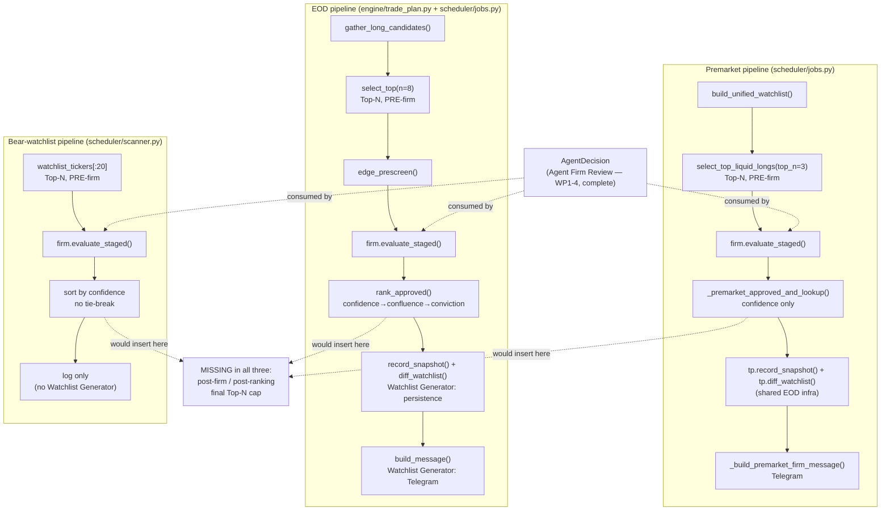

# AF-4 — Ranking Engine: Audit Only (Priority 2)

**Date:** 2026-07-29 · **Status:** Audit/planning only — no code changed, no files modified.
**Scope:** search-and-trace audit of `Production Engine → Candidate → Agent Firm Review → Ranking
Engine → Top N → Watchlist Generator`. Nothing in this document assumes the Ranking Engine is
missing; every claim is verified against actual code and a live test run.
**Method:** repo-wide grep for ranking/watchlist/top-N components, direct reads of every match,
and `pytest` runs to confirm current behavior — same evidence standard as AF-3.

**Headline finding, stated up front because it changes how to read everything below:** this is the
same situation as the Provider Layer audit (ADR-AF-005). **A working, tested Ranking Engine already
exists — three times over.** It is not a missing component; it is an *unconsolidated* one, split
across three strategy-specific pipelines (EOD, Premarket, Bear-Watchlist), all of which already
consume `AgentDecision` and already produce an ordered, capped, published shortlist. And critically:
**every file implementing it is Production Engine code** (`engine/trade_plan.py`,
`scheduler/jobs.py`, `scheduler/scanner.py`, `engine/unified_watchlist.py`, `engine/liquidity.py`)
— none of it lives in `engine/agent_firm/`. This matters directly against this task's own
constraint ("Do NOT modify the Production Engine") — see §8 Risks.

---

## 1. Current Ranking Engine Completion

**~85-90% functionally complete, fully tested, in production use — as three parallel
implementations, not one unified component.**

| Pipeline | Entry point | Status |
|---|---|---|
| EOD long shortlist | `scheduler/jobs.py::run_eod_trade_plan` (16:40 WIB) | **Complete** — scoring, pre-firm Top-N, firm review, post-firm ranking with 3-key tie-break, snapshot/diff, Telegram |
| Premarket long shortlist | `scheduler/jobs.py::run_premarket_firm_scan` (08:35 WIB) | **Complete**, reusing EOD's snapshot/diff/Telegram infrastructure — post-firm ranking has only a 1-key sort (see gap analysis) |
| Bear-watchlist ranking | `scheduler/scanner.py::rank_bear_watchlist_and_notify` | **Complete but intentionally minimal** — log-only, no snapshot/diff/Telegram, by an explicit prior design decision (see §3) |

All three are exercised by a passing test suite (verified this session):
`pytest tests/test_trade_plan.py tests/test_bear_watchlist_ranking.py tests/test_eod_trade_plan_job.py tests/test_unified_watchlist.py tests/test_dashboard_watchlist.py tests/test_watchlist.py`
→ **82 passed, 0 failed.**

---

## 2. Existing Implementation Inventory

| Component | File | Role |
|---|---|---|
| `gather_long_candidates()` | `engine/trade_plan.py` | Merges 4 long-signal sources into one candidate pool per ticker, tagging confluence |
| `edge_prescreen()` | `engine/trade_plan.py` | Tier-A directional pre-veto before the firm (cost control) |
| `candidate_score()` / `_rank_key()` | `engine/trade_plan.py` | **Final score, pre-firm**: weighted, source-quality-aware composite (broker-confirmed reversal > agent-approved premarket > technical screen > volume spike) |
| `select_top(n=8)` | `engine/trade_plan.py` | **Top-N, pre-firm** — caps the candidate pool handed to the LLM (cost cap), not the final published list |
| `rank_approved()` | `engine/trade_plan.py` | **Final ordering, post-firm**: keeps only `decision == "approve"`, sorts by `(confidence, confluence, conviction)` — a real 3-key tie-break |
| `fallback_rank()` | `engine/trade_plan.py` | Deterministic ranking when the firm is disabled/errors — synthesizes a confidence proxy from `candidate_score()`, flags the report degraded |
| `record_snapshot()` / `diff_watchlist()` | `engine/trade_plan.py` | **Watchlist Generator (persistence + diff)** — `watchlist_snapshot` table, keyed `(date, strategy, ticker)`; added/removed/upgraded/downgraded computed by comparing to the most recent prior snapshot |
| `build_message()` | `engine/trade_plan.py` | **Watchlist Generator (output)** — Telegram HTML message, ranked list + regime + VPIN gate + diff section |
| `_premarket_approved_and_lookup()` | `scheduler/jobs.py:588` | **Final ordering, post-firm, premarket** — approved decisions sorted by `confidence` only |
| `_premarket_ranked_for_snapshot()` | `scheduler/jobs.py:601` | Adapter into `trade_plan.py`'s snapshot/diff contract — reuses it rather than a parallel mechanism |
| `_build_premarket_diff_sections()` / `_build_premarket_firm_message()` | `scheduler/jobs.py` | Watchlist Generator (output), premarket variant of `build_message()` |
| `rank_bear_watchlist_and_notify()` | `scheduler/scanner.py:1097` | Bear-watchlist ranking — `evaluate_staged()` → sort by `confidence` only → log (explicitly no Telegram, "reference signal, not an alert," per its own docstring citing the 2026-06-16 lean-notification audit, commit `89baa33`) |
| `build_unified_watchlist()` | `engine/unified_watchlist.py` | Pre-firm merge of reversal/premover/bear-dip sources into one tiered, ranked, deduplicated list — feeds Premarket's input, **not itself agent-firm-aware** |
| `select_top_liquid_longs(top_n=3)` | `engine/liquidity.py:74` | **Top-N, pre-firm, premarket** — liquidity-gated cap on `build_unified_watchlist()`'s output before the firm runs |
| `normalize_quant()` | `engine/agent_firm/guardrails.py` | Score normalization — but for the **Risk Manager's veto gate input**, not for ranking; ranking's real sort key (`AgentDecision.confidence`) is already uniformly 0-1 by prompt contract (`risk_v2.md`), so no separate ranking-side normalization step exists or is needed |
| `engine/edge_score.py::compute_edge()` | `engine/edge_score.py` | Adjacent, not ranking: feeds `engine.position_sizing.resolve_size_hint()` (position **size**, ADR-AF-003), not rank **order** |

**Tests:** `tests/test_trade_plan.py` (19 cases), `tests/test_bear_watchlist_ranking.py` (6),
`tests/test_eod_trade_plan_job.py`, `tests/test_unified_watchlist.py`, `tests/test_dashboard_watchlist.py`,
`tests/test_watchlist.py`.

**Explicitly not a ranking component (checked, ruled out):** `scheduler/scanner.py::run_agent_firm_gate`
(the main real-time scan gate) calls `evaluate_staged()` too, but only to approve/veto/promote
individual rows for immediate signal alerts — it returns a filtered list, never ranks, caps, or
publishes a shortlist. A different concern from the three ranking pipelines above; not in scope
here.

---

## 3. Ranking Entry Points

Exactly three, all already scheduler-integrated (APScheduler cron, `deploy/crontab`-sourced,
dedup-guarded via the shared `_job_sentinel` table):

1. `run_eod_trade_plan()` — 16:40 WIB daily.
2. `run_premarket_firm_scan()` — 08:35 WIB daily.
3. `rank_bear_watchlist_and_notify()` — called from the bear-watchlist scout job (not on its own
   cron entry; invoked as part of that job's flow).

No other ranking entry point was found repo-wide (grep covered every `.py` file under `scheduler/`,
`engine/`, `routes/`).

---

## 4. Ranking Fully/Partially/Not-At-All?

**Fully exists, three times, with one consistent gap and one consistent inconsistency across all
three** (detailed in §7). Not "partial" in the sense of an unfinished pipeline — every one of the
three runs end-to-end today in production. "Partial" only in the sense that the *capability* is
duplicated rather than shared, and one specific stage (final Top-N) is absent from all three.

---

## 5. Complete Execution Flow (traced)

**EOD (`run_eod_trade_plan`, `scheduler/jobs.py:990-1115` + `engine/trade_plan.py`):**
`gather_long_candidates()` → `select_top(n=8)` [Top-N, pre-firm] → `edge_prescreen()` [Tier-A veto,
gated by `EDGE_SCORE_MODE`] → Tier 1 context attach (`build_candidate_context`, ADR-AF-002) →
`firm.evaluate_staged(candidates)` [**Agent Firm Review**] → `rank_approved()` [**Ranking**,
confidence→confluence→conviction] or `fallback_rank()` if the firm didn't run → `diff_watchlist()` +
`record_snapshot()` [**Watchlist Generator**, persistence] → `build_message()` [**Watchlist
Generator**, Telegram output].

**Premarket (`run_premarket_firm_scan`, `scheduler/jobs.py:768-...`):**
`build_unified_watchlist()` → `select_top_liquid_longs(top_n=3)` [Top-N, pre-firm, liquidity-gated]
→ optional edge pre-veto → Tier 1 context attach → `firm.evaluate_staged(candidates)` [**Agent Firm
Review**] → `_premarket_approved_and_lookup()` [**Ranking**, confidence only] →
`_premarket_ranked_for_snapshot()` → `tp.diff_watchlist()` + `tp.record_snapshot()` [**Watchlist
Generator**, persistence, shared table/strategy-keyed] → `_build_premarket_firm_message()`
[**Watchlist Generator**, Telegram output].

**Bear-watchlist (`rank_bear_watchlist_and_notify`, `scheduler/scanner.py:1097`):**
watchlist tickers (already filtered to not-yet-approved-today) → Tier 1 context attach →
`firm.evaluate_staged(candidates)` [**Agent Firm Review**] → sort by `confidence` [**Ranking**] →
log message (**no** Watchlist Generator persistence or Telegram — deliberate, per its docstring).

---

## 6. Dependency Graph

---

## 7. Gap Analysis

Four findings, all narrow and well-localized — none require new architecture, all are extensions of
existing, working functions:

1. **No post-ranking Top-N cap exists anywhere.** All three pipelines cap the candidate pool
   *before* the firm runs (`select_top(n=8)`, `select_top_liquid_longs(top_n=3)`, `[:20]`) for LLM
   cost control, then publish **every** firm-approved name with no further ceiling. This is the one
   gap that maps directly onto the target pipeline's explicit `... → Top N → Watchlist Generator`
   placement (Top-N *after* ranking, not only before it). In practice this rarely matters (firm
   approval counts are typically small — 0 to single digits), but there is no code-level guarantee
   of it.
2. **Inconsistent tie-break.** `rank_approved()` (EOD) breaks ties on `(confidence, confluence,
   conviction)` — three keys. `_premarket_approved_and_lookup()` and
   `rank_bear_watchlist_and_notify()` sort on `confidence` alone; ties fall back to Python's stable
   sort (incidental input order), not a designed rule.
3. **Bear-watchlist ranking has no Watchlist Generator output** — no `watchlist_snapshot` row, no
   diff, no Telegram; log-only. **This may be intentional, not a gap** — its docstring cites a
   specific prior decision ("Log-only by design ... since the 2026-06-16 lean-notification audit
   (commit `89baa33`) ... this ranking is reference signal, not an alert"). Treat as a decision to
   confirm before changing, not a defect to silently fix.
4. **No single shared "Ranking Engine" module.** `candidate_score()`/`rank_approved()`/
   `fallback_rank()` live in `engine/trade_plan.py`; premarket's equivalent ranking logic is
   duplicated as private helpers in `scheduler/jobs.py`; bear-watchlist's is inlined in
   `scheduler/scanner.py`. All three work and are tested — this is a DRY/maintainability
   observation, not a functional gap, and per this task's own "don't redesign working code"
   instruction, consolidating them is **not recommended** unless the duplication becomes an actual
   maintenance problem.

---

## 8. Risks

| Risk | Severity | Note |
|---|---|---|
| **Scope conflict: every file that would need to change is Production Engine code.** `engine/trade_plan.py`, `scheduler/jobs.py`, `scheduler/scanner.py`, `engine/unified_watchlist.py`, `engine/liquidity.py` are all Production Engine, not `engine/agent_firm/`. This task's own constraint set says "Do NOT modify the Production Engine." **Closing any of the four gaps in §7 would require exactly the kind of change this task instructs against.** This is not a technical risk — it's a scope contradiction that needs an explicit decision before any Priority-2 implementation begins. | **High (blocking, not technical)** | Resolve before writing code: either the "no Production Engine changes" constraint is scoped narrower than it reads (e.g., it meant "don't touch the *scanning/execution* core," not "don't touch reporting/ranking helpers"), or Priority 2 is not actually implementable under the constraints as stated. |
| Misreading bear-watchlist's log-only behavior as an oversight | Medium | It's a cited, dated, audited decision (commit `89baa33`) — verify current intent with whoever owns that decision before adding Telegram/snapshot output to it. |
| Expecting a single "Ranking Engine" component because the target diagram names one | Low | Same category of mismatch as the Provider Layer audit — the *capability* is complete; the *shape* (one module vs. three) doesn't match the diagram's implied singular component. Diagram-vs-reality mismatches like this are why this repo's own Decision-Making Hierarchy trusts code/tests over documents. |
| Adding a post-firm Top-N cap could silently drop a legitimately-approved, lower-ranked name from the published shortlist | Low | Purely a product-policy choice (what should N be, and should it differ by strategy) — cheap to implement once decided, but the "what N" decision isn't inferable from the code. |

---

## 9. Recommended Implementation Order

**Contingent on resolving the §8 scope conflict first — none of this should be coded until that's
answered.** If and when authorized to touch the named Production Engine files:

1. **Resolve the Production-Engine-constraint question** (§8) — not engineering work, a scope
   decision.
2. **Add an optional, defaulted post-firm Top-N cap** to `rank_approved()`,
   `_premarket_approved_and_lookup()`, and `rank_bear_watchlist_and_notify()`'s sort step — smallest,
   most literal gap (§7.1), and additive (default `None`/unbounded preserves current behavior
   exactly, matching this repo's own additive-parameter convention already used in
   `apply_guardrails()`/ADR-AF-004).
3. **Align premarket and bear-watchlist's tie-break** with EOD's existing
   `(confidence, confluence, conviction)` key — premarket already carries `conviction`/`confluence`
   in its row lookup (`by_ticker`), so this is a sort-key change, not new data.
4. **Confirm, then decide** (not default to "yes") whether bear-watchlist ranking should gain
   snapshot/diff/Telegram parity with EOD/premarket — requires checking with whoever owns the
   2026-06-16 decision this would reverse.
5. **Do not consolidate the three implementations into one shared module** unless a future,
   separately-justified need makes the duplication itself a problem — not recommended now, per
   "don't redesign working code" and "minimize future code changes."

No work has been started on any of the above; this is the audit only, as requested.
