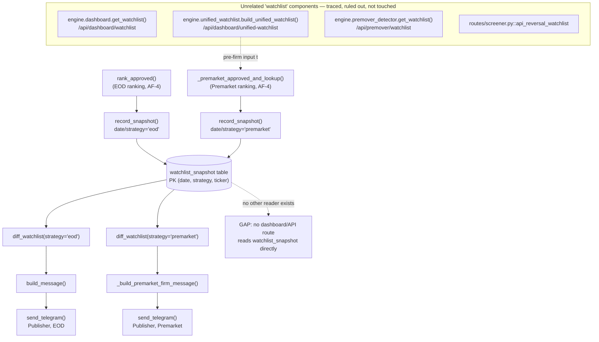

# AF-5 — Watchlist Generator: Audit Only (Priority 3)

**Date:** 2026-07-29 · **Status:** Audit/planning only — no code changed, no files modified.
**Scope:** `... → Ranking → Watchlist Generator → Publisher`. Builds directly on AF-4's findings
(Ranking Engine, already complete, three pipelines) — this audit traces exactly one stage further.
**Method:** repo-wide search for every watchlist-shaped component (not just ones downstream of the
Agent Firm), direct reads, and cross-checking `templates/dashboard.html`'s actual fetch calls against
what each backend route serves — no assumption that "found a function named `watchlist`" means "found
the Watchlist Generator."

**Headline finding:** the canonical Watchlist Generator (the one downstream of Agent Firm Review →
Ranking) **already exists and is ~90-95% complete** — artifact creation, persistence, day-over-day
diffing, and Telegram publishing are all implemented and tested. But the repository also contains
**four other, unrelated components that are also named "watchlist"** and are *not* downstream of the
Agent Firm at all. This naming collision is almost certainly why this stage looked like it might be
missing — a repo-wide search for "watchlist" surfaces mostly the wrong things. Distinguishing them
correctly is the main substance of this audit.

---

## 1. Watchlist Generator Completion

**~90-95% complete**, for the pipeline actually in scope (Agent Firm Review → Ranking → Watchlist
Generator → Publisher):

| Sub-capability | Status |
|---|---|
| Final artifact creation (ranked, agent-approved list) | **Complete** — `rank_approved()`/`_premarket_approved_and_lookup()` (traced fully in AF-4) |
| Snapshot persistence | **Complete** — `watchlist_snapshot` table, `record_snapshot()` |
| Diff generation (added/removed/upgraded/downgraded) | **Complete** — `diff_watchlist()`, shared by EOD and Premarket |
| Publisher (Telegram) | **Complete** — `build_message()` / `_build_premarket_firm_message()`, both wired to `send_telegram()` and confirmed firing in `run_eod_trade_plan`/`run_premarket_firm_scan` |
| JSON/formal data model | **Absent** — the contract is an implicit `list[dict]` shape, not a schema/dataclass (see §6) |
| Dashboard/API exposure of this specific artifact | **Absent** — `watchlist_snapshot` has no route reading it; the dashboard's watchlist widgets read from unrelated components (see §2) |

---

## 2. Existing Implementation Inventory

### The canonical Watchlist Generator (downstream of Agent Firm Review + Ranking)

| Component | File | Role |
|---|---|---|
| `WATCHLIST_SNAPSHOT_DDL` / `ensure_watchlist_snapshot_table()` | `engine/trade_plan.py:201-220` | Schema: `(date, strategy, ticker, rank, confidence, conviction, confluence, sources)`, PK `(date, strategy, ticker)` |
| `record_snapshot()` | `engine/trade_plan.py:223` | Persists today's ranked list, `INSERT OR REPLACE` (same-day re-run safe) |
| `diff_watchlist()` | `engine/trade_plan.py:242` | Diffs against the most recent prior snapshot for the same `strategy`; returns `added`/`removed`/`changes` (rank delta, confidence delta, upgraded/downgraded/unchanged status) |
| `build_message()` | `engine/trade_plan.py:407` | EOD Telegram artifact — ranked list + regime + VPIN gate + diff section |
| `_premarket_ranked_for_snapshot()` / `_build_premarket_diff_sections()` / `_build_premarket_firm_message()` | `scheduler/jobs.py:601-765` | Premarket's equivalent, explicitly reusing `trade_plan.py`'s snapshot/diff table and functions rather than a parallel mechanism |
| `send_telegram(tp.build_message(...))` | `scheduler/jobs.py:1111` | **Publisher, EOD** — confirmed live call site |
| `send_telegram(_build_premarket_firm_message(...))` | `scheduler/jobs.py:946` | **Publisher, Premarket** — confirmed live call site |

Bear-watchlist ranking (`rank_bear_watchlist_and_notify`, AF-4 §2) deliberately has no Watchlist
Generator/Publisher step — logs only, by the same cited 2026-06-16 design decision AF-4 already
flagged.

### Unrelated components that also contain the word "watchlist" (traced and ruled out)

| Component | File / route | What it actually is | Downstream of Agent Firm? |
|---|---|---|---|
| `engine.dashboard.get_watchlist()` | `engine/dashboard.py:231`, served at `/api/dashboard/watchlist` (`routes/flow.py:368`), also used by `routes/telegram.py:150` | A **deterministic BUY WATCH / AVOID / WAIT classifier** from raw OHLCV + foreign broker-flow thresholds (bounce %, volume, net foreign buy/sell). No LLM, no `AgentDecision`, no `watchlist_snapshot`. | **No** |
| `engine.unified_watchlist.build_unified_watchlist()` | `engine/unified_watchlist.py`, served at `/api/dashboard/unified-watchlist` (`routes/flow.py:388`) | Merges reversal/premover/bear-dip sources into one ranked, tiered list. It is an **input** to the Premarket ranking pipeline (AF-4 §2), not agent-firm-aware itself. | **No** (upstream of ranking, not downstream) |
| `engine.premover_detector.get_watchlist()` | `engine/premover_detector.py:490`, served at `/api/premover/watchlist` (`routes/screener.py:598`) | Pre-mover pattern detector's own candidate list (score-threshold based) — one of `unified_watchlist`'s three input sources. | **No** |
| `routes/screener.py::api_reversal_watchlist` | `routes/screener.py:627` | Raw dump of the `reversal_watchlist` table (another `unified_watchlist` input source). | **No** |
| `/api/agent/audit` (`engine.agent_firm.analytics`) | `routes/backtest.py:874` | Per-decision analytics (cohort win-rate, agent agreement, decision log) over `agent_decisions`. Adjacent — reads Agent Firm output — but is a performance-analytics view, not the ranked watchlist artifact. | Reads Agent Firm data, but is not the Watchlist Generator |

**`templates/dashboard.html` confirms which of these the UI actually uses**: its two watchlist
`fetch()` calls (lines 807-808) hit `/api/dashboard/watchlist` and `/api/dashboard/unified-watchlist`
— i.e. the dashboard's "watchlist" panel shows the two *unrelated*, non-agent-firm components, not
the canonical Ranking-Engine-downstream artifact. `tests/test_dashboard_watchlist.py` — despite its
name — tests `engine.dashboard.get_watchlist()` exclusively; it is not test coverage for
`engine/trade_plan.py`'s snapshot/diff pipeline (that has its own, separate 19-case suite,
`tests/test_trade_plan.py`, already confirmed passing in AF-4).

**This is a naming collision, not duplicate engineering.** All five non-canonical components are
legitimate, independently useful, pre-existing features serving genuinely different purposes (raw
price/flow screening vs. LLM-reviewed shortlist vs. decision analytics). None of them should be
merged, removed, or treated as redundant with the canonical pipeline — they answer different
questions.

---

## 3. Execution Flow (canonical path, traced end to end)

```
Ranking Engine (AF-4, complete)
  EOD:       rank_approved(top, decisions)          [confidence→confluence→conviction]
  Premarket: _premarket_approved_and_lookup(...)     [confidence]
        ↓
Watchlist Generator
  record_snapshot(conn, date, strategy, ranked)      → INSERT OR REPLACE into watchlist_snapshot
  diff_watchlist(conn, date, strategy, ranked)        → vs. most recent prior snapshot, same strategy
        ↓
Publisher
  EOD:       build_message(ranked, regime, ..., diff=diff, ...)         → send_telegram(...)
  Premarket: _build_premarket_firm_message(decisions, rows, ..., diff=diff)  → send_telegram(...)
```

Both legs are fail-soft at the snapshot/diff step (`try/except ... logging.warning(...
fail-soft)`) — a persistence error never blocks the Telegram send, matching this repo's stated
fail-soft-vs-fail-closed posture (CLAUDE.md, Coding Conventions).

---

## 4. Files Involved

**Canonical pipeline (0 files need modification for this audit; listed for completeness):**
`engine/trade_plan.py`, `scheduler/jobs.py` (both `run_eod_trade_plan` and
`run_premarket_firm_scan`, plus the `_premarket_*` helpers), `utils/telegram.py` (`send_telegram`).

**Unrelated components, traced to rule out (not part of this pipeline, not touched):**
`engine/dashboard.py`, `engine/unified_watchlist.py`, `engine/premover_detector.py`,
`routes/flow.py`, `routes/screener.py`, `routes/telegram.py`, `routes/backtest.py`,
`templates/dashboard.html`.

**Tests (all passing, verified in AF-4 and re-confirmed applicable here):**
`tests/test_trade_plan.py` (19 cases — covers `record_snapshot`/`diff_watchlist`/`build_message`
directly), `tests/test_eod_trade_plan_job.py`. `tests/test_dashboard_watchlist.py` and
`tests/test_unified_watchlist.py` exist but cover the *unrelated* components (§2) — do not read them
as coverage for the canonical Watchlist Generator.

---

## 5. Dependency Graph



---

## 6. Gap Analysis

Two findings, both narrow:

1. **`watchlist_snapshot` has no dashboard/API exposure.** It is written and read only inside
   `engine/trade_plan.py` (write via `record_snapshot`, read-back via `diff_watchlist` for
   self-comparison). No route serves it as JSON; `templates/dashboard.html` never fetches it. If
   "Publisher" in the target pipeline is meant to include a dashboard/API leg (not only Telegram),
   this is the one concrete gap. If Telegram alone satisfies "Publisher" (which is what's actually
   implemented and working today), there is no gap here at all — this is a scope question, not a
   defect (see §9).
2. **No formal data model.** The watchlist row contract (`ticker`, `confidence`, `conviction`,
   `confluence`, `sources`, `rank` via list position) is an implicit `list[dict]` shape, documented
   only in docstrings and the SQL DDL — not a Pydantic model or dataclass. This matches the rest of
   `engine/trade_plan.py`'s style (plain dicts throughout, deliberately — it's a DB/data-only, lean-venv
   module per its own module docstring) and is consistent with, not a deviation from, this repo's
   existing conventions. Not a gap worth closing on its own; only relevant if a future dashboard/API
   consumer (per finding 1) needs a documented contract to code against.

**No markdown generation exists anywhere for the watchlist** (searched; only Telegram HTML output was
found) — this was one of the audit's specific questions, and the answer is: there isn't one, and
nothing today calls for one.

**No file/CSV export exists** — same answer, same caveat: not called for by anything currently
consuming this pipeline.

---

## 7. Critical Path

There isn't one in the urgent sense — the canonical pipeline is complete, tested, and running in
production (confirmed: live call sites at `scheduler/jobs.py:946` and `:1111`). If the dashboard-
exposure gap (§6.1) is ever prioritized, the critical path would be: decide the JSON contract for a
`watchlist_snapshot` row (trivial — the DDL already defines it) → add one read-only route (e.g.
`/api/dashboard/eod-watchlist` or similar, following the existing `/api/dashboard/*` pattern in
`routes/flow.py`) → optionally a `templates/dashboard.html` panel. All three steps are additive; none
touch `engine/trade_plan.py`'s existing write path.

---

## 8. Risks

| Risk | Severity | Note |
|---|---|---|
| **Conflating the five "watchlist"-named components** and concluding the Watchlist Generator is missing because the dashboard's watchlist panel doesn't show agent-firm-ranked picks. | **Was the primary risk this audit exists to rule out** — resolved above; not a risk to future work as long as §2's table is consulted before touching anything watchlist-named. |
| Adding a dashboard route for `watchlist_snapshot` could be mistaken for "fixing" `engine.dashboard.get_watchlist()` or `unified_watchlist`, prompting an unwanted rewrite of working, differently-scoped code. | Medium | Any future work here must add a **new**, additional route — not modify `engine/dashboard.py` or `engine/unified_watchlist.py`, both of which are correct and complete for what they do. |
| None to Production Engine, Agent Firm, Provider Layer, or Ranking Engine from this audit itself — nothing was modified. | — | — |

---

## 9. Scope Conflicts

**One, and it's a definitional question rather than a code conflict:** does "Publisher" in the target
pipeline mean *only* Telegram (already fully implemented), or does it also imply a dashboard/API/JSON
surface? The pipeline diagram doesn't specify. Under the narrower reading, **Priority 3 is already
100% done** — nothing to build. Under the broader reading, one small additive gap remains (§6.1), and
closing it means adding a route in `routes/flow.py` (or a new routes module) plus a
`templates/dashboard.html` change — **both of which are Production Engine files**, the same category
of scope tension AF-4 flagged for Priority 2 ("Do NOT modify the Production Engine" vs. every
plausible fix living inside it). This should be resolved the same way: an explicit decision before
any code is written, not an inferred green light.

---

## 10. Recommended Implementation Order

**Existing production functionality (no action needed, already shipped and tested):**
- Ranked-list creation, snapshot persistence, diff generation, and Telegram publishing for both EOD
  and Premarket — all confirmed live and passing.

**Minor enhancement (optional, only if the broader "Publisher" reading in §9 is confirmed):**
1. Get an explicit answer to the §9 scope question first.
2. If broader: add one new, read-only route exposing `watchlist_snapshot` (e.g. latest EOD/premarket
   ranked list + its diff) as JSON — additive, no change to `record_snapshot`/`diff_watchlist`/
   `build_message`.
3. If a dashboard panel is also wanted: add it to `templates/dashboard.html` alongside (not
   replacing) the existing two watchlist panels, clearly labeled to distinguish it from
   `get_watchlist()`'s BUY WATCH/AVOID/WAIT panel — same-name-different-thing confusion is exactly
   what this audit had to untangle; a shipped UI shouldn't recreate it.

**Optional refactoring (not recommended now, per this task's own instruction):**
- Renaming any of the five "watchlist"-named components to disambiguate them. They're all correct
  and working; renaming is pure churn against call sites, routes, and tests for a naming-clarity
  benefit that this audit document itself now provides in written form.
- Consolidating `engine.dashboard.get_watchlist()` / `unified_watchlist` / `premover_detector` into
  the agent-firm-ranked pipeline. They serve different purposes (raw signal screening vs. LLM-reviewed
  shortlist) and merging them would be a product-behavior change, not a refactor.

No work has been started on any of the above; this is the audit only, as requested.
