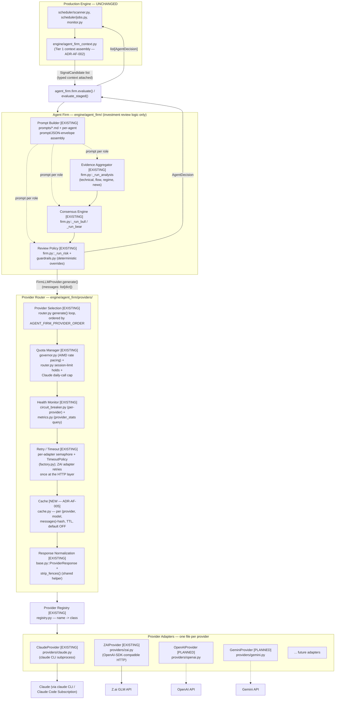

# Agent Firm — Provider Layer Architecture (Update Package)

**Date:** 2026-07-29 · **Status:** Canonical (companion to `ADR-AF-005-PROVIDER_ROUTER_LAYER.md`)
**Scope:** `engine/agent_firm/` only. The Production Engine (`scheduler/`, `engine/*` outside
`agent_firm/`, `monitor.py`, `paper_trade.py`, `data/`, `routes/`) is unaffected by anything in this
document — every consumer on that side still sees `agent_firm.firm.evaluate(candidates) ->
list[AgentDecision]`, byte-for-byte unchanged (ADR-AF-004 keeps that signature frozen).

This document reads the requested target architecture (Prompt Builder / Evidence Aggregator /
Consensus Engine / Review Policy → Provider Router → Provider Adapters → External APIs) against
what `engine/agent_firm/` actually contains today, and marks each piece **[EXISTING]** or **[NEW —
ADR-AF-005]**. Nothing marked EXISTING is being rebuilt; this is a gap-closing update, not a
redesign, per the request's own constraint.

---

## 1. Component Diagram



**Reading the diagram:** the Production Engine → Agent Firm → Provider Router → Provider Adapters
→ External APIs chain the request asked for already exists top-to-bottom in this repository. The
only boxes that do not yet exist are **Cache** and the **OpenAI/Gemini adapters** — both additive,
neither requiring a change to any box drawn above them.

---

## 2. Runtime Sequence Diagram

Single-candidate evaluation through the Risk node's provider call (the pattern is identical for
every analyst/bull/bear/risk node — each is an independent `FirmLLMProvider.generate()` call
through the same Router instance, shared per `evaluate()` invocation).

```mermaid
sequenceDiagram
    participant PE as Production Engine
    participant Firm as Agent Firm<br/>(Review Policy node)
    participant Router as Provider Router
    participant Governor as Quota Manager<br/>(AIMD governor)
    participant Breaker as Circuit Breaker<br/>(per provider)
    participant Cache as Cache<br/>(NEW, ADR-AF-005)
    participant P1 as Adapter: primary<br/>(order[0])
    participant P2 as Adapter: fallback<br/>(order[1])

    PE->>Firm: evaluate(candidates)
    Firm->>Firm: build prompt (Prompt Builder)<br/>+ assemble evidence (Evidence/Consensus)
    Firm->>Router: generate(messages)
    Router->>Cache: lookup(provider, model, messages)
    alt cache hit (enabled + fresh)
        Cache-->>Router: cached ProviderResponse
        Router-->>Firm: ProviderResponse
    else cache miss or disabled
        loop for each provider in AGENT_FIRM_PROVIDER_ORDER
            Router->>Router: check quota hold (session-limit window)
            Router->>Breaker: allow_request()?
            Breaker-->>Router: yes / no (OPEN)
            alt provider available
                Router->>Governor: acquire() (AIMD-paced, if governed)
                Governor-->>Router: proceed (after wait, if any)
                Router->>P1: generate(messages, timeout)
                alt success
                    P1-->>Router: ProviderResponse
                    Router->>Breaker: record_success()
                    Router->>Governor: on_success()
                    Router->>Cache: store(key, response)
                    Router-->>Firm: ProviderResponse (failover=False)
                else provider error (timeout / quota / network / malformed)
                    P1-->>Router: ProviderException (classified)
                    Router->>Breaker: record_failure()
                    Router->>Router: log provider_event; if session-limit,<br/>hold provider until reset time
                    Router->>P2: generate(messages, timeout)
                    P2-->>Router: ProviderResponse
                    Router->>Cache: store(key, response)
                    Router-->>Firm: ProviderResponse (failover=True)
                end
            else provider unavailable (hold / OPEN circuit)
                Router->>Router: skip, log provider_skipped
            end
        end
        opt every provider unavailable
            Router-->>Firm: raise ProviderException
            Firm->>Firm: AgentResult(status="failed", error=...)
        end
    end
    Firm-->>PE: AgentDecision
```

Key existing invariant preserved by this diagram: **the Agent Firm node never sees which provider
answered** unless it inspects `ProviderResponse.provider`/`.failover` for trace/persistence
purposes (`firm.py::_persist` records it) — no branch in `firm.py` or `agents/*.py` conditions
behavior on provider identity.

---

## 3. Responsibility Matrix

| Concern | Agent Firm | Provider Router | Provider Adapters | External Providers |
|---|---|---|---|---|
| Investment review logic (prompts, evidence weighting, bull/bear synthesis, approve/veto policy) | **Owns** | — | — | — |
| Deterministic guardrails (approve→veto overrides, quant-score normalization) | **Owns** (`guardrails.py`) | — | — | — |
| Which provider answers a given call | Unaware | **Owns** (selection order) | — | — |
| Cross-provider failover on failure | Unaware | **Owns** | — | — |
| Retry within a single provider | Unaware | Delegates | **Owns** (adapter-local retry, e.g. ZAI's one HTTP retry) | — |
| Per-call timeout | Unaware (default applies) | Configures policy (`TimeoutPolicy`) | **Enforces** (semaphore + `asyncio.wait_for`) | — |
| Provider health / circuit state | Unaware | **Owns** (`CircuitBreaker`, one per provider) | Exposes `health()` | — |
| Quota / rate-limit management | Unaware | **Owns** (session-limit holds, AIMD governor, Claude daily cap) | Reports quota signal (429/1302/session-limit text) | Enforces the actual limit |
| Response shape normalization | Consumes only `ProviderResponse` | **Owns** the target shape (`base.py`) | Produces `ProviderResponse` from its own SDK/CLI shape | Returns provider-native shape |
| Response caching | Unaware; must not assume cache correctness | **Owns** (NEW, default OFF) | — | — |
| Cost/token accounting | Reads `ProviderResponse.cost_usd/tokens_*` for persistence | Passes through | **Computes** (adapter-specific pricing/usage extraction) | Reports usage in its native response |
| Provider construction / config wiring | Unaware | Delegates to Factory/Registry | Declares its own `__init__` + `@register(name)` | — |
| API authentication, request formatting, SDK/CLI invocation | Unaware | Unaware | **Owns** | Validates |
| Adding a new provider | No change required | No change required | New file, self-registers | New account/contract |
| Observability (events, alerts, metrics) | Reads `AgentDecision`/traces it persisted itself | **Owns** (`events.py`, `alerts.py`, `metrics.py`) | Surfaces raw error text for classification | — |

The load-bearing cell is "Adding a new provider → No change required" for both Agent Firm and
Router — this is the property constraint 5 of the original request ("Adding a new provider should
require implementing only a new adapter") asks for, and it already holds today for Claude/Z.ai and
is unchanged in kind for OpenAI/Gemini.

---

## 4. Failure-Mode Analysis

| Failure mode | Detection | Router behavior | Agent Firm–visible effect | Existing mechanism |
|---|---|---|---|---|
| **Provider timeout** | `asyncio.wait_for` (adapter) raises `ProviderTimeout` | `CircuitBreaker.record_failure()`; try next provider in order | Transparent if any later provider succeeds; `AgentResult(status="failed")` on that node only if *every* provider times out | `providers/claude.py` (subprocess kill+wait on timeout), `providers/errors.py::ProviderTimeout`, `router.py` failover loop |
| **Provider quota exhausted** (session limit / daily cap / 429) | Adapter raises `ProviderQuotaExceeded`/`ProviderSessionLimit`; classified from stdout+stderr (Claude CLI) or HTTP status/message (Z.ai) | Provider held out of rotation until advertised reset (+ buffer), capped by `QUOTA_MAX_HOLD_S`; Claude additionally capped by a daily call count | Degrades to the next provider in order — **graceful, not a failure** unless all providers are quota-held simultaneously | `classification.py` (regex-based reset-time extraction, RCA 2026-07-10/13), `router.py::_on_session_limit`, `governor.py` (AIMD pacing prevents the burst that causes 429/1302 in the first place) |
| **Provider unavailable** (network failure, auth failure, process crash) | Adapter raises `ProviderNetworkFailure`/`ProviderAuthFailed`/`ProviderUnavailable` | Circuit opens after `CIRCUIT_FAILURES` consecutive failures (default 3); held OPEN for `CIRCUIT_COOLDOWN_S` (default 30s) before a single HALF_OPEN trial | Same as timeout: transparent unless every provider is unavailable, at which point the calling agent node returns `status="failed"` | `circuit_breaker.py` (CLOSED/OPEN/HALF_OPEN state machine); `alerts.py::all_providers_unavailable_alert` pages only when *every* provider is durably unavailable (quota hold or OPEN circuit), not on a single transient multi-provider blip |
| **Malformed response** (non-JSON content, missing expected fields) | Adapter-level JSON parse (Claude CLI's `--output-format json` envelope) or agent-node-level JSON parse of `resp.content` (every `agents/*.py::run()`) | Adapter: raises `ProviderUnavailable` if the CLI's own envelope isn't parseable JSON → normal failover. Agent node: catches `json.JSONDecodeError` from the model's *content* (which is provider-shaped free text, not validated by the Router) and returns `AgentResult(status="failed", error=...)` — **no retry**, since the same malformed output is likely to recur immediately from the same provider on the same input | That node's evidence/verdict is simply absent from what downstream nodes (bull/bear/risk) receive — they are explicitly given `{role, status, error}` for every failed node and reason around the gap (see Partial consensus, below) | `base.py::strip_fences()` (defends against the common markdown-fence malformation before parse); no dedicated "response schema" validator layer exists today — response validation is JSON-parse-or-fail per agent, not a Router responsibility |
| **Partial consensus** (some analysts/bull/bear succeed, others fail) | N/A — not a distinct failure signal, a designed data flow | N/A | Every downstream node (`_run_bull`, `_run_bear`, `_run_risk`) receives the full set of prior `AgentResult`s including failed ones (`{role, status, error}`), and its own prompt is responsible for reasoning around missing evidence. If the **Risk** node itself fails, `firm.py` hard-overrides to `decision="degraded"` ("quant signal passed through") rather than trusting a partial LLM read for the final approve/veto call | `firm.py::_run_bull/_run_bear/_run_risk` (pass-through of failed peer results); `firm.py` lines ~142-146 (risk-node-failure hard degrade); this is the one failure mode where Agent Firm, not the Router, owns the recovery policy — consistent with "Review Policy" being Agent Firm's responsibility, not infrastructure's |

**Cache-specific failure mode (NEW):** a cache entry served after a provider's advertised
knowledge/behavior would have changed (irrelevant here — a scored `messages` payload is
deterministic per candidate-scan-tick, not the kind of input that goes stale mid-TTL) is bounded by
a short TTL and by being keyed on the full message content, not just provider/role — a
different-context, same-role call never collides in the cache.

---

## 5. Deployment Recommendations

**Recommendation: keep the Provider Router in-process for now; design the seam so a standalone
service is a config change, not a rewrite, when/if it's needed.**

- Today's constraint (`gunicorn.conf.py` — exactly one worker; `docs/superpowers/specs/2026-07-08-*`
  — "the app runs as a single long-lived process... in-memory, per-process runtime state (the
  Circuit Breaker) is sufficient") still holds. There is no multi-worker fan-out that would make
  in-memory Router state (circuit breakers, AIMD governor, quota holds) incorrect or need sharing
  across processes.
- The seam that makes a future standalone Provider Router **possible without touching Agent Firm**
  already exists: `firm.py` and every `agents/*.py` module depend only on the `FirmLLMProvider`
  Protocol (`generate()`, `health()`, `model()`). The concrete object satisfying that protocol today
  is `ProviderRouter` (in-process); a future `HTTPRouterClient` implementing the same three methods
  by calling a remote Router service would be a drop-in replacement at exactly one call site
  (`providers/factory.py::build_router()`), with zero change to `firm.py` or any `agents/*.py` file.
- **When to actually move it:** only if a second workload needs the same provider pool (e.g. a
  second Flask app, `chart-viewer/`, or a batch research job wanting LLM review outside the
  `research/`↔production boundary) and needs shared, cross-process quota/circuit state that
  in-memory objects can no longer provide correctly. Until such a second consumer exists, extracting
  a service adds an HTTP hop, a new deployment unit, and a new failure mode (Router-service
  unavailable) for no present benefit — moving it now would violate this repository's stated
  "production stability over feature velocity" posture (CLAUDE.md, Evidence-first philosophy) by
  adding operational surface ahead of an actual driving need.
- If/when extracted: the Cache and Quota Manager should move with the Router (they are
  infrastructure state, not Agent Firm state); `provider_events`/metrics persistence
  (`data/db.py`-backed today) would need to become the service's own store or a shared one — flagged
  here as the one piece of today's design (SQLite-via-`data/db.py`) that does not translate to a
  separate machine without a decision this ADR does not make.

---

## 6. Repository Structure

Current state vs. the requested layout, annotated:

```
engine/agent_firm/
    firm.py                    # [EXISTING] orchestrator — Evidence Aggregator + Consensus Engine +
                                #   Review Policy wiring (LangGraph DAG)
    guardrails.py               # [EXISTING] Review Policy — deterministic overrides
    schemas.py                  # [EXISTING] SignalCandidate / AgentDecision / AgentResult / context types
    config.py                   # [EXISTING] AGENT_FIRM_* env config
    agents/                      # [EXISTING] Evidence Aggregator + Consensus Engine + Review Policy nodes
        technical.py, flow.py, regime.py, news.py, bull.py, bear.py, risk.py
    prompts/                     # [EXISTING] Prompt Builder templates
        technical_v1.md, flow_v1.md, regime_v1.md, news_v1.md, bull_v1.md, bear_v1.md, risk_v2.md
    providers/                   # Provider Router + Provider Adapters
        base.py                  # [EXISTING] FirmLLMProvider protocol, ProviderResponse, ProviderCapabilities
        router.py                # [EXISTING] Provider Selection + failover + quota holds
        governor.py               # [EXISTING] Quota Manager (AIMD rate pacing)
        circuit_breaker.py        # [EXISTING] Health Monitor (per-provider circuit state)
        classification.py         # [EXISTING] failure classification (Retry/Timeout support)
        errors.py                 # [EXISTING] provider exception taxonomy
        events.py                 # [EXISTING] structured provider decision events
        alerts.py                 # [EXISTING] Telegram alerting on provider state changes
        metrics.py                 # [EXISTING] query-time provider health/ops stats
        registry.py                # [EXISTING] name -> class lookup
        factory.py                 # [EXISTING] config -> ProviderRouter construction
        claude.py                  # [EXISTING] Claude Adapter
        zai.py                     # [EXISTING] Z.ai Adapter
        cache.py                   # [NEW — ADR-AF-005] Cache
        openai.py                  # [PLANNED] OpenAI Adapter — add when contracted
        gemini.py                  # [PLANNED] Gemini Adapter — add when contracted
```

This already matches the requested `agent_firm/engine/ + providers/{base,router,quota,health,
cache,claude,openai,gemini,zai}.py` shape almost file-for-file — `quota.py`/`health.py` in the
request correspond to this repo's (more specifically named) `governor.py`/`circuit_breaker.py`.
**No renames are proposed** — a rename is pure churn against every test and import in
`tests/agent_firm/` and `engine/agent_firm/` for zero behavioral gain, and this repository's
convention (CLAUDE.md, Coding Conventions) favors additive change over cosmetic restructuring.

---

## 7. Migration Strategy

Because the target architecture is already ~90% implemented, "migration" here means closing the
two remaining gaps — not moving off a legacy design.

1. **Add `providers/cache.py`** (ADR-AF-005 item 1). New module only:
   - `ResponseCache` with `get(key) -> ProviderResponse | None` and `put(key, response)`, TTL-bound,
     in-memory (mirrors the Circuit Breaker's single-process assumption — no new infra dependency).
   - `ProviderRouter.__init__` gains `cache: ResponseCache | None = None`; `factory.build_router()`
     passes one only when `AGENT_FIRM_CACHE_ENABLED` is true (default false). No existing call site
     of `build_router()` or `ProviderRouter(...)` (tests included) needs to change.
   - Ship default-OFF; enable in shadow (log cache hit/miss via `events.py`, never serve from cache)
     before flipping it to actually serve responses — same `shadow`/`enforce` posture this repo uses
     everywhere else (`AUTH_MODE`, `EDGE_SCORE_MODE`, `SECTORS_APP_MODE`).

2. **Add adapters as each provider is actually contracted** (ADR-AF-005 item 3), one at a time:
   - Write `providers/openai.py` implementing `FirmLLMProvider`, `@register("openai")`.
   - Add its env vars to `config.py` and `.env.example` (API key, base URL, model, concurrency cap
     — following the existing `ZAI_*`/`CLAUDE_*` naming pattern).
   - Add `openai` to `AGENT_FIRM_PROVIDER_ORDER` only in a non-production environment first; verify
     `provider_events`/`metrics.provider_stats` show sane behavior before adding it to the
     production order.
   - Repeat identically for `gemini.py`.
   - At no point does this step touch `router.py`, `factory.py`, `firm.py`, any `agents/*.py` file,
     any prompt, or any schema — this is the property the 2026-07-08 design already guaranteed and
     ADR-AF-005 reaffirms.

3. **No step requires a Production Engine change, a Production Engine deploy, or touches
   `engine/agent_firm_context.py`** — every migration step is contained inside
   `engine/agent_firm/providers/`, consistent with the request's hard constraint that the
   Production Engine must remain unchanged.

4. **Rollback:** every step above is independently revertible — deleting `cache.py` and the
   constructor parameter restores today's exact behavior; removing a provider name from
   `AGENT_FIRM_PROVIDER_ORDER` removes it from rotation without deleting the adapter file. No
   migration step is destructive or requires a data migration (no schema change to
   `agent_decisions`/`agent_traces`/`provider_events` is needed for either gap).
