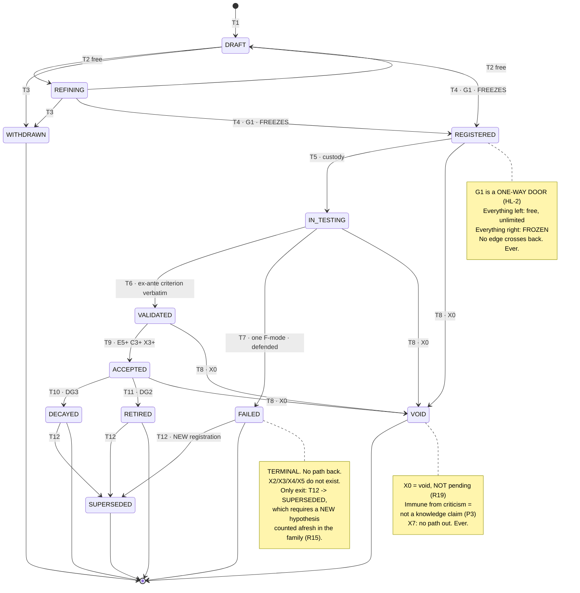

# Hypothesis Lifecycle

**Version:** 1.0 · **Status:** Canonical (candidate — inherits an unsigned L1; see §0.4) · **Layer:** L2 — Research Architecture
**Owner:** Research Architect · **Last Updated:** 2026-07-15 · **Supersedes:** — (initial version). **Does NOT supersede** [[TAXONOMY_AND_NAMING_STANDARD]] §6 or [[RESEARCH_OPERATING_MODEL]] §6–§7 — see §0.2.
**Realized in v3:** partial — `research/knowledge` hypotheses table + **receipt-bound `set_status`** (Task 11) realizes transition receipts; R-10 lifecycle enforcement realizes evidence-gated promotion; `failure_registry` realizes terminal failure. **No v3 component implements refinement, resurrection, or supersession.**
**Scientific basis:** [[01_SCIENTIFIC_FOUNDATION]] §5.2 (falsifiable-claim anatomy), **§5.4 (R15 — what may never be done to a dying claim; the document's operational core)**, §2.3 (R5, pre-registration), §2.4 (custody), §5.3 (F1–F9), §5.5 (asymmetry)
**Governance:** [[RESEARCH_OS_MASTER_ROADMAP]] §4, [[DECISION_LOG]] **D-020**, [[EVIDENCE_MODEL]] (E/C/X guards)

---

## 0. Authority and scope

### 0.1 The thesis

> **A hypothesis lifecycle is not a workflow. It is a set of paths that were deliberately not built.**

The valuable content of this document is **absent transitions**. Per [[01_SCIENTIFIC_FOUNDATION]] §5.4, the single most abused boundary in quantitative research is between *learning from failure* (registering a new risked claim) and *rescuing a failure* (editing the old claim until the evidence stops disagreeing). §5.4 is explicit about why the boundary cannot be policed by review:

> *"The first generates knowledge; the second destroys the institution's ability to know anything, and — because a rescued claim looks identical to a survived one — it does so **invisibly**."*

A rescue is undetectable **by inspecting the result**. It is detectable only by the **absence of a path that could have produced it**. So this state machine's job is to make the rescue **unexpressible**, per **R6**: *"a prohibition that relies on a researcher's discipline is a statement of intent, not a control."*

Read §4 (transitions) as the specification, and **§5 (prohibited transitions) as the point**.

### 0.2 Relationship to the existing corpus

[[TAXONOMY_AND_NAMING_STANDARD]] §6 declares: `REGISTERED → IN_TESTING → (VALIDATED | FAILED)`. [[RESEARCH_OBJECT_MODEL]] carries the same four values in `status`.

**That is the core path and it is correct as far as it goes.** It does not cover: pre-registration drafting, refinement, withdrawal, custody, reproducibility voiding, retirement, resurrection, or supersession — every one of which the institution will encounter, and several of which are exactly where the abuses live.

> **Per D-020, this document does not amend either.** It specifies the **full state machine** and records the delta as a gap. The four canonical states are **retained unchanged** and are a **strict subset** of §3's set — no renaming, no re-semanticizing. See **G-2** in §8.

### 0.3 One transition, one receipt

> **Rule HL-1 (justified by R6, v3 R-10 inherited):** Every transition requires an **evidence receipt** — a durable record of what justified it. **No receipt, no transition.** This inherits v3's receipt-binding rule ([[RESEARCH_OS_RECONCILIATION]] §4: *"no transition without an evidence receipt"*), already realized in `research/knowledge`'s `set_status` and R-10.
>
> A transition without a receipt is a **field edit wearing a state machine's clothes**, and per §7.3 it is indistinguishable from a legitimate transition by inspecting the resulting state. The receipt is the only difference, so the receipt is mandatory.

### 0.4 Baseline inheritance (binding)

Depends on [[01_SCIENTIFIC_FOUNDATION]] v1.0 — **certified-ready, NOT FROZEN** ([[DECISION_LOG]] **D-018/D-019**) — and on [[EVIDENCE_MODEL]] (candidate). If review alters R15, §5.2, or the E-scale, §4's guards are void pending re-derivation, not grandfathered.

---

## 1. What a hypothesis is

Per **§5.2**, a hypothesis is falsifiable *in this institution's sense* only if **all six** are present: a mechanism (M-class + constraint + participant class, R9) · a directional prediction (sign-specified) · a null · a scope · an ex-ante criterion including effect size · a multiplicity family.

> *"Any of the six missing ⇒ the claim is not falsifiable ⇒ Gate 1 refuses it."*

And per **R14**: *"A hypothesis with no stated refutation condition is not admitted — not deferred, not weakened. **Not admitted.**"*

**The lifecycle begins at the sixth element, not the first.** Before G1 there is no hypothesis — there is an intention (§5.1). This is why §3's pre-G1 states are named `DRAFT` and `REFINING` rather than `HYPOTHESIS_*`: they are not states of a hypothesis, they are states of a candidate.

---

## 2. The two eras

Everything in this document turns on one boundary:

| | **Before G1** — the free era | **After G1** — the frozen era |
|---|---|---|
| Refinement | **Unlimited and encouraged** | **Prohibited absolutely** |
| Cost of change | Zero | **The claim, destroyed** |
| What exists | A candidate | **A risked claim** |
| Governing rule | — | **R5** — criteria fixed before the evidence that judges them |
| What a change would be | Improvement | **R7.4** (threshold migration) or **R15** (rescue) |

> **Rule HL-2 (justified by R5, §2.3):** **G1 is a one-way door.** Before it, refine freely — nothing has been risked, so nothing can be corrupted. After it, the hypothesis is **frozen**. Per §2.3: *"criteria chosen after the data are seen are not criteria; they are descriptions."*
>
> **The asymmetry is not bureaucratic caution.** Pre-registration is what converts research *"from fitting an explanation to an outcome into risking a claim against an outcome, which is the only operation that generates evidence"* (§2.3). A post-G1 edit does not weaken the evidence — **it deletes it**, retroactively, and leaves the record looking unchanged.

---

## 3. States

| State | Era | Meaning | Terminal? |
|---|---|---|---|
| **DRAFT** | free | A candidate; not all six of §5.2 present | no |
| **REFINING** | free | Under revision. **Unlimited. Free. No record required** | no |
| **WITHDRAWN** | free | Abandoned pre-G1. **Not a failure — no claim was risked** | **yes** |
| **REGISTERED** ★ | **frozen** | G1 passed. All six present. **Immutable. Counted in the family.** | no |
| **IN_TESTING** ★ | frozen | Experiment executing under registered custody | no |
| **VALIDATED** ★ | frozen | Ex-ante criterion met; E≥E4 (**R10 floor**) | no |
| **FAILED** ★ | frozen | Refuted. **Exactly one F-mode, defended (R1)** | **yes** |
| **VOID** | frozen | **X0** — irreproducible. **Not "pending." Not a failure. Void** (R19, F6) | **yes** |
| **ACCEPTED** | frozen | Promoted to a Knowledge Object (E5+/C3+/X3+) | no |
| **RETIRED** | frozen | Was true; its constraint was removed (**DG2**). **Not a failure** | **yes** |
| **DECAYED** | frozen | Was true; is now false (**F9/DG3**). **Not a failure** | **yes** |
| **SUPERSEDED** | frozen | A **new** hypothesis learned from this one | **yes** |

★ = the four states declared in [[TAXONOMY_AND_NAMING_STANDARD]] §6, **retained unchanged**.

### 3.1 The three terminal states that are not failures

**WITHDRAWN, RETIRED, DECAYED are not failures**, and conflating them with FAILED is not a cosmetic error.

Per §5.3: *"**F9 is not a failure of the research.** A decayed mechanism was true and is now false — an expected consequence of P1 and D3, not an error. Filing F9 alongside F1 without distinction would corrupt the diagnostic."*

The diagnostic being protected is the one §5.3 calls *"the highest-value analysis the Failure Library enables"*: **the distribution of failures across F1–F9 is a diagnostic of the institution itself.** An institution whose failures cluster at F1 is operating efficiently — killing claims before spending data, custody, or multiplicity budget. One whose failures cluster at F2–F4 is *"spending its scarcest resources to learn things it could have reasoned out."*

**Mixing three non-failures into that distribution destroys the measurement** — and worse, an institution that files DECAYED as FAILED teaches its researchers that being right and then watching the world change is the same as being wrong. They will stop filing it.

---

## 4. Transitions

Every transition: a **guard** (what must be true) and a **receipt** (what records it). **No receipt, no transition** (HL-1).

### 4.1 The free era

| # | Transition | Guard | Receipt |
|---|---|---|---|
| **T1** | ∅ → DRAFT | An idea | Creation record |
| **T2** | DRAFT ↔ REFINING | **None. Free. Unlimited.** | **None required** |
| **T3** | DRAFT/REFINING → WITHDRAWN | Author's choice | Withdrawal note. **Not counted in the family** — nothing was risked |
| **T4** | **DRAFT/REFINING → REGISTERED** | **G1: all six of §5.2 · mechanism `blind_to` the OOS period (§7.3, OS-6) · family declared (R7.5) · power/MDE showing the test can fail (R2) · refutation condition in one sentence (R14, §5.1) · `required_data` resolving to Available-Today or Obtainable-Later (D-002) · CRO approval** | **G1 record. The hypothesis freezes here. Joins the family — permanently (OS-10).** |

> **T2 is unconstrained and that is deliberate.** Per §2.4, Discovery *"licenses conjecture, exploration, unlimited searching, no claims."* An institution that bureaucratizes pre-registration drafting has added process that does not reduce the probability of believing something false — and per **P4** *"a rule that does not protect it is bureaucracy and should be removed."*

> **T4 carries every guard because it is where they are cheap.** Each is an F1 kill: no data touched, no custody spent, no multiplicity budget consumed. Per §5.3, **F1 is privileged** — *"an institution that routinely kills claims at F1 is operating efficiently."* **T4 is the institution's cheapest and most valuable transition, and it should refuse most of what reaches it.**

### 4.2 The frozen era

| # | Transition | Guard | Receipt |
|---|---|---|---|
| **T5** | REGISTERED → IN_TESTING | Experiment approved (G2) · custody **enforced, not requested (R6)** · **OOS opened once, logged** | Custody receipt: **when, by whom, once** |
| **T6** | IN_TESTING → VALIDATED | **Ex-ante criterion met, verbatim from the frozen hypothesis** · effect ≥ `effect_size_floor` · **E≥E4 (R10)** · severity argument (**R3/EV-3**) | Validation Report (O7) |
| **T7** | IN_TESTING → FAILED | Any of F1–F9 · **exactly one mode** · **attribution defended against auxiliaries (R1)** | **Failure Entry (O8) — mandatory, immutable, never deleted** |
| **T8** | any frozen → **VOID** | **X0** — cannot reproduce from specification | Replication record (O13). **Immediate, at any tier or confidence (DG1)** |
| **T9** | VALIDATED → ACCEPTED | **E≥E5 · C≥C3 · X≥X3** ([[EVIDENCE_MODEL]] §5.1) · adversarial review by **someone other than the author (EV-9, LIM6)** · `retirement_rule` **pre-committed (EV-12)** · decay monitor live | **CRO sign-off + receipt (R-10)** |
| **T10** | ACCEPTED → DECAYED | **DG3** — the effect is measurably gone | Monitor trigger. **Not a failure** |
| **T11** | ACCEPTED → RETIRED | **DG2** — the generating constraint was removed | Rule-change record. **Not a failure** |
| **T12** | FAILED/DECAYED/RETIRED → **SUPERSEDED** | **A new hypothesis was registered** citing this one | **The new hypothesis's G1 record. This transition marks the old one; it does not modify it.** |

> **T6's guard is verbatim and this is the whole of R7.4.** The criterion checked is the one **frozen at T4**, read from the frozen object, never re-derived. Per **R7.4** (*threshold migration*): *"adjusting a criterion after seeing a near-miss. The criterion was the test; moving it deletes the test."* **A near-miss is a miss.** There is no path from IN_TESTING back to REFINING (see §5.1, X1) — and its absence is the enforcement.

> **T9 is currently unreachable, structurally.** It requires adversarial review by someone other than the author. Per **LIM6/LIM8** and **EV-9**, a single-researcher institution cannot supply this: **C2 is the ceiling** and T9 requires C3. **This is the same wall [[PHASE_A_FREEZE_CERTIFICATE]] v2.1 stands at** — one open condition, an external signature, owned by an External Validation Reviewer (**D-019**). The corpus and the pipeline it specifies are blocked by the identical limit, and per **LIM8** it cannot be climbed from inside, because self-certification is *epistemically indistinguishable from genuine certification*.
>
> **The honest response is to record the ceiling, not to lower the bar until the institution can reach it.** A T9 guard weakened to what one person can discharge would not make the institution able to accept knowledge; it would make it unable to tell whether it should.

---

## 5. Prohibited transitions — **the substance of this document**

> **R15 (§5.4), quoted in full because it is what §5 enforces:** *"When a hypothesis fails, the following are prohibited: re-running with adjusted parameters and reporting the survivor; narrowing the universe or period until it passes; adding a filter discovered from the failure; re-labeling the failure as 'needs more data'; splitting one dead claim into variants until one survives.*
>
> ***The only legitimate response to a falsified hypothesis is: record the failure (R12), and — if the failure taught a new mechanism — register a new hypothesis, with a new pre-registration, counted in the family.***"

### 5.1 The prohibited set

| # | The move | Why there is no path | L1 |
|---|---|---|---|
| **X1** | **IN_TESTING → REFINING** | Adjusting a criterion after seeing a near-miss. **The criterion was the test; moving it deletes the test** | **R7.4** |
| **X2** | **FAILED → IN_TESTING** | Re-running with adjusted parameters and reporting the survivor | **R15** |
| **X3** | **FAILED → REGISTERED** (same object) | Narrowing the universe or period until it passes | **R15** |
| **X4** | **FAILED → REFINING** | Adding a filter discovered from the failure. **The filter is E0 — a pattern found by searching, in the data that killed the claim** | **R15**, E0 |
| **X5** | **FAILED → DRAFT** ("needs more data") | Re-labeling a failure as pending. **Per R2 an underpowered test is no evidence — but a *failed* test is a refutation, and more data does not un-refute it** | **R15**, R2 |
| **X6** | **One FAILED → many REGISTERED** without family growth | Splitting a dead claim into variants until one survives. **Each variant joins the family — the denominator grows** | **R15**, **R7.5** |
| **X7** | **VOID → anything** | Irreproducibility is not a gap; it is **structural immunity from criticism**, and per **P3** a claim immune from criticism is not a knowledge claim | **R19**, §8.2 |
| **X8** | **Any state → a lower family count** | *"The denominator is part of the claim."* **OS-10 makes reduction unexpressible** | **R7.5** |
| **X9** | **ACCEPTED → VALIDATED** (demote-and-retry) | A degraded claim recovers only by **re-earning** its level; re-litigating is a rescue | **EV-10**, R15 |
| **X10** | **Extending a forward-test window** to reach a pass | **Threshold migration wearing a calendar.** *"A claim that fails its forward test fails; a claim that runs out of time is unproven, not proven"* | **§4.2**, R7.4, U12 |

### 5.2 Why absence is the enforcement

Each X above is a move a competent, honest researcher will be tempted toward — because each is locally reasonable. *The filter really does look like it explains the failure. The window really does look too short. The universe really was too broad.*

Per §5.4, the distinction between learning and rescuing is exact: **learning from failure is registering a new risked claim; rescuing a failure is editing the old claim until the evidence stops disagreeing.** And per §7.3 the two are *indistinguishable by inspecting the outcome*.

**So the enforcement cannot be judgment; it must be the absence of a path.** Per **R6**, *"a prohibition that relies on a researcher's discipline is a statement of intent, not a control."* The state machine is a control precisely because there is **no edge from FAILED to any state that could re-test the same object**. The only outward edge from FAILED is **T12 → SUPERSEDED**, and taking it requires a **new registration, counted afresh in the family** — which is exactly R15's legitimate response, and the only one available.

---

## 6. Resurrection

**Resurrection is the most dangerous idea in this document**, because it is R15's rescue with a respectable name, and it will always be proposed sincerely.

> **Rule HL-3 (justified by R15, R1):** **A FAILED hypothesis is never resurrected.** There is no path. The object is terminal.
>
> What *is* permitted is **T12 → SUPERSEDED**: registering a **new** hypothesis, with a **new** pre-registration, **counted afresh in the family**, citing the dead one.

### 6.1 The one legitimate case, and why it is still a new registration

Per **R1** (Duhem–Quine): *"No hypothesis is tested in isolation. A rejected prediction may indict the mechanism, the feature construction, the data, the cost model, the regime assumption, or the test itself."* Every falsification therefore **names an attribution and defends it** (T7's guard).

So a real case arises: a hypothesis died at **F4** under cost model v1; cost model v2 is materially different. Was the claim wrong, or was the auxiliary?

> **Rule HL-4 (justified by R1, R15, R7.5):** Where a falsification was attributed to an **auxiliary** (cost model, data fidelity, regime definition) and **that auxiliary has since demonstrably changed for reasons independent of this hypothesis**, a new hypothesis may be registered testing the same mechanism under the changed auxiliary. It is a **new registration**: new G1, new family count, new pre-registration, citing the dead one.
>
> **Three conditions, all necessary:**
> 1. The original `attribution_defense` (T7) named the auxiliary — **written before the change, not recalled after**;
> 2. The auxiliary changed for **independent reasons** — a cost model revised because it was wrong, not because it was inconvenient;
> 3. The new hypothesis is **counted in the family**. It is one of N+1. **Not a retry of the Nth.**

**Condition 2 is the load-bearing one and it is where the abuse lives.** A cost model revised *because it killed a claim we liked* is **R7.4** — threshold migration relocated to an auxiliary, where it is harder to see. The independence must be established from the auxiliary's own record: **the cost model's revision must have its own justification, authored blind to this hypothesis's fate.** Absent that, HL-4 is unavailable — and the sincerity of the person proposing it is not evidence, per **R13** (*sunk research cost is not evidence*) and **EV-5** (confidence never rises from how much the claim is wanted).

**Condition 1 exists because memory is not a receipt.** An attribution "recalled" after the auxiliary changed is authored knowing the result — U3, a counterfeit, and per §7.3 indistinguishable from the genuine article by inspection. The `attribution_defense` field is the only thing that makes condition 1 checkable, which is why T7 makes it mandatory.

---

## 7. The state machine

**Read the diagram for what is not in it.** There is no arrow from FAILED to IN_TESTING, none from IN_TESTING to REFINING, none out of VOID, and none crossing back over G1. **Those six absences are this document.**

---

## 8. Known gaps (recorded, not resolved)

Per **ADR-L1-008** — record, do not resolve. See [[KNOWLEDGE_CORPUS_DELIVERY]] §5.

| # | Gap | Consequence |
|---|---|---|
| **G-2** | [[TAXONOMY_AND_NAMING_STANDARD]] §6 and [[RESEARCH_OBJECT_MODEL]] `status` declare **4 states**; this document specifies **12**. The 4 are a strict subset, unchanged | Two canonical documents under-specify a machine a third now specifies. **Not amended (D-020).** Amendment proposed in [[KNOWLEDGE_CORPUS_DELIVERY]] §4 |
| **G-4** | **T9 is structurally unreachable** — requires non-author adversarial review (LIM6/LIM8, EV-9) | **The institution cannot currently promote any hypothesis to ACCEPTED.** This is the pipeline's binding constraint and it is **the same one blocking Phase A's own certificate** (D-019). Not a defect of this document — a fact it must state rather than design around |
| **G-5** | v3 realizes T5–T7 and T9's receipt-binding; **T2, T12, HL-4 have no realization** | Refinement, supersession, and the resurrection rule are specified but unbuilt. L6 concern; not a Phase-A/L2 blocker |

---

## 9. Traceability

| This document | Extends | Never restates |
|---|---|---|
| §3 twelve states | [[TAXONOMY_AND_NAMING_STANDARD]] §6 (4 states, **strict subset, unchanged**) | The four canonical values |
| §4 transitions T1–T12 | [[RESEARCH_OPERATING_MODEL]] §6 (G1–G4), §7 (custody pipeline) | The gates |
| **§5 prohibitions X1–X10** | **[[01_SCIENTIFIC_FOUNDATION]] §5.4 (R15)**, R7.4, R7.5, R19 | **R15 — quoted once, in §5, deliberately** |
| §6 resurrection HL-3/HL-4 | **R1** (Duhem–Quine), R15 | R1's argument |
| HL-1 receipts | v3 R-10 receipt-binding ([[RESEARCH_OS_RECONCILIATION]] §4) | The v3 mechanism |
| HL-2 (G1 one-way) | R5, §2.3 | §2.3's argument |
| Transition guards | [[EVIDENCE_MODEL]] (E/C/X, §5.1 caps, DG1–DG9) | The scales |
| State-carrying fields | [[RESEARCH_OBJECT_SCHEMA]] §3.3 (O3) | O3's field list |

**Upstream:** [[MARKET_INEFFICIENCY_TAXONOMY]] (T4 binds an entry) · [[ECONOMIC_MECHANISM_TAXONOMY]] (T4 requires a sub-class) · [[LITERATURE_RESEARCH_STANDARD]] (T4 cites a Card).
**Downstream:** [[RESEARCH_PROGRAM_STANDARD]] (T4 joins a Program's family — **the denominator, OS-10**) · [[RESEARCH_VALIDATION_FRAMEWORK]] / `research/gatekeeper` (T6/T7 guards) · [[FAILURE_LIBRARY_SCHEMA]] (T7's receipt).
