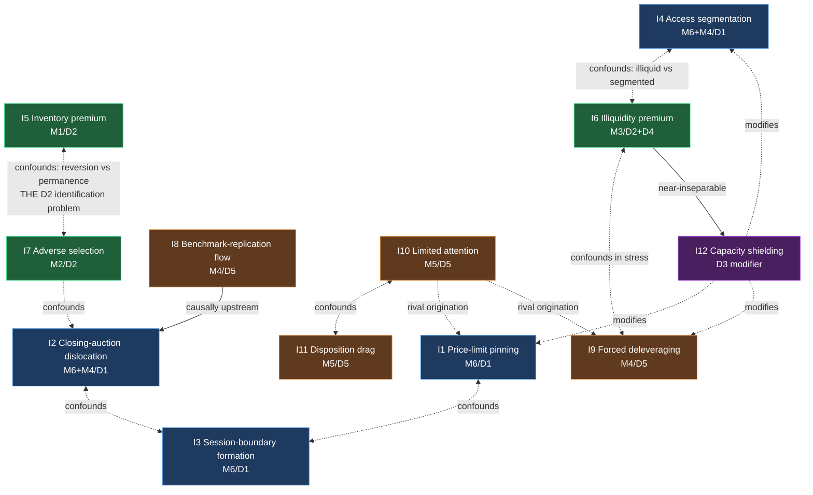

# Market Inefficiency Taxonomy

**Version:** 1.0 · **Status:** Canonical (candidate — inherits an unsigned L1; see §0.3) · **Layer:** L1 — Scientific Foundation
**Owner:** Chief Research Scientist · **Last Updated:** 2026-07-15 · **Supersedes:** — (initial version)
**Realized in v3:** none. This is a scientific catalogue, not a mechanism; no v3 component realizes it. Program P0 (NR7 family) supplies evidence *about* entries here (see I6, I14) but does not implement the taxonomy.
**Scientific basis:** [[01_SCIENTIFIC_FOUNDATION]] §3.5 (domains D1–D6), §3.4 (mechanism classes M1–M6), §6 (inefficiency philosophy: P6, R16, R17, P7), §5.3 (falsification modes F1–F9), §4.2 (evidence tiers E0–E7)
**Governance:** [[RESEARCH_OS_MASTER_ROADMAP]] §2 (L1), [[DECISION_LOG]] **D-020** (this document extends L1; it does not amend it)

---

## 0. Authority and scope

### 0.1 What this document is

[[01_SCIENTIFIC_FOUNDATION]] establishes **what kinds of inefficiency may exist** — six domains (D1–D6), six mechanism classes (M1–M6), and seven admissible persistence barriers (§6.3). It deliberately stops there: it is the substrate, and it names no individual inefficiency.

This document is the **instance layer**. It enumerates the specific market inefficiencies this institution admits as objects of study, each classified into the L1 class sets, each with a stated persistence hypothesis and a stated route to its own refutation.

> **The relationship is strict subordination.** L1 owns the classes. This document owns the instances. An instance that fits no L1 class is not an inefficiency this institution recognizes — it is either a novel class, requiring amendment of [[01_SCIENTIFIC_FOUNDATION]] §3.4 and CRO approval, or it is not a mechanism at all.

### 0.2 What this document is not

- It is **not a research agenda.** Presence here means *admissible as an object of study*, not *funded*, not *believed*, and not *prioritized*. Prioritization is L0 ([[RESEARCH_PROGRAM_STANDARD]] §4).
- It is **not evidence.** Every entry below is a conjecture at the maturity stated in its Research Maturity field. Most are RM1. None is Accepted Knowledge by virtue of appearing here.
- It contains **no indicators and no signals.** Per [[01_SCIENTIFIC_FOUNDATION]] §3.2, "the signal" is not an entity this institution reifies. An inefficiency is a claim about a mechanism; a measurement of it is a Feature, and Features are L5. The *Observable manifestation* field below names what the world would look like, not what to compute.

### 0.3 Baseline inheritance (binding)

This document is authored against [[01_SCIENTIFIC_FOUNDATION]] v1.0, which is **certified-ready but NOT FROZEN** — [[RESEARCH_OS_MASTER_ROADMAP]] §7, [[PHASE_A_FREEZE_CERTIFICATE]] v2.1, [[DECISION_LOG]] **D-018/D-019**. One condition remains open: independent adversarial sign-off, owned by an External Validation Reviewer.

**Consequence:** every classification in this document is provisional on L1's class sets surviving that review. If the reviewer alters D1–D6, M1–M6, or §6.3's barrier list, the affected entries here are void pending reclassification — not grandfathered. This is [[01_SCIENTIFIC_FOUNDATION]] §0.4's rule applied to a downstream document: *a rule whose justifying proposition is refuted is void, not grandfathered.*

---

## 1. The entry schema

Every inefficiency carries exactly these nine fields. The schema is not decorative — each field exists to force a commitment that [[01_SCIENTIFIC_FOUNDATION]] requires and that is otherwise silently skipped.

| Field | What it must state | Why it is mandatory |
|---|---|---|
| **Scientific definition** | The deviation, stated as a proposition about prices relative to a named counterfactual | §3.2 — a deviation claim without a stated counterfactual is empty |
| **Economic rationale (origination)** | Which constraint, on which participant class, produces it. Names the M-class. | R16.1, R9 |
| **Persistence hypothesis** | Why it has not been arbitraged away. Must cite one of §6.3's seven barriers. | R16.2, R17 — the primary question |
| **Expected half-life** | An estimate *with its basis*, declared as a hypothesis under D3 | P7 — half-life is a research question, not an assumption |
| **Observable manifestations** | What the world looks like if the claim is true, at fidelity we possess | §3.3 R8 — evidence flows upward from measurement |
| **Required evidence** | The minimum evidence tier for acceptance, and the specific discriminating test | R10 (≥E4 floor), R2/R3 (severity) |
| **Possible falsification** | The F-modes that most plausibly kill it, in expected order | §5.3, R14 |
| **Interactions** | Which other entries confound, subsume, or compete with it | §4.3 — a confounded test is not severe |
| **Research maturity** | RM0–RM6 per §2 below | Prevents an admissible conjecture from reading as a finding |

> **Rule I-1 (justified by R16, R17):** An entry whose *Persistence hypothesis* field reads only "not yet studied" is inadmissible. Absent a barrier, the default presumption is that **the effect does not exist**, because someone with more capital and better data has already taken it. A candidate inefficiency with no persistence story does not enter this document; it is refused at authorship, which is the cheapest refusal available (F1).

---

## 2. Research maturity scale (RM0–RM6)

This scale is an **institutional-state** axis. It is deliberately orthogonal to the evidence tier E0–E7 ([[01_SCIENTIFIC_FOUNDATION]] §4.2), which is a *property of a test*, and to confidence C0–C4 ([[EVIDENCE_MODEL]] §3), which is a *property of belief*. Conflating them is how an institution talks itself into believing that having studied something a lot is the same as having established it.

| RM | State | What it licenses | Entry condition |
|---|---|---|---|
| **RM0** | **Conjectured** | Nothing. It is a sentence. | Passes Rule I-1: has an origination and a persistence story |
| **RM1** | **Literature-supported** | Registration as hypothesis material | A mechanism sourced per [[LITERATURE_RESEARCH_STANDARD]], authored blind to our data |
| **RM2** | **Registered** | One severe test, once | A hypothesis exists at G1 with all six of §5.2 present |
| **RM3** | **Locally observed** | Continued study. **No claim.** | An effect of the predicted sign found in *our* market, in-sample (E2) |
| **RM4** | **Validated** | Consumable by capital as Accepted Knowledge | E≥E4 survived: pre-registered OOS, net of friction |
| **RM5** | **Live-monitored** | Capital deployment under decay monitoring | Accepted, with an active decay monitor (L8) |
| **RM6** | **Decayed / Retired** | Nothing. Preserved as knowledge *about* the market. | F9 decay, or its generating constraint removed |

> **Rule I-2 (justified by §2.4, R10):** **RM3 is the trap.** An effect observed in-sample, in our own market, with a mechanism attached, feels like a discovery and is evidentially E2 — *low*, because the explanation may be retro-fitted (§7.3). The institutional failure mode is treating RM3 as RM4. No entry advances RM3→RM4 without a pre-registered out-of-sample test that was **capable of failing** (R2).

**RM6 is not a demotion of the research.** A decayed mechanism was true and is now false — an expected consequence of P1 and P7, not an error (§5.3, F9). RM6 entries remain in this document permanently. Deleting them would destroy the institution's only record of *what the market used to be*, which is the substantive scientific object of study.

---

## 3. The taxonomy

Entries are grouped by **originating domain** — the domain that owns the question *why does the deviation arise?* Persistence (D3) and capture (D4) gate every entry without owning any, exactly as [[01_SCIENTIFIC_FOUNDATION]] §3.5's domain-to-mechanism mapping states.

Ordering follows the L1 rule: **substrate before phenomenon**. D1-originated inefficiencies come first because they are consequences of published rules and are therefore the cheapest to reason about and to kill (F1).

---

### 3.1 Originating in D1 · Market Design (venue-specific: IDX)

These arise from the rule substrate itself. They share a structural property that makes them the institution's most attractive class: **their generating constraint is published**, so origination is not conjectural — it is readable. What remains conjectural is only whether the constraint produces an exploitable deviation.

---

#### I1 · Price-limit (auto-rejection band) pinning

| | |
|---|---|
| **Scientific definition** | When a venue enforces an auto-rejection band, prices at or adjacent to the band deviate from the price that would obtain under an unconstrained matching process, because the constraint truncates the feasible price path rather than the underlying demand. |
| **Economic rationale (origination)** | **M6 · Market-design artifact.** Constraint: the ARA/ARB band mechanically forbids execution beyond a bound (D1). Participant class: all. The demand that would have cleared at a forbidden price does not vanish — it is *deferred*, accumulating as unexecuted intent. |
| **Persistence hypothesis** | **Structural barrier** (§6.3). No participant can arbitrage a price the venue forbids. This is the strongest barrier class available: it does not depend on anyone's capital, horizon, or attention, and it cannot erode through competition. It erodes only if IDX changes the rule. |
| **Expected half-life** | **Rule-lifetime, not arbitrage-lifetime.** Half-life is governed by the regulatory amendment process, not by capital discovery — so calendar-based decay estimation is category-inappropriate here. *Basis:* P7 — which decay process applies is a D3 research question. The D3 answer for a structural barrier is that decay is a **step function on rule change**, not an exponential on capital inflow. This makes I1 the only class where a decay monitor should watch a rulebook rather than a return series. |
| **Observable manifestations** | Asymmetric distribution of realized returns conditional on prior-session band contact; conditional dependence of next-session opening behavior on whether the band bound; volume/price-path discontinuity at the bound. |
| **Required evidence** | **E4 floor (R10).** The discriminating test must separate *deferred demand* from *momentum*: both predict continuation. The severity argument (R3) must show the test would have detected the difference. Absent that separation, a confirmation is uninformative — it corroborates two rival mechanisms equally. |
| **Possible falsification** | **F4 first** (the deferred demand is real but the band-adjacent spread makes it uncapturable — a real and worthless inefficiency); then **F3** (band-contact events are a heavily searched family); then **F5** (band contact is regime-correlated by construction — bands bind in volatility). |
| **Interactions** | **Confounded with I10** (band contact is a salience event, so M5 attention is a rival origination for the same observation) and **with I2** (band effects concentrate at session boundaries). **Subsumes nothing.** A test that does not separate I1 from I10 tests neither. |
| **Research maturity** | **RM0 · Conjectured.** No literature card, no registration. Admissible only. |

---

#### I2 · Closing-auction dislocation

| | |
|---|---|
| **Scientific definition** | The auction clearing price deviates from the price that continuous trading would have produced at the same instant, because the auction aggregates a different and smaller population of intent under a different matching rule. |
| **Economic rationale (origination)** | **M6 · Market-design artifact**, jointly with **M4 · Mandated flow.** Constraint: participants benchmarked to the closing price (index funds, NAV-struck funds, settlement-referenced contracts) *must* transact at the close regardless of the price it implies (D1 supplies the mechanism; D5 supplies the participants). Their demand is price-insensitive by mandate. |
| **Persistence hypothesis** | **Constraint barrier** (§6.3) — those who could remove the dislocation are, in part, the same participants mandated to cause it; and **capacity barrier** for the residual, since the correcting trade is available only in the auction window. |
| **Expected half-life** | **Long, conditional on mandate stability.** *Basis:* the barrier is a mandate, not an information gap, so it does not erode through discovery — a competitor learning of it does not weaken it. Decays only if benchmark conventions change. Elevated D3 burden: this is a persistence claim about *other institutions' governance*, which we do not observe. |
| **Observable manifestations** | Systematic close-to-next-open reversal conditional on auction imbalance; dependence of the reversal on proxies for mandated participation; concentration on index-event dates. |
| **Required evidence** | **E4 floor.** In the absence of auction message data ([[DATA_FEASIBILITY_STUDY]]; P3 is classified *Current* only in **PROXY** form), the imbalance driver is unobserved and must be proxied from OHLC close behavior. The severity argument must therefore address **A3** explicitly: does the proxy measure the mechanism, or a correlate of it? An E4 claim on a proxy carries the proxy's fidelity limit into the claim (**LIM1**). |
| **Possible falsification** | **F7 first** — close-based measurement is a classic look-ahead surface. Then **F4** (the auction is where liquidity is cheapest; the dislocation may be smaller than the spread everywhere else). Then **F1**, if the proxy is shown incapable of distinguishing mandated from discretionary flow — which would kill the claim before data. |
| **Interactions** | **Subsumed-by relation with I8**: index-reconstitution flow is a *cause* of auction imbalance, so I8 evidence is not independent of I2 evidence. Pooling them inflates the effective sample. **Competes with I3** for the same session-boundary observations. |
| **Research maturity** | **RM0 · Conjectured.** Program P3 is scoped as *Current (PROXY)* ([[RESEARCH_OS_MASTER_ROADMAP]] §3) but no hypothesis is registered. |

---

#### I3 · Session-boundary price formation

| | |
|---|---|
| **Scientific definition** | Prices formed at the reopening of a session deviate from a continuous-trading counterfactual, because overnight information accumulates against a closed mechanism and is released into a single discontinuous matching event. |
| **Economic rationale (origination)** | **M6 · Market-design artifact.** Constraint: the venue's session structure (D1) forbids continuous price adjustment during the closed interval. Information does not pause; the mechanism does. |
| **Persistence hypothesis** | **Structural barrier** — the closure is a rule, unarbitrable during closure — **conjoined with a risk barrier**: correcting the deviation requires holding overnight, which is not a riskless arbitrage. The conjunction matters: the structural barrier alone would not persist, because participants could position before the close. |
| **Expected half-life** | **Long for the mechanism, short for any parameterization of it.** *Basis:* session structure is stable, but the magnitude of gap adjustment is a function of participant composition, which drifts. D3 prediction: the *sign* persists, the *size* decays. This is testable and is the discriminating prediction. |
| **Observable manifestations** | Overnight-return distribution differing systematically from intraday; conditional dependence of the opening path on the closing state; asymmetric adjustment between good and bad overnight news. |
| **Required evidence** | **E4 floor, plus a declared regime scope (E5).** Overnight adjustment is strongly regime-dependent; an undeclared regime scope makes F5 near-certain. |
| **Possible falsification** | **F5 first** (gap behavior is a volatility-regime artifact); **F4** (the open is the most expensive moment of the day to transact — friction is maximal exactly where the effect is claimed); **F3** (gap studies are a saturated family). |
| **Interactions** | **Confounds I1** — a band that bound at the close mechanically shapes the next open, so I1 and I3 evidence overlap on precisely the observations most likely to be studied. **Confounds I2** at the close boundary. |
| **Research maturity** | **RM0 · Conjectured.** |

---

#### I4 · Access-segmentation deviation

| | |
|---|---|
| **Scientific definition** | Where venue or regulatory rules partition the participant population — foreign-ownership limits, board segmentation, eligibility restrictions — the price of a restricted instrument deviates from the price implied by the unrestricted valuation of its cash flows, because the marginal participant differs across the partition. |
| **Economic rationale (origination)** | **M6 · Market-design artifact** conjoined with **M4 · Mandated flow.** Constraint: a rule (D1) makes some participants ineligible to hold or to trade. The eligible population's constraints, not the full population's, set the price. |
| **Persistence hypothesis** | **Structural barrier**, and the most durable kind: the barrier *is* the mechanism. There is no capital quantity that removes a rule. Where the restriction binds, the deviation is not an error being corrected slowly — it is the rule's intended effect. |
| **Expected half-life** | **Indefinite while the rule stands.** *Basis:* as I1 — decay is a step function on regulatory change. D3 note: this is the clearest case in the taxonomy where a long observed persistence is *not* evidence of an undiscovered edge; it is evidence that the barrier works. |
| **Observable manifestations** | Persistent price differentials across the partition for claims on identical cash flows; differential responsiveness to flow originating on either side of the partition; discontinuity in the differential at the binding threshold. |
| **Required evidence** | **E4 floor.** The counterfactual must be *stated*, not assumed (§3.2): "the price absent the restriction" requires an explicit construction. Without it, the deviation claim is empty and the entry fails at F1. |
| **Possible falsification** | **F1 first and most likely** — the differential may be a correct price for a genuinely different claim (different liquidity, different rights), in which case there is no deviation at all, only two assets. This is the cheapest available kill and must be attempted before any data is touched. Then **F8** (capacity: the restricted class may be too small to hold a position in). |
| **Interactions** | **Competes with I6** — a segmented instrument is typically also illiquid, so an illiquidity premium is a rival explanation for the same differential. Separation is required or neither is tested. |
| **Research maturity** | **RM0 · Conjectured.** |

---

### 3.2 Originating in D2 · Microstructure & Price Formation

These arise from how flow becomes price *given* the D1 substrate. Origination is well-supported by external literature; **persistence is the open question for every entry in this group**, and per §6.3 that is the question that decides them.

---

#### I5 · Inventory-imbalance liquidity premium

| | |
|---|---|
| **Scientific definition** | Following a flow imbalance that forces liquidity suppliers into undesired inventory, prices deviate from the pre-imbalance level by an amount reflecting the compensation those suppliers require to hold that inventory, and revert as the inventory is worked off. |
| **Economic rationale (origination)** | **M1 · Inventory / risk-bearing.** Constraint: risk limits and capital costs bind on liquidity suppliers (D2). Participant class: market makers and opportunistic liquidity providers. They quote a price that pays them to accept imbalance. |
| **Persistence hypothesis** | **Risk barrier** conjoined with **capacity barrier.** The compensation is not a free lunch — it is payment for bearing genuine inventory risk. It persists because *taking it requires accepting the same risk*, which is what makes it a premium rather than an arbitrage. This is the entry where the institution must be most careful about a category error: **a risk premium is not an inefficiency**. It qualifies here only to the extent the compensation exceeds the risk borne, which is a *separate* claim requiring separate evidence. |
| **Expected half-life** | **Short and competition-sensitive.** *Basis:* the barrier is risk-bearing capacity, which capital can supply. D3 prediction: half-life falls as liquidity-provision capital enters, and the effect is *inverse* to market maturity — implying the effect should be larger in the thinnest names, which is a discriminating and falsifiable prediction rather than a convenient one. |
| **Observable manifestations** | Mean reversion of price conditional on signed flow imbalance, at a horizon matching plausible inventory-clearing time; magnitude scaling inversely with liquidity depth; asymmetry between supply and demand shocks. |
| **Required evidence** | **E4 floor, and E4 is unusually demanding here.** The claim is *net-of-risk* compensation, so the cost model (D4) must charge not only friction but the inventory risk borne. A gross-of-risk E4 does not establish this entry; it establishes only that a premium exists — which nobody disputes. |
| **Possible falsification** | **F1** (the compensation exactly equals the risk — no deviation, only a fair price); **F4** (we pay the same spread we are trying to earn); **F8** (capacity: the imbalance is small by construction). |
| **Interactions** | **Deeply confounded with I7** — adverse selection and inventory produce the *same* observable (price moves with flow, then partially reverts). This is the central identification problem of D2 and cannot be waved away: reversion is inventory, permanence is information, and real data contains both. Any test claiming I5 must state how it excluded I7, or it has tested neither (**LIM2**). |
| **Research maturity** | **RM1 · Literature-supported.** Origination is textbook. **No registration.** Persistence net of risk is the unstudied question, and it is the one that matters. |

---

#### I6 · Illiquidity premium

| | |
|---|---|
| **Scientific definition** | Assets that are costly to trade are priced at a discount to otherwise-identical liquid assets, such that their expected returns are higher by an amount related to expected trading cost. |
| **Economic rationale (origination)** | **M3 · Liquidity / price-impact compensation.** Constraint: trading is costly and costs scale with size (D2, measured in D4). Participant class: any investor with an uncertain horizon, who must be compensated for the possibility of needing to sell into an illiquid book. |
| **Persistence hypothesis** | **Cost barrier**, primarily — capturing the premium requires incurring the very cost that generates it — conjoined with a **capacity barrier**, which is the only barrier in this taxonomy that *favors this institution* (§6.4). Large institutions cannot harvest it at their size; a small one can. |
| **Expected half-life** | **Long — decades in the literature — but with a critical caveat.** *Basis:* the barrier is cost, and cost does not erode through discovery: a competitor learning about the illiquidity premium does not make illiquid stocks liquid. **However**, the *measured* premium decays as the measurement improves, because early estimates are contaminated by the costs they omit. The institutional risk here is not decay; it is that the premium was never as large as it was measured. |
| **Observable manifestations** | Cross-sectional return dispersion related to realized trading-cost proxies; conditional dependence of returns on turnover and impact measures; regime-dependence of the relationship. |
| **Required evidence** | **E4 floor, and this entry is the taxonomy's clearest case where E4 is the whole test.** Gross of cost, this effect is trivially confirmable and means nothing — the premium is *defined* as compensation for a cost. Only the net-of-realistic-friction result (D4) is a claim. An E3 result here is not partial progress; it is uninformative by construction. |
| **Possible falsification** | **F4 by design** — this is the entry most likely to die at cost, and its dying there is the *correct* outcome if the premium is fair. **F8** (capacity: harvesting at size destroys the premium — A4 failing at scale). **F5** (the premium is a crisis-regime artifact: illiquid assets fall together when it matters). |
| **Interactions** | **Confounds I4** (segmented assets are illiquid); **subsumes part of I14** (capacity-shielded deviation is partly an illiquidity story, and pooling them double-counts). **Interacts with I5** via the shared D4 cost model — a cost-model error propagates to both, so their failures are *not* independent, which matters for the family denominator. |
| **Research maturity** | **RM3 · Locally observed — with a caveat that must not be lost.** Program P0 (v3, NR7 family) found a **liquidity-conditional** BULL effect: the edge concentrated in LOW_LIQ (+2.29%) and inverted in HIGH_LIQ (−0.47%) — falsifying the design's prediction that no liquidity axis was needed ([[RESEARCH_OS_MASTER_ROADMAP]] §3, Program P0). **This is E2/E3 evidence about a strategy family, not E4 evidence about this inefficiency.** It raises the entry to RM3 and no further. Per **Rule I-2**, RM3 is where institutions deceive themselves; this entry is the live instance of that risk in this corpus. |

---

#### I7 · Adverse-selection premium

| | |
|---|---|
| **Scientific definition** | Liquidity suppliers who must quote continuously against a population containing better-informed participants embed a premium in their quotes, so that transaction prices deviate systematically from the pre-trade consensus in the direction of the informed party's information, and **do not revert**. |
| **Economic rationale (origination)** | **M2 · Information asymmetry.** Constraint: the supplier must quote without knowing whether the counterparty is informed (D2). Participant class: market makers versus informed traders. |
| **Persistence hypothesis** | **Information barrier** — identifying informed flow requires costly processing — and, more fundamentally, a **structural barrier**: adverse selection cannot be arbitraged away *because it is the price of a real informational disadvantage*. Removing it would require the supplier to know what the informed trader knows, at which point there is no asymmetry and no premium. |
| **Expected half-life** | **Structurally permanent; parametrically unstable.** *Basis:* asymmetry is a permanent feature of a market with heterogeneous information (D2). Its *magnitude* tracks the informativeness of flow, which is regime- and event-dependent. D3 prediction: no decay in existence; large variation in size. Testable via whether the premium's magnitude tracks independently-measured information events. |
| **Observable manifestations** | Permanent (non-reverting) component of price change conditional on signed flow; widening of the permanent component around information events; differential permanence by participant-class proxy. |
| **Required evidence** | **E4 floor.** The discriminating test is **permanence versus reversion** — the only observable that separates M2 from M1. With broker-summary and 1-min signed-flow data classified *Current (PROXY)* ([[RESEARCH_OS_MASTER_ROADMAP]] §3, Programs P1/P4), the participant-class attribution is a proxy, and **LIM1** binds the claim's fidelity. Program P4 is additionally blocked on history maturity (3.5 months), which is a **LIM4** constraint: time is the only remedy. |
| **Possible falsification** | **F1** (the premium is fair compensation for a real disadvantage — no deviation, only a price); **F7** (informed-flow labeling using end-of-day classification is a look-ahead surface); **F4**. |
| **Interactions** | **The I5/I7 separation is the central identification problem of D2** — see I5. Additionally **confounds I2** (auction imbalance is partly informed flow). |
| **Research maturity** | **RM1 · Literature-supported.** Programs P1/P4 are scoped; P4 blocked on **LIM4**. |

---

### 3.3 Originating in D5 · Behavioral & Institutional Flow

Participant-side generators. Two very different sub-groups live here and must not be treated alike: **mandated flow (M4)**, where the participant is *constrained* to trade, and **behavioral bias (M5)**, where the participant is *mistaken*. The first is observable in principle and its persistence is well-grounded; the second is neither, and carries a correspondingly heavier burden.

---

#### I8 · Benchmark-replication flow

| | |
|---|---|
| **Scientific definition** | When a widely-tracked benchmark's composition changes, prices of affected instruments deviate around the effective date by an amount related to the mandated demand, and partially revert afterward — because a downward-sloping demand curve meets price-insensitive buying. |
| **Economic rationale (origination)** | **M4 · Mandated / price-insensitive flow.** Constraint: a replication mandate requires the manager to hold the benchmark weight regardless of price (D5). Participant class: index and benchmark-tracked funds. This is the taxonomy's cleanest origination story — the constraint is *published in a prospectus*. |
| **Persistence hypothesis** | **Constraint barrier.** The participants who move the price are contractually forbidden from not moving it. Their tracking error, not their return, is their objective — so the deviation is not an error they are trying to avoid. **But:** the *correcting* participants face no such constraint, which is why the persistence claim here is weaker than its origination story and why this entry is more likely to die than its plausibility suggests. |
| **Expected half-life** | **Decaying, and probably substantially decayed already.** *Basis:* the barrier constrains the *causers*, not the *correctors*, so arbitrage capital can and does enter. Literature documents attenuation in developed markets. D3 prediction for IDX: attenuation lags developed markets by the degree of local arbitrage-capital scarcity — an explicit, falsifiable, and market-specific prediction. |
| **Observable manifestations** | Abnormal return concentrated in the announcement-to-effective window; reversal after the effective date; magnitude scaling with mandated demand relative to available liquidity. |
| **Required evidence** | **E4 floor, and the binding constraint is not evidence tier but sample size.** Index events are rare. **LIM4** binds directly: the number of events available is small, fixed, and cannot be increased by effort — only by waiting. The power/MDE analysis (R2) is therefore not a formality here; it is likely to show the test *cannot fail*, in which case the correct action is to **not run it**. A test incapable of refutation produces no evidence regardless of outcome (R2). |
| **Possible falsification** | **F3** (event windows are the most-searched family in the literature); **F2**; **F5** (index events cluster in time, so they are regime-correlated). |
| **Interactions** | **Causally upstream of I2** — reconstitution flow executes in the closing auction. I2 and I8 evidence therefore share observations; treating them as independent tests inflates the effective sample and understates the family denominator (**LIM3**). |
| **Research maturity** | **RM1 · Literature-supported.** Well-established externally; **not established here**, and the literature's own maturity is a reason for *skepticism*, not confidence (§6.4 — deviation is least likely where a mechanism is most studied). |

---

#### I9 · Forced-deleveraging cascade

| | |
|---|---|
| **Scientific definition** | When leveraged participants face margin calls or redemption demands, they liquidate regardless of price, producing deviation that exceeds the information content of the initiating shock and that reverts once the forced supply is exhausted. |
| **Economic rationale (origination)** | **M4 · Mandated / price-insensitive flow.** Constraint: a margin or redemption rule binds mechanically (D5). Participant class: leveraged holders and funds facing redemption. The seller is not expressing a view; the seller has no choice. |
| **Persistence hypothesis** | **Risk barrier** and **horizon barrier.** Correcting the deviation requires buying into a falling market with unknown remaining forced supply. Noise-trader risk is maximal exactly here: the arbitrageur can be right about value and still be liquidated before convergence (D3). This is the taxonomy's textbook limits-to-arbitrage entry. |
| **Expected half-life** | **Structurally durable; episodically realized.** *Basis:* the barrier is risk, which capital does not remove — more arbitrage capital deepens the pockets but does not eliminate the possibility of being carried out. D3 prediction: durable existence, extremely lumpy realization. **Consequence:** conventional half-life estimation is inapplicable; the observations arrive in clusters. |
| **Observable manifestations** | Overshoot relative to plausible information content, followed by reversion; concentration in high-leverage names; correlation of the deviation with independently-observable stress proxies. |
| **Required evidence** | **E5, not E4 — this entry's floor is raised above R10's minimum.** Rationale: the effect is definitionally regime-conditional (it occurs *in* stress), so a regime-agnostic E4 is meaningless, and the regime scope must be declared *ex ante* or **F5** is certain. **A5 binds hard here** — regimes are constructs, never measurements, and this entry rests on the corpus's weakest assumption. |
| **Possible falsification** | **F5 first** (this *is* a regime artifact — the honest possibility, not a technicality); **F2**; **F8** (deployable size at the moment of maximal stress is not the size deployable in calm, so measured capacity is optimistic). |
| **Interactions** | **Confounded with I10** (a crash is maximally salient, so attention is a rival origination for the same observations) and **with I6** (illiquidity is what makes forced selling move the price — the two are not separable in stress, which is when both are measured). |
| **Research maturity** | **RM0 · Conjectured.** |

---

#### I10 · Limited-attention mispricing

| | |
|---|---|
| **Scientific definition** | Information that is available but not salient is incorporated into price with delay, so prices deviate from the value implied by public information for a period related to the information's salience rather than its content. |
| **Economic rationale (origination)** | **M5 · Behavioral / attention.** Constraint: attention is a scarce resource; participants cannot process all public information (D5). Participant class: **must be named per R9** — an unnamed "investors are inattentive" is not a classification. |
| **Persistence hypothesis** | **Information barrier** — the information exists but processing it is costly. **This is the taxonomy's weakest persistence story and it should be read as such.** Processing cost is exactly what falls fastest as technology improves; a barrier made of "nobody has bothered" is a barrier that a single competitor removes. Per **R17**, absent a barrier the default presumption is that the effect does not exist. |
| **Expected half-life** | **Short and shortening.** *Basis:* the barrier erodes with processing cost, which falls monotonically. D3 prediction: any attention-based effect should show *monotonic decay* in the measured record, and a **stable** attention effect over a long sample is evidence *against* the mechanism — the constraint would have to not be binding, contradicting the origination story. This makes stability a defeater, which is an unusually sharp and useful test. |
| **Observable manifestations** | Delayed price adjustment to public information, with delay length related to salience proxies; drift concentrated in low-coverage instruments; attenuation over the sample. |
| **Required evidence** | **E5 floor plus a mandatory decay test (raised above R10).** Rationale: per the half-life reasoning above, the mechanism predicts its own attenuation. An E4 result that is *stable* across the sample refutes the mechanism even while confirming the effect — the rare case where confirmation and refutation come from the same result. The test must be specified to detect this or it is not severe (R3). |
| **Possible falsification** | **F1** — R9 compliance is the gate: name the bias, the participant class, and *why that bias is unarbitraged* (§6.3), or the entry dies before data at zero cost. **F5** (attention effects and volatility regimes co-move). **F3** (behavioral anomalies are the most-searched family in all of finance — the denominator is enormous and **LIM3** says we cannot know it). |
| **Interactions** | **The universal confounder of this taxonomy.** I10 is a rival origination for I1 (bands are salient), I9 (crashes are salient), and I11. Any entry whose observations cluster on salient events must exclude I10 or it has not identified its mechanism. |
| **Research maturity** | **RM0 · Conjectured.** No registration. Per §6.4, this is *a priori* among the least attractive entries here: it is the most studied class in finance, and it is where deviation is least likely to survive. |

---

#### I11 · Disposition-driven adjustment drag

| | |
|---|---|
| **Scientific definition** | Where holders' propensity to sell depends on their unrealized gain or loss rather than on forward-looking value, the supply curve becomes reference-dependent, and price adjustment to new information is impeded in a direction predicted by the aggregate holding basis. |
| **Economic rationale (origination)** | **M5 · Behavioral / attention.** Constraint: reference-dependent preferences bind on holders' selling decisions (D5). Participant class: must be named per R9 — plausibly high-retail-participation names. |
| **Persistence hypothesis** | **Constraint barrier** — the biased participants cannot be arbitraged *out of their bias*; a rational participant can trade against the resulting price but cannot fix the supply curve — conjoined with an **information barrier**, since aggregate holding basis is not directly observable to anyone. **This second conjunct is the entry's real problem:** the same unobservability that sustains the barrier prevents us from measuring the mechanism. A barrier that blocks us equally is not an advantage. |
| **Expected half-life** | **Long in existence; possibly unmeasurable throughout.** *Basis:* preferences are stable; observability is not improving. D3 prediction: durable, but the *measured* effect tracks the quality of the basis proxy — meaning improvements in measurement will look like changes in the effect, and cannot be distinguished from them without a design that separates the two. |
| **Observable manifestations** | Adjustment asymmetry conditional on proxies for aggregate unrealized position; volume response asymmetry around the estimated basis; slower adjustment where the proxy indicates concentrated loss positions. |
| **Required evidence** | **E4 floor with an explicit A3 argument.** The mechanism's driver is unobservable and is reachable only through a proxy for holding basis. Per **LIM1**, the claim inherits the proxy's fidelity: we are entitled to claim only what the proxy can distinguish. An E4 on a basis proxy is a claim about the proxy unless the design shows otherwise. |
| **Possible falsification** | **F1** (the basis proxy cannot distinguish reference-dependence from mechanical volume effects — a design flaw, killable before data); **F3**; **F5**. |
| **Interactions** | **Confounded with I10** (both are M5 and both predict slow adjustment — they are rival explanations of the same observable) and **with I6** (the proxies for both load on turnover). |
| **Research maturity** | **RM0 · Conjectured.** |

---

### 3.4 Originating primarily in D3 · Limits to Arbitrage

One entry is classified here — anomalously, since D3 normally *gates* rather than *generates*. It earns the placement because its origination is unremarkable and its **persistence is the entire scientific content**.

---

#### I12 · Capacity-shielded deviation

| | |
|---|---|
| **Scientific definition** | Deviations too small in absolute currency terms to interest participants with the capital and skill to remove them persist indefinitely, not because they are hidden or hard, but because removing them is not worth the fixed cost of attention to anyone able to. |
| **Economic rationale (origination)** | **Origination is deliberately unspecified — and that is the point.** I12 is a *persistence claim about other entries*. Any of M1–M6 may originate the underlying deviation; I12 asserts only that its survival is explained by irrelevance to larger participants. It is therefore a modifier, not a competitor: an entry is *shielded*, it is not *caused by shielding*. |
| **Persistence hypothesis** | **Capacity barrier** (§6.3), and per §6.4 this is **the only barrier in the taxonomy that structurally favors a small institution.** It is the institution's principal *a priori* comparative advantage and the strategic reason this taxonomy is worth maintaining at all. |
| **Expected half-life** | **Long, and — uniquely — decaying with our own success.** *Basis:* the barrier is our competitors' indifference. It erodes if the deviation grows, if competitors' minimum size falls, or if the institution's own capital grows past the threshold. **A4 is the operative assumption**, and it is stated to fail at scale: a mechanism captured at size ceases to be the mechanism observed. **The institution's growth is itself a decay mechanism for its own edge** — a fact best recorded here, in a taxonomy of what may be true, than discovered later in a drawdown. |
| **Observable manifestations** | Deviation magnitude inversely related to instrument capacity; persistence of the effect concentrated below a plausible institutional-attention threshold; absence of the effect in instruments large enough to interest constrained-but-capable participants. |
| **Required evidence** | **E4 floor, with a mandatory capacity analysis (D4) — not as a robustness check but as the claim itself.** The discriminating prediction is the *capacity gradient*: the effect must be present below a threshold and absent above it. A test that measures the effect without measuring the gradient has not tested I12; it has tested whatever originates the deviation. |
| **Possible falsification** | **F8 by construction** — I12 lives one step from capacity extinction, and finding it deployable at meaningful size would *refute* the persistence story even while confirming the effect (a second instance of the I10 pattern: confirmation and refutation from one result). **F4** (small deviations are proportionally most exposed to friction). **F3.** |
| **Interactions** | **Modifies, and is partly subsumed by, I6** — illiquidity and capacity shielding co-occur almost perfectly in practice, and the institution should expect never to fully separate them (**LIM2** — no causal identification, only causal argument). **Applies as a modifier to I1, I4, I9.** |
| **Research maturity** | **RM0 · Conjectured — and RM0 is where it will likely remain.** Testing I12 directly requires observing the *absence* of an effect in large instruments, which is an underpowered test by construction (R2). This is a permanent limitation, not a gap to be closed. |

---

## 4. Interaction structure

Interactions are recorded because [[01_SCIENTIFIC_FOUNDATION]] §4.3 makes evidential weight a property of the process: **a test that cannot separate two entries has tested neither**, and pooled tests across confounded entries inflate the effective sample and corrupt the family denominator (LIM3).

Three relation kinds are recognized, and they have different consequences:

| Relation | Meaning | Consequence for evidence |
|---|---|---|
| **Confounds** | Both entries predict the same observable | A confirmation supports both equally. **Severity is zero** for discriminating between them (R3). The test must be redesigned or the claim narrowed. |
| **Subsumes / causally-upstream** | One entry's mechanism produces the other's observations | Their evidence is **not independent**. Pooling inflates the sample; counting them as separate family members understates the denominator. |
| **Modifies** | One entry explains another's persistence without originating it | Not a rival. Must be tested *jointly*, as I12 is testable only through a host entry. |

**The two structural facts this graph records:**

1. **I5↔I7 is the identification problem of D2.** Inventory and information produce the same observable. The separating prediction is *reversion versus permanence*, and real flow contains both simultaneously. Per **LIM2**, the institution has no causal identification here — only causal argument. Every D2 claim must state its separation strategy or be refused at G1.
2. **I10 is the universal rival.** Every entry whose observations cluster on salient events — bands binding, crashes, index events — has attention as a rival origination. This is not a technicality: it means most of this taxonomy's *a priori* most attractive entries (§6.4) are confounded with its *a priori* least attractive one.

---

## 5. What this taxonomy asserts about the institution

Read as a whole, the twelve entries carry four institutional consequences that are not visible from any single entry:

**5.1 · The D1 entries are structurally privileged, and this is a real strategic finding.** I1–I4 rest on **structural barriers** — published rules that no capital quantity removes. Per §6.4, arbitrage-capital scarcity and venue-design discontinuity are exactly where deviation is *a priori* most likely, and both are D1 properties. **This taxonomy's own structure argues for prioritizing D1 over D5**, which inverts the field's attention: D5/M5 behavioral work dominates the literature and is where deviation is least likely to survive.

**5.2 · Most entries will die at F1 or F4, and that is the system working correctly.** Six of twelve name F1 or F4 as the most likely death. F1 is the cheapest falsification available — it consumes no data, no out-of-sample custody, and no multiplicity budget (§5.3). Per L1: *"an institution whose failures cluster at F2–F4 is spending its scarcest resources to learn things it could have reasoned out."* **This taxonomy is an F1 instrument.** Its highest-value use is killing entries at authorship.

**5.3 · The corpus's weakest assumptions concentrate in its most attractive entries.** I9 rests on **A5** (regimes are constructs, the corpus's self-declared weakest assumption). I6 and I12 rest on **A4** (observation does not alter the system — declared to fail at scale). I7 and I11 rest on **A3** (data faithfully represents the mechanism) through proxy dependence. The entries most worth studying are the ones standing on the ground L1 declared least solid. This is not an argument against studying them; it is an argument for stating it here rather than discovering it in review.

**5.4 · Nothing in this document is knowledge.** Eleven of twelve entries are RM0/RM1 — conjectured or literature-supported. One (**I6**) is RM3, on evidence from Program P0 that is about a *strategy family*, not about this inefficiency. **The institution currently has zero validated inefficiencies.** Recording that plainly is the point of the maturity scale: a taxonomy that reads as an inventory of edges, when it is an inventory of conjectures, is the exact failure the corpus exists to prevent (P4).

---

## 6. Amendment

- **Adding an entry** requires: an origination story naming an M-class, a participant class, and a constraint (R9); a persistence story citing one of §6.3's seven barriers (Rule I-1); a half-life estimate with its basis; and an interaction analysis against every existing entry. CRO approval. Adding is cheap and should be.
- **Adding a *class*** — an M-class or a persistence barrier — is **not** an amendment to this document. It amends [[01_SCIENTIFIC_FOUNDATION]] §3.4 or §6.3 and requires CRO approval there (§3.4). This document cannot grow its own class set. That constraint is the whole content of D-020.
- **Removing an entry** is prohibited. A falsified entry moves to RM6 with its falsification recorded, per **R12** (negative evidence is a first-class product) and §4.4 (a suppressed failure corrupts every future multiplicity calculation by hiding the denominator). **This document is append-only in substance**, whatever its file history shows.
- **Amending maturity** requires the evidence stated in the target RM's entry condition. RM3→RM4 specifically requires a pre-registered OOS test that was capable of failing (Rule I-2).

---

## 7. Traceability

| This document | Extends | Never restates |
|---|---|---|
| Instances I1–I12 | [[01_SCIENTIFIC_FOUNDATION]] §3.4 (M1–M6), §3.5 (D1–D6) | The class definitions themselves |
| Persistence hypotheses | §6.3 (seven barriers) | The barrier list |
| Half-life estimates | P7 (mortality), D3 (decay is a research question) | P7 itself |
| Falsification fields | §5.3 (F1–F9) | The mode definitions |
| Required-evidence fields | §4.2 (E0–E7), R10 (≥E4 floor) | The tier definitions — see [[EVIDENCE_MODEL]] |
| Rule I-1, Rule I-2 | R16, R17, R10, §2.4 | — (new rules, subordinate to their cited L1 rules) |
| RM0–RM6 | — (new axis, orthogonal to E and C) | — |

**Downstream consumers:** [[ECONOMIC_MECHANISM_TAXONOMY]] (sub-classes the M-classes these entries cite) · [[RESEARCH_OBJECT_SCHEMA]] (the Market Inefficiency object references entries here by ID) · [[HYPOTHESIS_LIFECYCLE]] (registration binds a hypothesis to an entry) · [[RESEARCH_PROGRAM_STANDARD]] (a Program's scope is a set of entries) · [[LITERATURE_RESEARCH_STANDARD]] (literature raises entries RM0→RM1).
