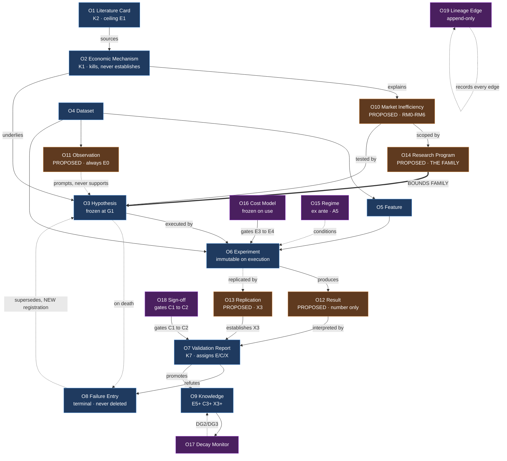

# Research Object Schema

**Version:** 1.0 · **Status:** Canonical (candidate — extends an unsigned baseline; see §0.4) · **Layer:** L2 — Research Architecture
**Owner:** Research Architect · **Last Updated:** 2026-07-15 · **Supersedes:** — (initial version). **Does NOT supersede [[RESEARCH_OBJECT_MODEL]]** — see §0.1.
**Realized in v3:** `research/knowledge` (hypotheses, `hypothesis_links`, receipt-bound `set_status`) · `research/gatekeeper` (validation reports) · `research/regime` (`regime_profiles`) · `failure_registry` · edge registry + R-10 lifecycle · `research.tracking` (provenance envelope). See [[RESEARCH_OS_RECONCILIATION]] §4.
**Scientific basis:** [[01_SCIENTIFIC_FOUNDATION]] §3 (world ontology — **distinct from this artifact ontology**), §4.3 (evidential weight is a property of process), §8 (reproducibility), §5.2 (falsifiable-claim anatomy)
**Governance:** [[RESEARCH_OS_MASTER_ROADMAP]] §4 (Core vs Extension, **D-005**), [[DECISION_LOG]] **D-020**, [[EVIDENCE_MODEL]] (E/C/X axes)

---

## 0. Authority and scope

### 0.1 The extension relationship — read this before anything else

[[RESEARCH_OBJECT_MODEL]] v1.0 is **canonical and unaltered by this document.** It declares **which objects exist** and their **core fields**. It is not superseded, deprecated, or re-scoped.

What it does not do — and does not claim to do — is specify, for any object: **lifecycle, relationships, ownership, versioning, provenance, or evidence requirements.** Those six facets are absent from it entirely. That absence is this document's entire subject.

| | [[RESEARCH_OBJECT_MODEL]] | **This document** |
|---|---|---|
| Declares objects exist | ✅ | ❌ — cannot add an object without D-005 amendment (§4.0) |
| Core field lists | ✅ | ❌ — **never restated here** |
| Purpose | implicit | ✅ explicit |
| Additional attributes | ❌ | ✅ — **additive only** |
| **Lifecycle** | ❌ | ✅ |
| **Relationships** | ❌ | ✅ |
| **Ownership** | ❌ | ✅ |
| **Versioning** | ❌ | ✅ |
| **Provenance** | ❌ | ✅ |
| **Evidence requirements** | ❌ | ✅ |

> **Rule OS-1 (justified by D-020):** This document **never restates** a field declared in [[RESEARCH_OBJECT_MODEL]]. Where a field exists there, this document cites it. Where a field is *missing* for a facet specified here, this document declares it as an **addition** and flags it as an amendment requiring Research Architect approval. **A reader must consult both documents; neither is complete alone.** That is a deliberate cost of D-020's extend-don't-restate discipline, and §9 records it as a real defect to revisit when L1 is signed.

### 0.2 Artifact ontology, not world ontology

Per [[01_SCIENTIFIC_FOUNDATION]] §3: *"This document's ontology answers 'what is out there that we study?' The Research Object Model answers 'what do we produce while studying it?' … Confusing the two is the reification error."*

Everything here is an **artifact** — an institutional record. A `Market Inefficiency Object` is our record of a conjecture about an inefficiency; the inefficiency, if real, is a feature of the world and is not in this document. **This distinction is not pedantry.** The reification error is what turns "our record of a conjecture" into "the edge we have," and it does so silently, through nothing more than a schema field.

### 0.3 What this document does not contain

No storage, no database, no serialization, no API, no code, no thresholds. Field *types* are stated only where the type is a **scientific** constraint (e.g. "append-only" is a scientific requirement per **R12**, not a storage choice). Physical realization is L4 ([[FUTURE_GOVERNANCE_OUTLINES]] §1–§3).

### 0.4 Baseline inheritance (binding)

Extends [[RESEARCH_OBJECT_MODEL]] v1.0 (canonical) and depends on [[01_SCIENTIFIC_FOUNDATION]] v1.0 (**certified-ready, NOT FROZEN** — [[DECISION_LOG]] **D-018/D-019**). Evidence requirements here resolve to [[EVIDENCE_MODEL]], which is itself candidate. If L1 review alters E0–E7 or R10, the evidence-requirement facet is void pending re-derivation.

---

## 1. The nine-facet specification

Every object is specified across nine facets. Six of the nine (**bold**) have no counterpart in the existing corpus.

| # | Facet | Answers | Basis |
|---|---|---|---|
| 1 | **Purpose** | Why the object exists; which rule it makes enforceable | P4 — an object not protecting claim credibility is bureaucracy |
| 2 | **Mandatory attributes** | Without which the object is invalid | §5.2 |
| 3 | **Optional attributes** | Additive, non-blocking | D-005 |
| 4 | **Lifecycle** | States and admissible transitions | §2.4 (custody), R6 |
| 5 | **Relationships** | Edges to other objects; cardinality | §4.3 (lineage) |
| 6 | **Ownership** | Who may create, amend, approve, retire | [[RESEARCH_OPERATING_MODEL]] §5 |
| 7 | **Versioning** | When a change forks vs amends | Non-retroactive amendment (v3 invariant) |
| 8 | **Provenance** | What must be recorded to reconstruct it | **§4.3, §8** |
| 9 | **Evidence requirements** | What tier/confidence/reproducibility it must carry | [[EVIDENCE_MODEL]] |

### 1.1 Cross-cutting rules

> **Rule OS-2 (justified by §4.3, §8.2):** **Provenance is part of the evidence, not metadata about it.** §4.3: *"the evidential weight of a result is not recoverable from the result."* An object whose provenance facet is incomplete is not a poorly-documented object — its evidential weight is **unknowable**, which per **R19/EV-6** makes it **X0: void, not pending.**

> **Rule OS-3 (justified by R12, §4.4):** Every object recording a **claim, a result, or a failure** is **append-only in substance**. Amendment forks a version; it never overwrites. Rationale is not audit hygiene: §4.4 holds that suppressing negative evidence *"corrupts every future multiplicity calculation by hiding the denominator."* **A mutable object is a suppressible object.**

> **Rule OS-4 (justified by R5, §5.2):** Objects carrying **pre-registered content** — Hypothesis, Experiment design, Cost Model, family declaration — are **frozen on use** and thereafter immutable. §2.3: *"criteria chosen after the data are seen are not criteria; they are descriptions."* Mutability after use is R7.4 (threshold migration) **enabled by schema**, and per §7.3 the result is a counterfeit indistinguishable from the genuine article by inspection.

> **Rule OS-5 (justified by R6):** Where a rule can be enforced by the object's structure, it **must** be, not requested. R6: *"a prohibition that relies on a researcher's discipline is a statement of intent, not a control."* A schema is a control; a convention is not.

---

## 2. Object inventory

Per [[RESEARCH_OS_MASTER_ROADMAP]] §4 (**D-005**), objects split Core / Extension. This document specifies all declared objects and **proposes five additions** (§4).

| # | Object | Class | Declared in | Status |
|---|---|---|---|---|
| **O1** | Literature Card | Core | ROM | Specified §3.1 |
| **O2** | Economic Mechanism | Core | ROM | Specified §3.2 |
| **O3** | Research Hypothesis | Core | ROM | Specified §3.3 |
| **O4** | Dataset | Core | ROM | Specified §3.4 |
| **O5** | Feature Definition | Core | ROM | Specified §3.5 |
| **O6** | Experiment | Core | ROM | Specified §3.6 |
| **O7** | Validation Report | Core | ROM | Specified §3.7 |
| **O8** | Failure Library Entry | Core | ROM | Specified §3.8 |
| **O9** | Accepted Knowledge Object | Core | ROM | Specified §3.9 |
| **O10** | **Market Inefficiency** | **Core** | — | **PROPOSED §4.1** |
| **O11** | **Observation** | **Core** | — | **PROPOSED §4.2** |
| **O12** | **Result** | **Core** | — | **PROPOSED §4.3** |
| **O13** | **Replication** | **Core** | — | **PROPOSED §4.4** |
| **O14** | **Research Program** | **Core** | — | **PROPOSED §4.5** |
| O15 | Regime | Extension | Roadmap §4 | Specified §5.1 |
| O16 | Cost Model | Extension | Roadmap §4 | Specified §5.2 |
| O17 | Decay Monitor | Extension | Roadmap §4 | Specified §5.3 |
| O18 | Reviewer Sign-off | Extension | Roadmap §4 | Specified §5.4 |
| O19 | Lineage Edge | Extension | Roadmap §4 | Specified §5.5 |

---

## 3. Core objects (declared in [[RESEARCH_OBJECT_MODEL]])

For each: ROM's fields are **cited, not restated**. Only additions and the six missing facets appear.

### 3.1 · O1 Literature Card

**Purpose.** To hold a mechanism authored **blind to our data** — per [[LITERATURE_RESEARCH_STANDARD]] §0.1, the institution's only structurally-guaranteed source of non-retro-fitted mechanisms (§7.3). **The Card's purpose is not to record a paper.** A Card that records findings has recorded the one thing we never use (LR-1).

**ROM fields (cited, unaltered).** `card_id` · `source` · `identified_mechanisms` · `empirical_claims` · `limitations`.

**Additions — required by [[LITERATURE_RESEARCH_STANDARD]], absent from ROM.** *Amendment: Research Architect.*

| Field | Why mandatory |
|---|---|
| `quality_grade` | Q0–Q4 (LR §3.1). **Grades the mechanism, not the finding** |
| `sub_class_ref` | → O2; resolves to [[ECONOMIC_MECHANISM_TAXONOMY]] |
| `transportability_condition` | What must be true of IDX (LR §3.2c). **Highest-leverage field on the Card — kills more candidates than any other, at F1 cost** |
| `weakest_link` | Where the chain most likely fails here (LR-9) |
| `biases[]` | B1–B9 (LR §5). **B1 always present** — a property of the corpus, not the paper |
| `barrier_statement` | The D3 persistence story, or explicit *absent* |
| `replication_status` | Factual. **Does not affect `quality_grade`** (LR-7) |
| `rivals[]` | Rivals the paper considered (M-3) |

**Optional.** `contradicts[]` → O1 · `superseded_by` → O1 · `retraction_status`.

**Lifecycle.** `DRAFT → EXTRACTED → SYNTHESIZED` · `→ RETRACTED` (retained) · `→ SUPERSEDED` (retained). **No terminal delete** — LR-15.

**Relationships.** `sources` → O2 (n:1) · `cited_by` → O3 (1:n) · `contradicts` ↔ O1 (n:n, **never resolved by editing** — LR-13).

**Ownership.** Create: Quant Researcher. Amend: **prohibited** (append a new Card — LR §9). Approve: none (a Card is not a claim). Retire: **never**.

**Versioning.** **Immutable on creation.** A Card is a fact about what was known when it was written; a new paper is a new Card. Rule OS-3.

**Provenance.** `source` resolving to obtainable full text (EX7) · extractor identity · extraction date · search frame that found it (LR §1.2).

**Evidence.** Class **K2**; ceiling **E1**, absolute and non-aggregable (**EV-1**). A Card **never** raises confidence, lowers a bar, or supports a finding (**LR-14**, CR6).

---

### 3.2 · O2 Economic Mechanism

**Purpose.** To make **R18** enforceable — no statistical result suffices absent an ex-ante mechanism. The object exists so that "was there a mechanism, and when was it authored?" is answerable from the record rather than from memory.

**ROM fields (cited).** `mechanism_id` · `classification` · `causal_graph` · `half_life_estimate`. ROM already binds `classification` to [[01_SCIENTIFIC_FOUNDATION]] §3.4 (M1–M6).

**Additions.** *Amendment: Research Architect.*

| Field | Why |
|---|---|
| `sub_class` | Resolves to [[ECONOMIC_MECHANISM_TAXONOMY]] M`<c>`.`<n>`. **Rule M-1: no M7.x** |
| `participant_class` | **R9** — a class without a named participant class is not a classification |
| `constraint` | **R9** — the specific binding constraint |
| `persistence_barrier` | One of §6.3's seven. **Rule I-1: absent ⇒ inadmissible** |
| `reversion_permanence` | Rule M-4 cell (§8.1). **Declared before testing** |
| `rivals[]` | Rule M-3 |
| `falsification_sentence` | §5.1 counterfactual interview — **one sentence** |
| `authored_at` + `blind_to` | **The load-bearing pair.** §7.3: the mechanism requirement does its work **only** if authored in ignorance of the result. `blind_to` names the experiments not yet run when this was authored |
| `source_cards[]` | → O1 |

> **Rule OS-6 (justified by §7.3, R7.3, OS-5):** `authored_at` and `blind_to` are **structural enforcement of the S2→S3→S6 ordering**. §7.3 holds that a retro-fitted mechanism is a **counterfeit indistinguishable from the genuine article by inspection**, and therefore *"the ordering must be enforced by process rather than judged by review."* These two fields are that process. **A mechanism whose `authored_at` postdates any experiment in `blind_to` is U3 and voids every claim resting on it.** Per OS-5, this is enforceable by structure and so must be.

**Lifecycle.** `PROPOSED → CLASSIFIED → REGISTERED` · `→ REFUTED` (F1, retained) · `→ DECAYED` (F9/DG2, retained). **F1 is the cheapest death available** (§5.3) and this object is where it happens — before data, custody, or multiplicity budget is spent.

**Relationships.** `classified_as` → taxonomy sub-class (n:1) · `sourced_from` → O1 (n:n) · `explains` → O10 (n:n) · `underlies` → O3 (1:n) · `rival_of` ↔ O2 (n:n).

**Ownership.** Create: Quant Researcher. Approve: **CRO at G1**. Amend: **prohibited after registration** (OS-4). Retire: CRO, on F1 or DG2.

**Versioning.** **Frozen on first reference by a Hypothesis.** A revised mechanism is a **new mechanism** with a new `authored_at`, and it is **not blind** to results obtained under the old one — which the new `blind_to` must state. This is where a rescue would enter (**R15**) and the versioning rule is what makes it visible.

**Provenance.** `authored_at` · `blind_to` · `source_cards[]` · author identity · **the experiments extant at authorship**.

**Evidence.** Class **K1** (theoretical). Per **EV-2**: **can kill a claim outright (F1); can never establish one.** Asymmetric by design.

---

### 3.3 · O3 Research Hypothesis

**Purpose.** To make a claim **risked** rather than described (§2.3). The object *is* the pre-registration; its immutability is the mechanism by which R5 becomes enforceable rather than aspirational.

**ROM fields (cited).** `hypothesis_id` · `mechanism` · `economic_rationale` · `prediction` · `null_hypothesis` · `alternative_hypothesis` · `required_data` · `validation_criteria` · `status`. ROM already binds `required_data` to [[DATA_FEASIBILITY_STUDY]] §4 (**D-002**).

**Additions — the §5.2 six-part anatomy is not fully covered by ROM.** *Amendment: Research Architect.*

| Field | §5.2 element | Why |
|---|---|---|
| `mechanism_ref` → O2 | 1 · mechanism | ROM has `mechanism` as free text; **R9 requires a resolvable class + participant + constraint** |
| `direction` | 2 · directional prediction | **Sign-specified.** "Related to" is not a prediction |
| `scope` | 4 · scope | Universe, horizon, regime, period. **A claim without scope is trivially true somewhere or unfalsifiable everywhere** |
| `effect_size_floor` | 5 · ex-ante criterion | **Significance alone is insufficient.** An effect smaller than its own cost is a *confirmed irrelevance* (§5.5) |
| `multiplicity_family` → O14 | 6 · **the family** | **The denominator is part of the claim** (R7.5). Declared before; **never narrowed after** |
| `refutation_condition` | R14 | The one-sentence counterfactual. **Absent ⇒ not admitted. Not deferred, not weakened — not admitted** |
| `inefficiency_ref` → O10 | — | The taxonomy entry it tests |
| `program_ref` → O14 | — | Its family and its Program |
| `custody_state` | §2.4 | Discovery / Confirmation / Accepted |
| `oos_period` + `oos_opened_at` | R6 | **OOS is a non-renewable resource; every unlogged glance silently converts it to in-sample while leaving its appearance unchanged** |
| `power_analysis` / `mde` | **R2** | A test incapable of failing produces **no evidence** — not weak evidence |
| `supersedes` → O3 | R15 | A *new* claim learning from a dead one. **Not a rescue** |
| `retirement_rule` | **EV-12** | Pre-committed at promotion. Authored later, it is authored under the pressure that makes it wrong |

**Lifecycle.** Fully specified in [[HYPOTHESIS_LIFECYCLE]]. Note: ROM's `status` enumeration (`REGISTERED, IN_TESTING, VALIDATED, FAILED`) and [[TAXONOMY_AND_NAMING_STANDARD]] §6's identical set are **both incomplete** against that document's state machine. **Recorded as a gap, not amended here** (§9, D-020).

**Relationships.** `tests` → O10 (n:1) · `rests_on` → O2 (n:1) · `belongs_to` → O14 (n:1) · `cites` → O1 (n:n) · `requires` → O4 (n:n) · `executed_by` → O6 (1:n) · `supersedes` → O3 (n:1) · `produced` → O8 on death (1:1).

**Ownership.** Create: Quant Researcher. Approve: **CRO at G1**. Amend: **prohibited after G1** (OS-4). Retire: CRO.

**Versioning.** **Frozen at G1 approval.** *"The only legitimate response to a falsified hypothesis is: record the failure, and — if the failure taught a new mechanism — register a **new** hypothesis, with a new pre-registration, counted in the family"* (**R15**). The version rule enforces R15: there is no path that edits a registered hypothesis, so a rescue cannot be expressed.

**Provenance.** Registration timestamp · approver · `blind_to` at registration · family declaration and its size at declaration · custody log for `oos_period`.

**Evidence.** The hypothesis carries **no** evidence — it is the claim, not its support. Its **admissibility** requires all six §5.2 elements; **any missing ⇒ G1 refuses.**

---

### 3.4 · O4 Dataset

**Purpose.** To make **A3** auditable — *available data faithfully represents the mechanism's operation at the fidelity we claim.* Per **LIM1**, observational fidelity is bounded and *"the bound is not a detail."* The object exists to carry the bound with the claim.

**ROM fields (cited).** `dataset_id` · `asset_class` · `resolution` · `regime_classification` · `provenance_hash`. ROM binds `resolution` to [[DATA_FEASIBILITY_STUDY]] §3–§4.

**Additions.** | `capability_class` — Available Today / Obtainable Later / Future / Unrealistic (**D-002**, the binding scope constraint) | `fidelity_limit` — **LIM1**; what this data **cannot** distinguish | `proxy_for` — if a proxy, the mechanism it proxies; **the claim inherits the proxy's fidelity** (LR-5) | `point_in_time` — whether reconstructible as-known-then (**F7**) | `corporate_actions_applied` — a P0-era contamination surface | `custody_partition` — in-sample / out-of-sample / forward |

**Lifecycle.** `DECLARED → FINGERPRINTED → FROZEN` · `→ SUPERSEDED` (retained; prior experiments remain bound to the prior fingerprint).

**Relationships.** `used_by` → O6 (1:n) · `feeds` → O5 (1:n) · `proxy_for` → O2 (n:1) · `classified_by` → O15 (n:n).

**Ownership.** Create/maintain: **Data Engineer**. Approve `capability_class`: CRO ([[DATA_FEASIBILITY_STUDY]] is binding). Amend after freeze: prohibited.

**Versioning.** **Immutable on fingerprint.** A revised dataset is a new Dataset. Experiments bind the fingerprint, not the name — otherwise a silent upstream revision retroactively changes what a completed experiment tested, which is F7 arriving through the back door.

**Provenance.** `provenance_hash` · vendor + retrieval time · transformation lineage · `point_in_time` construction argument.

**Evidence.** Class **K3**. **Tier depends entirely on custody, not on the data** — the same dataset yields E0 in Discovery and E3 in Confirmation (§2.4). **This is the E-axis fact most often misread**, and the `custody_partition` field is what makes it checkable.

---

### 3.5 · O5 Feature Definition

**Purpose.** To make a measurement **reconstructible** — per **P8**, an irreproducible result is not a result.

**ROM fields (cited).** `feature_id` · `mathematical_formulation` · `code_reference` · `dependencies`.

**Additions.** | `measures` → O2 — **which mechanism this measures. R8: a claim stated only at the level of measurements is not a mechanism claim and cannot become one by assertion** | `point_in_time_argument` — why no future information enters (**F7**) | `parameter_provenance` — where each constant came from; **a parameter chosen from the data is in-sample fit wearing a feature's clothes (E0)** | `frozen_at` |

**Lifecycle.** `DRAFT → REVIEWED (G2) → FROZEN` · `→ SUPERSEDED` (branch-on-upstream-change).

**Relationships.** `measures` → O2 (n:1) · `depends_on` → O5 / O4 (n:n, **DAG — cycles prohibited**) · `used_by` → O6 (1:n).

**Ownership.** Create: Quant Researcher. Approve: **G2 Code Review**. Amend after freeze: prohibited.

**Versioning.** `Feature_v[M].[m]_[hash]`; **branch-on-upstream-change** ([[FUTURE_GOVERNANCE_OUTLINES]] §3). A change to a dependency **forks** the dependent — it never silently alters it.

**Provenance.** `code_reference` at a resolvable commit · dependency closure · `parameter_provenance` · environment.

**Evidence.** Carries none. **A feature is an instrument, not a claim** — and per §3.2 of L1 a "signal" that cannot be decomposed into *(constraint → participant behavior → price consequence)* is a curve fit with a name. The `measures` field is what prevents this object from becoming one.

---

### 3.6 · O6 Experiment

**Purpose.** To make an execution **auditable** and its **custody** enforceable rather than requested (**R6**).

**ROM fields (cited).** `experiment_id` · `hypothesis_ref` · `feature_set_ref` · `in_sample_period` · `out_of_sample_period` · `methodology`.

**Additions.** | `cost_model_ref` → O16 — **the model registered ex ante, not one selected after** | `dataset_fingerprints[]` — bound at execution | `run_id`, `git_commit`, `seed`, `environment` — the reproducibility set (**X2 minimum**) | `custody_receipt` — **when OOS was opened, by whom, once** | `family_ref` → O14 — the declared family **at execution time** | `executed_at` |

**Lifecycle.** `DESIGNED → APPROVED (G2) → EXECUTED → REVIEWED` · `→ VOID` (**F6/X0 — void, not pending**, R19).

**Relationships.** `tests` → O3 (n:1) · `uses` → O5, O4, O16 (n:n) · `produces` → O12 (1:1) · `replicated_by` → O13 (1:n).

**Ownership.** Create: Quant Researcher. Approve: G2. Execute: Quant Researcher. **Amend after execution: prohibited.**

**Versioning.** **Immutable on execution.** A re-run is a **new Experiment counted in the family.** *"Re-running with adjusted parameters and reporting the survivor"* is prohibited (**R15**) — and the versioning rule is what makes a re-run visible in the denominator rather than invisible in a revision.

**Provenance.** **The full X2 set.** Per **OS-2**, incomplete ⇒ **X0 ⇒ void**, at any tier, at any confidence, at any date (**DG1**).

**Evidence.** Class **K4**. Tier bounded by the custody it actually enforced — **not by the custody it intended.**

---

### 3.7 · O7 Validation Report

**Purpose.** To record the **adversarial** attempt, not the confirmatory summary. Per **R4** the burden rests permanently on the proponent; this object is where the reviewer discharges the attack that burden invites.

**ROM fields (cited).** `report_id` · `experiment_ref` · `statistical_metrics` · `reviewer_notes` · `decision`.

**Additions.** | `severity_argument` — **EV-3**: *what would have had to be true for this test to have caught the error, and was it capable of that?* **Prose, not a p-value.** Unanswered ⇒ not evidence | `evidence_tier` — E0–E7 · `confidence` — C0–C4 · `reproducibility` — X0–X4 ([[EVIDENCE_MODEL]]) | `family_size_at_review` — **the true denominator, which may exceed the declared one (DG4)** | `f_mode` — if refuted, which of F1–F9 | `attribution_defense` — **R1**: defend the attribution against the auxiliary explanations Duhem–Quine says cannot be assumed away | `reviewer_independence` — **LIM6**: author ≠ reviewer, or state that it is not |

**Lifecycle.** `DRAFT → FINALIZED`. Immutable thereafter.

**Relationships.** `evaluates` → O6 (n:1) · `signed_by` → O18 (1:n) · `promotes/refutes` → O3 (1:1) · `produces` → O8 on refutation (1:1).

**Ownership.** Create: **Validation Reviewer**. Approve: G3 (automated) + G4 (peer defense). Amend: prohibited.

**Versioning.** Immutable on finalization.

**Provenance.** Reviewer identity · `reviewer_independence` · metrics inputs · family size at review.

**Evidence.** Class **K7** (adversarial). Per **EV-9**: **can raise C, cannot raise E, and can destroy both.**

> **LIM6 binds this object harder than any other.** [[RESEARCH_OPERATING_MODEL]]'s header records that §5–§6 presuppose ≥3 distinct humans and the institution has one. Per **EV-9**, **C2 is the practical ceiling for a single-researcher claim** — a structural fact, not a staffing gap. `reviewer_independence` exists to make that visible on every report rather than forgotten on all of them. **This is the same limit that leaves Phase A at GO WITH CONDITIONS (D-019).**

---

### 3.8 · O8 Failure Library Entry

**Purpose.** Per **R12**, *a competent refutation is a first-class institutional product, of equal standing to a validated mechanism.* This object is that standing, made structural.

**ROM fields (cited).** `failure_id` · `hypothesis_ref` · `falsification_reason` · `lessons_learned`.

**Additions.** | `f_mode` — **exactly one** of F1–F9 | `attribution_defense` — **R1**: *"every falsification must name what specifically was falsified and defend that attribution against the alternative auxiliary explanations"* | `invalid_assumptions[]` — A1–A8 | `family_position` — which of N this was; **the denominator datum** | `cost_incurred` — data, custody, multiplicity budget spent; **the F1-efficiency datum** |

> **Rule OS-7 (justified by §5.3, R1):** `f_mode` is **exactly one** value and `attribution_defense` is **mandatory**. Per **R1**, Duhem–Quine means a bare "the test failed" is not knowledge — the attribution must be *defended*, not asserted. And per §5.3, **the distribution of failures across F1–F9 is a diagnostic of the institution itself** and *"the highest-value analysis the Failure Library enables."* A multi-valued or undefended `f_mode` destroys that distribution, which is the one analysis this object exists to make possible.

**Lifecycle.** `RECORDED`. **Terminal. Immutable. No deletion, ever.**

**Relationships.** `records` → O3 (1:1) · `attributed_to` → F-mode (n:1) · `informs` → O3 via `supersedes` (1:n).

**Ownership.** Create: **mandatory on any refutation** — Quant Researcher or Validation Reviewer. Amend: prohibited. **Delete: prohibited absolutely.**

**Versioning.** N/A — immutable.

**Provenance.** Full lineage of the dead hypothesis, retained. **A dead claim's lineage is not garbage; it is the denominator.**

**Evidence.** **A refutation is accepted on first competent demonstration** (§2.2) — the asymmetry is deliberate. It does not require E4. Per §5.5: slow to believe, fast to disbelieve.

> **Why deletion is prohibited absolutely.** §4.4: *"a Failure Library that is optional is a Failure Library that is empty, and an empty one silently biases every DSR the institution ever computes."* Deleting one entry biases every future multiplicity calculation **by an amount no one can subsequently measure**. The prohibition is not sentiment about record-keeping; it is arithmetic.

---

### 3.9 · O9 Accepted Knowledge Object

**Purpose.** To hold a **provisional, revocable** institutional belief. Per **P3**, knowledge is *"a set of surviving conjectures, not a set of discoveries"* — *"which is why the Knowledge Object lifecycle terminates in DECAYED/RETIRED rather than in permanence."*

**ROM fields (cited).** `knowledge_id` · `mechanism_ref` · `validation_ref` · `decay_monitor_id`.

**Additions.** | `evidence_tier` ≥ **E5** and `confidence` = **C3+** and `reproducibility` ≥ **X3** ([[EVIDENCE_MODEL]] §5.1 — **note E4 caps at C2 and C2 licenses no capital; R10's E4 is the floor of the conversation, not its conclusion**) | `inefficiency_ref` → O10 | `decay_hypothesis` — what kind of decay its barrier admits (**EV-11**) | `retirement_rule` — **pre-committed at promotion (EV-12)** | `capacity_limit` — **A4 fails at scale** (F8) | `receipt_ref` — **no status transition without an evidence receipt** (v3 R-10, inherited) |

**Lifecycle.** `ACCEPTED → MONITORED → (DECAYED | RETIRED)`. **Terminates in mortality — by design (P7).**

**Relationships.** `rests_on` → O7 (n:1) · `about` → O10 (n:1) · `explained_by` → O2 (n:1) · `monitored_by` → O17 (1:1) · `consumed_by` → **capital allocation, outside this architecture** ([[01_SCIENTIFIC_FOUNDATION]] §0.1: research produces knowledge; capital consumes it; **the reverse dependency is prohibited**).

**Ownership.** Create: **CRO only**, on G4. Amend: prohibited. Retire: CRO, or **automatically on any DG1–DG9 trigger**.

**Versioning.** Immutable. A revised claim is a new Knowledge Object resting on new validation.

**Provenance.** Complete lineage: Card → Mechanism → Hypothesis → Experiment → Result → Report → here. **Any break voids it** (R19).

**Evidence.** ≥E5 / C3 / X3. **Degrades on any DG trigger — immediately, without a decision** ([[EVIDENCE_MODEL]] §6).

> **P7 made structural.** *"Validated knowledge is depreciating inventory, and the institution's steady-state obligation is replacement, not accumulation."* The `decay_hypothesis` and `retirement_rule` fields are that sentence turned into schema. An Accepted Knowledge Object without them is an asset booked with no depreciation schedule — which is the accounting error P7 exists to prevent.

---

## 4. Proposed additions

### 4.0 Amendment status

**These five objects are not declared in [[RESEARCH_OBJECT_MODEL]] and are not in [[RESEARCH_OS_MASTER_ROADMAP]] §4's Core/Extension split (D-005).** Per **D-020** this document has no authority to declare an object. They are **PROPOSED**, requiring a D-005 amendment (CRO + Research Architect). Specified here so the proposal is concrete; **not admitted until approved.** Recorded in [[KNOWLEDGE_CORPUS_DELIVERY]] §5 as **Gap G-1** and §4 as a required roadmap update.

---

### 4.1 · O10 Market Inefficiency **[PROPOSED]**

**Purpose.** To make [[MARKET_INEFFICIENCY_TAXONOMY]] entries **first-class and referenceable**, so a hypothesis binds to a *catalogued conjecture about the world* rather than restating one. Without it, every hypothesis re-authors its own inefficiency and the taxonomy is prose no schema can enforce (**OS-5**).

**Mandatory.** `inefficiency_id` (I`<n>`) · `definition` · `counterfactual` (**§3.2 — a deviation claim without a stated counterfactual is empty**) · `mechanism_refs[]` → O2 · `persistence_barrier` (§6.3) · `half_life_hypothesis` + `basis` (**P7 — a research question, not an assumption**) · `observable_manifestations[]` · `required_evidence_tier` · `likely_f_modes[]` · `interactions[]` · `research_maturity` (RM0–RM6).

**Optional.** `program_refs[]` → O14 · `knowledge_refs[]` → O9.

**Lifecycle.** `RM0 → RM1 → RM2 → RM3 → RM4 → RM5 → RM6`. **RM6 is terminal and permanent** — never deleted (Taxonomy §6). **RM3→RM4 requires a pre-registered OOS test capable of failing (Rule I-2)** — this is the transition where institutions deceive themselves.

**Relationships.** `explained_by` → O2 (n:n) · `tested_by` → O3 (1:n) · `confounds` ↔ O10 (n:n) · `subsumes` → O10 (n:n) · `modifies` → O10 (n:n).

> **Rule OS-8 (justified by Taxonomy §4, R3):** The three interaction kinds are **structurally distinct and must not collapse into one edge type**. `confounds` ⇒ **severity is zero** for discriminating the pair (R3). `subsumes` ⇒ evidence is **not independent**; pooling inflates the effective sample and understates the family. `modifies` ⇒ **not a rival**; testable only jointly. An undifferentiated "related-to" edge would erase the distinction that makes the graph useful — and it is exactly the distinction the I5↔I7 identification problem turns on.

**Ownership.** Create: Quant Researcher. Approve: **CRO** (Taxonomy §6). Amend maturity: CRO on evidence. **Delete: prohibited.**

**Versioning.** Append-only. Maturity changes are **logged transitions with receipts**, never field edits — otherwise RM3→RM4 is an edit rather than an event, and Rule I-2 has nothing to bind to.

**Provenance.** Source Cards · CRO approval · every maturity transition with its evidence.

**Evidence.** The object holds none; it **references** the tier its entry has reached. **Presence is not evidence — RM is.** Per Taxonomy §5.4, eleven of twelve entries are RM0/RM1 and **the institution currently has zero validated inefficiencies**; the object must make that legible at a glance, because a catalogue that reads as an inventory of edges when it is an inventory of conjectures is the precise failure P4 names.

---

### 4.2 · O11 Observation **[PROPOSED]**

**Purpose.** To hold a **measured fact with no claim attached** — separating *what we saw* from *what we assert*. Absent this object, an observation is recorded as a weak Result, and a weak Result reads as weak evidence. Per **R2/U7**, an observation from an unpowered look is **not weak evidence — it is no evidence**, and the schema must make that a *type* distinction rather than a magnitude one.

**Mandatory.** `observation_id` · `dataset_ref` → O4 · `feature_refs[]` → O5 · `custody_state` (**§2.4**) · `measurement` · `observed_at` · `claim: NONE` (**structural, not decorative**).

**Optional.** `prompted_hypothesis` → O3 · `regime_ref` → O15.

**Lifecycle.** `RECORDED`. Terminal, immutable.

**Relationships.** `measured_from` → O4 (n:1) · `prompted` → O3 (1:n) · `never supports` → O9 — **structurally prohibited**.

**Ownership.** Create: Quant Researcher, freely, in Discovery. **Unlimited** — *"Discovery licenses conjecture, exploration, unlimited searching, no claims"* (§2.4).

**Versioning.** Immutable.

**Provenance.** Dataset fingerprint · custody state at observation · **whether it was one of many looks** (the family datum).

**Evidence.** **E0. Always. Regardless of magnitude.** *"In-sample fit; a pattern found by searching — weight: zero; guaranteed obtainable by search; discriminates nothing."* An Observation is **hypothesis material** and never anything else.

> **Rule OS-9 (justified by §2.4, R6):** An Observation **cannot be promoted** to a Result. The path is **Observation → Hypothesis → Experiment → Result**, and it necessarily passes through pre-registration. Per **R6**, custody must be *enforced, not requested*: a schema permitting `observation.promote()` would make the in-sample→claim conversion a one-line operation — the exact silent conversion §2.4 says leaves the data's appearance unchanged while destroying its evidential value. **The absence of that method is the control.**

---

### 4.3 · O12 Result **[PROPOSED]**

**Purpose.** To separate **what an experiment produced** from **what a reviewer concluded**. Today both live in the Validation Report, which fuses the datum with its interpretation. Per **§4.3**, *"the evidential weight of a result is not recoverable from the result"* — so the result and its weight are **different objects**, and fusing them makes the weight look like a property of the number.

**Mandatory.** `result_id` · `experiment_ref` → O6 (1:1) · `measurement` · `criterion_met` (**against the ex-ante criterion, verbatim from the frozen Hypothesis**) · `produced_at` · `provenance_set` (run_id, git_commit, seed, fingerprints, environment).

**Optional.** `diagnostics[]` · `regime_breakdown` → O15.

**Lifecycle.** `PRODUCED → INTERPRETED (by O7)` · `→ VOID` (X0 — **R19**).

**Relationships.** `produced_by` → O6 (1:1) · `interpreted_by` → O7 (1:n) · `reproduced_by` → O13 (1:n).

**Ownership.** Create: automatic on execution. **Amend: prohibited absolutely** — a mutable Result is not a result.

**Versioning.** Immutable on production.

**Provenance.** The complete X2 set. Per **OS-2**, incomplete ⇒ **X0 ⇒ void**.

**Evidence.** **Carries a measurement, not a weight.** Weight is assigned by O7 using the process facts (family, custody, severity) that the Result cannot contain.

> **Why the split matters.** Per **R11**, *"a t-statistic of 3.0 from a single pre-registered test and a t-statistic of 3.0 selected from two hundred searched variants are not the same evidence, and no property of the number itself distinguishes them."* **The Result holds the number; the Report holds the difference.** One object cannot hold both without implying the number carries its own weight — which is exactly the belief §4.3 exists to destroy.

---

### 4.4 · O13 Replication **[PROPOSED]**

**Purpose.** To make **X3 an event with a record** rather than a claimed property. Per **P8**, reproducibility is *constitutive of the claim*; an unrecorded reproduction cannot be audited and therefore did not occur institutionally.

**Mandatory.** `replication_id` · `target_ref` → O6/O12 · `replicator` (**≠ original author — otherwise it is X1**) · `from_specification_only` (**boolean; false ⇒ not a replication**) · `conclusion_match` — **sign, rejection/non-rejection, order of magnitude (§8.3), *not* bit-identity** · `variations_applied[]` · `x_level_achieved`.

**Lifecycle.** `ATTEMPTED → (SUCCEEDED | FAILED)`. **FAILED ⇒ target → X0 ⇒ VOID (R19, DG1) — immediately, at any prior tier or confidence.**

**Relationships.** `replicates` → O6/O12 (n:1) · `establishes` → X-level (1:1).

**Ownership.** Create: any party **other than the original author**. **Structural, per LIM6/LIM8.**

**Versioning.** Immutable.

**Provenance.** Replicator identity · specification received · variations · date.

**Evidence.** Class **K5**; ceiling **E6** (EV-1).

> **LIM5 binds this object permanently and must be visible on it.** *Single-institution replication is weak replication.* An internal replication shares the data vendor, cost model, universe construction, and assumptions — so it tests the **specification's completeness**, which is real and valuable, and **not** the result's robustness to those shared choices. **X4 is structurally unavailable at this scale** ([[EVIDENCE_MODEL]] §4.1). `variations_applied[]` exists to record how little variation was actually possible — so that an X3 is never silently read as an X4 by an institution that has forgotten it has one lab.

---

### 4.5 · O14 Research Program **[PROPOSED]**

**Purpose.** Two purposes, and **the second is the load-bearing one**:
1. To organize research into governed tracks ([[RESEARCH_PROGRAM_STANDARD]]).
2. **To be the multiplicity family boundary.** Per **§5.2.6**, a hypothesis requires *"the denominator against which this test is one of N"* — and per **R7.5** narrowing it after the fact is prohibited. **A family with no object is a family with no enforcement.** The Program is that object.

**Mandatory.** `program_id` (P`<n>`) · `objective` · `inefficiency_refs[]` → O10 (**the scope**) · `capability_class` (Current / Future / Out-of-scope — **D-002, D-006**) · `family_declaration` — **the multiplicity family; declared at initiation, monotonically non-decreasing** · `success_criteria` · `termination_criteria` · `governance` · `review_cadence`.

**Optional.** `parent_program` → O14 · `work_packages[]`.

**Lifecycle.** `PROPOSED → APPROVED → ACTIVE → (COMPLETED | TERMINATED | SUSPENDED)`. Fully specified in [[RESEARCH_PROGRAM_STANDARD]] §6–§7.

**Relationships.** `scopes` → O10 (1:n) · `contains` → O3 (1:n) · `bounds_family_of` → O3 (1:n) · `child_of` → O14 (n:1).

**Ownership.** Create: Quant Researcher. Approve: **CRO**. Terminate: **CRO — and per [[RESEARCH_PROGRAM_STANDARD]] §7, termination is an obligation, not a failure.**

**Versioning.** `family_declaration` is **append-only and monotonically non-decreasing.**

> **Rule OS-10 (justified by R7.5, §5.2.6):** **`family_declaration` may only grow.** Every hypothesis registered under a Program joins its family; **no hypothesis leaves.** Per **R7.5** (*family reduction*), narrowing the family after the fact so a survivor clears is prohibited — *"the denominator is part of the claim."* **The append-only rule makes reduction unexpressible**, which per **OS-5/R6** is the only kind of prohibition that is a control rather than a statement of intent. This is the single most important structural rule in this document: it is the one that P0's own 42-cell family collapse demonstrates is load-bearing.

**Provenance.** Approval · family at every registration · every hypothesis ever registered, **including withdrawn and failed ones** — *especially* those: they are the denominator.

**Evidence.** Holds none. **Bounds the family that determines the C-axis of every claim inside it** ([[EVIDENCE_MODEL]] EV-4).

---

## 5. Extension objects

Per **D-005**, "optional" means *not required to define the first release* — **not "unbuilt"**; several already exist in v3 ([[RESEARCH_OS_RECONCILIATION]] §4). Specified compactly; the nine facets apply.

### 5.1 · O15 Regime
**Purpose:** to make regime-conditional claims falsifiable by giving the conditioning variable an ex-ante definition. **Mandatory:** `regime_id` · `definition` (**ex ante, declared before use — post-hoc is R7.4 and F5**) · `taxonomy_position` (hierarchical: 3-regime primary + declarable vol/liq axes, per v3 Phase D) · `identification_method`. **Lifecycle:** `DEFINED → DECLARED → APPLIED`. **Ownership:** Research Architect; CRO approves. **Versioning:** immutable on declaration. **Evidence:** carries none. **Rests on A5 — the corpus's self-declared weakest assumption**: *regimes are constructs, never measurements* (§3.1). **Realized in v3:** `research/regime`, `regime_profiles` (append-only).

### 5.2 · O16 Cost Model
**Purpose:** to make **F4** available — an effect smaller than its friction is a *confirmed irrelevance* (§5.5). **Mandatory:** `cost_model_id` · `components` (spread, impact, fees, slippage) · `impact_function` · `capacity_limit` · `frozen_at`. **Lifecycle:** `DRAFT → FROZEN → SUPERSEDED`. **Ownership:** Research Architect; CRO approves. **Versioning:** **frozen on first experimental use (OS-4)** — a cost model revised after seeing a result is R7.4. **Evidence:** carries none; **gates E3→E4**. **Note:** a revision that kills an accepted claim is **DG5**, not a modelling error.

### 5.3 · O17 Decay Monitor
**Purpose:** **P7** made operational — *validated knowledge is depreciating inventory.* **Mandatory:** `monitor_id` · `knowledge_ref` → O9 · `decay_hypothesis` (**what kind of decay the barrier admits**) · `watch_target` · `retirement_rule` (**pre-committed — EV-12**). **Lifecycle:** `ACTIVE → (TRIGGERED | RETIRED_WITH_KNOWLEDGE)`. **Ownership:** Research Architect; CRO retires. **Evidence:** produces **DG2/DG3** triggers.
> **Rule OS-11 (justified by EV-11):** `watch_target` **follows the barrier class.** An **M6 structural barrier decays as a step function on rule change** ([[ECONOMIC_MECHANISM_TAXONOMY]] §6), so its monitor watches a **rulebook**, not a return series. Applying return-based decay detection to an M6 mechanism detects nothing until long after the rule changed — it is watching the one variable the mechanism is not a function of. Per **LIM7** decay is detectable only in arrears; a mis-targeted monitor makes the lag unbounded.

### 5.4 · O18 Reviewer Sign-off
**Purpose:** to make **independence** a recorded fact rather than an assumption. **Mandatory:** `signoff_id` · `report_ref` → O7 · `reviewer` · `independence_attestation` (**author ≠ reviewer, or an explicit statement that it is not**) · `attempted_refutations[]` (**R4: the reviewer's mandate is to attempt refutation, and the record must show the attempt, not the conclusion**). **Lifecycle:** `PENDING → SIGNED`. **Ownership:** Validation Reviewer. **Evidence:** class **K7**; **gates C1→C2 (EV-9)**.
> **The institution's live constraint, and its own foundation's.** Per **LIM6/LIM8** and **ADR-L1-007**, a single researcher cannot supply this. **C2 is the practical ceiling** (EV-9). **[[PHASE_A_FREEZE_CERTIFICATE]] v2.1 is itself blocked on exactly this object** — one open condition, an external signature, owned by an External Validation Reviewer (**D-019**). The schema and the corpus that defines it are stopped at the same wall, and per **LIM8** self-certification is *epistemically indistinguishable from genuine certification*, which is why the wall cannot be climbed from inside.

### 5.5 · O19 Lineage Edge
**Purpose:** **§4.3** made structural — *"the evidential weight of a result is not recoverable from the result. It is recoverable only from the process that produced it."* **Mandatory:** `edge_id` · `from_ref` · `to_ref` · `edge_type` · `created_at`. **Lifecycle:** `CREATED`. Terminal. **Ownership:** system-generated; **never author-authored**. **Versioning:** **append-only, immutable**. **Realized in v3:** `hypothesis_links` (append-only).
> **Rule OS-12 (justified by §4.3):** Lineage edges are **append-only and never deleted**. §4.3: *"an institution that discards process history has not merely lost an audit trail — it has destroyed its ability to know what its own numbers mean."* A deleted edge does not weaken a claim; it makes the claim's weight **uncomputable**, which per **OS-2/R19** is **X0: void**.

---

## 6. Relationship graph

**Four structural facts the graph records:**

1. **`O14 ⇒ O3` is the load-bearing edge** (bold). The Program bounds the family; the family determines the C-axis of every claim inside it. **Without O14 there is no object to attach R7.5 to, and family reduction becomes a thing nobody can detect.**
2. **`O11 ⇢ O3` is dashed and one-way.** An Observation prompts a hypothesis; it never supports a claim. **The absence of a promotion path is the control** (OS-9).
3. **`O8 ⇢ O3` is the only path out of failure**, and it is a *new registration counted afresh in the family* (**R15**), not a revision. **There is no edge that edits a dead hypothesis** — that absence is R15 made structural.
4. **`O12 → O7` splits the number from its weight.** The Result holds the measurement; the Report holds the process facts that determine what it is worth (**R11**).

---

## 7. Cross-cutting: versioning, provenance, ownership

### 7.1 Versioning
Three regimes, and which one applies is a **scientific** question, not a storage preference:

| Regime | Objects | Rule |
|---|---|---|
| **Immutable on creation** | O1, O8, O11, O12, O13, O19 | Facts about what was known/measured/attempted |
| **Frozen on use** | O2, O3, O5, O6, O15, O16 | **Pre-registered content. OS-4 — mutability after use is R7.4 enabled by schema** |
| **Append-only, growing** | O10 (maturity), O14 (family) | **Monotonic. OS-10** |

**Nothing in this schema is freely mutable.** That is not caution; per **R6** an unenforced prohibition is a statement of intent, and per **§7.3** a rescued claim is *indistinguishable from a survived one by inspection*. Mutability is what makes the counterfeit possible.

### 7.2 Provenance
Minimum reproducibility set (**X2**) for any object carrying a measurement: `run_id` · `git_commit` · `dataset_fingerprint` · `seed` · `environment` · `cost_model_ref` · `family_ref` · `custody_receipt`. Realized in v3 as `research.tracking`.

Per **OS-2** and **R19**: incomplete ⇒ **X0** ⇒ **void, not pending**. Per **§8.5**, this will sometimes void results the institution believes are true — *"that is the rule working."*

### 7.3 Ownership
Per [[RESEARCH_OPERATING_MODEL]] §5. **Its header records the live limitation:** §5–§6 presuppose ≥3 distinct humans; the institution has one (**LIM6, ADR-L1-007**).

| Role | Creates | Approves |
|---|---|---|
| Quant Researcher | O1, O2, O3, O5, O6, O10, O11 | — |
| Data Engineer | O4 | — |
| Research Architect | O15, O16, O17, O19 | O5 (G2) |
| Validation Reviewer | O7, O13, O18 | G3, G4 |
| **CRO** | **O9 only** | G1, O2, O10, O14 |

> **The separation is the control, and it is currently unavailable.** Per **EV-9/LIM6**, one person filling every role means **C2 is the ceiling** for every claim this institution produces. The schema encodes the separation anyway — **not as aspiration, but because a schema that encoded the current reality would make the deficit invisible**, and per **LIM8** an invisible deficit is indistinguishable from no deficit.

---

## 8. Traceability

| This document | Extends | Never restates |
|---|---|---|
| §3 nine facets on O1–O9 | [[RESEARCH_OBJECT_MODEL]] v1.0 | **Its core field lists** |
| §4 proposed O10–O14 | Roadmap §4 (D-005) — **requires amendment** | — |
| §5 extension O15–O19 | Roadmap §4 | — |
| OS-2 provenance | [[01_SCIENTIFIC_FOUNDATION]] §4.3, §8 | §4.3's argument |
| OS-3/OS-4 immutability | R5, R12, R15, R7.4 | R7 |
| OS-6 `blind_to` | **§7.3** | §7.3's argument |
| OS-10 family append-only | **R7.5**, §5.2.6 | R7.5 |
| Evidence facets | [[EVIDENCE_MODEL]] E/C/X | The scales |
| Lifecycle facet (O3) | [[HYPOTHESIS_LIFECYCLE]] | The state machine |

---

## 9. Known gaps (recorded, not resolved)

Per **ADR-L1-008**, the corpus *records* inconsistencies rather than resolving them. This document inherits that discipline and adds three of its own — see [[KNOWLEDGE_CORPUS_DELIVERY]] §5.

| # | Gap | Consequence |
|---|---|---|
| **G-1** | **O10–O14 are PROPOSED** — not declared in ROM, not in D-005's split | Five objects specified but **not admitted**. Requires a D-005 amendment (CRO + Research Architect) |
| **G-2** | **ROM's `status` enumeration is incomplete** against [[HYPOTHESIS_LIFECYCLE]]'s state machine; [[TAXONOMY_AND_NAMING_STANDARD]] §6 carries the same incomplete set | Two canonical documents under-specify a state machine a third now specifies. **Not amended here (D-020)** |
| **G-3** | **Two-document reading burden** — ROM declares fields; this document declares facets; **neither is complete alone** | A cost of D-020's extend-don't-restate discipline. Revisit when L1 is signed and ROM may be amended without disturbing a pending certification |
