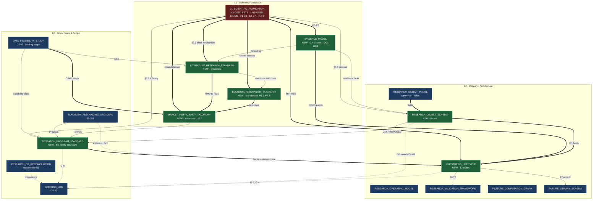

# Research Knowledge Corpus — Delivery, Traceability & Readiness

**Version:** 1.0 · **Status:** Delivery record · **Layer:** L0 — Governance & Scope (roadmap-adjacent)
**Owner:** Research Program Director · **Last Updated:** 2026-07-15 · **Supersedes:** — (initial version)
**Authority:** This is a **delivery and assessment record**, not a canonical specification. It creates no rules. Where it disagrees with a canonical document, the canonical document governs.
**Governance:** [[RESEARCH_OS_MASTER_ROADMAP]] · [[DECISION_LOG]] **D-020** · [[01_SCIENTIFIC_FOUNDATION]] (the baseline all seven extend)

---

## 1. What was delivered

Seven canonical documents, authored as a **strict extension** of the certified Phase-A corpus per **D-020**, filed by owning layer.

| # | Document | Layer | Location | Nature | New rules |
|---|---|---|---|---|---|
| 1 | [[MARKET_INEFFICIENCY_TAXONOMY]] | **L1** | `research_os/` | **Instance layer** under L1's D1–D6 / M1–M6 | I-1, I-2 |
| 2 | [[ECONOMIC_MECHANISM_TAXONOMY]] | **L1** | `research_os/` | **Sub-class layer** under L1's closed M1–M6 | M-1…M-4 |
| 3 | [[EVIDENCE_MODEL]] | **L1** | `research_os/` | **Two new axes** (C, X) + the **degradation rules L1 has none of** | EV-1…EV-12, DG1–DG9 |
| 4 | [[LITERATURE_RESEARCH_STANDARD]] | **L1** | `research_os/` | **Greenfield** — S1 had no standard | LR-1…LR-15 |
| 5 | [[RESEARCH_OBJECT_SCHEMA]] | **L2** | `research_os/` | **Six facets ROM does not specify**; 5 objects proposed | OS-1…OS-12 |
| 6 | [[HYPOTHESIS_LIFECYCLE]] | **L2** | `research_os/` | **12-state machine**; 10 prohibited transitions | HL-1…HL-4, X1–X10 |
| 7 | [[RESEARCH_PROGRAM_STANDARD]] | **L0** | `governance/` | **Program = the family boundary** | PG-1…PG-17, TC1–TC8 |

Plus: **D-020** in [[DECISION_LOG]] and this record.

### 1.1 What was deliberately not done

| Not done | Why |
|---|---|
| No class added — no `M7`, `D7`, `E8`, `F10` | **D-020 R-a.** L1 §3.4 declares M1–M6 a **closed set**, amendable only by CRO |
| No canonical document amended | **D-020 R-b.** Deltas recorded as gaps (§5), never as edits |
| **No field list restated** from [[RESEARCH_OBJECT_MODEL]] | D-020 R-b. Cost accepted as **G-3** |
| No new *layer* declared | The seven span L0/L1/L2; **"Phase B" is not a layer** (D-003) |
| **D-009 not reopened** | The family **boundary** is specified (governance); the family **policy** stays a P1 deliverable |
| Phase A not re-certified or described as frozen | **D-018/D-019.** Status unchanged: GO WITH CONDITIONS |

---

## 2. Dependency graph

**Reading the graph:**

- **Every bold edge originates at `01_SCIENTIFIC_FOUNDATION`, and it is unsigned (red).** That is the corpus's structural risk in one picture: seven documents subordinate to closed sets whose independent certification is pending (**D-019**). Per §0.4's rule, *a rule whose justifying proposition is refuted is void, not grandfathered* — so a reviewer who alters M1–M6, D1–D6, or E0–E7 voids the dependent content **pending re-derivation, not grandfathered**.
- **`PGS ⇒ HL` is the corpus's most load-bearing new edge.** The Program bounds the family; the family determines the C-axis of every claim in it (**EV-4**). Without an object to attach **R7.5** to, family reduction is undetectable.
- **`LRS ⇒ MIT ⇒ EMT` is the only inbound path to a mechanism.** Per **§7.3**, literature is the institution's only structurally-guaranteed source of mechanisms authored blind to our data. **Cutting this path leaves only retro-fitted mechanisms** — counterfeits indistinguishable from genuine by inspection.
- **Dashed edges are gaps, not dependencies** — the deltas D-020 forbade resolving.

### 2.1 Cycles

**None.** The graph is a DAG. The `LRS → MIT → EMT → MIT` appearance resolves: literature raises *maturity* (RM0→RM1); the mechanism taxonomy supplies *classification*. Different edges, different objects, no cycle.

---

## 3. Traceability matrix

### 3.1 New documents → L1 provisions

| L1 provision | MIT | EMT | EM | LRS | ROS | HL | PGS |
|---|:--:|:--:|:--:|:--:|:--:|:--:|:--:|
| **P1** markets are mechanisms | ● | ● | | | | | |
| **P2** inefficiency is a mechanical claim | ● | ● | | ● | ● | | ● |
| **P3** surviving conjectures | ● | | ● | | | ● | ● |
| **P4** credibility is the scarce resource | ● | | ● | ● | ● | | **◆** |
| **P5** evidence could have gone otherwise | | | ◆ | | | | |
| **P6** efficiency is a tuple property | ● | | | **◆** | | | |
| **P7** inefficiency is mortal | **◆** | ● | ● | ● | ● | ● | ● |
| **P8** irreproducible ⇒ not a result | | | **◆** | | ◆ | ● | |
| **R1** Duhem–Quine attribution | | | | | ● | **◆** | |
| **R2** test must be capable of failing | ● | | ◆ | | | ● | ● |
| **R3** severity argument | ● | ● | ◆ | | ● | | |
| **R4** burden never transfers | | | ◆ | ● | ● | | ● |
| **R5** prediction precedes observation | | | ● | ● | ◆ | **◆** | ● |
| **R6** custody enforced, not requested | | | ● | | ◆ | **◆** | |
| **R7.1–7.6** prohibited inferences | ● | ● | **◆** | ● | ● | **◆** | ● |
| **R8** explanation down, evidence up | ● | **◆** | | ● | ● | | |
| **R9** name the class/constraint/participant | ● | **◆** | | ● | ● | | |
| **R10** E4 floor | ● | | **◆** | ● | ● | ● | ● |
| **R11** weight ≠ number | | | ● | ● | **◆** | | |
| **R12** negative evidence is evidence | ● | ● | ● | ● | **◆** | ● | **◆** |
| **R13** bar scales with consequence | | | ◆ | | | | ● |
| **R14** state the refutation | ● | ◆ | | ● | ● | ● | |
| **R15** no rescue of a dying claim | | | ● | | ● | **◆◆** | ● |
| **R16/R17** origination + persistence | **◆** | ● | | ● | ● | | ● |
| **R18** mechanism before statistics | | **◆** | ● | **◆** | ● | | ● |
| **R19** irreproducible ⇒ void | | | **◆** | | ◆ | ● | |
| **A1–A8** assumptions | ● | ● | ● | | ● | | ● |
| **LIM1–LIM8** limitations | ● | ● | **◆** | ● | ● | ● | ● |
| **§6.3** seven barriers | **◆** | ● | | ● | ● | | |
| **§6.4** where deviation is likely | **◆** | ● | | **◆** | | | **◆** |
| **§7.3** mechanism authored blind | | ● | ● | **◆◆** | **◆** | ● | |
| **E0–E7** | ● | | **◆** | ● | ● | ● | |
| **F1–F9** | **◆** | ● | ● | ● | ● | ● | **◆** |
| **M1–M6** | ● | **◆◆** | | ● | ● | | |
| **D1–D6** | **◆** | ● | | ● | | | |

◆◆ = the document's organizing principle · ◆ = primary · ● = cited

**What the matrix shows.** Every one of the corpus's eight propositions, twenty rules, eight assumptions, and eight limitations is carried by at least one new document, and the heaviest concentrations are where they should be: **R15 in the lifecycle** (which exists to make rescue unexpressible), **§7.3 in the literature standard** (which exists because blind mechanisms must come from somewhere), **M1–M6 in the mechanism taxonomy** (which sub-divides without extending). **P7 and LIM1–LIM8 appear in all seven** — mortality and the limits are not a section, they are a texture.

### 3.2 New documents → v3 realization

Per [[RESEARCH_OS_RECONCILIATION]] §4: *where an OS object maps to an existing v3 mechanism, cite it; never re-spec it.*

| Document | Realized in v3 | Unrealized |
|---|---|---|
| MIT | — (a catalogue; P0 supplies evidence *about* I6) | All 12 entries |
| EMT | — (`gate_config` consumes mechanism identity) | All 20 sub-classes |
| **EM** | `gatekeeper` (E-axis inputs) · `research.tracking` (X evidence) · R-10 (one promotion rule) | **C axis · X axis · all of §6 degradation** |
| LRS | **none** | **Everything — S1 is unrealized** |
| ROS | `knowledge` · `gatekeeper` · `regime` · `failure_registry` · edge registry · `research.tracking` | O10–O14 (**proposed**); most facets |
| HL | `set_status` receipt-binding (HL-1) · R-10 (T9 receipt) · `failure_registry` (T7) | **T2, T12, HL-4** |
| PGS | P0 = the worked instance; `gate_config` family scoping (one program) | **All governance, cadence, termination** |

**The honest summary:** v3 realizes the **statistical machinery** (gatekeeper, tracking, receipts) and none of the **scientific scaffolding** (literature, mechanism taxonomy, program governance, degradation). That is exactly the complementarity [[RESEARCH_OS_RECONCILIATION]] §2 predicted — *"the OS adds the missing scientific-method scaffolding around v3's statistical-validation machinery"* — and this corpus is the first delivery to test the prediction against a concrete artifact set rather than assert it.

---

## 4. Roadmap updates required

**Not applied here** — [[RESEARCH_OS_MASTER_ROADMAP]] is canonical and this is a delivery record. Proposed for owner action.

| # | Section | Change | Priority |
|---|---|---|---|
| **U1** | §2 (L1 row) | L1 now comprises **four documents**, not one: `01_SCIENTIFIC_FOUNDATION` + MIT + EMT + EM + LRS. The row describes only the first | **P1** |
| **U2** | §2 (L2 row) | L2 now comprises **eight documents**: the canonical six + ROS + HL | **P1** |
| **U3** | §2 (L0 row) | L0 gains `RESEARCH_PROGRAM_STANDARD` (5 governance docs authored, 4 outlined) | **P1** |
| **U4** | **§4 (Core vs Extension)** | **D-005 amendment: admit O10–O14** (Market Inefficiency, Observation, Result, Replication, Research Program) as Core. **Gap G-1** | **P0 — blocks ROS** |
| **U5** | §6 (dependency diagram) | Add the corpus's internal edges (§2 above), notably **PGS ⇒ HL** (family) and **LRS ⇒ MIT** (the only inbound mechanism path) | P2 |
| **U6** | §3 (program register) | Record that **P1/P2/P3 have mandatory or probable family merges** (PG-7). **Gap G-6** | **P0 — blocks P1 initiation** |
| **U7** | §5 (validation enhancements) | Record that **degradation (EM §6) is specified and unrealized** — the roadmap's enhancement list does not mention it | P2 |
| **U8** | §7 (exit checklist) | **No change.** Phase A's one open condition is unaffected: this corpus neither discharges nor adds to it | — |
| **U9** | §8 (folder architecture) | No change — all seven filed per the canonical layout | — |
| **U10** | [[TAXONOMY_AND_NAMING_STANDARD]] §6 | **Amendment: the 4-state Hypothesis enumeration under-specifies HL's 12-state machine.** The 4 remain a strict unchanged subset. **Gap G-2** | **P1** |
| **U11** | [[FUTURE_GOVERNANCE_OUTLINES]] §4 | `KNOWLEDGE_LIFECYCLE.md` (L8, outlined) now **overlaps EM §6 (degradation) and ROS §5.3 (O17)**. Rescope to avoid a third authority | P2 |

> **U4 and U6 are marked P0 because they are prerequisites, not improvements.** Without U4, five specified objects are inadmissible and [[RESEARCH_OBJECT_SCHEMA]] is partly inert. Without U6, initiating P1 as its own family **understates its denominator on the I5↔I7 confound** — the exact error that decided P0.

---

## 5. Gap analysis

Per **ADR-L1-008** — *record inconsistencies; do not resolve them here.*

| # | Gap | Severity | Owner | Blocks |
|---|---|---|---|---|
| **G-1** | **O10–O14 are PROPOSED**, not declared in ROM or D-005's split | **MAJOR** | CRO + Research Architect | Five objects inadmissible; ROS partly inert |
| **G-2** | ROM `status` and [[TAXONOMY_AND_NAMING_STANDARD]] §6 declare **4 states**; HL specifies **12** | **MINOR** | Research Architect | Nothing — the 4 are an unchanged subset |
| **G-3** | **Two-document reading burden** — ROM declares fields, ROS declares facets, **neither complete alone** | **MINOR** | Research Architect | Usability. **A deliberate cost of D-020 R-b** |
| **G-4** | **T9 (VALIDATED→ACCEPTED) is structurally unreachable** — requires non-author adversarial review | **BLOCKING** | **External Validation Reviewer** | **All Accepted Knowledge, permanently, until a second person exists** |
| **G-5** | v3 realizes T5–T7/T9-receipts; **T2, T12, HL-4 unrealized** | MINOR | L6 | Nothing at L0/L1/L2 |
| **G-6** | **P1/P2/P3 family merges mandatory or probable** (PG-7) on the MIT §4 confound structure | **MAJOR** | CRO | **P1 initiation** |
| **G-7** | **AQ-4 inherited** — L2 asserts bit-identity; L1/EM require conclusion-invariance | MINOR | recorded per ADR-L1-008 | Nothing — recorded, not resolved |
| **G-8** | **The entire corpus inherits an unsigned L1** (D-019) | **BLOCKING (inherited)** | **External Validation Reviewer** | Certification of anything here |

### 5.1 G-4 is the finding

**It is not a defect of this corpus. It is what the corpus discovered by being specified.**

[[HYPOTHESIS_LIFECYCLE]] **T9** requires adversarial review by someone other than the author. [[EVIDENCE_MODEL]] **EV-9** caps a single-researcher claim at **C2**; T9 requires **C3**. Therefore:

> **The institution cannot currently promote any hypothesis to Accepted Knowledge.** Not because its science is weak, and not because of a staffing gap it can plan around — **structurally**, per **LIM6** (adversarial review is structurally compromised at this scale) and **LIM8** (self-certification is epistemically indistinguishable from genuine certification).

**And it is the same wall the corpus's own foundation stands at.** [[PHASE_A_FREEZE_CERTIFICATE]] v2.1 is blocked on one condition: an external signature (**D-019**). The pipeline this corpus specifies and the certificate that would bless it are stopped by the **identical constraint**, and per LIM8 neither can be climbed from inside.

**This is the correct outcome, and it is worth stating why it feels wrong.** The temptation is to weaken T9 until one person can discharge it. Per **ADR-L1-007** — *declare the single-researcher review deficit; do not absorb it* — that would not make the institution able to accept knowledge; it would make it **unable to tell whether it should**. The gate stays where it is, and the institution operates at C2 with the ceiling visible on every claim.

### 5.2 G-6 is the finding this corpus produced on contact with the register

Per [[MARKET_INEFFICIENCY_TAXONOMY]] §4 and [[RESEARCH_PROGRAM_STANDARD]] §9:

- **I5 ↔ I7 confound** (inventory vs adverse selection — *the central identification problem of D2*) spans **P1** and **P2**.
- **I8 → I2** is causally upstream (reconstitution flow executes in the closing auction), so their evidence is **not independent** — both inside **P3**.
- **I6 ↔ I12** are near-inseparable (**LIM2**) — both inside **P2**.

Per **PG-7**, dependent evidence in separate families **understates both denominators**, and per **§4.3** that is a process error that inflates the weight of every result in both.

> **The roadmap's program decomposition is organizational. The family decomposition is scientific. They do not currently coincide** — and per **R7.5** the family cannot be narrowed later to fix it. **The merge must happen at initiation or not at all.**

### 5.3 What is not a gap

- **No new class was needed.** Twelve inefficiency instances and twenty mechanism sub-classes fit L1's M1–M6 / D1–D6 without amendment. **That is evidence for the closed set's adequacy** — weak evidence (one author, one attempt, per **LIM5**), but the failure mode would have been loud and was not observed.
- **Zero contradictions found** with the canonical corpus. Every delta is an *absence* upstream, not a conflict — consistent with D-020 R-b having been followed rather than merely declared.

---

## 6. Readiness assessment

### 6.1 Which "Phase C"?

**The brief's "Phase C" is ambiguous and the ambiguity must be resolved before the assessment means anything.** Two referents exist:

| Candidate | Status |
|---|---|
| **v3's Phase C** (Statistical Gatekeeper) | **Delivered and verified 2026-07-14** (run `c967502e`; NR7→REJECT@walk_forward 47.96%). Nothing to be ready for |
| **The next OS increment = L3 Data Ontology** | *"⚪ Next; grounded on [[DATA_FEASIBILITY_STUDY]]"* ([[RESEARCH_OS_MASTER_ROADMAP]] §2) |

**Assessed against L3.** Note that per **D-003** neither should be called "Phase C" in OS structure.

### 6.2 Assessment

| Criterion | State | Evidence |
|---|---|---|
| **L3's upstream scope constraint exists** | ✅ | [[DATA_FEASIBILITY_STUDY]], **D-002** binding |
| **L3's consumer is specified** | ✅ | ROS **O4 Dataset** — nine facets incl. `capability_class`, `fidelity_limit`, `proxy_for`, `custody_partition` |
| **What a Dataset must *support* is now known** | ✅ | **New.** Before this corpus, L3 would have been designed without knowing that E-tier depends on `custody_partition`, that a proxy's fidelity binds the claim (**LIM1**), or that F7 requires point-in-time reconstruction |
| **L3's dependency edges are declared** | ✅ | Roadmap §6: `SCOPE→L3`, `L2→L3`, `L3→L4`, `L3→L6` |
| **L1 signed** | ❌ | **D-019.** One open condition |
| **Object model admits the corpus's objects** | ❌ | **G-1** — D-005 amendment required |
| **Family decomposition settled** | ❌ | **G-6** — blocks P1, not L3 |
| **Institution can accept knowledge** | ❌ | **G-4** — structural, unrelated to L3 |

### 6.3 Verdict

> ## GO WITH CONDITIONS — for L3 Data Ontology

**Rationale.** L3 is **better specified now than before this corpus existed**, and specifically: [[RESEARCH_OBJECT_SCHEMA]] §3.4 tells L3 what a Dataset must carry for a claim to reach any tier at all. **That is a real, checkable improvement in readiness**, and it is the concrete answer to whether this delivery moved the program forward.

**Conditions, in dependency order:**

1. **U4 (G-1) — admit O10–O14 via a D-005 amendment.** L3 specifies Dataset Objects; **O4 is declared but five of its neighbours are not.** L3 designed against a partial object set will need rework. *Owner: CRO + Research Architect.*
2. **U1–U3 — roadmap layer rows.** L1 and L2 now hold four and eight documents. *Owner: Research Program Director.*
3. **U6 (G-6) — settle the family decomposition before initiating P1.** Does not block L3; **blocks the first Program that would consume it**, and per R7.5 cannot be fixed afterward. *Owner: CRO.*

**Explicitly *not* a condition on L3:**

- **G-4** (T9 unreachable) — blocks **Accepted Knowledge**, not the Data Ontology. **The institution can build L3, L4, L5 and run every Program to C2 without it.** It cannot promote to C3. That is a real ceiling and it is not L3's problem.
- **G-8** (unsigned L1) — blocks **certification**, not construction. Per **D-020**, work proceeds on a candidate baseline with each document declaring the inheritance; per **§0.4**, dependent content is **void pending re-derivation, not grandfathered**, if review alters the class sets.

### 6.4 The honest reading

**Two of the eight readiness criteria are blocked by the same fact, and it is not a Phase-B fact.** G-4 and G-8 are both **LIM6/LIM8**: the institution has one mind, and one mind cannot adversarially review itself. That constraint blocked Phase A's certificate (**D-019**), it blocks every hypothesis at T9, and it will block L3's certification exactly as it blocks this corpus's.

**Nothing in this delivery could have fixed it, and nothing in the next one will.** Per **ADR-L1-007**, the correct institutional response is to **declare the deficit, not absorb it** — which is what every document here does, on every gate it specifies, rather than quietly lowering a bar to the height one person can clear.

> **Stated plainly: this corpus makes the institution's ceiling legible. It does not raise it. Raising it requires a second person, and that is a hiring decision, not an architecture decision.**

---

## 7. Traceability of this record

| This document | Source |
|---|---|
| §1 delivery | The seven documents; **D-020** |
| §2 graph | Each document's §11/§9/§10 traceability table |
| §3.1 matrix | [[01_SCIENTIFIC_FOUNDATION]] P1–P8, R1–R20, A1–A8, LIM1–LIM8, E0–E7, F1–F9, M1–M6, D1–D6 |
| §3.2 v3 map | [[RESEARCH_OS_RECONCILIATION]] §4; each document's `Realized in v3` header |
| §4 updates | [[RESEARCH_OS_MASTER_ROADMAP]] §2–§8; [[TAXONOMY_AND_NAMING_STANDARD]] §6; [[FUTURE_GOVERNANCE_OUTLINES]] §4 |
| §5 gaps | ROS §9, HL §8, PGS §9; **ADR-L1-008** (record, don't resolve) |
| §6 readiness | Roadmap §2 (L3 "Next"); **D-019**; ADR-L1-007 |
