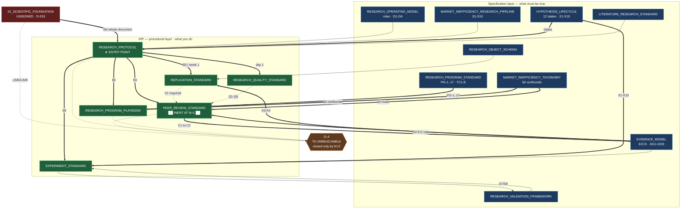

# Institutional Research Protocol — Delivery, Traceability & Readiness

**Version:** 1.0 · **Status:** Delivery record · **Layer:** L0 — Governance & Scope (roadmap-adjacent)
**Owner:** Research Program Director · **Last Updated:** 2026-07-15 · **Supersedes:** — (initial version)
**Authority:** A delivery and assessment record. **It creates no rules.** Where it disagrees with a canonical document, the canonical document governs.
**Governance:** [[RESEARCH_OS_MASTER_ROADMAP]] · [[DECISION_LOG]] **D-021** · [[KNOWLEDGE_CORPUS_DELIVERY]] (the prior increment)

---

## 1. What was delivered

Six documents forming the **Institutional Research Protocol (IRP)** — the procedural layer — plus **D-021** and this record.

| # | Document | Layer | Location | Answers |
|---|---|---|---|---|
| 1 | [[RESEARCH_PROTOCOL]] | L2 | `research_os/` | **The entry point.** "What do I follow?" |
| 2 | [[EXPERIMENT_STANDARD]] | L2 | `research_os/` | "How do I run one experiment without destroying it?" |
| 3 | [[REPLICATION_STANDARD]] | L2 | `research_os/` | "How do I replicate, and how do I hand over?" |
| 4 | [[PEER_REVIEW_STANDARD]] | L2 | `research_os/` | "How do I attack a claim?" — **inert at N=1** |
| 5 | [[RESEARCH_QUALITY_STANDARD]] | L2 | `research_os/` | "What does good look like?" |
| 6 | [[RESEARCH_PROGRAM_PLAYBOOK]] | L0 | `governance/` | "How do I run a Program day to day?" |

### 1.1 The organizing question, answered

> *"If a researcher joins tomorrow, what do they follow to produce research consistent with the Scientific Foundation?"*

**They read [[RESEARCH_PROTOCOL]].** Everything else is invoked from it at the moment of need. The answer is one document, ~350 lines, with a day-1 reading order that gets them productive in a day and correct in a week — against a corpus of ~8,000 lines they must not read linearly.

### 1.2 The non-duplication rule (D-021)

> **PR-1: A specification states what must be true. A protocol states what you do, in what order, and what to do when you cannot.**

This is the same discipline as **D-020** (extend, never restate), applied to a different seam. D-020 separated **classes from instances**; D-021 separates **specification from procedure**.

| Owned upstream — cited, never restated | Owned by IRP |
|---|---|
| S1–S10 ([[MARKET_INEFFICIENCY_RESEARCH_PIPELINE]]) | **The order you actually work in, and where it differs from the diagram** |
| G1–G4, the five roles ([[RESEARCH_OPERATING_MODEL]]) | **What you bring to a gate; what to do wearing all five hats** |
| The 12 states, X1–X10 ([[HYPOTHESIS_LIFECYCLE]]) | **What to type, and when** |
| E/C/X, DG1–DG9 ([[EVIDENCE_MODEL]]) | **What to check before claiming** |
| PG-1…PG-17, TC1–TC8 ([[RESEARCH_PROGRAM_STANDARD]]) | **The runbooks** |
| R1–R20, P1–P8, LIM1–LIM8 ([[01_SCIENTIFIC_FOUNDATION]]) | **The six you must know by heart** |

### 1.3 What was deliberately not done

| Not done | Why |
|---|---|
| No new layer declared | IRP is **the procedural face of L2**, not L2.5. There is no such number |
| No rule, gate, stage, or state added | **D-021 R-b.** Procedures sequence; they do not legislate |
| **G4 not weakened to fit N=1** | **ADR-L1-007** — *declare the deficit; do not absorb it.* §4.1 |
| No calendar cadence introduced | **P4** — a review that does not reduce the probability of believing something false is bureaucracy |
| Bit-identity not required | **§8.3 / ADR-L1-005.** L1 governs; the pipeline's S5 demand is recorded as **G-7**, not obeyed |
| Trading system not addressed | **§0.1 / ADR-L1-001** — production trading is a **consumer**, explicitly outside this architecture. §6.3 |

---

## 2. Dependency graph

**Reading it:**

- **The graph is bipartite by design.** Specification flows into procedure; **nothing flows back.** That is **PR-1** made visible: no IRP document can create a rule, so no arrow returns.
- **`RESEARCH_PROTOCOL` is the only node with inbound edges from outside IRP** — the single entry point. That is the deliverable's whole shape.
- **`PV ⇒ EM` is the one exception**, and it is not a rule: a review **assigns** C1→C2 under EV-9. It applies the scale; it does not define it.
- **Four IRP documents point at G-4.** The constraint is not localised in the peer-review document — it is **structural across the layer**, which is why it is stated in four places rather than hidden in one.

---

## 3. Traceability matrix

### 3.1 IRP → L1 provisions

| L1 provision | RP | EX | REP | PV | QS | PB |
|---|:--:|:--:|:--:|:--:|:--:|:--:|
| **P1** markets are mechanisms | ● | | | | | |
| **P2** inefficiency is mechanical | ● | | | ● | | ● |
| **P3** surviving conjectures | ● | | ● | ● | ● | |
| **P4** credibility is scarce | **◆** | ● | | | **◆** | **◆** |
| **P5** could have gone otherwise | | ● | | ● | ◆ | |
| **P7** mortality | | | | | ● | ● |
| **P8** irreproducible ⇒ not a result | ● | ● | **◆** | ● | ● | |
| **R1** Duhem–Quine | ● | ● | | ● | ● | |
| **R2** capable of failing | **◆** | **◆** | | ● | ◆ | ● |
| **R3** severity | ● | ● | | **◆** | ◆ | |
| **R4** burden never transfers | ● | | ● | **◆** | ● | |
| **R5** criteria before evidence | **◆** | ● | | ● | ◆ | ● |
| **R6** custody enforced | **◆** | **◆◆** | | | | |
| **R7.1–7.6** prohibited inferences | **◆** | ● | | ● | **◆** | ● |
| **R9** name the constraint | ● | | | **◆** | | ● |
| **R10** E4 floor | | ● | | ● | | |
| **R11** weight ≠ number | | ◆ | | ● | **◆** | |
| **R12** negative evidence | ● | ● | | ● | **◆** | **◆** |
| **R13** sunk cost is not evidence | ● | | | ● | **◆** | |
| **R14** state the refutation | **◆** | ● | | ● | ● | ● |
| **R15** no rescue | **◆** | **◆** | | | ● | |
| **R16/R17** origination + persistence | ● | | | **◆** | | **◆** |
| **R18** mechanism first | ● | | | ● | | ● |
| **R19** irreproducible ⇒ void | ● | ● | **◆** | ● | ● | |
| **§2.4** custody states | **◆** | **◆◆** | | | | |
| **§4.3** weight is process | | | | ● | **◆◆** | |
| **§5.2** six elements | **◆** | ● | | ● | | ● |
| **§5.3** F1–F9 distribution | ● | | | **◆** | **◆◆** | **◆** |
| **§5.4** R15 | **◆** | ● | | | | |
| **§6.3** seven barriers | | | | **◆** | | **◆** |
| **§6.4** where deviation is likely | | | | | ● | **◆** |
| **§7.3** blind mechanism | **◆** | ● | | **◆** | **◆** | ● |
| **§8.2** adversarial / institutional | | | **◆** | ● | | ● |
| **§8.3** conclusion-invariance | | ◆ | **◆** | | | |
| **§8.5** the costly corollary | ● | ● | **◆** | | | |
| **LIM5** weak replication | ● | | **◆◆** | ● | | |
| **LIM6** review compromised | **◆** | | ● | **◆◆** | ● | **◆** |
| **LIM8** self-cert indistinguishable | **◆** | | ● | **◆◆** | **◆** | ● |
| **ADR-L1-007** declare the deficit | **◆** | | | **◆** | ◆ | **◆** |

◆◆ = organizing principle · ◆ = primary · ● = cited

**What it shows.** **R6/§2.4 (custody) concentrates in the Experiment Standard** — the document where custody is actually spent. **R15/§5.4 concentrates in the Protocol** — where the researcher is told what to do when a claim dies. **LIM6/LIM8/ADR-L1-007 appear in five of six** — the staffing constraint is not a section, it is the layer's spine.

### 3.2 IRP → v3 realization

| Document | Realized | Unrealized |
|---|---|---|
| RP | `knowledge` (registration), `gatekeeper` (S7–S8), `failure_registry`, data fence | **S1–S2, S9** |
| **EX** | `research.tracking` (provenance) | **██ The custody receipt — G-9 ██** |
| REP | `research.tracking` (X2 material) | **Replication as an event (G-11)** |
| **PV** | **none** | **██ Everything. S9 has no realization (G-12) ██** |
| QS | `failure_registry` (data) | **The F-distribution is not computed (G-14)** |
| PB | P0 = worked instance; `gate_config` (one family) | **All governance, cadence, termination (G-15)** |

**The honest summary:** v3 realizes **execution and statistics**. It realizes **none of the epistemic controls** — custody enforcement, blindness, review, family integrity. Every one of those is currently **procedure enforced by a person**, and per **R6** *"a prohibition that relies on a researcher's discipline is a statement of intent, not a control."*

> **This layer's most uncomfortable output: writing the procedures down made it legible that the procedures are all there is.** §5.1.

---

## 4. Roadmap updates required

**Not applied here.** Proposed for owner action.

| # | Section | Change | Priority |
|---|---|---|---|
| **U12** | §2 (L2 row) | L2 now comprises **thirteen** documents: canonical 6 + ROS + HL + the 5 IRP L2 docs | **P1** |
| **U13** | §2 (L0 row) | L0 gains `RESEARCH_PROGRAM_PLAYBOOK` (6 governance docs authored) | **P1** |
| **U14** | §6 (dependency diagram) | Add the specification→procedure seam (§2 above) | P2 |
| **U15** | **New — roadmap §2 or §7** | **Record the N-dependency explicitly**: T9/G4 are unreachable at N=1; **N=2 closes G-4**. This is a **roadmap-level fact**, currently visible only in D-019 and the delivery records | **P0** |
| **U16** | [[MARKET_INEFFICIENCY_RESEARCH_PIPELINE]] S5 | **G-7:** S5 demands bit-identity; **L1 §8.3 declines it.** Recorded, not resolved (ADR-L1-008). Amendment proposed | P2 |
| **U17** | §5 (validation enhancements) | The roadmap lists **OOS-custody enforcement (mechanism, not policy)** as an enhancement. **G-9 confirms it is still policy.** Elevate — it is the corpus's most consequential unmechanised rule | **P0** |
| **U18** | §8 (folder architecture) | `research_os/` now holds **13 documents**. Consider a `protocol/` concern folder. **Requires a §8 amendment — authority withheld (D-021)** | P3 |

> **U15 and U17 are P0 because they are facts the roadmap currently does not state.** A reader of the roadmap alone cannot learn that the institution **cannot accept knowledge at N=1**, nor that **custody — the rule everything else rests on — is unenforced.** Both are load-bearing and both are currently discoverable only by reading a delivery record.

---

## 5. Gap analysis

Per **ADR-L1-008** — record, do not resolve. **G-1…G-8** are inherited from [[KNOWLEDGE_CORPUS_DELIVERY]] §5.

| # | Gap | Severity | Owner | New? |
|---|---|---|---|---|
| **G-9** | **OOS custody is policy, not mechanism** (W9) | **BLOCKING** | Research Architect | **NEW** |
| **G-13** | **Blindness (`authored_at`/`blind_to`) and reviewer independence are attestations, not controls** | **MAJOR** | Research Architect | **NEW** |
| **G-10** | Family size at execution has **no enforcement** | **MAJOR** | Research Architect | **NEW** |
| **G-11** | Replication is **not recorded as an event** — the X-axis is unrecoverable | MINOR | L4/L6 | **NEW** |
| **G-12** | **S9 has no v3 realization** | MINOR | L6 | **NEW** |
| **G-14** | **The F1–F9 distribution is not computed** | MINOR | L6 | **NEW** |
| **G-15** | **No program governance / cadence / termination machinery** | MINOR | L6 | **NEW** |
| **G-4** | **T9 unreachable at N=1** | **BLOCKING** | **Hiring** | inherited |
| **G-6** | **P1/P2/P3 family merges** — window closes at P1's first registration | **MAJOR, P0** | CRO | inherited |
| **G-1** | **O10–O14 PROPOSED** — needs a D-005 amendment | **MAJOR, P0** | CRO + Architect | inherited |
| **G-8** | Whole corpus inherits an **unsigned L1** | **BLOCKING** | **External Reviewer** | inherited |

### 5.1 ██ G-9 is this layer's finding ██

**Writing the Experiment Standard forced a question nobody had to answer while it was implicit: *what actually stops a researcher from looking at out-of-sample data?***

**The answer is: nothing.**

- **§2.4** makes OOS a **non-renewable resource**: *"it can be spent exactly once per hypothesis, and every unlogged glance silently converts it into in-sample data while leaving its appearance unchanged. **This invisibility is precisely why it requires a mechanism.**"*
- **R6** makes the requirement explicit: custody must be **enforced, not requested**, because *"a prohibition that relies on a researcher's discipline is a statement of intent, not a control."*
- **The roadmap §5** lists *"OOS-custody enforcement (mechanism, not policy)"* as a **planned enhancement**.
- **It is still policy.** [[EXPERIMENT_STANDARD]] §3.2's receipt is a **procedure a person performs**, and §3.2 says so.

**L1's verdict on this exact state is unambiguous** (§2.4):

> *"L1's position: the policy formulation is **epistemologically void**, because unenforced custody produces a system whose evidential state cannot be known even by its own operators."*

> **Therefore: every E3+ claim this institution currently produces rests on a control that does not exist.** Not a weak control — an **absent** one. And per §2.4 the breach is **invisible by construction**: contaminated OOS data is indistinguishable from clean OOS data by inspection. **The institution cannot currently determine whether any of its own out-of-sample results are out-of-sample.**
>
> **This outranks G-4.** G-4 blocks *acceptance* — a ceiling the institution knows about and has declared. **G-9 undermines the tier of every claim below that ceiling**, and it does so silently. **G-4 is a wall you can see. G-9 is a floor you cannot.**

### 5.2 G-13 — the same shape, twice more

Two further rules the corpus treats as controls and which are, on inspection, attestations:

| Rule | Should be enforced by | Actually enforced by |
|---|---|---|
| **§7.3 blindness** — `authored_at` predates `blind_to` (**OS-6**) | Structure | **A field the author fills in** |
| **LIM6 independence** — reviewer ≠ author (**O18**) | Structure | **An attestation the reviewer writes** |

Per **OS-5/R6**: *where a rule can be enforced by structure, it must be.* **Neither is.** And per **§7.3** and **LIM8** respectively, **neither violation is detectable by inspecting the product** — a retro-fitted mechanism is *"indistinguishable from the genuine article"*; a self-review is *"epistemically indistinguishable from genuine certification."*

**The pattern across G-9, G-13, G-10 is one finding:** *every rule whose violation is invisible is currently enforced by the discipline of the person whose violation it would be.* **That is precisely the configuration R6 exists to prohibit.**

### 5.3 What is not a gap

- **The layer is complete against its question.** A new researcher has a single entry point, a reading order, six rules to internalize, five procedures, and an honest account of where they will stop.
- **No rule was added.** Six documents, ~1,900 lines, zero new gates, zero new stages, zero new states. **PR-1 held.**
- **No contradiction found** with the canonical corpus. Every delta is an *absence* upstream (G-9…G-15) or an inherited inconsistency (G-7).

---

## 6. Readiness assessment

### 6.1 The chain, corrected

The owner's proposed chain:

> Scientific Foundation → Knowledge Layer → **Research Execution Methodology** → Data Ontology → Computational Framework → Research Engine → ~~Trading System~~

| Owner's term | Canonical | State |
|---|---|---|
| Scientific Foundation | **L1** `01_SCIENTIFIC_FOUNDATION` | ✅ Authored · **unsigned (D-019)** |
| Knowledge Layer | L0/L1/L2 extension (**D-020**) | ✅ Authored |
| **Research Execution Methodology** | **IRP — the procedural face of L2** (**D-021**) | ✅ **This delivery** |
| Data Ontology | **L3** | ⚪ Next |
| Computational Framework | **L4** infra + **L5** feature computation | ⚪ Outlined |
| Research Engine | **L6** hypothesis engine + **L7** validation | 🟢 v3 reference impl exists |
| ~~Trading System~~ | **Outside the architecture** | **§6.3** |

### 6.2 The owner's sequencing argument was right, and stronger than stated

> *"…barulah masuk ke L3 Data Ontology, karena pada saat itu Anda sudah benar-benar tahu informasi apa yang harus direpresentasikan oleh data."*

**Confirmed, with a concrete instance.** Authoring [[EXPERIMENT_STANDARD]] §3 produced a requirement L3 could not otherwise have known it must satisfy:

> **A Dataset must carry a custody partition whose state is a recorded fact, not an attribute** — because per §2.4 a contaminated OOS window is **indistinguishable from a clean one by inspection**, so the partition's *history* is the only evidence of its state.

**An L3 designed before this would have modelled custody as a field on a dataset.** That model is unfixable later: it cannot represent *"this window was opened, once, by this person, for this hypothesis"* — which is the only thing that makes the tier assignment defensible. **The procedural layer told the data layer what to represent. That is exactly the argument, and it produced a real constraint rather than a plausible one.**

### 6.3 One correction

**The chain does not end at a trading system.** Per **§0.1** and **ADR-L1-001**:

> *"The system-of-interest is **not** the trading system. Production trading is a **consumer** of this system's outputs and lies outside this architecture description. The relationship is one-directional: research produces knowledge; capital allocation consumes it. **The reverse dependency — allowing capital outcomes to determine what counts as knowledge — is prohibited by §2.5.**"*

The chain terminates at **L6/L7**. Extending it to a trading system would make capital a downstream *layer* rather than an external *consumer* — and per **EV-5** that inversion is the most dangerous single failure mode the evidence model names.

### 6.4 Verdict

> ## GO WITH CONDITIONS — for L3 Data Ontology

**Improved from the prior increment.** [[KNOWLEDGE_CORPUS_DELIVERY]] §6.3 gave L3 the *object* it must produce (O4). **This layer gives L3 the requirement that object must satisfy** — §6.2.

**Conditions, in dependency order:**

1. **U17 / G-9 — decide OOS custody enforcement before L3 is designed.** ⚠️ **This is now the top of the list, ahead of G-1.** Custody is a **property of how data is partitioned and accessed** — an L3/L4 concern. Designing L3 without deciding it **bakes the unenforceable model in**, and per §6.2 that model cannot represent the receipt. *Owner: CRO + Research Architect.*
2. **U4 / G-1 — admit O10–O14 (D-005 amendment).** L3 specifies Dataset Objects; five neighbours remain undeclared. *Owner: CRO + Research Architect.*
3. **U6 / G-6 — settle the P1/P2/P3 family decomposition.** Does not block L3; **blocks P1**, and per **PB-5** the window **closes at P1's first registration and never reopens.** *Owner: CRO.*
4. **U15 — state the N-dependency in the roadmap.** *Owner: Research Program Director.*

**Explicitly not conditions on L3:** **G-4** (blocks acceptance, not construction — the institution can build L3/L4/L5 and run every Program to C2 without it) and **G-8** (blocks certification, not construction).

### 6.5 The honest reading

**This layer produced one genuinely new finding and it is not the one that was commissioned.**

The brief asked for an onboarding methodology. Writing it down surfaced **G-9**: *the rule the entire evidence hierarchy rests on — custody — has no enforcement, and its violation is invisible by construction.* That was not visible while the procedures were implicit, because an implicit procedure has an implicit enforcer. **Writing "you must log the custody receipt" forces the question "or what?" — and the answer is "or nothing."**

**G-9 outranks G-4.** G-4 is a declared ceiling: the institution knows it cannot accept knowledge at N=1 and says so on every gate. G-9 is **undeclared and beneath everything**: every E3+ claim rests on it, and per §2.4 nobody — including the researcher — can tell whether a given claim's window was clean.

> **Stated plainly: the prior increment made the institution's ceiling legible. This one made its floor legible. The floor is the more urgent problem, and it is fixable by mechanism rather than by hiring** — which makes it the only blocking gap in this corpus that the institution can close by itself.

---

## 7. Traceability of this record

| This document | Source |
|---|---|
| §1 delivery | The six documents; **D-021** |
| §2 graph | Each document's traceability table |
| §3.1 matrix | [[01_SCIENTIFIC_FOUNDATION]] P1–P8, R1–R20, LIM1–LIM8, §2.4, §4.3, §5.3, §5.4, §7.3, §8 |
| §3.2 v3 map | [[RESEARCH_OS_RECONCILIATION]] §4; each document's `Realized in v3` header |
| §4 updates | [[RESEARCH_OS_MASTER_ROADMAP]] §2, §5, §6, §8 |
| §5 gaps | Each document's *Known gaps*; **ADR-L1-008** |
| §5.1 G-9 | **§2.4, R6**; roadmap §5; review W9 |
| §6 readiness | Roadmap §2 (L3 "Next"); **§0.1, ADR-L1-001** (trading system); [[KNOWLEDGE_CORPUS_DELIVERY]] §6 |
