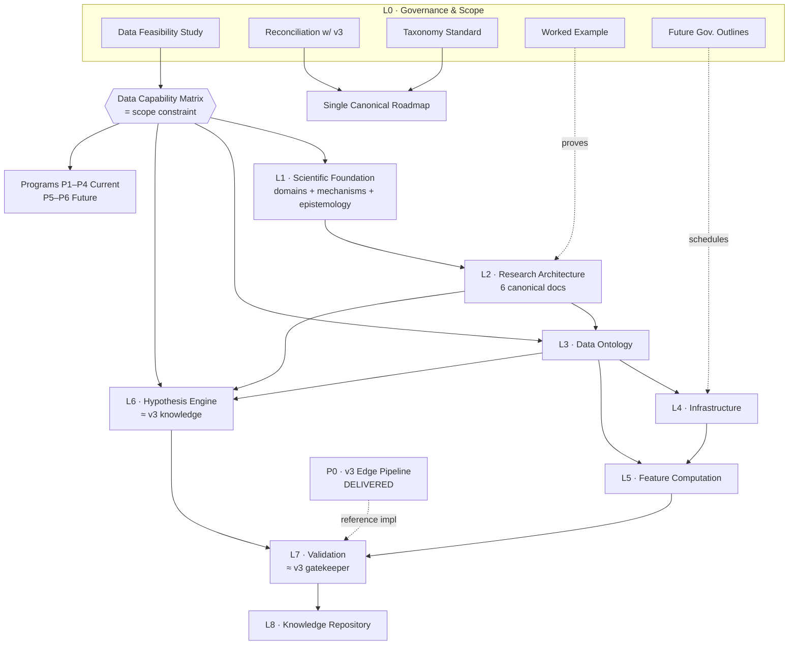

# Research OS — Master Roadmap (Revised)

**Status:** GO WITH CONDITIONS · **Version:** 2.0 (supersedes the draft Master Research Plan v1.0) · **Date:** 2026-07-15
**Authority:** The **single canonical roadmap** ([[RESEARCH_OS_RECONCILIATION]] §3). Uses the controlled vocabulary of [[TAXONOMY_AND_NAMING_STANDARD]] — Layers / Programs / Stages / Gates, never "Phase".

---

## 1. Status: GO WITH CONDITIONS

The Research OS architecture is fundamentally sound. Remaining Phase-A work is **governance, feasibility, taxonomy, and repository alignment — not scientific redesign**. The seven canonical architecture documents are preserved and remain the foundation.

## 2. Architecture Layers (the OS)

"Phase A" (old scheme) = **L0 + L1 + L2**. The architecture stays *inside* Phase A; L0/L1/L2 only make responsibilities explicit.

| Layer | Name | State | Home |
|---|---|---|---|
| **L0** | Governance & Scope | 🟢 **Being hardened now** — 4 governance docs authored (feasibility, reconciliation, taxonomy, worked example) + 5 outlined | `governance/`, `roadmap/` |
| **L1** | Scientific Foundation | 🟢 **Artifact authored 2026-07-15** — [[01_SCIENTIFIC_FOUNDATION]]. Six exclusive domains (D1–D6) incl. Market-Design + Limits-to-Arbitrage; mechanism taxonomy M1–M6; assumptions; evidence hierarchy; rationale + 8 ADRs. Closes AQ-8 | `Phase_A_Scientific_Foundation/` — **path violates [[TAXONOMY_AND_NAMING_STANDARD]]; see [[DECISION_LOG]] D-015** |
| **L2** | Research Architecture | 🟢 **Canonical — preserved** (Object Model, Operating Model, Validation, FCG, Pipeline, Failure Library) | `research_os/` |
| **L3** | Data Ontology | ⚪ Next; grounded on [[DATA_FEASIBILITY_STUDY]] | `research_os/` |
| **L4** | Research Infrastructure | ⚪ Outlined (DB concept, metadata, versioning) | `governance/` outlines |
| **L5** | Feature Computation | ⚪ FCG realization | — |
| **L6** | Hypothesis Engine | 🟢 Reference impl exists (v3 `research/knowledge`) | v3 |
| **L7** | Validation Framework | 🟢 Reference impl exists (v3 `research/gatekeeper`) | v3 |
| **L8** | Knowledge Repository | 🟡 Partial (v3 edge registry + failure_registry); needs decay lifecycle | v3 + outline |

## 3. Research Programs — Current vs Future Capability

**Future directions are preserved, not deleted** — only classified. Scope class from [[DATA_FEASIBILITY_STUDY]] §4.

| Program | Capability class | Backing data | Notes |
|---|---|---|---|
| **P0 · v3 Edge Pipeline (NR7 family)** | ✅ **Delivered** | ohlcv + regime | Reference implementation; proves the framework produces validated knowledge |
| **P1 · Order-Flow Imbalance (PROXY)** | 🟢 Current | 1-min signed flow, broker summary | True L3/OFI form → Future (Institutional) |
| **P2 · Liquidity / Illiquidity & Toxicity** | 🟢 Current | Amihud (ohlcv), VPIN | Worked example lives here ([[WORKED_EXAMPLE_END_TO_END]]) |
| **P3 · Close/Auction Dislocation (PROXY)** | 🟢 Current | OHLC close behaviour | Auction-message form → Future (Institutional) |
| **P4 · Informed-Flow / Adverse Selection** | 🟡 Current-but-immature | broker_flow (3.5 mo) | Blocked on history-maturity gate |
| **P5 · L3 Microstructure (OFI-proper, queue, cancels)** | 🔵 **Future (Institutional)** | L3 LOB — not held | Visionary; retained, clearly separated from executable scope |
| **P6 · Latency/HFT microstructure** | ⚫ Out of scope | nanosecond — Unrealistic | Documented as excluded |

## 4. Research Object Model — Core vs Extension

Do not over-engineer the first release. Mandatory core ships first; extensions are additive.

**Core (mandatory, first release):** Hypothesis · Dataset · Feature · Experiment · Knowledge Object *(+ Literature Card, Economic Mechanism, Validation Report, Failure Entry as foundational science objects).*

**Extension (additive, optional at first):** Regime · Cost Model · Decay Monitor · Reviewer Sign-off · Lineage Edge.
*(Several extensions already exist as v3 mechanisms — [[RESEARCH_OS_RECONCILIATION]] §4 — so "optional" means "not required to *define* the first release," not "unbuilt".)*

## 5. Validation enhancements (L7, additive to the canonical Validation Framework)

Add — **without rewriting** the framework: power analysis · minimum detectable effect (MDE) · structural-break/stationarity testing · reproducibility checks · **OOS-custody enforcement** (mechanism, not policy). The **Multiple-Testing Family Policy is a P1 deliverable, not a Phase-A blocker** (per owner decision).

## 6. Dependency Diagram



**Edges added 2026-07-15** ([[DECISION_LOG]] C-5): `SCOPE→L6` — the Hypothesis Engine enforces the Data Capability Matrix at registration, so it depends on the constraint directly, not only transitively through L2; `L3→L6` — a hypothesis binds Dataset Objects, so registration depends on the Data Ontology; `L3→L4` — infrastructure must store what the ontology declares, so it cannot be specified before it.

## 7. Phase A Exit Checklist

Phase A (L0+L1+L2) is **frozen** only when all are true. ✅ = done this revision.

- [x] **Data Feasibility Study** authored; Data Capability Matrix is the scope constraint. ✅
- [x] **Reconciliation with v3** written; single canonical roadmap declared (complement/superset, not replace). ✅
- [x] **Taxonomy standard** authored; "Phase" retired for OS structure. ✅
- [x] **Worked end-to-end example** proves the object model composes on Available-Today data. ✅
- [x] **Programs classified** Current vs Future (nothing deleted). ✅
- [x] **Object model** split into Core vs Extension. ✅
- [ ] **Folder structure** migrated to concern-based hybrid layout. **Decided ([[DECISION_LOG]] D-008), NOT executed** — the 7 canonical docs remain in `docs/Institutional_Research_Architecture/`. *(This box was checked in error; corrected 2026-07-15 — [[DECISION_LOG]] C-3. [[REVISION_IMPACT_ASSESSMENT]] §2 always said the migration was planned, not executed; the two documents contradicted each other.)* Blocked on the baseline commit — D-014.
- [x] **Future governance** (DB, metadata, versioning, knowledge lifecycle, prioritization) outlined. ✅
- [x] **L1 domain de-overlap** — six exclusive domains D1–D6 with an adjudication rule; Microstructure+Price-Formation merged (D2); Market-Design(IDX) (D1) and Limits-to-Arbitrage (D3) added; Cost/Impact promoted to a domain (D4). ✅ [[01_SCIENTIFIC_FOUNDATION]] §3.5, ADR-L1-004
- [x] **Architecture rationale recorded** (ISO 42010 §5.7) — [[DECISION_LOG]] + 8 ADRs. ✅ *Partial by design: closes AQ-7 for L0/L1; the L2 rationale debt is itemized as RD-1…RD-7 and is closable only by its original decider.*
- [ ] **7 canonical docs cross-referenced** to their v3 mechanisms ([[RESEARCH_OS_RECONCILIATION]] §6) — a one-line reference **inside each document**. [[01_SCIENTIFIC_FOUNDATION]] §11 maps them centrally to L1, which is a *different* artifact and does not discharge this ([[DECISION_LOG]] C-8).
- [ ] **Repository baseline commit** — the corpus is untracked; a frozen phase cannot rest on an untracked repository ([[DECISION_LOG]] D-014).
- [ ] **Independent adversarial sign-off** on this checklist (Validation Reviewer, not the author). Undischargeable by the author by construction — [[01_SCIENTIFIC_FOUNDATION]] LIM6, ADR-L1-007.

- [ ] **AQ-1 resolved** — Object Model exemplars reconciled with the binding scope constraint. **Blocking:** a freeze ratifies, and the present exemplars teach unfalsifiable hypotheses ([[PHASE_A_FREEZE_CERTIFICATE]] §3; ADR-L1-006).
- [ ] **Version headers** on the six L2 canonical documents — mandatory per [[TAXONOMY_AND_NAMING_STANDARD]] §7; six documents currently have no version for a freeze to name.

**Remaining to freeze:** 6 items. **None is scientific redesign** — one commit, three lines of exemplar text, six headers, one file move, seven one-line annotations, one signature.

> **Phase-gate status: NO-GO for Phase A Freeze** ([[PHASE_A_FREEZE_CERTIFICATE]] v1.0, [[DECISION_LOG]] **D-017**). Not a rejection: the architecture is approved and the science is complete. The corpus is **untracked**, so no revision exists to freeze. Audited against [[PHASE_A_FREEZE_CHECKLIST]] — 12 items, 5 PASS / 7 FAIL (5 BLOCKING, 2 MAJOR). **GO WITH CONDITIONS was considered and rejected**: all five blocking conditions are preconditions of the state transition, not parallel work.

## 8. Folder architecture (canonical)

```
docs/
  roadmap/           ← this file, revision impact, migration plan, DECISION_LOG
  governance/        ← L0: feasibility, reconciliation, taxonomy, future outlines
  research_os/       ← L1+L2: Scientific Foundation + the 6 canonical docs + worked example (post-migration)
  research_programs/ ← P0…P6 (one folder per Program)
  references/        ← supporting/living: microstructure roadmap, literature cards
```
Folders are **concern-based, not phase-coupled** — status lives in this roadmap, never in folder names.

> **Known deviation:** [[01_SCIENTIFIC_FOUNDATION]] currently sits at `docs/Phase_A_Scientific_Foundation/`, which uses the retired word "Phase" structurally and is phase-coupled — violating [[TAXONOMY_AND_NAMING_STANDARD]] §2/§7 and D-008. Recorded as an **open owner decision**, [[DECISION_LOG]] D-015; recommended resolution is a `git mv` into `research_os/` as part of the migration.
