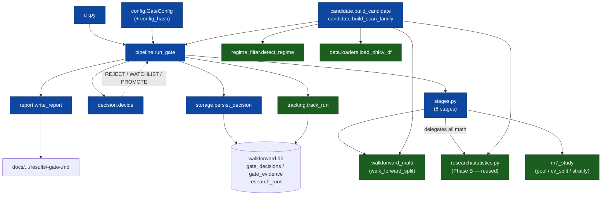
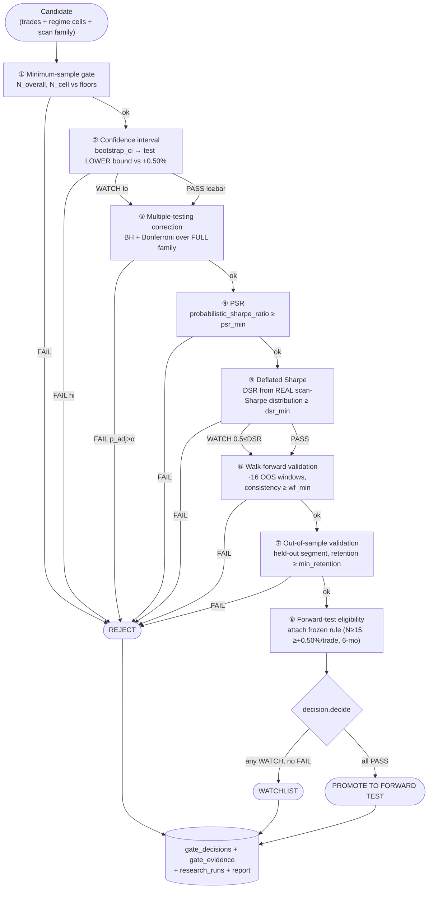

# Phase C — Statistical Gatekeeper — Technical Specification (Design Only)

**Status:** DESIGN ONLY — implementation-ready. No code, no configuration, no
production change. Phase C is **not** started.
**Date:** 2026-07-12
**Baseline:** `docs/RESEARCH_MASTER_PLAN.md` — ARCHITECTURE BASELINE — FROZEN (Phase C).
This spec translates the frozen Phase C block into an implementable design; it does
**not** modify the master plan or redesign any prior phase.
**Branch of record:** `ops/hardening-2026-07-10`.
**Implementation status (2026-07-12):** BUILT (TDD) on `ops/hardening-2026-07-10` —
package `research/gatekeeper/` (config, models, decision, stages, candidate, storage,
report, pipeline, cli) + `tests/gatekeeper/` (44 tests) + write-fence extended.
Uncommitted; no production code changed.

**Live end-to-end run (2026-07-12, NR7 Breakout, 187 liquid tickers, 1108 trades):**
the gate reproduced the Phase B statistics **exactly** (BULL CI [+0.324,+2.056],
PSR 0.9963, N 333/619/156) — strong end-to-end validation. The BULL claim PASSED
min-sample, multiplicity (BH/Bonf 0.025), PSR, and out-of-sample (retention 0.67);
CI and DSR (real 3-cell 0.769) were WATCH. **Decision: REJECT at `walk_forward`** —
BULL-scoped monthly consistency 45% < 60% bar (the documented "lumpy / single-BULL-
cycle" concern, made quantitative). The run surfaced and fixed one correctness bug:
WF/OOS were scoping to the unscoped all-regime pool; they now judge the governing
(target-regime) claim, consistent with CI/PSR/DSR. Persisted to `gate_decisions` /
`gate_evidence` (append-only) with fingerprint `0d017509…`.

**Fidelity gap CLOSED (real WF windows wired):** `_wf_summary` now uses the engine's
exact consistency definition (`walkforward_multi._summarize_strategy`: profitable
windows / windows tested, a window profitable when its pooled return > 0) over the
real quarterly OOS windows. Each trade is tagged at collection with its
`<ticker>@<test_start>` window (the trade set is unchanged — the exact Phase B
reproduction is preserved). **Re-run result: NR7 walk_forward consistency 46.8%**
(vs the 45.5% monthly proxy) — the REJECT is *robust* to the fix, not an artifact of
the proxy. `out_of_sample` PASSES (retention 0.67). **Decision: REJECT at
`walk_forward`.**

**Consistency bar RESOLVED — pre-registered at 50%.** The owner set
`walk_forward.min_consistency_pct = 50`, grounded in the scanner's strict WF gate
(`walk_forward_split` docstring: 33% / 50%) — a promotion gate is at least as strict
as the live-selection gate. **Final recorded verdict: NR7 Breakout → REJECT at
`walk_forward`** (consistency 46.8% < 50%; config_hash `c86edb9e…`). Institutionally
the gate is stricter than the original `NR7_BULL_v1` APPROVED decision (which had
shadow N=0 — the R-10 gap): NR7's BULL expectancy is real and positive (+1.197%,
PSR 0.996, survives multiplicity, OOS retention 0.67) but its edge is carried by a
minority of OOS windows — temporally lumpy, exactly the Phase A/B "single BULL cycle"
caveat, now quantified. Four gate_decisions rows persisted (append-only) trace the
decision lineage across the WF-scoping fix, the real-window fix, and the bar change —
each a distinct config lineage, as designed.

> **Purpose.** Make one **mandatory, deterministic, reproducible** statistical
> promotion gate that every strategy — existing or newly discovered — must pass
> before it may be promoted to a **forward test**. The gate's most permissive
> output is *"eligible to forward-test."* It makes **no production-deployment
> decision** and never writes the edge registry.

---

## 1. Design principles (binding)

1. **Reuse, do not duplicate.** All statistics come from the existing
   `research/statistics.py` (Phase B). All provenance comes from
   `research/tracking.py` (Phase A). The gate is *orchestration + decision +
   storage*, not new statistics.
2. **One door.** The eight-stage pipeline is the only path to a forward test.
3. **Determinism.** Identical `(candidate, config, corpus)` ⇒ identical decision,
   byte-for-byte in the evidence JSON. Enforced by fixed seed + fingerprints.
4. **Pre-registration.** The config (thresholds *and* the multiplicity family
   definition) is frozen and hashed **before** a candidate is evaluated; no
   post-hoc threshold tuning.
5. **Research-domain only.** The package lives under `research/`, writes only
   research tables, and is CI-fenced out of production import scope (invariants #2,
   #5 of the master plan).
6. **No proxy survives.** The Phase B 42-cell DSR proxy (`sr_trials_std` estimated
   from 3 cells) is **replaced** here by the Deflated Sharpe computed from the
   **complete distribution of actual scan Sharpes** (master plan §8).

---

## 2. Reused inputs — existing components (avoid duplication)

Everything below already exists and is consumed as-is. **Nothing here is
re-implemented.**

| Asset | Location | Reused for |
|---|---|---|
| `bootstrap_ci(values, n_boot, ci, seed)` | `research/statistics.py` | Stage 2 — CI on expectancy |
| `t_test_greater(values, mu0)` | `research/statistics.py` | per-cell p-values feeding Stage 3 |
| `benjamini_hochberg(pvalues, alpha)` | `research/statistics.py` | Stage 3 — FDR correction |
| `bonferroni(pvalues, alpha)` | `research/statistics.py` | Stage 3 — family-wise correction |
| `probabilistic_sharpe_ratio(values, sr_benchmark)` | `research/statistics.py` | Stage 4 — PSR |
| `deflated_sharpe_ratio(values, n_trials, sr_trials_std)` | `research/statistics.py` | Stage 5 — DSR |
| `expected_max_sharpe(n_trials, sr_trials_std)` | `research/statistics.py` | inside DSR |
| `sharpe(values)` | `research/statistics.py` | per-cell Sharpe for the scan distribution |
| `SEED = 20260711` | `research/statistics.py` | the reproducibility seed |
| `track_run(kind, params)` / `RunHandle` | `research/tracking.py` | wrap each evaluation → `research_runs` row |
| `dataset_fingerprint(conn)` / `git_commit()` | `research/tracking.py` | provenance stamping |
| `ensure_column(conn, table, col)` | `research/tracking.py` | idempotent DDL pattern to copy |
| `pool / cv_split / stratify_by_regime / round_trip_net_pct / THRESHOLDS` | `research/nr7_study.py` | pooling, chronological CV (Stage 7), regime cells, net-cost expectancy, promotion bar (`min_net_exp = 0.50`) |
| `walk_forward_split(df, train_months, test_months)`, `run_walk_forward`, `compute_metrics` | `research/walkforward_multi.py` | Stage 6 — WF windows + consistency |
| trade-collection + no-look-ahead regime labelling (`_regime_at`, warmup-drop) | `research/studies/nr7_generalization_study.py` | candidate & scan-family construction pattern |
| `RULE` (min_n 15, go_exp 0.50, timebox 6mo), `verdict()` | `research/studies/phase5_tracker.py` | Stage 8 — the frozen forward-test rule attached to a PROMOTE |
| `apply_costs`, `COMMISSION_SELL`, `SLIPPAGE` | `engine/exits/costs.py` | single cost authority (net expectancy) |
| `detect_regime(df)` | `engine/regime_filter.py` | regime labels |
| `load_ohlcv_df(conn, ticker)` | `data/loaders.py` | split-adjusted settled corpus (R-1) |
| `connect(db_path)` (WAL + busy_timeout) | `data/db.py` | all DB access |
| `load_registry / edge_registry.yaml / manifest schema` | `engine/registry_loader.py`, `registry/` | the human-gated promotion target the gate feeds evidence to (gate does **not** write it) |

**New code is confined to:** a `research/gatekeeper/` package (orchestration,
decision, storage, report, config, CLI) and two append-only tables. No existing
module is modified except two CI boundary tests (see §11 Migration).

---

## 3. Module responsibilities & internal architecture

New package `research/gatekeeper/`:

| Module | Responsibility | Depends on |
|---|---|---|
| `pipeline.py` | Orchestrator. `run_gate(candidate, config)`: runs the 8 stages in order inside `track_run`, collects `StageResult`s, calls `decision.decide`, persists + reports. Short-circuits on the first hard-fail. | `stages`, `decision`, `storage`, `report`, `tracking` |
| `candidate.py` | `Candidate` dataclass + builders. `build_candidate(...)` collects a strategy's OOS trades with no-look-ahead regime labels; `build_scan_family(...)` computes the **full** scan family and each cell's Sharpe (the real DSR distribution). | `walkforward_multi`, `nr7_study`, `regime_filter`, `loaders`, `statistics.sharpe` |
| `stages.py` | The eight pure stage functions. Each `(candidate, config, ctx) -> StageResult`, delegating every statistic to `statistics.py`. No new math. | `statistics`, `nr7_study`, `walkforward_multi` |
| `decision.py` | The state machine reducing `[StageResult] -> (FinalState, failing_stage)`. Encodes REJECT / WATCHLIST / PROMOTE rules. Pure. | — |
| `config.py` | `GateConfig` dataclass + `load_config(path)` + `config_hash(config)`. Frozen defaults sourced from `THRESHOLDS` + `RULE`. | `yaml`, `hashlib` |
| `storage.py` | `ensure_gate_tables(conn)`, `persist_decision(conn, decision)`. Append-only DAO for `gate_decisions` + `gate_evidence`. | `data.db`, `tracking` patterns |
| `report.py` | `write_report(decision, path)` (markdown) + `evidence_json(decision)`. Mirrors `nr7_generalization_study._write_results`. | stdlib |
| `cli.py` | `python -m research.gatekeeper.cli evaluate --strategy "<fn>"`. Mirrors `research/cli.py`. | `pipeline`, `candidate`, `config` |

**Internal architecture:** a linear, short-circuiting pipeline over immutable
inputs. `pipeline.run_gate` builds a `ctx` (per-trade net returns, regime cells,
scan-family Sharpes — computed once, shared by stages), then folds the stages. Each
stage is side-effect-free and returns evidence; persistence happens once at the end.

---

## 4. Deliverable 2 — Module diagram



Green = reused Phase A/B assets; blue = new `research/gatekeeper/` modules.

---

## 5. Deliverable 3 — Data-flow diagram (the promotion pipeline)

The exact pipeline from the mandate. Every stage emits a `StageResult{verdict ∈
PASS/WATCH/FAIL, statistic, threshold, evidence}`. The pipeline **short-circuits on
the first FAIL** → `REJECT`.



**Stage contract table** (input → reused function → verdict rules → evidence):

| # | Stage | Input | Reused fn | FAIL (hard) | WATCH (soft) | PASS | Evidence |
|---|---|---|---|---|---|---|---|
| 1 | Min sample | trade counts | — (counts) | `N_overall < min_n_overall` or governing `N_cell < min_n_cell` | — | counts ≥ floors | N_overall, per-cell N |
| 2 | Confidence interval | per-trade net % | `bootstrap_ci` | CI `hi < bar` | `lo < bar ≤ hi` | `lo ≥ bar` | point, lo, hi, se, n, seed |
| 3 | Multiplicity | family p-values | `t_test_greater`,`benjamini_hochberg`,`bonferroni` | governing cell `p_adj > alpha` | — | `p_adj ≤ alpha` (BH & Bonferroni) | raw p, BH p_adj, Bonferroni p_adj, family size |
| 4 | PSR | net returns | `probabilistic_sharpe_ratio` | `PSR < psr_min` | — | `PSR ≥ psr_min` | PSR, SR |
| 5 | Deflated Sharpe | net returns + **real scan Sharpes** | `deflated_sharpe_ratio` | *(never hard-fails alone — see note)* | `DSR < dsr_min` | `DSR ≥ dsr_min` | DSR, sr, sr_benchmark, n_trials, sr_trials_std |
| 6 | Walk-forward | OHLCV df | `walk_forward_split`,`run_walk_forward`,`compute_metrics` | `consistency < wf_min` or pooled OOS exp `< bar` | — | both pass | consistency %, pooled OOS exp, #windows |
| 7 | Out-of-sample | held-out trades | `cv_split`,`pool` | `retention < min_retention` or held-out exp `< bar` | — | both pass | early/late exp, retention, held-out N |
| 8 | FT eligibility | prior verdicts | `phase5_tracker.RULE` | (never fails alone) | — | attaches frozen rule | rule dict, pre-registration stamp |

**On the NR7 anchor:** under this pipeline the frozen `NR7_BULL_v1` candidate lands
**WATCHLIST**, not PROMOTE — its CI lower bound (+0.32%) is below the +0.50% bar
(Stage 2 WATCH) and its DSR collapses under the full family (Stage 5 WATCH). This is
the correct, humbling outcome from Phase B and becomes the gate's golden regression
test (§10). The forward test remains decisive — exactly the master-plan posture.

**Implementation refinement (DSR never hard-fails alone).** During Phase C build,
Stage 5 was made **PASS/WATCH only** — it can never on its own emit FAIL/REJECT. A
Deflated Sharpe that collapses under a large family is a *multiplicity-risk flag*;
when the expectancy evidence is otherwise positive (CI, multiplicity, PSR passing),
that warrants **WATCHLIST + the pre-registered forward test**, not an outright
REJECT. The original stage table's `DSR < 0.5 → FAIL` rule would have **REJECTed**
NR7 (whose Phase B proxy DSR(42) ≈ 0.0002), directly contradicting the frozen
master-plan posture that the forward test is decisive on NR7. Hard rejects come only
from sample / CI-upper-bound / multiplicity / PSR / WF / OOS. This refines this
(design) spec; it does **not** touch the frozen master plan.

---

## 6. Deliverable 4 — API / interface specification

Signatures + semantics only (no bodies — this is design). Types are indicative.

**Enums**
- `FinalState = {"REJECT", "WATCHLIST", "PROMOTE_TO_FORWARD_TEST"}`
- `StageVerdict = {"PASS", "WATCH", "FAIL"}`

**Dataclasses**
- `Candidate(strategy_fn: str, trades: list[dict], regime_cells: dict[str, list[dict]], scan_family: list[ScanCell], meta: dict)`
  - `trades[i]` = `{ticker, entry_date, raw_entry, raw_exit, regime}` (same shape as `nr7_generalization_study`).
  - `meta` carries `strategy_config_hash` (sha256 of the strategy source, like the manifest), `universe`, `corpus_as_of`.
- `ScanCell(label: str, sharpe: float, n: int)` — one cell of the full scan; `sharpe` from `statistics.sharpe`.
- `StageResult(stage: str, verdict: StageVerdict, statistic: dict, threshold: dict)`
- `GateDecision(final_state: FinalState, failing_stage: str | None, stage_results: list[StageResult], candidate_hash: str, config_hash: str, dataset_fingerprint: str, git_commit: str, seed: int, forward_test_rule: dict | None, run_id: str)`
- `GateConfig(...)` — see §8.

**Public functions**
- `pipeline.run_gate(candidate: Candidate, config: GateConfig, db_path: str = DB_PATH) -> GateDecision`
  — orchestrates; wraps in `track_run("gate-eval", params={strategy, config_hash})`; persists + writes report; returns the decision. Pure w.r.t. production (writes only research tables + a results doc).
- `candidate.build_candidate(conn, strategy_fn: str, universe: list[str], config: GateConfig) -> Candidate`
  — reuses the collect-trades + `_regime_at` no-look-ahead pattern.
- `candidate.build_scan_family(conn, strategy_fn: str, config: GateConfig) -> list[ScanCell]`
  — enumerates the **pre-registered** scan family (regime × any parameter axes named in config), computes each cell's Sharpe. This is the source of the real DSR distribution (retires the proxy).
- `stages.stage_min_sample / stage_confidence_interval / stage_multiplicity / stage_psr / stage_deflated_sharpe / stage_walk_forward / stage_out_of_sample / stage_ft_eligibility (candidate, config, ctx) -> StageResult`
- `decision.decide(stage_results: list[StageResult], config: GateConfig) -> tuple[FinalState, str | None]`
  — rule: any `FAIL` → `("REJECT", first_fail_stage)`; else any `WATCH` → `("WATCHLIST", None)`; else `("PROMOTE_TO_FORWARD_TEST", None)`.
- `config.load_config(path: str) -> GateConfig` · `config.config_hash(config: GateConfig) -> str`
- `storage.ensure_gate_tables(conn) -> None` · `storage.persist_decision(conn, decision: GateDecision) -> None`
- `report.write_report(decision: GateDecision, path: str) -> None` · `report.evidence_json(decision: GateDecision) -> dict`
- `cli.main(argv)` — `evaluate --strategy "<fn>" [--config path] [--report path]`

**Interface invariants**
- `run_gate` is idempotent per `(candidate_hash, config_hash, dataset_fingerprint)`:
  re-running appends an identical-valued decision row (append-only history), never
  mutates a prior one.
- Stage functions never touch the DB or filesystem; only `pipeline` persists.
- The gate never imports or writes `registry/` — PROMOTE emits *evidence + rule*, a
  human authors the registry SHADOW entry (invariant #4/#5).

---

## 7. Deliverable 5 — Storage specification

Two **append-only** tables in `walkforward.db`, created idempotently
(`ensure_gate_tables`), written **only** by `research/` (CI-fenced, §11). No
existing table is altered. Provenance columns mirror `research_runs`.

**`gate_decisions`** — one row per evaluation (append-only; re-runs add rows):

| column | type | notes |
|---|---|---|
| `decision_id` | TEXT PK | uuid4 hex |
| `run_id` | TEXT | FK → `research_runs.run_id` |
| `strategy_fn` | TEXT | key into `STRATEGY_FUNCS` |
| `candidate_hash` | TEXT | sha256 of trades + `strategy_config_hash` |
| `config_hash` | TEXT | sha256 of the frozen `GateConfig` |
| `dataset_fingerprint` | TEXT | from `tracking.dataset_fingerprint` |
| `git_commit` | TEXT | from `tracking.git_commit` |
| `seed` | INTEGER | `statistics.SEED` used |
| `final_state` | TEXT | REJECT / WATCHLIST / PROMOTE_TO_FORWARD_TEST |
| `failing_stage` | TEXT | nullable; set on REJECT |
| `forward_test_rule` | TEXT | JSON; the frozen rule, non-null on PROMOTE |
| `summary_json` | TEXT | compact per-stage verdict summary |
| `decided_at` | TEXT | timestamp |

**`gate_evidence`** — one row per stage per decision (append-only):

| column | type | notes |
|---|---|---|
| `evidence_id` | TEXT PK | uuid4 hex |
| `decision_id` | TEXT | FK → `gate_decisions.decision_id` |
| `stage` | TEXT | stage id (`min_sample` … `ft_eligibility`) |
| `verdict` | TEXT | PASS / WATCH / FAIL |
| `statistic_json` | TEXT | CI / p_adj / PSR / DSR / WF / OOS values |
| `threshold_json` | TEXT | the config thresholds applied |

**Storage rules**
- **Append-only:** no `UPDATE`/`DELETE` in the DAO. A superseding evaluation is a
  new `decision_id`. (Same discipline as `research_runs`.)
- **Idempotent DDL:** `CREATE TABLE IF NOT EXISTS`, following `tracking.ensure_*`.
- **Research-write-only:** both tables added to the `test_research_data_fence`
  research-product set; production may *read* (dashboards) but never write.
- **Retention:** unbounded (audit history); ~1 decision + 8 evidence rows per
  evaluation — negligible growth.

---

## 8. Deliverable 6 — Configuration specification

`research/gatekeeper/gate_config.yaml` — versioned, hashed per decision. Defaults
sourced from existing frozen values (`nr7_study.THRESHOLDS`, `phase5_tracker.RULE`)
so the gate starts consistent with today's discipline.

```yaml
version: 1                     # bump = new config; never edit silently post-registration
promotion_bar_pct: 0.50        # = nr7_study THRESHOLDS.min_net_exp  (Stage 2/6/7 bar)
min_n_overall: 300             # = THRESHOLDS.t1_min_n               (Stage 1)
min_n_cell: 100                # = THRESHOLDS.t3_min_n               (Stage 1)
ci:
  level: 0.95                  # bootstrap_ci ci=
  n_boot: 10000                # bootstrap_ci n_boot=
multiplicity:
  alpha: 0.05                  # BH / Bonferroni level
  require_both: true           # must clear BH AND Bonferroni
  family:                      # PRE-REGISTERED — defines n_trials for DSR + the p-value set
    regimes: [BULL, BEAR, SIDEWAYS, HIGH_VOL, LOW_VOL, HIGH_LIQ, LOW_LIQ]
    parameter_axes: []         # named scan axes, if any (kept explicit to prevent denominator-hacking)
psr:
  min: 0.95                    # Stage 4
deflated_sharpe:
  min: 0.90                    # Stage 5 PASS bar
  watch_floor: 0.50            # Stage 5 WATCH band lower edge
walk_forward:
  train_months: 12             # walk_forward_split
  test_months: 3
  min_consistency_pct: 60      # Stage 6
out_of_sample:
  holdout_months: 6            # reserved BEFORE the WF windows (distinct segment)
  min_retention: 0.50          # = THRESHOLDS.t2_min_retention       (Stage 7)
forward_test_rule:             # = phase5_tracker.RULE (frozen; attached on PROMOTE)
  min_n: 15
  go_exp: 0.50
  nogo_exp: 0.0
  timebox_months: 6
seed: 20260711                 # = statistics.SEED
```

**Config rules**
- The **family** block is part of pre-registration: it fixes both the p-value set
  (Stage 3 denominator) and `n_trials` for DSR (Stage 5). It cannot be narrowed
  after seeing results.
- `config_hash` (sha256 of the canonicalised YAML) is stored on every decision;
  changing any threshold produces a new hash and a new decision lineage.
- Defaults equal existing frozen constants — the gate introduces no new magic
  numbers, only makes them one governed surface.

---

## 9. Reproducibility & audit-logging requirements

- **Seed:** `statistics.SEED` (20260711) threaded into `bootstrap_ci` and the DSR
  path; recorded in `gate_decisions.seed`.
- **Fingerprints:** `dataset_fingerprint` + `git_commit` + `config_hash` +
  `candidate_hash` stamped on every decision — the four coordinates that make a
  decision regenerable.
- **Ledger:** every `run_gate` opens a `track_run("gate-eval")` row in
  `research_runs`, so a gate evaluation has the same provenance as a WF refresh.
- **Audit trail:** `gate_decisions` (what was decided) + `gate_evidence` (why, per
  stage) + the markdown report (human-readable) + the JSON evidence bundle
  (machine-readable). Append-only; a REJECT is preserved permanently (feeds the
  Phase E Failure Registry later).
- **Determinism guarantee:** re-evaluating the same candidate/config/corpus yields
  an identical evidence JSON (§10 test).

---

## 10. Deliverable 7 — Test specification

Mirrors the hand-verified, deterministic discipline of
`tests/test_statistics.py`. New file(s) under `tests/gatekeeper/`.

**Unit — stages (golden fixtures):**
- Each stage tested against a small hand-computed fixture; assert verdict +
  statistic. Reuse the published NR7 numbers as golden anchors: BULL CI
  `[+0.324, +2.056]`, BH p_adj `0.011`, PSR `0.996`.
- Stage 5 (DSR) explicitly asserts `n_trials == len(scan_family)` and that
  `sr_trials_std` is the **std of the real scan Sharpes**, not a 3-cell estimate
  (retirement-of-proxy test).

**Unit — decision matrix:**
- Synthetic `StageResult` lists → assert `decide`: all-PASS → PROMOTE; any FAIL →
  REJECT + correct `failing_stage`; WATCH-without-FAIL → WATCHLIST.

**Integration — golden regression (the anchor):**
- Run the full gate on the frozen `NR7_BULL_v1` candidate → assert **WATCHLIST**
  with Stage 2 = WATCH (lo `< 0.50`) and Stage 5 = WATCH (DSR in `[0.5, 0.90)`).
  This pins the Phase B conclusion into CI.

**Determinism:**
- `run_gate` twice on identical inputs → byte-identical `evidence_json`.

**Storage:**
- Append-only invariant: a second `persist_decision` inserts a new row, never
  updates; DAO exposes no update/delete. Idempotent `ensure_gate_tables`.

**Provenance:**
- Decision row carries non-null `dataset_fingerprint`, `config_hash`,
  `candidate_hash`, `git_commit`, `run_id`; the `research_runs` row exists.

**No-look-ahead:**
- Candidate construction reuses `_regime_at` (trailing-only) and warmup-drop; a test
  asserts no trade uses data at/after its own entry date and costs come solely from
  `apply_costs`.

**Boundary (CI fence):**
- `research/gatekeeper/` classified research-only; `gate_decisions`/`gate_evidence`
  are research-write-only; no production module imports the package. Extends
  `tests/test_architecture_boundary.py` + `tests/test_research_data_fence.py`.

---

## 11. Deliverable 8 — Migration plan

**Nature:** purely additive; no production change; no existing table altered.

1. **New package** `research/gatekeeper/` (8 modules) + `tests/gatekeeper/`.
2. **New tables** `gate_decisions`, `gate_evidence` via idempotent
   `ensure_gate_tables` (created on first run; no migration script needed).
3. **CI fence updates** (the only edits to existing files): add the package to the
   research scope and the two tables to the research-product set in
   `test_architecture_boundary.py` and `test_research_data_fence.py` (shrink-only
   allowlists, same pattern as R-2).
4. **Config file** `research/gatekeeper/gate_config.yaml` committed with v1 defaults.
5. **Proxy retirement:** once `build_scan_family` lands, mark the Phase B 42-cell
   DSR proxy *superseded* in the Phase B report's follow-up note (the proxy scripts
   remain as historical evidence; the gate uses the real distribution). Closes the
   R-6 residual.
6. **Optional baseline backfill (one-time, non-blocking):** run the gate over the
   current roster (NR7 + the 8 disabled strategies) to seed `gate_decisions` and
   validate the pipeline against known outcomes. Produces the first evidence set;
   not required for correctness.
7. **Optional research-cron wiring:** a later, separate decision (out of this
   phase) — the gate is invoked manually / by research batch only.

**Rollback:** drop the two new tables + delete the package; no production path
depends on it. Because writes are research-only and append-only, blast radius is
contained (the R-5 physical split remains the standing infra condition).

---

## 12. Deliverable 9 — Risk assessment

| # | Risk | Likelihood | Impact | Mitigation |
|---|---|---|---|---|
| 1 | Real-distribution scan (Stage 5 / `build_scan_family`) is compute-heavy | High | Slow evaluations | Cache scan Sharpes keyed by `dataset_fingerprint + config_hash`; use R-7 parallel WF (open item) when wired |
| 2 | Multiplicity family gamed (denominator-hacking) | Med | Inflated significance | Family is **pre-registered** in config and hashed per decision; narrowing it is a new config lineage, visible in audit |
| 3 | Shared DB (R-5) — new tables in `walkforward.db` | Med | Research bug touches prod DB file | Append-only + research-write CI fence; physical split tracked as the open R-5 condition |
| 4 | WATCHLIST becomes a graveyard | Med | Stale candidates | Store `decided_at`; re-evaluation cadence + timebox metadata; Phase H later owns lifecycle |
| 5 | Threshold over-fitting | Med | Gate tuned to pass a favorite | Defaults = existing frozen constants; any change = new `config_hash`, never silent; pre-registration rule |
| 6 | Look-ahead in candidate construction | Low | Corrupted evidence | Reuse proven no-look-ahead collect pattern + single cost authority; explicit CI test |
| 7 | numpy-version determinism drift | Low | Non-reproducible CI/DSR | Fixed seed + pinned deps + determinism test in CI |
| 8 | Gate mistaken for a production-deploy decision | Low | Boundary erosion | Spec + code forbid registry writes; PROMOTE = "eligible to forward-test" only; human authors registry entry |

---

## 13. Deliverable 10 — Implementation checklist

Ordered build steps (no code here — the checklist for when implementation is
authorised). Each step ends green before the next.

- [ ] 1. Scaffold `research/gatekeeper/` package + `config.py` (`GateConfig`,
      `load_config`, `config_hash`) + `gate_config.yaml` v1 (defaults from
      `THRESHOLDS`/`RULE`).
- [ ] 2. `candidate.py`: `Candidate`/`ScanCell` dataclasses; `build_candidate`
      (reuse `nr7_generalization` collect + `_regime_at`); `build_scan_family`
      (real scan Sharpes). Unit + no-look-ahead tests.
- [ ] 3. `stages.py`: eight stage functions, each delegating to `statistics.py`.
      Golden-fixture unit tests (NR7 anchors), proxy-retirement test on Stage 5.
- [ ] 4. `decision.py`: `decide` state machine + decision-matrix tests.
- [ ] 5. `storage.py`: `ensure_gate_tables` + `persist_decision` (append-only DAO)
      + storage/provenance tests.
- [ ] 6. `report.py`: markdown report + JSON evidence bundle
      (mirror `_write_results`).
- [ ] 7. `pipeline.py`: `run_gate` orchestration inside `track_run`; determinism
      test; golden regression (NR7 → WATCHLIST).
- [ ] 8. `cli.py`: `evaluate` command (mirror `research/cli.py`).
- [ ] 9. CI fence: extend `test_architecture_boundary.py` +
      `test_research_data_fence.py` (research-only package + tables).
- [ ] 10. Full suite green; retire the Phase B 42-cell DSR proxy note; (optional)
      baseline backfill over the roster.

---

## 14. Non-goals (restated)

This phase does **not**: implement algorithms; modify production; redesign any prior
phase; optimize strategies; write the edge registry; make production-deployment
decisions; start Phase D. It ends at emitting one of **REJECT / WATCHLIST / PROMOTE
TO FORWARD TEST** with a full, reproducible evidence trail.

*End of Phase C Technical Specification — design only. No code, no configuration, no
production change.*
